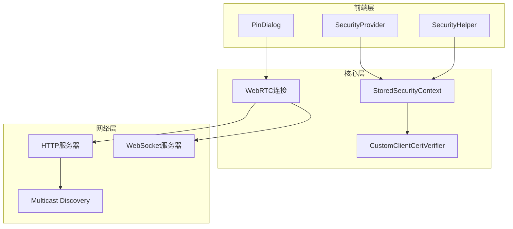
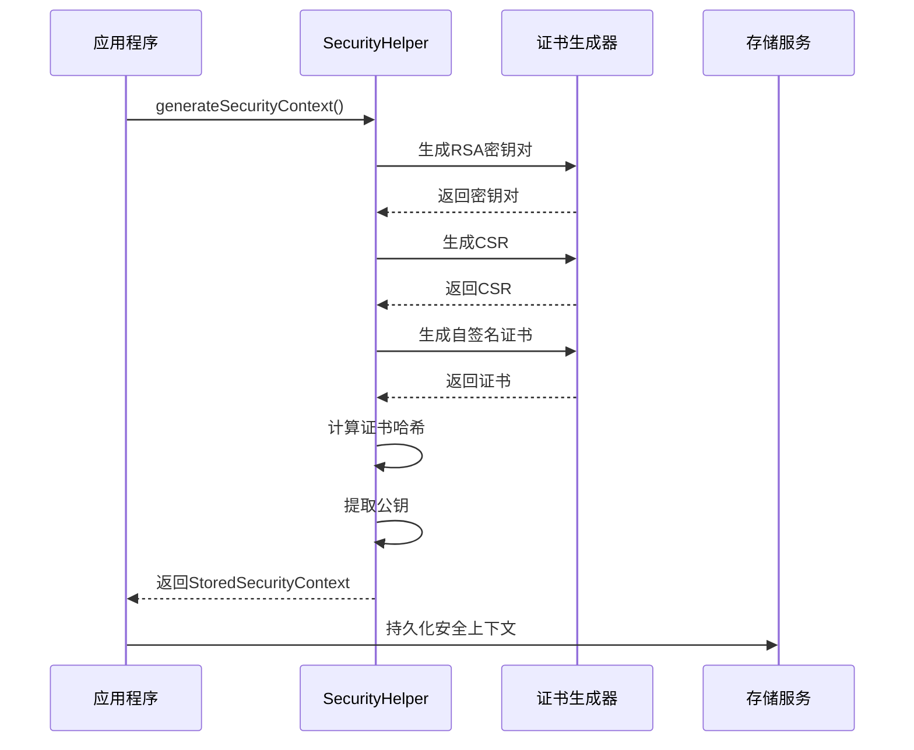
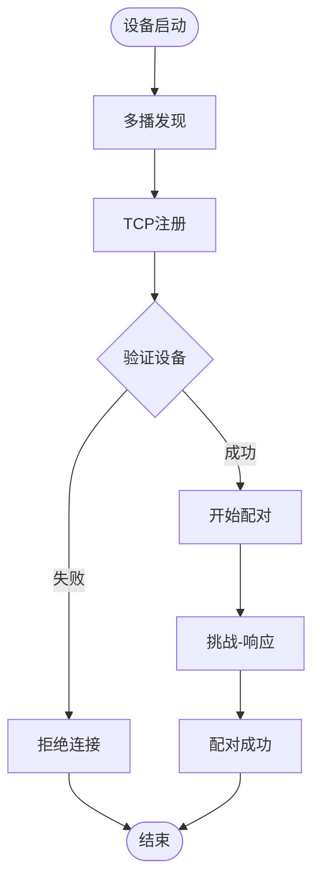
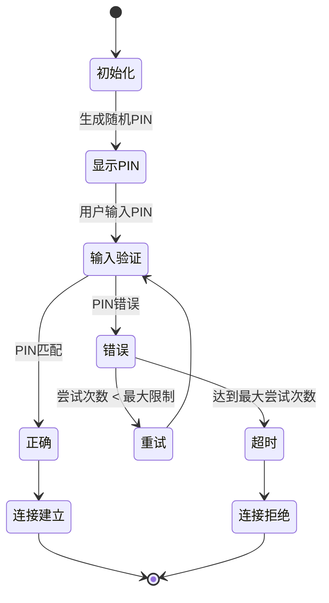
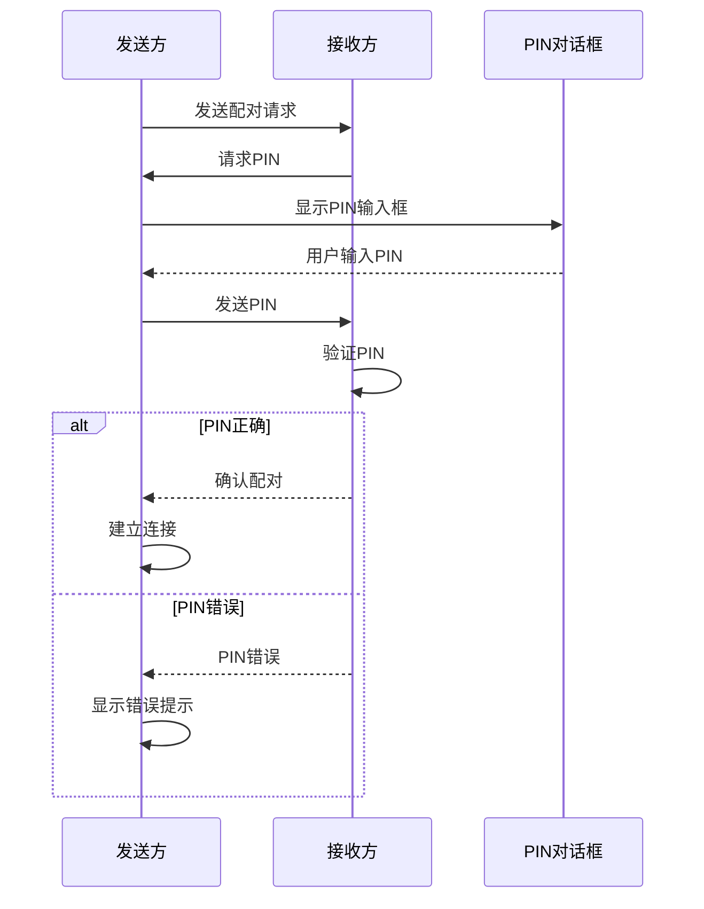
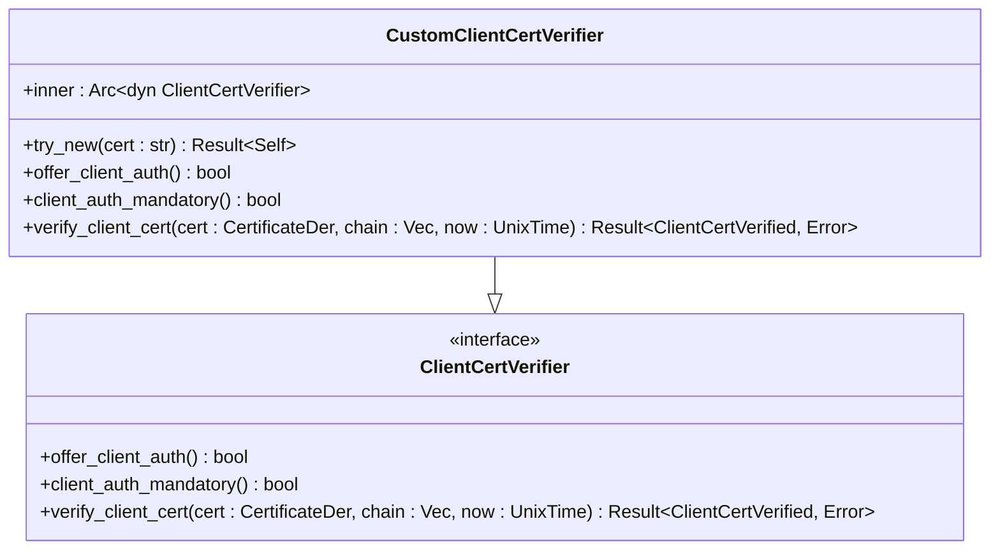
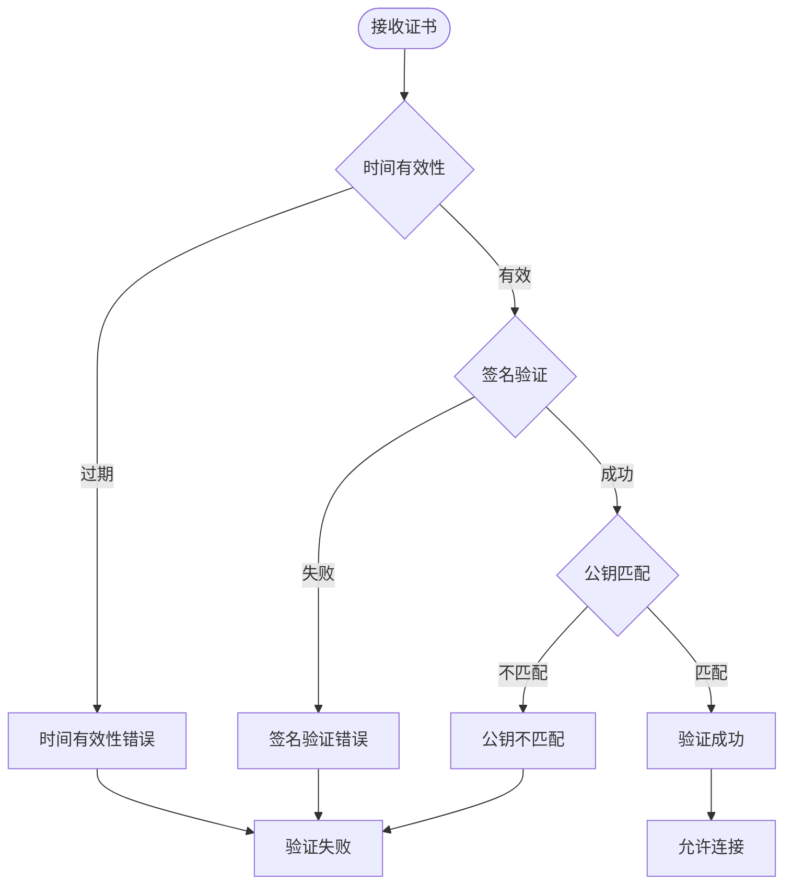
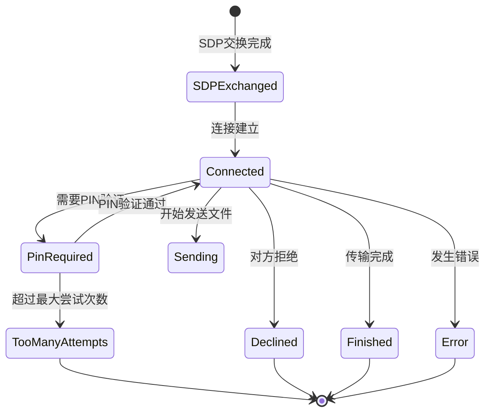

# 身份验证流程

<cite>
**本文档中引用的文件**
- [security_provider.dart](file://app/lib/provider/security_provider.dart)
- [security_helper.dart](file://app/lib/util/security_helper.dart)
- [client_cert_verifier.rs](file://core/src/http/server/client_cert_verifier.rs)
- [webrtc.rs](file://core/src/webrtc/webrtc.rs)
- [cert.rs](file://core/src/crypto/cert.rs)
- [stored_security_context.dart](file://common/lib/model/stored_security_context.dart)
- [webrtc.dart](file://app/lib/rust/api/webrtc.dart)
- [send_provider.dart](file://app/lib/provider/network/send_provider.dart)
- [pin_dialog.dart](file://app/lib/widget/dialogs/pin_dialog.dart)
- [common.dart](file://app/lib/provider/network/server/controller/common.dart)
- [webrtc.freezed.dart](file://app/lib/rust/api/webrtc.freezed.dart)
</cite>

## 目录
1. [简介](#简介)
2. [系统架构概览](#系统架构概览)
3. [安全上下文管理](#安全上下文管理)
4. [设备间安全配对](#设备间安全配对)
5. [PIN码验证机制](#pin码验证机制)
6. [客户端证书验证](#客户端证书验证)
7. [状态转换与错误处理](#状态转换与错误处理)
8. [测试指南](#测试指南)
9. [故障排除](#故障排除)
10. [总结](#总结)

## 简介

LocalSend采用了一套完整的身份验证流程来确保设备间的安全通信。该系统结合了证书验证、PIN码保护和状态机管理，为用户提供了一个既安全又友好的配对体验。本文档详细阐述了从设备发现到建立安全连接的完整身份验证流程。

## 系统架构概览

LocalSend的身份验证系统由以下核心组件构成：

**图表来源**
- [security_provider.dart](file://app/lib/provider/security_provider.dart#L1-L35)
- [security_helper.dart](file://app/lib/util/security_helper.dart#L1-L72)
- [client_cert_verifier.rs](file://core/src/http/server/client_cert_verifier.rs#L10-L84)

**章节来源**
- [security_provider.dart](file://app/lib/provider/security_provider.dart#L1-L35)
- [security_helper.dart](file://app/lib/util/security_helper.dart#L1-L72)

## 安全上下文管理

### 安全上下文生成

安全上下文是整个身份验证系统的核心，包含了设备的私钥、公钥、证书和证书哈希值。

**图表来源**
- [security_helper.dart](file://app/lib/util/security_helper.dart#L8-L39)
- [stored_security_context.dart](file://common/lib/model/stored_security_context.dart#L1-L24)

### 安全上下文结构

StoredSecurityContext包含以下关键字段：
- `privateKey`: PEM格式的RSA私钥
- `publicKey`: SPKI格式的公钥
- `certificate`: PEM格式的X.509证书
- `certificateHash`: SHA-256哈希值

**章节来源**
- [security_helper.dart](file://app/lib/util/security_helper.dart#L8-L39)
- [stored_security_context.dart](file://common/lib/model/stored_security_context.dart#L1-L24)

## 设备间安全配对

### 发现阶段

设备发现通过多播协议进行，每个设备都会广播自己的指纹信息：

**图表来源**
- [multicast_discovery.dart](file://common/lib/src/task/discovery/multicast_discovery.dart#L129-L197)
- [receive_controller.dart](file://app/lib/provider/network/server/controller/receive_controller.dart#L133-L173)

### 配对握手协议

配对过程遵循以下步骤：

1. **设备识别**: 通过指纹验证确认设备身份
2. **证书交换**: 交换双方的X.509证书
3. **公钥验证**: 验证对方公钥的有效性
4. **会话建立**: 建立加密的WebRTC连接

**章节来源**
- [multicast_discovery.dart](file://common/lib/src/task/discovery/multicast_discovery.dart#L129-L197)
- [receive_controller.dart](file://app/lib/provider/network/server/controller/receive_controller.dart#L133-L173)

## PIN码验证机制

### PIN码生成与显示

PIN码验证提供了额外的安全层，防止未经授权的访问：

**图表来源**
- [webrtc.rs](file://core/src/webrtc/webrtc.rs#L1139-L1200)
- [pin_dialog.dart](file://app/lib/widget/dialogs/pin_dialog.dart#L1-L68)

### PIN码验证流程

PIN码验证采用挑战-响应机制：

**图表来源**
- [webrtc.rs](file://core/src/webrtc/webrtc.rs#L320-L351)
- [webrtc.rs](file://core/src/webrtc/webrtc.rs#L1139-L1200)

### PIN码配置参数

PIN码验证支持以下配置：
- `pin`: 6位数字PIN码
- `maxTries`: 最大尝试次数（默认3次）
- `timeout`: 超时时间（5秒）

**章节来源**
- [webrtc.dart](file://app/lib/rust/api/webrtc.dart#L170-L195)
- [webrtc.rs](file://core/src/webrtc/webrtc.rs#L1139-L1200)

## 客户端证书验证

### 证书验证器实现

CustomClientCertVerifier负责验证客户端证书的有效性：

**图表来源**
- [client_cert_verifier.rs](file://core/src/http/server/client_cert_verifier.rs#L10-L84)

### 证书验证流程

证书验证包括以下检查：

1. **时间有效性**: 验证证书是否在有效期内
2. **签名验证**: 使用根证书验证证书签名
3. **公钥匹配**: 验证证书中的公钥与预期一致
4. **完整性检查**: 确保证书未被篡改

**图表来源**
- [cert.rs](file://core/src/crypto/cert.rs#L20-L50)

**章节来源**
- [client_cert_verifier.rs](file://core/src/http/server/client_cert_verifier.rs#L10-L84)
- [cert.rs](file://core/src/crypto/cert.rs#L20-L50)

## 状态转换与错误处理

### WebRTC状态机

WebRTC连接维护一个复杂的状态机来跟踪连接进度：

**图表来源**
- [webrtc.freezed.dart](file://app/lib/rust/api/webrtc.freezed.dart#L16-L1132)

### 错误处理策略

系统实现了多层次的错误处理机制：

| 错误类型 | HTTP状态码 | 处理策略 | 用户反馈 |
|---------|-----------|---------|---------|
| 无效PIN | 401 | 重新输入PIN | 显示错误提示 |
| 超过尝试次数 | 429 | 拒绝连接 | 显示限制信息 |
| 证书验证失败 | 403 | 拒绝连接 | 显示安全警告 |
| 设备忙碌 | 409 | 等待重试 | 显示等待状态 |
| 网络错误 | 5xx | 自动重试 | 显示重试按钮 |

**章节来源**
- [send_provider.dart](file://app/lib/provider/network/send_provider.dart#L155-L229)
- [common.dart](file://app/lib/provider/network/server/controller/common.dart#L10-L37)

## 测试指南

### 单元测试场景

为了确保身份验证流程的可靠性，建议测试以下场景：

1. **正常配对流程**: 验证标准的设备发现和配对过程
2. **PIN码验证**: 测试正确的和错误的PIN码输入
3. **证书验证**: 验证有效和无效证书的处理
4. **超时处理**: 测试超过最大尝试次数的情况
5. **并发连接**: 验证多个设备同时连接的场景

### 集成测试要点

- 验证证书生成和存储的完整性
- 测试跨平台兼容性
- 模拟网络中断和恢复
- 验证错误消息的本地化

**章节来源**
- [security_helper_test.dart](file://app/test/unit/util/security_helper_test.dart#L31-L54)

## 故障排除

### 常见问题及解决方案

1. **证书验证失败**
   - 检查证书是否过期
   - 验证证书链的完整性
   - 确认时间同步设置

2. **PIN码验证失败**
   - 确认PIN码输入正确
   - 检查最大尝试次数限制
   - 验证网络连接稳定性

3. **设备发现失败**
   - 检查防火墙设置
   - 验证网络配置
   - 确认多播支持

### 调试工具

系统提供了详细的日志记录功能，可以通过以下方式启用调试：
- 启用详细日志记录
- 监控网络流量
- 检查证书存储位置

**章节来源**
- [error.rs](file://app/lib/provider/network/server/controller/common.dart#L10-L37)
- [error.rs](file://server/src/config/error.rs#L1-L58)

## 总结

LocalSend的身份验证流程通过多层次的安全机制确保了设备间通信的安全性。从证书验证到PIN码保护，从状态管理到错误处理，每个环节都经过精心设计。这套系统不仅提供了强大的安全保障，还保持了良好的用户体验，是现代P2P应用安全设计的优秀范例。

通过本文档的详细说明，开发者可以深入理解LocalSend的身份验证机制，并能够有效地测试和维护这一关键功能模块。随着技术的发展，这套身份验证框架也为未来的安全增强提供了良好的扩展基础。