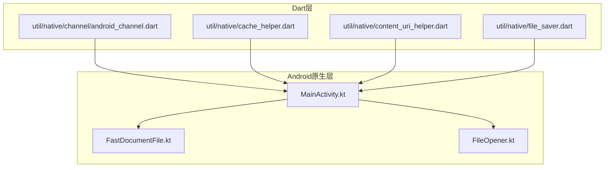
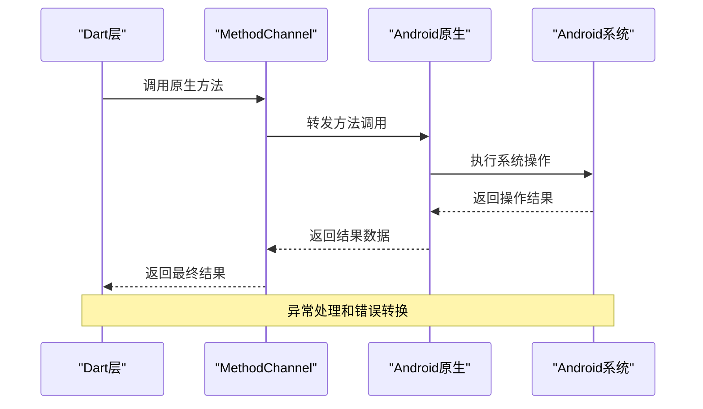
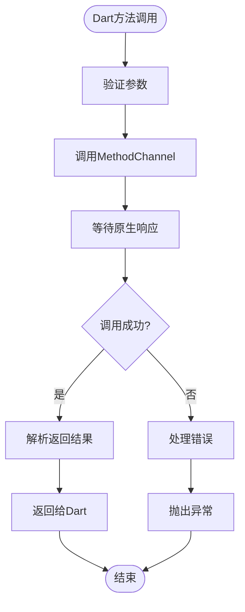
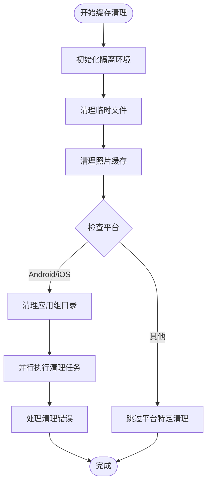
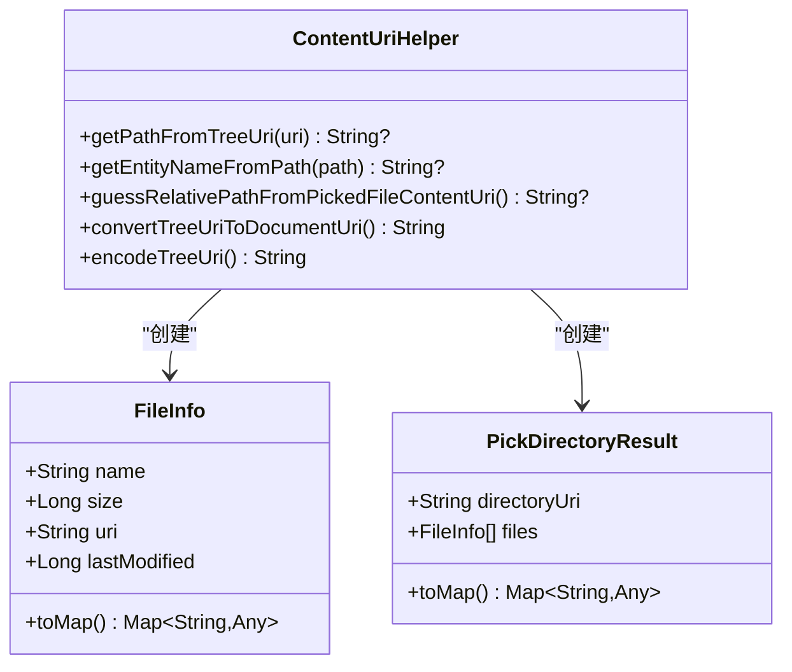
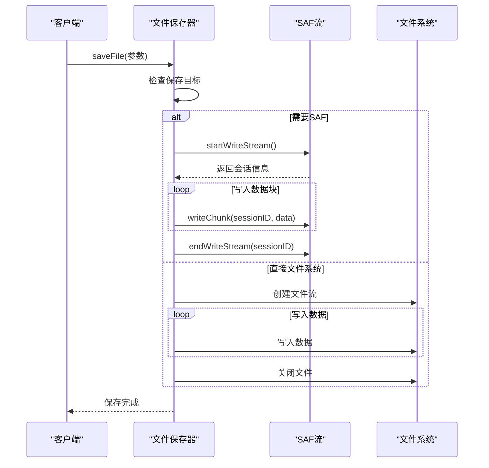
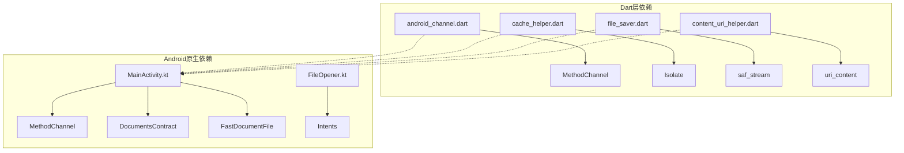
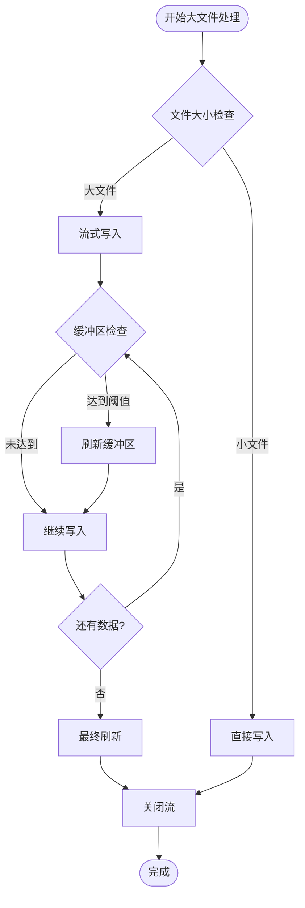

# 原生通信

<cite>
**本文档中引用的文件**
- [android_channel.dart](file://app/lib/util/native/channel/android_channel.dart)
- [cache_helper.dart](file://app/lib/util/native/cache_helper.dart)
- [MainActivity.kt](file://app/android/app/src/main/kotlin/org/localsend/localsend_app/MainActivity.kt)
- [content_uri_helper.dart](file://app/lib/util/native/content_uri_helper.dart)
- [file_saver.dart](file://app/lib/util/native/file_saver.dart)
- [FastDocumentFile.kt](file://app/android/app/src/main/kotlin/org/localsend/localsend_app/FastDocumentFile.kt)
- [FileOpener.kt](file://app/android/app/src/main/kotlin/org/localsend/localsend_app/FileOpener.kt)
</cite>

## 目录
1. [简介](#简介)
2. [项目结构](#项目结构)
3. [核心组件](#核心组件)
4. [架构概览](#架构概览)
5. [详细组件分析](#详细组件分析)
6. [依赖关系分析](#依赖关系分析)
7. [性能考虑](#性能考虑)
8. [故障排除指南](#故障排除指南)
9. [结论](#结论)

## 简介

本文档详细介绍了LocalSend应用中Dart与Android原生通信的实现机制。该应用使用Flutter框架开发，通过MethodChannel机制实现了Dart层与Android原生代码之间的双向通信。这种通信方式使得Flutter应用能够访问Android特有的功能，如文件系统访问、存储权限管理、系统设置等。

主要的技术特点包括：
- 使用Flutter的MethodChannel进行跨平台通信
- 实现了Storage Access Framework (SAF) 文件管理
- 提供了完整的文件缓存清理机制
- 支持Android 10+的Scoped Storage兼容性
- 实现了异步操作和错误处理机制

## 项目结构

LocalSend项目的原生通信相关文件主要分布在以下目录结构中：

**图表来源**
- [android_channel.dart](file://app/lib/util/native/channel/android_channel.dart#L1-L120)
- [MainActivity.kt](file://app/android/app/src/main/kotlin/org/localsend/localsend_app/MainActivity.kt#L1-L290)

**章节来源**
- [android_channel.dart](file://app/lib/util/native/channel/android_channel.dart#L1-L120)
- [cache_helper.dart](file://app/lib/util/native/cache_helper.dart#L1-L78)

## 核心组件

### MethodChannel机制

MethodChannel是Flutter提供的核心原生通信机制，它允许Dart代码与原生Android/iOS代码进行双向通信。

#### 主要功能模块

1. **文件选择器**：支持目录和文件的选择
2. **文件系统操作**：创建目录、文件写入等
3. **系统集成**：打开内容URI、访问相册等
4. **状态查询**：获取系统动画状态等

### 缓存管理系统

提供了完整的文件缓存清理机制，支持多平台的缓存清理操作。

### 内容URI助手

专门处理Android 10+ Scoped Storage的Content URI编码和解码。

**章节来源**
- [android_channel.dart](file://app/lib/util/native/channel/android_channel.dart#L10-L50)
- [cache_helper.dart](file://app/lib/util/native/cache_helper.dart#L15-L40)

## 架构概览

LocalSend的原生通信架构采用分层设计，确保了良好的可维护性和扩展性：

**图表来源**
- [android_channel.dart](file://app/lib/util/native/channel/android_channel.dart#L12-L30)
- [MainActivity.kt](file://app/android/app/src/main/kotlin/org/localsend/localsend_app/MainActivity.kt#L25-L50)

## 详细组件分析

### Android Channel组件

Android Channel组件是Dart与Android原生通信的核心接口，提供了丰富的原生功能调用。

#### 方法调用流程

**图表来源**
- [android_channel.dart](file://app/lib/util/native/channel/android_channel.dart#L12-L40)
- [MainActivity.kt](file://app/android/app/src/main/kotlin/org/localsend/localsend_app/MainActivity.kt#L25-L50)

#### 核心方法实现

##### 文件选择功能

| 方法名称 | 参数类型 | 返回类型 | 功能描述 |
|---------|---------|---------|----------|
| pickDirectory | Map | PickDirectoryResult? | 选择目录并返回目录信息和文件列表 |
| pickFiles | - | List<FileInfo>? | 选择多个文件并返回文件信息列表 |
| pickDirectoryPath | - | String? | 仅选择目录路径 |
| createDirectory | documentUri, directoryName | void | 在指定位置创建新目录 |

##### 系统功能调用

| 方法名称 | 参数类型 | 返回类型 | 功能描述 |
|---------|---------|---------|----------|
| isAnimationsEnabled | - | bool | 检查系统动画是否启用 |
| openContentUri | uri | void | 使用系统默认应用打开内容URI |
| openGallery | - | void | 打开系统相册 |

**章节来源**
- [android_channel.dart](file://app/lib/util/native/channel/android_channel.dart#L12-L87)
- [MainActivity.kt](file://app/android/app/src/main/kotlin/org/localsend/localsend_app/MainActivity.kt#L25-L78)

### 缓存助手组件

缓存助手组件负责管理应用的缓存清理操作，确保应用不会占用过多的存储空间。

#### 缓存清理流程

**图表来源**
- [cache_helper.dart](file://app/lib/util/native/cache_helper.dart#L15-L40)

#### 清理策略

缓存助手采用了多层级的清理策略：

1. **临时文件清理**：使用FilePicker清理临时文件
2. **照片缓存清理**：调用PhotoManager清理图片缓存
3. **应用组目录清理**：清理iOS应用组共享目录
4. **隔离环境执行**：在独立隔离环境中运行以避免UI阻塞

**章节来源**
- [cache_helper.dart](file://app/lib/util/native/cache_helper.dart#L15-L78)

### 内容URI助手

内容URI助手专门处理Android 10+引入的Scoped Storage兼容性问题。

#### URI转换机制

**图表来源**
- [content_uri_helper.dart](file://app/lib/util/native/content_uri_helper.dart#L5-L104)
- [MainActivity.kt](file://app/android/app/src/main/kotlin/org/localsend/localsend_app/MainActivity.kt#L270-L290)

#### SAF集成

Storage Access Framework (SAF) 是Android 4.4引入的文件访问框架，LocalSend通过以下方式集成：

1. **树状URI处理**：处理Android 10+的scoped storage
2. **持久化权限**：获取和管理持久化URI权限
3. **文件操作**：支持文件的读取、写入和删除操作

**章节来源**
- [content_uri_helper.dart](file://app/lib/util/native/content_uri_helper.dart#L5-L104)
- [FastDocumentFile.kt](file://app/android/app/src/main/kotlin/org/localsend/localsend_app/FastDocumentFile.kt#L15-L32)

### 文件保存组件

文件保存组件提供了灵活的文件写入机制，支持多种存储位置和格式。

#### 文件保存流程

**图表来源**
- [file_saver.dart](file://app/lib/util/native/file_saver.dart#L20-L80)
- [MainActivity.kt](file://app/android/app/src/main/kotlin/org/localsend/localsend_app/MainActivity.kt#L200-L230)

#### 错误处理机制

文件保存组件实现了完善的错误处理机制：

1. **异常捕获**：捕获所有可能的IO异常
2. **资源清理**：确保失败时正确清理资源
3. **回滚操作**：删除已部分写入的文件
4. **日志记录**：记录详细的错误信息用于调试

**章节来源**
- [file_saver.dart](file://app/lib/util/native/file_saver.dart#L20-L233)

## 依赖关系分析

LocalSend的原生通信组件之间存在复杂的依赖关系：

**图表来源**
- [android_channel.dart](file://app/lib/util/native/channel/android_channel.dart#L1-L5)
- [MainActivity.kt](file://app/android/app/src/main/kotlin/org/localsend/localsend_app/MainActivity.kt#L1-L10)

### 外部依赖

| 依赖包 | 版本 | 用途 |
|--------|------|------|
| flutter/services | - | MethodChannel基础 |
| saf_stream | - | Android SAF文件流 |
| uri_content | - | URI内容流解析 |
| gal | - | Android相册集成 |
| path_provider | - | 路径提供器 |

**章节来源**
- [android_channel.dart](file://app/lib/util/native/channel/android_channel.dart#L1-L5)
- [file_saver.dart](file://app/lib/util/native/file_saver.dart#L1-L15)

## 性能考虑

### 异步操作最佳实践

为了确保UI不被阻塞，LocalSend采用了多种异步操作策略：

1. **Isolate使用**：缓存清理在独立Isolate中执行
2. **流式处理**：文件保存采用流式写入，避免内存溢出
3. **批量操作**：目录创建采用批量处理减少原生调用次数

### 内存管理

**图表来源**
- [file_saver.dart](file://app/lib/util/native/file_saver.dart#L100-L140)

### 错误恢复机制

系统实现了多层次的错误恢复机制：

1. **方法级重试**：某些操作可以自动重试
2. **资源级清理**：确保失败时清理已分配的资源
3. **状态级回滚**：保持系统状态的一致性

## 故障排除指南

### 常见问题及解决方案

#### MethodChannel连接问题

**症状**：原生方法调用无响应或抛出异常

**解决方案**：
1. 检查MethodChannel名称是否匹配
2. 确认原生端已正确注册方法处理器
3. 验证Dart端的MethodChannel实例创建

#### 权限相关问题

**症状**：文件访问被拒绝或权限不足

**解决方案**：
1. 确保在AndroidManifest.xml中声明必要权限
2. 运行时请求动态权限（Android 6.0+）
3. 使用SAF处理Scoped Storage权限

#### 内存泄漏问题

**症状**：长时间运行后内存使用持续增长

**解决方案**：
1. 检查Isolate的正确使用
2. 确保流式操作完成后正确关闭
3. 避免在回调中持有大量对象引用

**章节来源**
- [MainActivity.kt](file://app/android/app/src/main/kotlin/org/localsend/localsend_app/MainActivity.kt#L25-L50)
- [file_saver.dart](file://app/lib/util/native/file_saver.dart#L100-L140)

## 结论

LocalSend的原生通信机制展现了现代Flutter应用开发的最佳实践。通过MethodChannel、SAF集成和完善的错误处理，该应用成功地在保持跨平台特性的同时，充分利用了Android系统的原生功能。

### 技术亮点

1. **架构清晰**：分层设计确保了代码的可维护性
2. **性能优化**：异步操作和流式处理保证了良好的用户体验
3. **兼容性强**：全面支持Android 10+的Scoped Storage
4. **错误处理完善**：多层次的异常处理机制

### 最佳实践总结

1. **合理使用Isolate**：对于耗时操作，始终在独立Isolate中执行
2. **异步编程模式**：优先使用异步方法避免UI阻塞
3. **资源管理**：确保所有资源都能得到正确释放
4. **错误处理**：实现完善的异常捕获和恢复机制

这套原生通信机制不仅满足了当前的功能需求，也为未来的功能扩展奠定了坚实的基础。