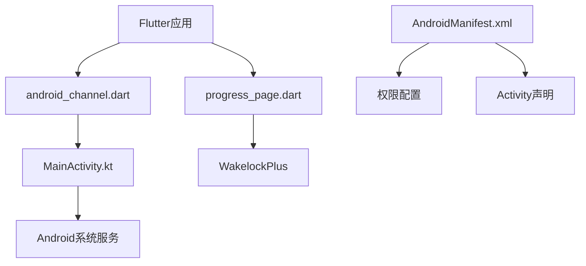
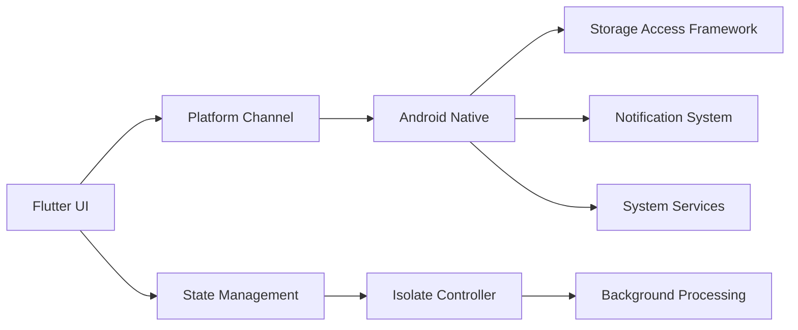
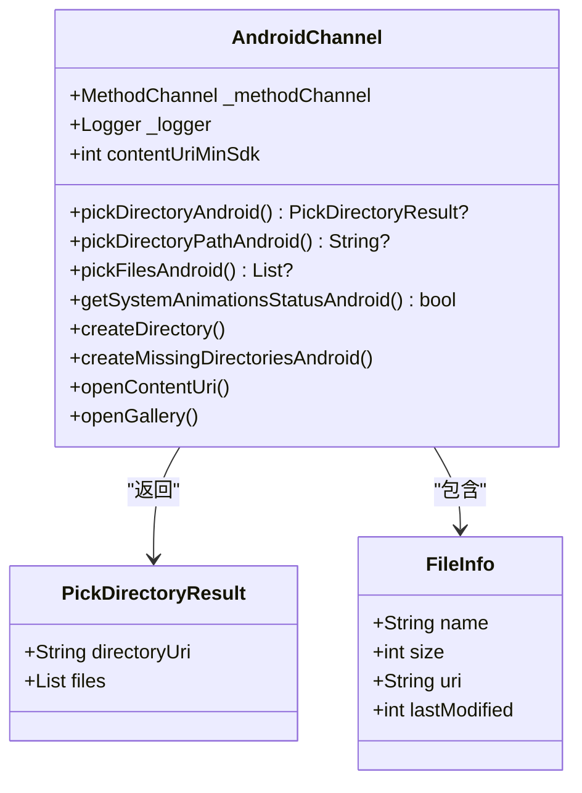
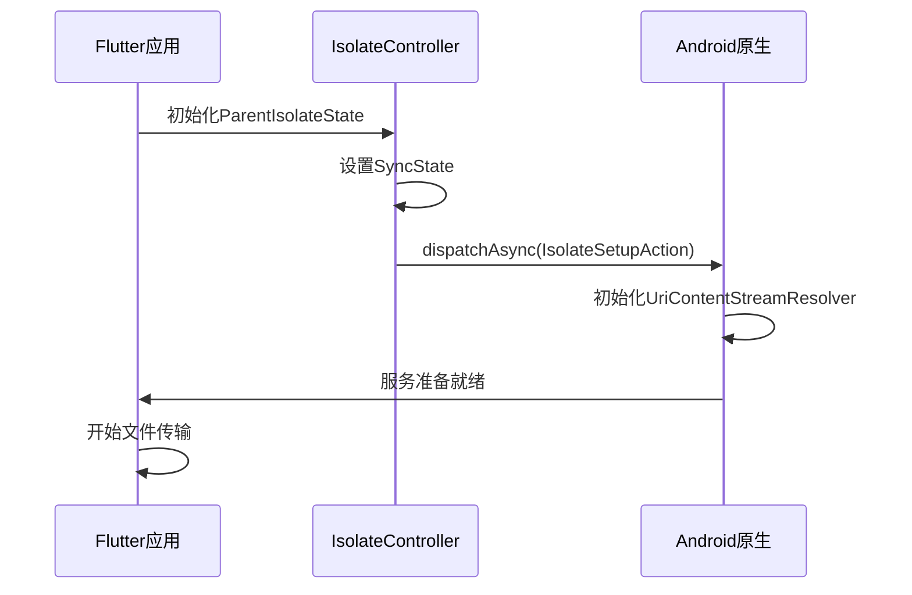
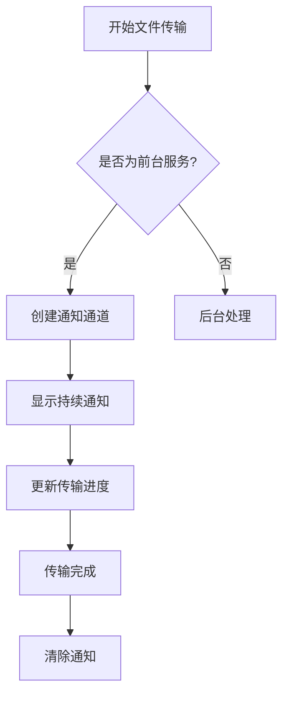
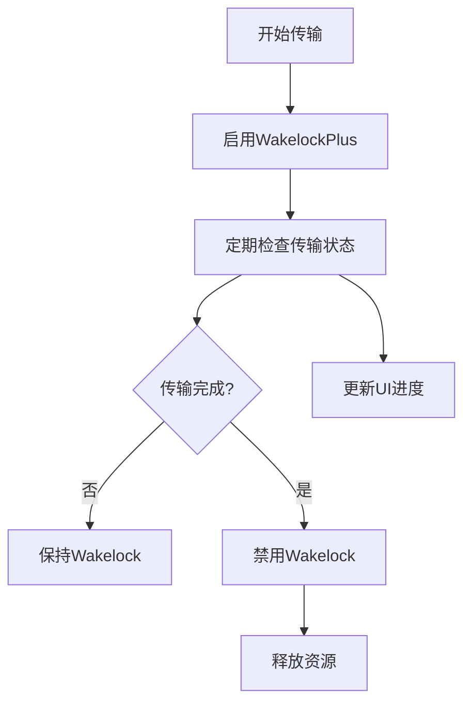
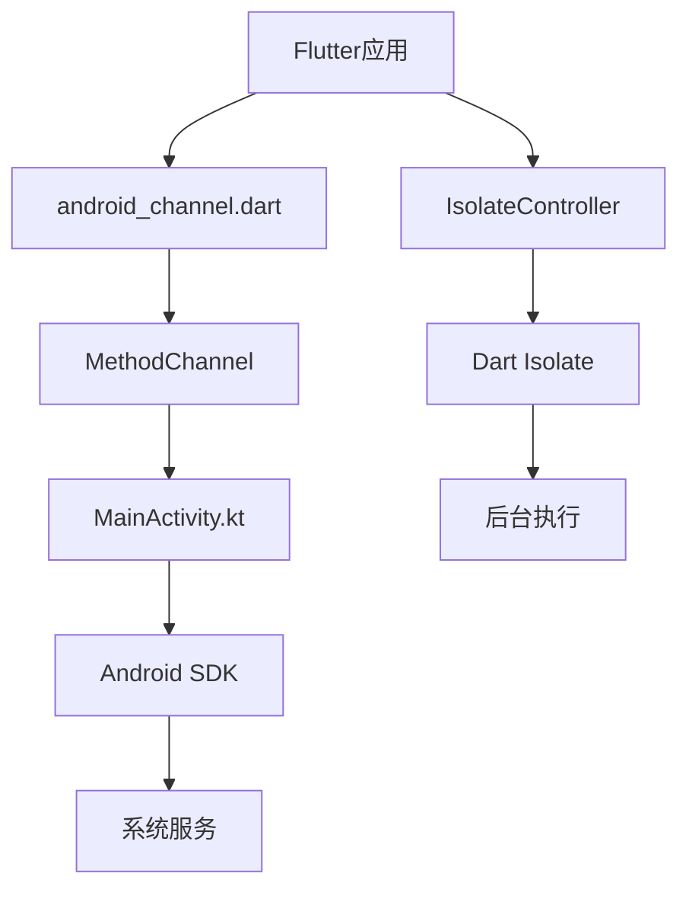

# 后台服务

<cite>
**本文档中引用的文件**  
- [android_channel.dart](file://app/lib/util/native/channel/android_channel.dart)
- [android_channel.mapper.dart](file://app/lib/util/native/channel/android_channel.mapper.dart)
- [MainActivity.kt](file://app/android/app/src/main/kotlin/org/localsend/localsend_app/MainActivity.kt)
- [AndroidManifest.xml](file://app/android/app/src/main/AndroidManifest.xml)
- [content_uri_helper.dart](file://app/lib/util/native/content_uri_helper.dart)
- [init.dart](file://app/lib/config/init.dart)
- [progress_page.dart](file://app/lib/pages/progress_page.dart)
</cite>

## 目录
1. [简介](#简介)
2. [项目结构](#项目结构)
3. [核心组件](#核心组件)
4. [架构概述](#架构概述)
5. [详细组件分析](#详细组件分析)
6. [依赖分析](#依赖分析)
7. [性能考虑](#性能考虑)
8. [故障排除指南](#故障排除指南)
9. [结论](#结论)

## 简介
本文件详细说明了LocalSend应用中Android后台服务的实现。文档重点介绍了如何配置前台服务以确保文件传输在后台持续运行，通过android_channel.dart与原生层通信的机制，通知系统的实现，服务生命周期管理，以及性能优化策略。

## 项目结构
项目结构遵循标准的Flutter应用布局，包含Android特定的原生代码实现。核心的后台服务功能通过平台通道与Android原生代码交互。

**图示来源**
- [android_channel.dart](file://app/lib/util/native/channel/android_channel.dart)
- [MainActivity.kt](file://app/android/app/src/main/kotlin/org/localsend/localsend_app/MainActivity.kt)
- [AndroidManifest.xml](file://app/android/app/src/main/AndroidManifest.xml)

**章节来源**
- [AndroidManifest.xml](file://app/android/app/src/main/AndroidManifest.xml)
- [MainActivity.kt](file://app/android/app/src/main/kotlin/org/localsend/localsend_app/MainActivity.kt)

## 核心组件
核心组件包括用于与Android原生代码通信的平台通道、处理后台文件传输的服务机制，以及管理应用生命周期的组件。系统通过MethodChannel实现Flutter与Android原生代码的双向通信。

**章节来源**
- [android_channel.dart](file://app/lib/util/native/channel/android_channel.dart)
- [content_uri_helper.dart](file://app/lib/util/native/content_uri_helper.dart)

## 架构概述
系统架构采用Flutter框架与Android原生代码结合的方式，通过平台通道实现功能扩展。文件传输服务作为前台服务运行，确保在应用退至后台时仍能持续工作。

**图示来源**
- [android_channel.dart](file://app/lib/util/native/channel/android_channel.dart)
- [MainActivity.kt](file://app/android/app/src/main/kotlin/org/localsend/localsend_app/MainActivity.kt)
- [init.dart](file://app/lib/config/init.dart)

## 详细组件分析

### Android通道分析
Android通道组件负责Flutter应用与Android原生代码之间的通信。通过MethodChannel，Flutter可以调用Android原生功能，如文件选择、目录创建和内容URI处理。

**图示来源**
- [android_channel.dart](file://app/lib/util/native/channel/android_channel.dart)
- [android_channel.mapper.dart](file://app/lib/util/native/channel/android_channel.mapper.dart)

**章节来源**
- [android_channel.dart](file://app/lib/util/native/channel/android_channel.dart)

### 服务生命周期管理
服务生命周期管理确保文件传输在各种应用状态下都能正常进行。系统通过IsolateController管理后台任务，并在应用启动时初始化必要的服务。

**图示来源**
- [init.dart](file://app/lib/config/init.dart)
- [content_uri_helper.dart](file://app/lib/util/native/content_uri_helper.dart)

**章节来源**
- [init.dart](file://app/lib/config/init.dart)

### 通知系统实现
虽然代码中未直接显示通知通道的创建，但通过平台通道可以推断出通知系统的存在。前台服务需要持续的通知来防止系统回收。

**图示来源**
- [MainActivity.kt](file://app/android/app/src/main/kotlin/org/localsend/localsend_app/MainActivity.kt)
- [android_channel.dart](file://app/lib/util/native/channel/android_channel.dart)

### 性能优化机制
系统实现了多种性能优化策略，包括使用Wakelock防止设备休眠，以及合理管理资源使用。

**图示来源**
- [progress_page.dart](file://app/lib/pages/progress_page.dart)

**章节来源**
- [progress_page.dart](file://app/lib/pages/progress_page.dart)

## 依赖分析
系统依赖关系清晰，Flutter层通过平台通道依赖Android原生实现，而原生层则依赖Android系统服务和权限配置。

**图示来源**
- [android_channel.dart](file://app/lib/util/native/channel/android_channel.dart)
- [MainActivity.kt](file://app/android/app/src/main/kotlin/org/localsend/localsend_app/MainActivity.kt)
- [init.dart](file://app/lib/config/init.dart)

**章节来源**
- [android_channel.dart](file://app/lib/util/native/channel/android_channel.dart)
- [MainActivity.kt](file://app/android/app/src/main/kotlin/org/localsend/localsend_app/MainActivity.kt)

## 性能考虑
在性能方面，系统通过多种机制确保文件传输的效率和可靠性。使用WakelockPlus保持设备唤醒状态，防止传输过程中设备休眠。同时，通过定时器定期检查传输状态，及时释放资源。

**章节来源**
- [progress_page.dart](file://app/lib/pages/progress_page.dart)

## 故障排除指南
当遇到后台服务问题时，可以检查以下方面：
1. 确认AndroidManifest.xml中的权限配置是否完整
2. 检查平台通道方法名称是否匹配
3. 验证Wakelock是否正确启用和禁用
4. 确认IsolateController初始化是否成功

**章节来源**
- [android_channel.dart](file://app/lib/util/native/channel/android_channel.dart)
- [MainActivity.kt](file://app/android/app/src/main/kotlin/org/localsend/localsend_app/MainActivity.kt)
- [progress_page.dart](file://app/lib/pages/progress_page.dart)

## 结论
LocalSend应用的Android后台服务实现采用了标准的Flutter平台通道模式，通过精心设计的架构确保文件传输的可靠性和性能。系统合理利用Android前台服务特性，结合Wakelock机制，为用户提供流畅的文件传输体验。