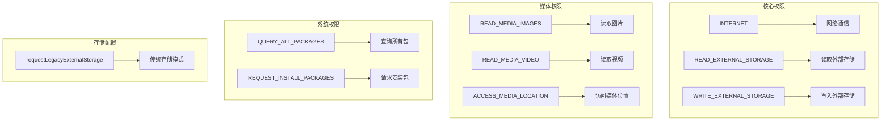
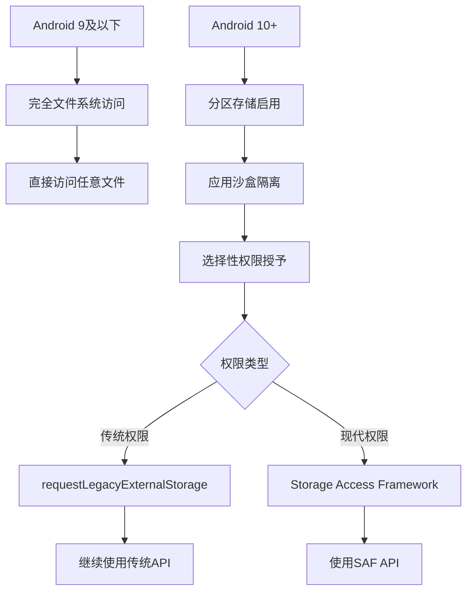
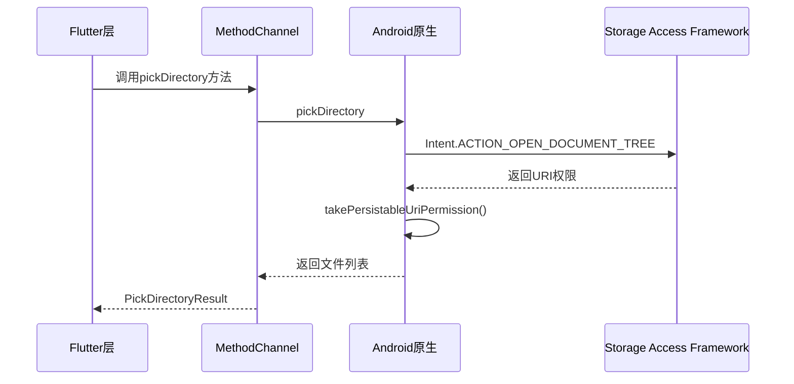
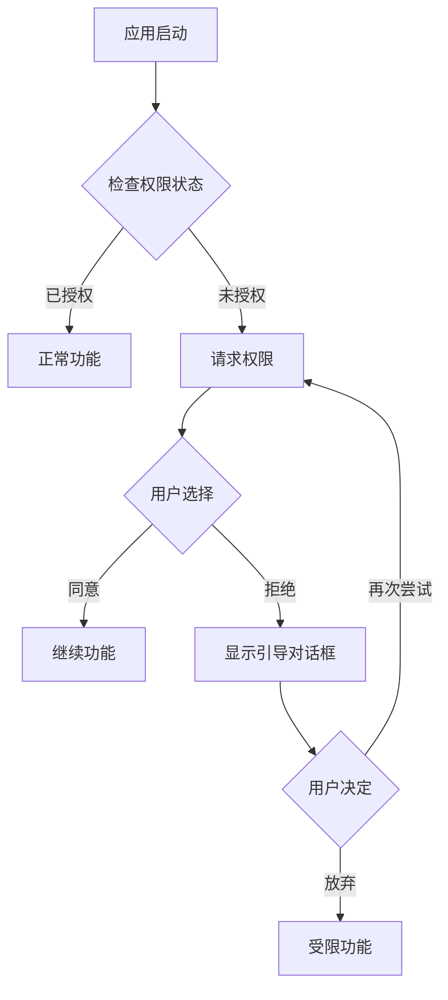
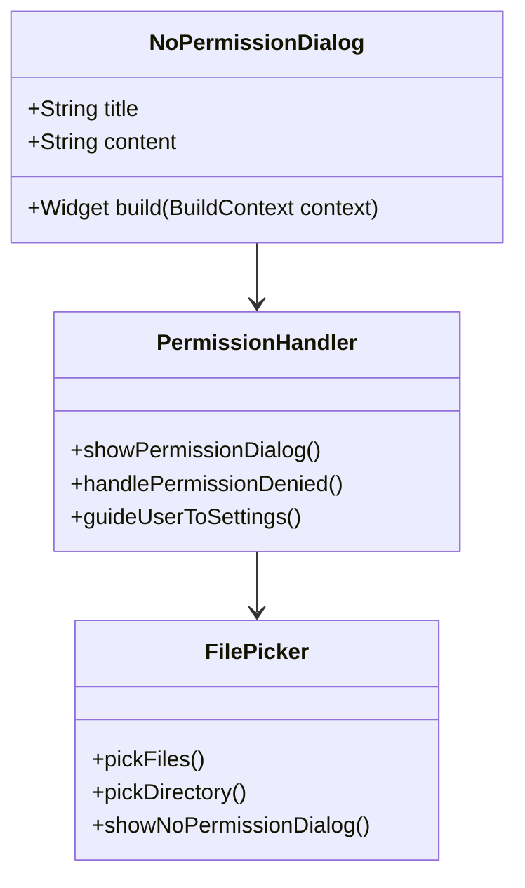

# 权限配置

<cite>
**本文档中引用的文件**
- [AndroidManifest.xml](file://app/android/app/src/main/AndroidManifest.xml)
- [android_channel.dart](file://app/lib/util/native/channel/android_channel.dart)
- [MainActivity.kt](file://app/android/app/src/main/kotlin/org/localsend/localsend_app/MainActivity.kt)
- [build.gradle](file://app/android/app/build.gradle)
- [content_uri_helper.dart](file://app/lib/util/native/content_uri_helper.dart)
- [no_permission_dialog.dart](file://app/lib/widget/dialogs/no_permission_dialog.dart)
- [FastDocumentFile.kt](file://app/android/app/src/main/kotlin/org/localsend/localsend_app/FastDocumentFile.kt)
- [FileOpener.kt](file://app/android/app/src/main/kotlin/org/localsend/localsend_app/FileOpener.kt)
</cite>

## 目录
1. [简介](#简介)
2. [AndroidManifest.xml权限声明](#androidmanifestxml权限声明)
3. [权限作用与必要性分析](#权限作用与必要性分析)
4. [Android 10及以上版本的分区存储影响](#android-10及以上版本的分区存储影响)
5. [原生通道权限处理机制](#原生通道权限处理机制)
6. [运行时权限请求最佳实践](#运行时权限请求最佳实践)
7. [权限拒绝后的用户引导策略](#权限拒绝后的用户引导策略)
8. [权限配置调试方法](#权限配置调试方法)
9. [常见权限相关错误解决方案](#常见权限相关错误解决方案)
10. [总结](#总结)

## 简介

LocalSend应用是一个跨平台的文件传输工具，需要在Android平台上处理复杂的权限配置。本文档深入分析了Android权限配置的各个方面，包括权限声明、分区存储影响、原生通道处理以及调试方法。

## AndroidManifest.xml权限声明

LocalSend在Android平台上声明了多个关键权限，这些权限对于应用的核心功能至关重要。



**图表来源**
- [AndroidManifest.xml](file://app/android/app/src/main/AndroidManifest.xml#L1-L27)

### 权限声明详情

应用在AndroidManifest.xml中声明了以下权限：

| 权限名称 | 类型 | 用途 | 必要性 |
|---------|------|------|--------|
| `INTERNET` | 网络权限 | 允许应用进行网络通信，实现设备发现和文件传输 | 核心功能必需 |
| `READ_EXTERNAL_STORAGE` | 存储权限 | 读取设备上的文件和目录 | 核心功能必需 |
| `WRITE_EXTERNAL_STORAGE` | 存储权限 | 写入设备上的文件和目录 | 核心功能必需 |
| `READ_MEDIA_IMAGES` | 媒体权限 | 专门读取图片文件 | 媒体功能必需 |
| `READ_MEDIA_VIDEO` | 媒体权限 | 专门读取视频文件 | 媒体功能必需 |
| `ACCESS_MEDIA_LOCATION` | 媒体权限 | 访问媒体文件的位置信息 | 媒体功能必需 |
| `QUERY_ALL_PACKAGES` | 系统权限 | 查询设备上安装的所有应用 | 系统集成必需 |
| `REQUEST_INSTALL_PACKAGES` | 系统权限 | 请求安装APK包 | 应用更新必需 |

**节来源**
- [AndroidManifest.xml](file://app/android/app/src/main/AndroidManifest.xml#L1-L27)

## 权限作用与必要性分析

### INTERNET权限

**作用**: 允许应用进行网络通信，实现设备发现、文件传输和HTTP服务器功能。

**必要性**: 绝对必需。LocalSend的核心功能是通过网络在设备间传输文件，没有INTERNET权限无法实现设备发现和数据传输。

### 存储权限组合

**READ_EXTERNAL_STORAGE + WRITE_EXTERNAL_STORAGE**:
- **作用**: 提供对设备外部存储的完整访问权限
- **必要性**: 在Android 10以下版本中绝对必需，允许直接访问文件系统

**READ_MEDIA_*系列权限**:
- **作用**: 针对Android 10+的分区存储设计，提供对特定类型媒体文件的访问
- **必要性**: 在Android 10+设备上必需，替代传统的存储权限

### QUERY_ALL_PACKAGES权限

**作用**: 允许应用查询设备上安装的所有应用包信息。

**必要性**: 对于设备发现功能至关重要，需要扫描网络中的其他LocalSend实例。

### REQUEST_INSTALL_PACKAGES权限

**作用**: 允许应用请求安装APK包的能力。

**必要性**: 支持应用自动更新功能，无需用户手动下载和安装。

**节来源**
- [AndroidManifest.xml](file://app/android/app/src/main/AndroidManifest.xml#L3-L15)

## Android 10及以上版本的分区存储影响

### 分区存储概述

Android 10引入了分区存储（Scoped Storage）概念，显著改变了应用对文件系统的访问方式。



**图表来源**
- [MainActivity.kt](file://app/android/app/src/main/kotlin/org/localsend/localsend_app/MainActivity.kt#L25-L26)

### requestLegacyExternalStorage的作用

应用在AndroidManifest.xml中声明了`android:requestLegacyExternalStorage="true"`：

```xml
<application
    android:label="LocalSend"
    android:name="${applicationName}"
    android:usesCleartextTraffic="true"
    android:banner="@drawable/banner"
    android:icon="@mipmap/ic_launcher"
    android:requestLegacyExternalStorage="true"
>
```

**作用**:
- 允许应用在Android 10+设备上继续使用传统的文件系统访问方式
- 维持与旧版本应用的兼容性
- 避免立即迁移到Storage Access Framework（SAF）

**限制**:
- Google建议最终迁移到SAF
- 可能受到未来Android版本的限制
- 不符合最新的隐私保护要求

### 分区存储对LocalSend的影响

1. **文件访问方式变化**
   - 从直接路径访问变为URI权限管理
   - 需要使用Storage Access Framework API

2. **权限模型变化**
   - 从一次性权限授予变为按需权限申请
   - 更细粒度的权限控制

3. **用户体验变化**
   - 用户需要通过系统对话框选择文件夹
   - 权限持久化需要特殊处理

**节来源**
- [AndroidManifest.xml](file://app/android/app/src/main/AndroidManifest.xml#L25-L26)

## 原生通道权限处理机制

LocalSend使用Flutter的MethodChannel机制来处理Android原生权限相关的操作。



**图表来源**
- [android_channel.dart](file://app/lib/util/native/channel/android_channel.dart#L10-L25)
- [MainActivity.kt](file://app/android/app/src/main/kotlin/org/localsend/localsend_app/MainActivity.kt#L25-L45)

### 核心方法实现

#### pickDirectory方法

```dart
Future<PickDirectoryResult?> pickDirectoryAndroid() async {
  final result = await _methodChannel.invokeMethod<Map>('pickDirectory');
  if (result == null) {
    return null;
  }
  
  return PickDirectoryResultMapper.fromJson({
    'directoryUri': result['directoryUri'],
    'files': (result['files'] as List).map((e) => FileInfoMapper.fromJson((e as Map).cast<String, dynamic>())).toList(),
  });
}
```

#### pickFiles方法

```dart
Future<List<FileInfo>?> pickFilesAndroid() async {
  final result = await _methodChannel.invokeMethod<List>('pickFiles');
  if (result == null) {
    return null;
  }
  
  return result.map((e) => FileInfoMapper.fromJson((e as Map).cast<String, dynamic>())).toList();
}
```

### Storage Access Framework (SAF) 实现

Android原生代码中实现了完整的SAF处理逻辑：

```kotlin
private fun openDirectoryPicker(onlyPath: Boolean) {
    val intent = Intent(Intent.ACTION_OPEN_DOCUMENT_TREE)
    intent.addFlags(Intent.FLAG_GRANT_READ_URI_PERMISSION or Intent.FLAG_GRANT_PERSISTABLE_URI_PERMISSION)
    startActivityForResult(
        intent,
        if (onlyPath) REQUEST_CODE_PICK_DIRECTORY_PATH else REQUEST_CODE_PICK_DIRECTORY
    )
}
```

**关键特性**:
- 使用`ACTION_OPEN_DOCUMENT_TREE`打开文件夹选择器
- 添加`FLAG_GRANT_READ_URI_PERMISSION`授予权限
- 添加`FLAG_GRANT_PERSISTABLE_URI_PERMISSION`使权限持久化

**节来源**
- [android_channel.dart](file://app/lib/util/native/channel/android_channel.dart#L10-L25)
- [MainActivity.kt](file://app/android/app/src/main/kotlin/org/localsend/localsend_app/MainActivity.kt#L65-L75)

## 运行时权限请求最佳实践

### 权限请求时机



### 权限检查与请求流程

1. **权限状态检查**
   ```kotlin
   // 检查权限是否已授予
   if (ContextCompat.checkSelfPermission(context, permission) == PackageManager.PERMISSION_GRANTED) {
       // 权限已授予
   }
   ```

2. **权限请求**
   ```kotlin
   ActivityCompat.requestPermissions(activity, arrayOf(permission), requestCode)
   ```

3. **结果处理**
   ```kotlin
   override fun onRequestPermissionsResult(requestCode: Int, permissions: Array<String>, grantResults: IntArray) {
       when (requestCode) {
           PERMISSION_REQUEST_CODE -> {
               if (grantResults.isNotEmpty() && grantResults[0] == PackageManager.PERMISSION_GRANTED) {
                   // 权限授予成功
               } else {
                   // 权限被拒绝
               }
           }
       }
   }
   ```

### 最佳实践原则

1. **最小权限原则**
   - 只请求完成功能所需的最小权限集合
   - 避免过度请求不必要的权限

2. **透明性原则**
   - 向用户解释为什么需要特定权限
   - 提供清晰的权限说明

3. **渐进式请求**
   - 在实际需要时才请求权限
   - 避免应用启动时大量请求权限

4. **优雅降级**
   - 权限被拒绝时提供替代方案
   - 显示友好的错误提示

**节来源**
- [MainActivity.kt](file://app/android/app/src/main/kotlin/org/localsend/localsend_app/MainActivity.kt#L35-L78)

## 权限拒绝后的用户引导策略

### 错误处理架构

LocalSend实现了专门的权限拒绝处理机制：



**图表来源**
- [no_permission_dialog.dart](file://app/lib/widget/dialogs/no_permission_dialog.dart#L1-L21)

### 用户引导策略

#### 1. 即时反馈
当权限请求失败时，立即显示友好的错误对话框：

```dart
class NoPermissionDialog extends StatelessWidget {
  const NoPermissionDialog({super.key});

  @override
  Widget build(BuildContext context) {
    return AlertDialog(
      title: Text(t.dialogs.noPermission.title),
      content: Text(t.dialogs.noPermission.content),
      actions: [
        TextButton(
          onPressed: () => context.pop(),
          child: Text(t.general.close),
        )
      ],
    );
  }
}
```

#### 2. 渐进式教育
- **首次拒绝**: 显示简单错误提示
- **多次拒绝**: 提供详细的权限说明
- **设置引导**: 引导用户到应用设置页面

#### 3. 替代方案
当某些权限被拒绝时，提供功能替代方案：
- 文件选择功能受限时，提供部分可用的功能
- 显示清晰的说明，告知用户哪些功能不可用

### 权限设置引导

```kotlin
private fun guideUserToSettings() {
    val intent = Intent(Settings.ACTION_APPLICATION_DETAILS_SETTINGS)
    val uri = Uri.fromParts("package", packageName, null)
    intent.data = uri
    startActivity(intent)
}
```

**节来源**
- [no_permission_dialog.dart](file://app/lib/widget/dialogs/no_permission_dialog.dart#L1-L21)

## 权限配置调试方法

### adb命令检查权限状态

#### 1. 查看应用权限列表
```bash
adb shell dumpsys package org.localsend.localsend_app | grep "grantedPermissions"
```

#### 2. 检查特定权限状态
```bash
adb shell dumpsys package org.localsend.localsend_app | grep "android.permission.READ_EXTERNAL_STORAGE"
```

#### 3. 查看运行时权限状态
```bash
adb shell dumpsys package org.localsend.localsend_app | grep "runtime permissions"
```

### 日志分析

#### 1. 权限相关日志
```bash
adb logcat | grep -i "permission\|security\|access"
```

#### 2. 特定包的日志
```bash
adb logcat | grep "org.localsend.localsend_app"
```

### 开发者选项检查

1. **显示应用权限**
   - 设置 > 应用 > LocalSend > 权限

2. **检查权限状态**
   - 设置 > 安全 > 应用权限 > LocalSend

3. **测试权限行为**
   - 使用不同的Android版本模拟权限场景

### 内存泄漏检测

```kotlin
// 检查URI权限持有情况
val contentResolver = context.contentResolver
val persistedUriPermissions = contentResolver.persistedUriPermissions
Log.d("PermissionDebug", "Persisted URI permissions: ${persistedUriPermissions.size}")
```

**节来源**
- [MainActivity.kt](file://app/android/app/src/main/kotlin/org/localsend/localsend_app/MainActivity.kt#L115-L138)

## 常见权限相关错误解决方案

### 1. 权限被拒绝错误

**错误现象**: 应用无法访问文件或执行需要权限的操作

**解决方案**:
```kotlin
// 检查并请求权限
private fun checkAndRequestPermissions() {
    val permissions = listOf(
        Manifest.permission.READ_EXTERNAL_STORAGE,
        Manifest.permission.WRITE_EXTERNAL_STORAGE
    )
    
    val missingPermissions = permissions.filter { 
        ContextCompat.checkSelfPermission(this, it) != PackageManager.PERMISSION_GRANTED 
    }
    
    if (missingPermissions.isNotEmpty()) {
        ActivityCompat.requestPermissions(this, missingPermissions.toTypedArray(), PERMISSION_REQUEST_CODE)
    }
}
```

### 2. Storage Access Framework权限丢失

**错误现象**: 用户之前授予的文件夹访问权限失效

**解决方案**:
```kotlin
// 重新获取持久化URI权限
private fun restoreUriPermissions(uri: Uri) {
    try {
        val takeFlags = Intent.FLAG_GRANT_READ_URI_PERMISSION or Intent.FLAG_GRANT_WRITE_URI_PERMISSION
        contentResolver.takePersistableUriPermission(uri, takeFlags)
    } catch (e: SecurityException) {
        Log.e("Permission", "Failed to restore URI permission", e)
        // 引导用户重新选择文件夹
    }
}
```

### 3. 分区存储兼容性问题

**错误现象**: 在Android 10+设备上无法访问某些文件

**解决方案**:
```kotlin
// 检查是否支持SAF
private fun isSafSupported(): Boolean {
    return Build.VERSION.SDK_INT >= Build.VERSION_CODES.KITKAT &&
           Environment.isExternalStorageEmulated()
}
```

### 4. 多媒体权限问题

**错误现象**: 无法访问相册或媒体文件

**解决方案**:
```kotlin
// 请求媒体权限
private fun requestMediaPermissions() {
    val permissions = if (Build.VERSION.SDK_INT >= Build.VERSION_CODES.TIRAMISU) {
        listOf(
            Manifest.permission.READ_MEDIA_IMAGES,
            Manifest.permission.READ_MEDIA_VIDEO,
            Manifest.permission.ACCESS_MEDIA_LOCATION
        )
    } else {
        listOf(Manifest.permission.READ_EXTERNAL_STORAGE)
    }
    
    ActivityCompat.requestPermissions(this, permissions.toTypedArray(), MEDIA_PERMISSION_REQUEST_CODE)
}
```

### 5. 权限状态不一致

**错误现象**: 应用认为有权限，但实际无法访问

**解决方案**:
```kotlin
// 权限状态验证
private fun validatePermissionState(): Boolean {
    return when {
        Build.VERSION.SDK_INT >= Build.VERSION_CODES.R -> {
            Environment.isExternalStorageManager()
        }
        Build.VERSION.SDK_INT >= Build.VERSION_CODES.M -> {
            ContextCompat.checkSelfPermission(this, Manifest.permission.READ_EXTERNAL_STORAGE) == PackageManager.PERMISSION_GRANTED
        }
        else -> true // 低于6.0的版本总是有权限
    }
}
```

### 6. 性能优化

```kotlin
// 批量权限检查
private fun checkMultiplePermissions(): Map<String, Boolean> {
    val permissions = listOf(
        Manifest.permission.READ_EXTERNAL_STORAGE,
        Manifest.permission.WRITE_EXTERNAL_STORAGE,
        Manifest.permission.INTERNET
    )
    
    return permissions.associateWith { 
        ContextCompat.checkSelfPermission(this, it) == PackageManager.PERMISSION_GRANTED 
    }
}
```

**节来源**
- [MainActivity.kt](file://app/android/app/src/main/kotlin/org/localsend/localsend_app/MainActivity.kt#L161-L186)
- [FastDocumentFile.kt](file://app/android/app/src/main/kotlin/org/localsend/localsend_app/FastDocumentFile.kt#L102-L140)

## 总结

LocalSend的Android权限配置体现了现代移动应用开发的最佳实践。通过合理的权限设计、完善的错误处理机制和用户友好的引导策略，确保了应用在各种Android版本上的稳定运行。

### 关键要点

1. **权限设计平衡**: 在功能需求和用户体验之间找到平衡点
2. **向后兼容**: 通过`requestLegacyExternalStorage`保持与旧版本的兼容性
3. **用户教育**: 提供清晰的权限说明和引导
4. **错误处理**: 建立完善的错误处理和恢复机制
5. **调试支持**: 提供丰富的调试工具和方法

### 未来发展方向

随着Android系统的不断演进，LocalSend需要持续关注新的权限模型和最佳实践，适时调整权限策略以适应最新的Android版本要求。