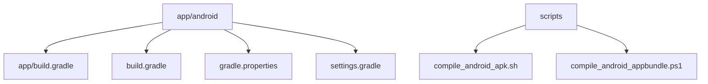
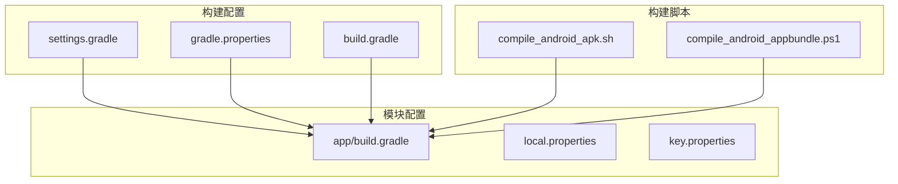
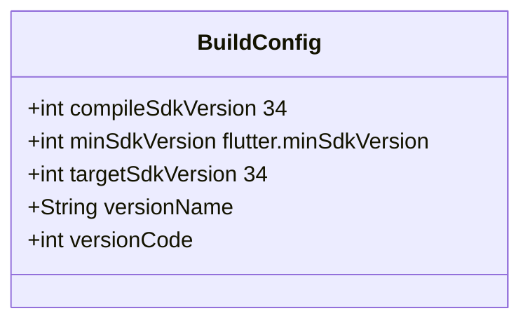
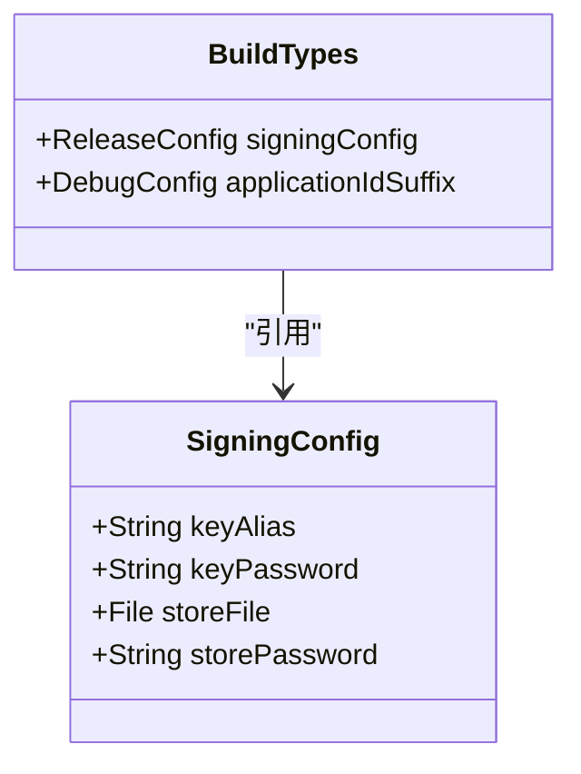
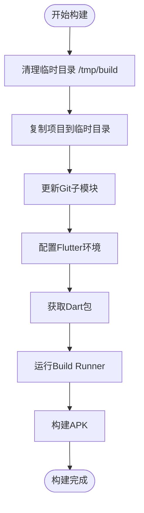
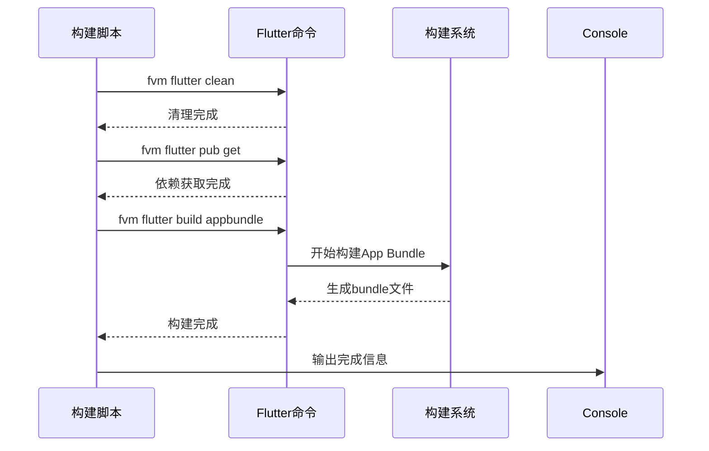
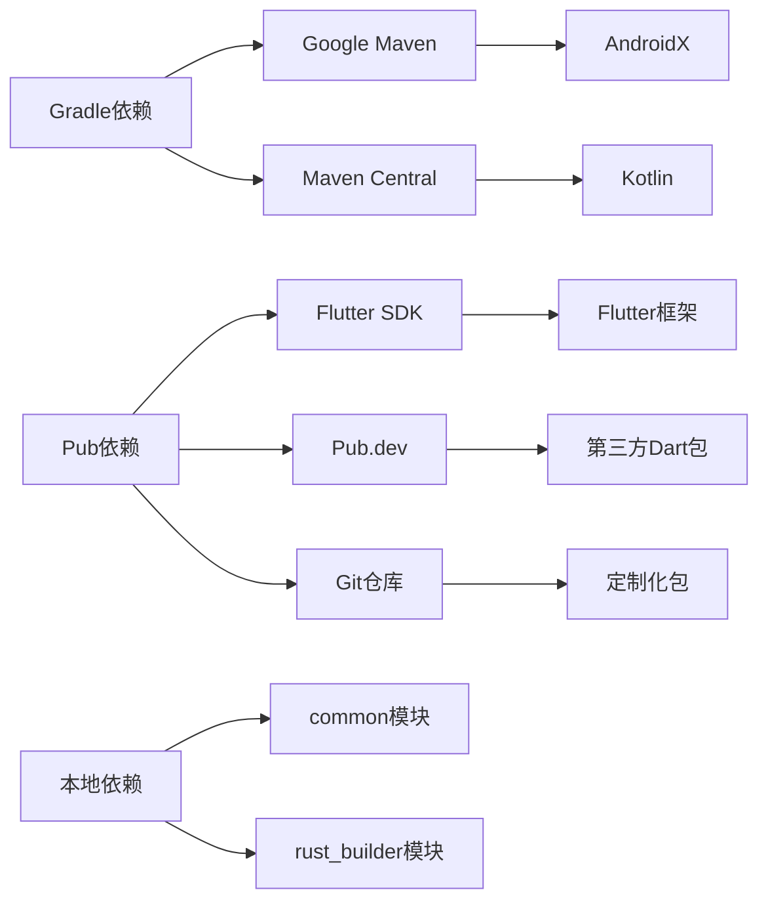

# 构建配置

<cite>
**本文档中引用的文件**  
- [app/build.gradle](file://app/android/app/build.gradle)
- [build.gradle](file://app/android/build.gradle)
- [gradle.properties](file://app/android/gradle.properties)
- [settings.gradle](file://app/android/settings.gradle)
- [compile_android_apk.sh](file://scripts/compile_android_apk.sh)
- [compile_android_appbundle.ps1](file://scripts/compile_android_appbundle.ps1)
- [pubspec.yaml](file://app/pubspec.yaml)
</cite>

## 目录
1. [简介](#简介)
2. [项目结构](#项目结构)
3. [核心组件](#核心组件)
4. [架构概述](#架构概述)
5. [详细组件分析](#详细组件分析)
6. [依赖分析](#依赖分析)
7. [性能考虑](#性能考虑)
8. [故障排除指南](#故障排除指南)
9. [结论](#结论)

## 简介
本文件详细说明了LocalSend项目的Android构建配置。文档深入分析了`app/build.gradle`中的关键配置，包括SDK版本设置、构建类型、签名配置以及构建脚本的使用方法。同时涵盖了Google Play发布所需的App Bundle生成流程。

## 项目结构
LocalSend项目采用Flutter多平台架构，Android构建配置位于`app/android`目录下。主要构建文件包括顶级和模块级的`build.gradle`文件、`gradle.properties`配置以及构建脚本。

**Diagram sources**
- [app/android/app/build.gradle](file://app/android/app/build.gradle#L1-L103)
- [scripts/compile_android_apk.sh](file://scripts/compile_android_apk.sh#L1-L32)

## 核心组件
Android构建系统基于Gradle，使用Flutter Gradle插件进行集成。核心配置包括编译SDK版本、默认配置、构建类型和签名配置。构建过程通过外部脚本自动化，支持APK和App Bundle两种发布格式。

**Section sources**
- [app/android/app/build.gradle](file://app/android/app/build.gradle#L1-L103)
- [app/android/build.gradle](file://app/android/build.gradle#L1-L35)

## 架构概述
构建系统采用分层架构，顶层`build.gradle`配置仓库和全局设置，模块级`build.gradle`定义具体构建参数。通过`flutter-gradle-plugin`与Flutter框架集成，使用独立脚本控制构建流程。

**Diagram sources**
- [app/android/app/build.gradle](file://app/android/app/build.gradle#L1-L103)
- [app/android/build.gradle](file://app/android/build.gradle#L1-L35)
- [scripts/compile_android_apk.sh](file://scripts/compile_android_apk.sh#L1-L32)

## 详细组件分析

### 构建配置分析
Android构建配置定义了应用的编译环境和发布参数。`app/build.gradle`文件包含SDK版本、编译选项、默认配置和构建类型等关键设置。

#### SDK版本配置

**Diagram sources**
- [app/android/app/build.gradle](file://app/android/app/build.gradle#L10-L12)
- [app/android/app/build.gradle](file://app/android/app/build.gradle#L50-L58)

#### 构建类型配置

**Diagram sources**
- [app/android/app/build.gradle](file://app/android/app/build.gradle#L60-L75)

### 构建脚本分析
构建脚本自动化了Android应用的编译过程，支持不同发布渠道的需求。

#### APK构建脚本

**Diagram sources**
- [scripts/compile_android_apk.sh](file://scripts/compile_android_apk.sh#L1-L32)

#### App Bundle构建脚本

**Diagram sources**
- [scripts/compile_android_appbundle.ps1](file://scripts/compile_android_appbundle.ps1#L1-L11)

**Section sources**
- [scripts/compile_android_apk.sh](file://scripts/compile_android_apk.sh#L1-L32)
- [scripts/compile_android_appbundle.ps1](file://scripts/compile_android_appbundle.ps1#L1-L11)

## 依赖分析
项目依赖通过Gradle和Pub两种系统管理。Gradle处理Android原生依赖，Pub管理Dart/Flutter包。

**Diagram sources**
- [app/android/build.gradle](file://app/android/build.gradle#L1-L10)
- [app/pubspec.yaml](file://app/pubspec.yaml#L1-L124)

**Section sources**
- [app/android/build.gradle](file://app/android/build.gradle#L1-L35)
- [app/pubspec.yaml](file://app/pubspec.yaml#L1-L124)

## 性能考虑
构建配置优化了编译性能和应用运行效率。通过设置适当的JVM参数、启用AndroidX和Jetifier，确保构建过程的稳定性和兼容性。

## 故障排除指南
常见构建问题包括签名配置缺失、SDK版本不匹配和依赖冲突。确保`key.properties`文件存在且配置正确，检查本地Android SDK安装情况，并保持Gradle和Flutter版本兼容。

**Section sources**
- [app/android/app/build.gradle](file://app/android/app/build.gradle#L60-L75)
- [app/android/gradle.properties](file://app/android/gradle.properties#L1-L3)

## 结论
LocalSend的Android构建配置设计合理，支持多种发布渠道。通过Gradle脚本和外部构建脚本的结合，实现了灵活的构建流程，既满足Google Play发布要求，也兼容F-Droid等第三方应用商店的需求。