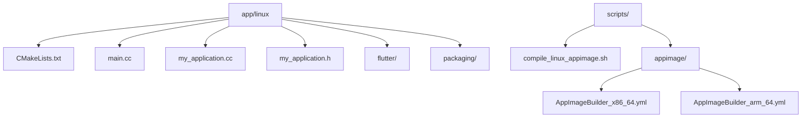

# Linux 实现

<cite>
**本文档中引用的文件**  
- [CMakeLists.txt](file://app/linux/CMakeLists.txt)
- [main.cc](file://app/linux/main.cc)
- [my_application.cc](file://app/linux/my_application.cc)
- [my_application.h](file://app/linux/my_application.h)
- [tray_helper.dart](file://app/lib/util/native/tray_helper.dart)
- [tray_watcher.dart](file://app/lib/widget/watcher/tray_watcher.dart)
- [window_watcher.dart](file://app/lib/widget/watcher/window_watcher.dart)
- [generated_plugin_registrant.cc](file://app/linux/flutter/generated_plugin_registrant.cc)
- [compile_linux_appimage.sh](file://scripts/compile_linux_appimage.sh)
- [AppImageBuilder_x86_64.yml](file://scripts/appimage/AppImageBuilder_x86_64.yml)
- [AppImageBuilder_arm_64.yml](file://scripts/appimage/AppImageBuilder_arm_64.yml)
- [make_config.yaml](file://app/linux/packaging/deb/make_config.yaml)
- [make_config.yaml](file://app/linux/packaging/rpm/make_config.yaml)
</cite>

## 目录
1. [简介](#简介)
2. [项目结构](#项目结构)
3. [构建系统配置](#构建系统配置)
4. [应用入口点与原生代码集成](#应用入口点与原生代码集成)
5. [系统托盘集成](#系统托盘集成)
6. [Linux 特定功能实现](#linux-特定功能实现)
7. [打包指南](#打包指南)
8. [调试技巧](#调试技巧)

## 简介
本文档详细介绍了 LocalSend 应用在 Linux 平台上的实现。涵盖了从构建系统配置、应用入口点、系统托盘集成到打包和调试的各个方面。文档重点分析了 CMake 构建系统、原生代码集成、跨桌面环境的系统托盘支持，以及生成 AppImage、DEB 和 RPM 包的完整流程。

## 项目结构
LocalSend 的 Linux 实现主要位于 `app/linux` 目录下，包含 C++ 源文件、CMake 构建脚本和打包配置。核心组件包括：
- `main.cc` 和 `my_application.cc`：应用的 C++ 入口点和 GTK 应用实现
- `CMakeLists.txt`：主构建配置文件
- `flutter/` 目录：Flutter 生成的插件注册文件
- `packaging/` 目录：DEB 和 RPM 包的配置文件

此外，`scripts/` 目录包含用于构建 AppImage 的脚本和配置。



**图源**  
- [CMakeLists.txt](file://app/linux/CMakeLists.txt#L1-L140)
- [compile_linux_appimage.sh](file://scripts/compile_linux_appimage.sh#L1-L40)

**章节源**  
- [CMakeLists.txt](file://app/linux/CMakeLists.txt#L1-L140)
- [compile_linux_appimage.sh](file://scripts/compile_linux_appimage.sh#L1-L40)

## 构建系统配置
Linux 构建系统基于 CMake，配置文件 `app/linux/CMakeLists.txt` 定义了完整的构建流程。该文件设置了项目名称、编译选项、依赖项和安装规则。

构建系统的关键特性包括：
- 使用 CMake 3.10 或更高版本
- 针对 Debug、Profile 和 Release 构建类型进行配置
- 集成 GTK+ 3.0 作为系统级依赖
- 应用标准编译设置（C++14、-Wall、-Werror）
- 配置安装捆绑包的目录结构

```cmake
# 项目级配置
cmake_minimum_required(VERSION 3.10)
set(CMAKE_TRY_COMPILE_TARGET_TYPE "STATIC_LIBRARY")
project(runner LANGUAGES CXX)

# 应用程序的可执行文件名称
set(BINARY_NAME "localsend_app")
# 唯一的 GTK 应用程序标识符
set(APPLICATION_ID "org.localsend.localsend_app")
```

**章节源**  
- [CMakeLists.txt](file://app/linux/CMakeLists.txt#L1-L30)

## 应用入口点与原生代码集成
应用的入口点由 `main.cc` 文件定义，它创建并运行一个 `MyApplication` 实例。`MyApplication` 类在 `my_application.cc` 中实现，继承自 `GtkApplication`，负责处理应用的激活、命令行参数和窗口管理。

```cpp
// main.cc
#include "my_application.h"

int main(int argc, char** argv) {
  g_autoptr(MyApplication) app = my_application_new();
  return g_application_run(G_APPLICATION(app), argc, argv);
}
```

`MyApplication` 类通过 `my_application_activate` 方法创建主窗口，并设置窗口标题、大小和 Flutter 视图。它还通过 `my_application_local_command_line` 方法处理命令行参数。

```cpp
// my_application.cc
static void my_application_activate(GApplication* application) {
  MyApplication* self = MY_APPLICATION(application);
  GtkWindow* window = GTK_WINDOW(gtk_application_window_new(GTK_APPLICATION(application)));

  // 根据环境变量设置客户端装饰
  const char* GTK_CSD = getenv("GTK_CSD");
  if (GTK_CSD && strcmp(GTK_CSD, "1") == 0) {
    // 使用 GTK 头部栏
    GtkHeaderBar* header_bar = GTK_HEADER_BAR(gtk_header_bar_new());
    gtk_header_bar_set_title(header_bar, "LocalSend");
    gtk_window_set_titlebar(window, GTK_WIDGET(header_bar));
  } else {
    gtk_window_set_title(window, "LocalSend");
  }

  gtk_window_set_default_size(window, 400, 500);
  gtk_widget_show(GTK_WIDGET(window));

  // 创建 Flutter 项目并添加视图
  g_autoptr(FlDartProject) project = fl_dart_project_new();
  FlView* view = fl_view_new(project);
  gtk_container_add(GTK_CONTAINER(window), GTK_WIDGET(view));
  fl_register_plugins(FL_PLUGIN_REGISTRY(view));
}
```

**章节源**  
- [main.cc](file://app/linux/main.cc#L1-L7)
- [my_application.cc](file://app/linux/my_application.cc#L1-L100)
- [my_application.h](file://app/linux/my_application.h#L1-L19)

## 系统托盘集成
系统托盘功能通过 `tray_manager` 插件实现，该插件已在 `generated_plugin_registrant.cc` 中注册。托盘集成的逻辑主要在 Dart 代码中处理，位于 `tray_helper.dart` 文件中。

### 托盘初始化
`initTray` 函数负责初始化系统托盘图标和上下文菜单。它根据不同的 Linux 环境（如 Flatpak）选择合适的图标路径。

```dart
Future<void> initTray() async {
  if (!checkPlatformHasTray()) {
    return;
  }
  try {
    if (checkPlatform([TargetPlatform.linux])) {
      String icon;
      if (await File('/.flatpak-info').exists()) {
        // Flatpak 环境下的图标路径
        icon = 'org.localsend.localsend_app-tray';
      } else {
        icon = Assets.img.logo32White.path;
      }
      await tm.trayManager.setIcon(icon);
    }
    // 创建上下文菜单
    final items = [
      tm.MenuItem(key: TrayEntry.open.name, label: t.tray.open),
      tm.MenuItem(key: TrayEntry.close.name, label: t.tray.close),
    ];
    await tm.trayManager.setContextMenu(tm.Menu(items: items));
  } catch (e) {
    _logger.warning('Failed to init tray', e);
  }
}
```

### 托盘事件处理
`TrayWatcher` 组件监听托盘事件，如图标点击和菜单项选择。它实现了 `TrayListener` 接口来处理这些事件。

```dart
class _TrayWatcherState extends State<TrayWatcher> with TrayListener {
  @override
  void onTrayIconMouseDown() async {
    if (checkPlatform([TargetPlatform.macOS])) {
      await trayManager.popUpContextMenu();
    } else {
      await showFromTray();
    }
  }

  @override
  void onTrayMenuItemClick(MenuItem menuItem) async {
    final entry = TrayEntry.values.firstWhereOrNull((e) => e.name == menuItem.key);
    switch (entry) {
      case TrayEntry.open:
        await showFromTray();
        break;
      case TrayEntry.close:
        exit(0);
      default:
    }
  }
}
```

### 桌面环境兼容性
代码通过检查不同的 Linux 发行版和桌面环境来确保兼容性。例如，它使用 `libayatana-appindicator3-1` 而不是已废弃的 `libappindicator3-1`，以支持现代桌面环境。

```yaml
# AppImageBuilder_x86_64.yml
apt:
  include:
    - libayatana-appindicator3-1:amd64
    - librsvg2-common:amd64
```

**章节源**  
- [tray_helper.dart](file://app/lib/util/native/tray_helper.dart#L1-L95)
- [tray_watcher.dart](file://app/lib/widget/watcher/tray_watcher.dart#L1-L61)
- [generated_plugin_registrant.cc](file://app/linux/flutter/generated_plugin_registrant.cc#L1-L20)

## Linux 特定功能实现
### 桌面文件创建
应用通过打包配置自动创建桌面文件。DEB 和 RPM 包的配置文件中包含了桌面文件所需的信息，如应用名称、图标、分类和启动通知。

```yaml
# make_config.yaml (DEB)
display_name: LocalSend
package_name: localsend
icon: assets/img/logo-512.png
categories:
  - GTK
  - FileTransfer
  - Utility
startup_notify: true
```

### 系统通知集成
虽然文档中未直接提及，但通过集成 `url_launcher_linux` 和其他系统插件，应用能够与 Linux 桌面环境的系统通知服务进行交互。

### 自启动支持
应用支持 Linux 系统的自启动功能，通过在 `~/.config/autostart/` 目录下创建 `.desktop` 文件实现。

```dart
String _getLinuxFilePath(String appName) {
  return '${Platform.environment['HOME']}/.config/autostart/$appName.desktop';
}
```

**章节源**  
- [make_config.yaml](file://app/linux/packaging/deb/make_config.yaml#L1-L42)
- [make_config.yaml](file://app/linux/packaging/rpm/make_config.yaml#L1-L29)
- [autostart_helper.dart](file://app/lib/util/native/autostart_helper.dart#L89-L119)

## 打包指南
### AppImage 打包
AppImage 打包通过 `scripts/compile_linux_appimage.sh` 脚本和 `AppImageBuilder` 配置文件实现。流程包括：
1. 清理和准备构建环境
2. 运行 Flutter 构建
3. 创建 AppDir 目录结构
4. 使用 appimage-builder 生成最终的 AppImage 文件

```bash
# compile_linux_appimage.sh
flutter build linux
mkdir AppDir
cp -r build/linux/x64/release/bundle/* AppDir
appimage-builder
```

AppImage 配置文件指定了应用 ID、名称、图标、执行命令和依赖项。

```yaml
# AppImageBuilder_x86_64.yml
AppDir:
  app_info:
    id: org.localsend.localsend_app
    name: LocalSend
    icon: localsend
    exec: localsend_app
  apt:
    include:
      - libayatana-appindicator3-1:amd64
```

### DEB 包生成
DEB 包使用 `make_config.yaml` 配置文件，通过 `fpm` 或其他打包工具生成。配置文件指定了包名、维护者、依赖项和元数据。

```yaml
# deb/make_config.yaml
package_name: localsend
dependencies:
  - libappindicator3-1 | libayatana-appindicator3-1
  - gir1.2-appindicator3-0.1 | gir1.2-ayatanaappindicator3-0.1
```

### RPM 包生成
RPM 包同样使用 `make_config.yaml` 配置文件，但针对 RPM 包管理器进行了调整。

```yaml
# rpm/make_config.yaml
requires:
  - libappindicator
  - xdg-user-dirs
```

**章节源**  
- [compile_linux_appimage.sh](file://scripts/compile_linux_appimage.sh#L1-L40)
- [AppImageBuilder_x86_64.yml](file://scripts/appimage/AppImageBuilder_x86_64.yml#L1-L69)
- [AppImageBuilder_arm_64.yml](file://scripts/appimage/AppImageBuilder_arm_64.yml#L1-L69)
- [make_config.yaml](file://app/linux/packaging/deb/make_config.yaml#L1-L42)
- [make_config.yaml](file://app/linux/packaging/rpm/make_config.yaml#L1-L29)

## 调试技巧
### 依赖管理问题
不同 Linux 发行版的依赖管理可能存在问题。建议：
- 在 Ubuntu/Debian 系统上安装 `libayatana-appindicator3-dev`
- 确保安装了 `librsvg2-common` 以支持 SVG 图标
- 对于 Flatpak 环境，确保应用图标路径正确

```bash
# 安装构建依赖
sudo apt install libayatana-appindicator3-dev librsvg2-common
```

### 系统托盘兼容性问题
系统托盘在不同桌面环境（GNOME、KDE、XFCE）中的行为可能不同：
- GNOME 40+ 使用 `libayatana-appindicator` 而非 `libappindicator`
- KDE Plasma 有自己的一套系统托盘 API
- 某些轻量级桌面环境可能不支持系统托盘

解决方案是使用 `libayatana-appindicator`，它提供了更好的跨桌面环境兼容性。

### 构建问题
常见构建问题及解决方案：
- **CMake 版本过低**：确保安装 CMake 3.10 或更高版本
- **GTK 开发文件缺失**：安装 `libgtk-3-dev`
- **Flutter 构建失败**：运行 `flutter pub get` 和 `flutter clean`

```bash
# 安装 Flutter 构建依赖
sudo apt install curl clang cmake libgtk-3-dev ninja-build
```

**章节源**  
- [compile_linux_appimage.sh](file://scripts/compile_linux_appimage.sh#L1-L5)
- [AppImageBuilder_x86_64.yml](file://scripts/appimage/AppImageBuilder_x86_64.yml#L1-L69)
- [tray_helper.dart](file://app/lib/util/native/tray_helper.dart#L1-L95)