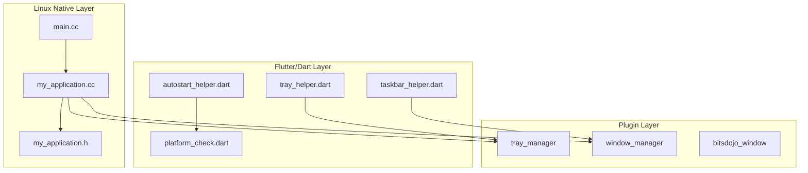
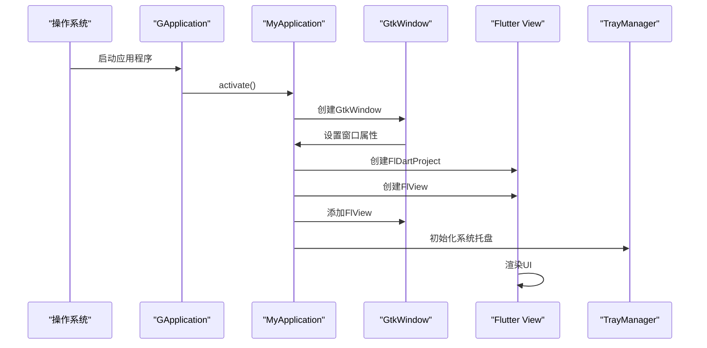
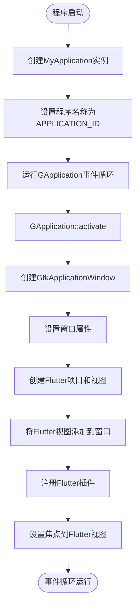
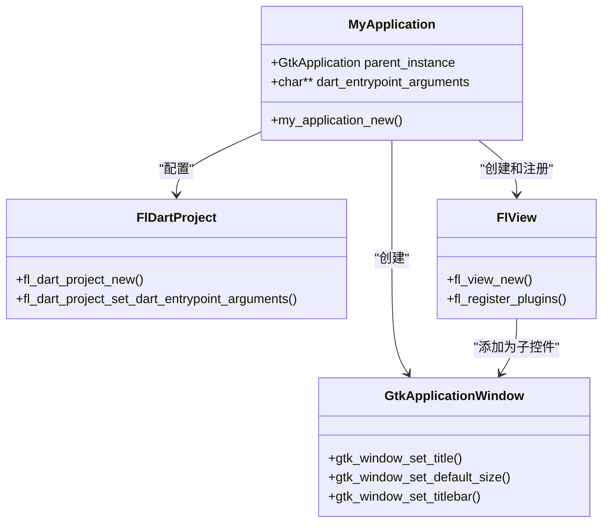
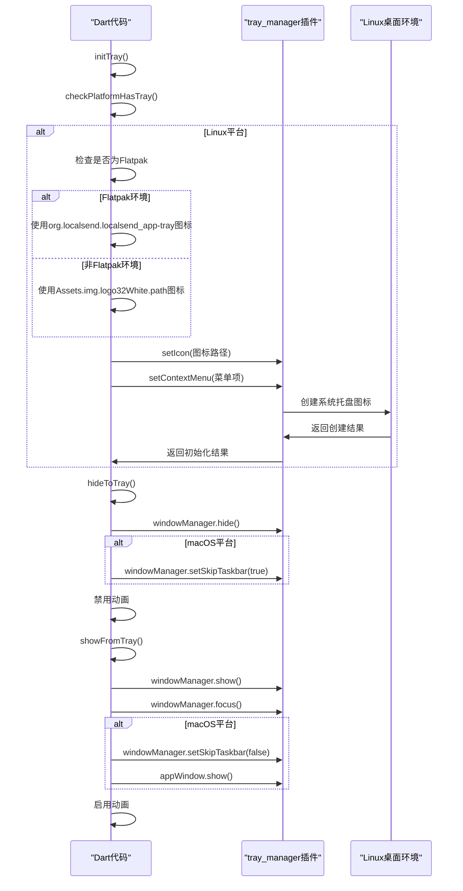
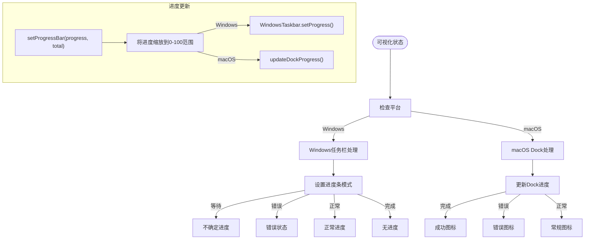
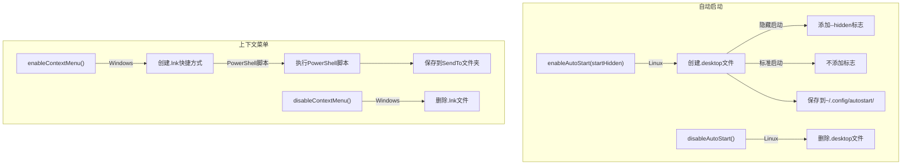
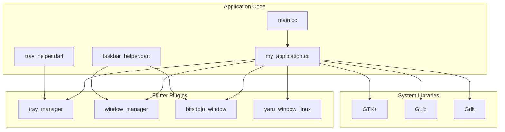

# 原生功能集成

<cite>
**本文档中引用的文件**  
- [main.cc](file://app/linux/main.cc)
- [my_application.cc](file://app/linux/my_application.cc)
- [my_application.h](file://app/linux/my_application.h)
- [tray_helper.dart](file://app/lib/util/native/tray_helper.dart)
- [platform_check.dart](file://app/lib/util/native/platform_check.dart)
- [taskbar_helper.dart](file://app/lib/util/native/taskbar_helper.dart)
- [autostart_helper.dart](file://app/lib/util/native/autostart_helper.dart)
- [context_menu_helper.dart](file://app/lib/util/native/context_menu_helper.dart)
</cite>

## 目录
1. [简介](#简介)
2. [项目结构](#项目结构)
3. [核心组件](#核心组件)
4. [架构概述](#架构概述)
5. [详细组件分析](#详细组件分析)
6. [依赖分析](#依赖分析)
7. [性能考虑](#性能考虑)
8. [故障排除指南](#故障排除指南)
9. [结论](#结论)

## 简介
本文件详细说明了LocalSend应用程序在Linux平台上的原生功能集成。重点分析了应用程序生命周期管理、窗口创建、事件循环处理、系统托盘功能、任务栏集成、系统通知和权限管理的实现细节。文档还涵盖了不同Linux发行版和桌面环境（GNOME、KDE、XFCE）的兼容性处理，以及处理Linux发行版差异的最佳实践和调试技巧。

## 项目结构
LocalSend项目采用分层架构，将平台特定的代码与跨平台的Dart代码分离。Linux原生功能主要在`app/linux`目录下通过C++实现，而Flutter框架的集成和高级功能则在Dart代码中处理。

**Diagram sources**
- [main.cc](file://app/linux/main.cc)
- [my_application.cc](file://app/linux/my_application.cc)
- [tray_helper.dart](file://app/lib/util/native/tray_helper.dart)

**Section sources**
- [main.cc](file://app/linux/main.cc)
- [my_application.cc](file://app/linux/my_application.cc)
- [tray_helper.dart](file://app/lib/util/native/tray_helper.dart)

## 核心组件
本节分析了Linux原生功能集成的核心组件，包括应用程序生命周期管理、系统托盘实现和任务栏集成。这些组件共同提供了与Linux桌面环境的深度集成，确保了应用程序的原生外观和行为。

**Section sources**
- [main.cc](file://app/linux/main.cc)
- [my_application.cc](file://app/linux/my_application.cc)
- [tray_helper.dart](file://app/lib/util/native/tray_helper.dart)

## 架构概述
LocalSend的Linux原生功能集成采用了分层架构，将GTK+应用程序生命周期管理与Flutter UI渲染分离。应用程序通过GApplication框架管理生命周期，使用GtkApplicationWindow创建主窗口，并通过tray_manager插件实现系统托盘功能。

**Diagram sources**
- [main.cc](file://app/linux/main.cc)
- [my_application.cc](file://app/linux/my_application.cc)
- [tray_helper.dart](file://app/lib/util/native/tray_helper.dart)

## 详细组件分析

### 应用程序生命周期管理
LocalSend使用GTK+的GApplication框架来管理应用程序的生命周期。`main.cc`文件中的`main`函数是应用程序的入口点，它创建`MyApplication`实例并启动GApplication的事件循环。

**Diagram sources**
- [main.cc](file://app/linux/main.cc#L1-L7)
- [my_application.cc](file://app/linux/my_application.cc#L20-L98)

#### 窗口创建和管理
`my_application.cc`中的`my_application_activate`函数负责创建和配置主窗口。该函数实现了GApplication的activate回调，当应用程序被激活时调用。

**Diagram sources**
- [my_application.cc](file://app/linux/my_application.cc#L30-L78)

**Section sources**
- [my_application.cc](file://app/linux/my_application.cc#L30-L78)

### 系统托盘功能实现
`tray_helper.dart`文件实现了跨平台的系统托盘功能，特别针对Linux环境进行了优化。该实现使用`tray_manager`插件来创建和管理系统托盘图标和上下文菜单。

**Diagram sources**
- [tray_helper.dart](file://app/lib/util/native/tray_helper.dart#L1-L96)

**Section sources**
- [tray_helper.dart](file://app/lib/util/native/tray_helper.dart#L1-L96)

### 任务栏集成和系统通知
`taskbar_helper.dart`文件实现了任务栏进度条和状态指示器功能，允许应用程序在Windows任务栏或macOS Dock上显示传输进度和状态。

**Diagram sources**
- [taskbar_helper.dart](file://app/lib/util/native/taskbar_helper.dart#L1-L88)

**Section sources**
- [taskbar_helper.dart](file://app/lib/util/native/taskbar_helper.dart#L1-L88)

### 自动启动和上下文菜单
`autostart_helper.dart`和`context_menu_helper.dart`文件实现了Linux平台的自动启动和上下文菜单集成功能。

**Diagram sources**
- [autostart_helper.dart](file://app/lib/util/native/autostart_helper.dart#L1-L120)
- [context_menu_helper.dart](file://app/lib/util/native/context_menu_helper.dart#L1-L64)

**Section sources**
- [autostart_helper.dart](file://app/lib/util/native/autostart_helper.dart#L1-L120)
- [context_menu_helper.dart](file://app/lib/util/native/context_menu_helper.dart#L1-L64)

## 依赖分析
LocalSend的Linux原生功能依赖于多个Flutter插件和系统库，这些依赖关系确保了与不同Linux桌面环境的兼容性。

**Diagram sources**
- [main.cc](file://app/linux/main.cc)
- [my_application.cc](file://app/linux/my_application.cc)
- [tray_helper.dart](file://app/lib/util/native/tray_helper.dart)
- [taskbar_helper.dart](file://app/lib/util/native/taskbar_helper.dart)

**Section sources**
- [main.cc](file://app/linux/main.cc)
- [my_application.cc](file://app/linux/my_application.cc)
- [tray_helper.dart](file://app/lib/util/native/tray_helper.dart)
- [taskbar_helper.dart](file://app/lib/util/native/taskbar_helper.dart)

## 性能考虑
在实现Linux原生功能时，需要考虑以下性能因素：

1. **内存使用**：系统托盘图标的内存占用应最小化，特别是在低内存设备上。
2. **启动时间**：自动启动功能不应显著增加系统启动时间。
3. **CPU使用率**：事件循环和定时器应优化以减少CPU占用。
4. **资源管理**：正确管理GTK+对象的生命周期，避免内存泄漏。

最佳实践包括：
- 使用`g_autoptr`自动管理GTK+对象的内存
- 在适当的时候释放不再需要的资源
- 避免在主线程中执行耗时操作
- 使用异步操作处理文件I/O和网络请求

[无来源，因为本节提供一般性指导]

## 故障排除指南
### 常见问题和解决方案

**系统托盘不显示**
- 检查桌面环境是否支持系统托盘
- 确认`tray_manager`插件已正确注册
- 检查图标路径是否正确
- 验证应用程序是否有足够的权限

**自动启动不工作**
- 检查`.desktop`文件是否创建在`~/.config/autostart/`目录
- 验证文件权限是否正确
- 确认桌面环境支持自动启动功能

**上下文菜单不显示**
- 确认应用程序有文件系统写入权限
- 检查PowerShell脚本是否正确执行
- 验证快捷方式是否创建在正确的SendTo目录

**任务栏进度不更新**
- 检查`windows_taskbar`插件是否正确注册
- 验证进度值是否在有效范围内
- 确认平台特定的API调用是否成功

**Section sources**
- [tray_helper.dart](file://app/lib/util/native/tray_helper.dart#L1-L96)
- [autostart_helper.dart](file://app/lib/util/native/autostart_helper.dart#L1-L120)
- [context_menu_helper.dart](file://app/lib/util/native/context_menu_helper.dart#L1-L64)
- [taskbar_helper.dart](file://app/lib/util/native/taskbar_helper.dart#L1-L88)

## 结论
LocalSend通过精心设计的架构实现了与Linux桌面环境的深度集成。通过结合GTK+的原生功能和Flutter的跨平台能力，应用程序提供了流畅的用户体验和良好的系统集成。关键组件如系统托盘、任务栏集成和自动启动功能都经过优化，确保在不同Linux发行版和桌面环境中的兼容性。未来的工作可以包括对Wayland显示服务器的更好支持，以及对更多桌面环境特定功能的集成。

[无来源，因为本节总结而不分析特定文件]