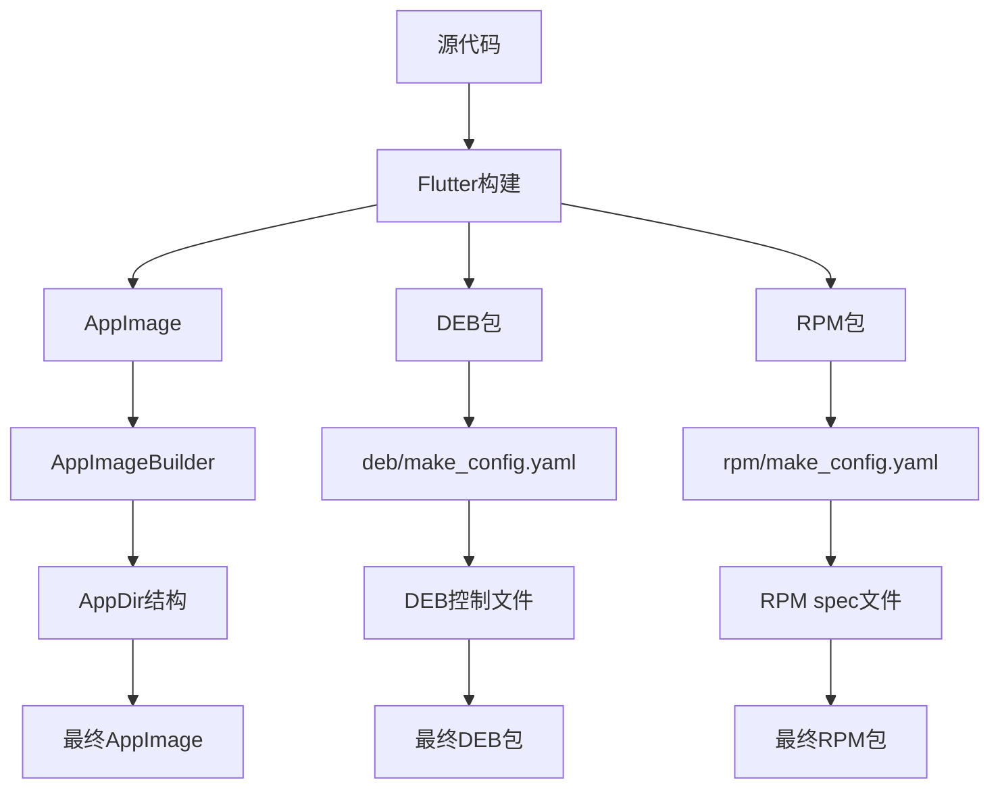
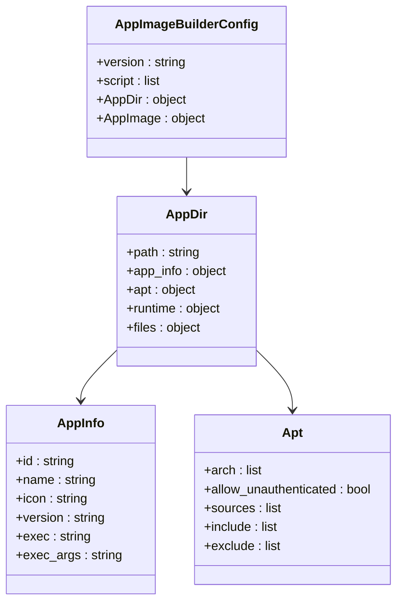
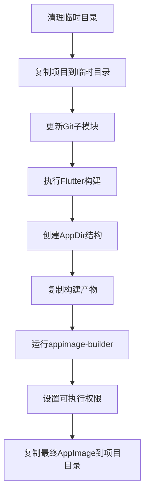
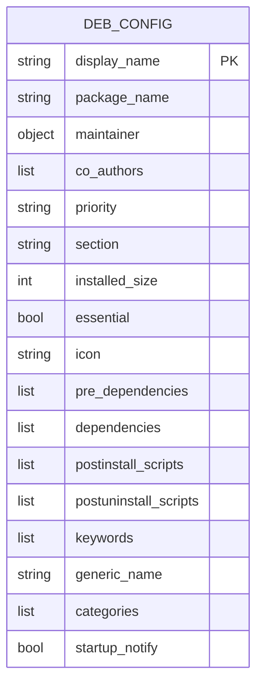
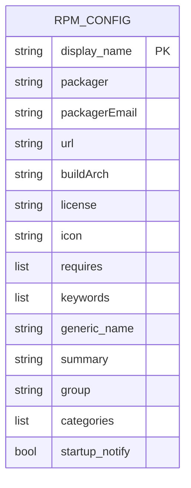
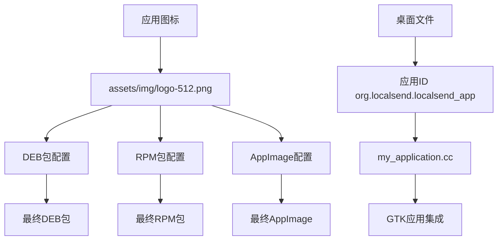
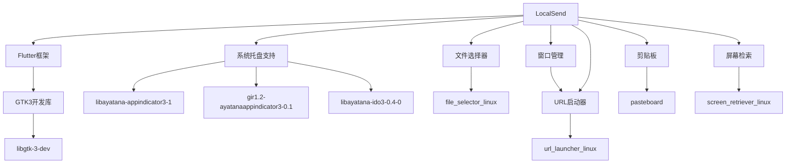

# 打包与分发

<cite>
**本文档引用的文件**
- [compile_linux_appimage.sh](file://scripts/compile_linux_appimage.sh)
- [AppImageBuilder_x86_64.yml](file://scripts/appimage/AppImageBuilder_x86_64.yml)
- [AppImageBuilder_arm_64.yml](file://scripts/appimage/AppImageBuilder_arm_64.yml)
- [make_config.yaml](file://app/linux/packaging/deb/make_config.yaml)
- [make_config.yaml](file://app/linux/packaging/rpm/make_config.yaml)
- [my_application.cc](file://app/linux/my_application.cc)
- [pubspec.yaml](file://app/pubspec.yaml)
- [autostart_helper.dart](file://app/lib/util/native/autostart_helper.dart)
</cite>

## 目录
1. [简介](#简介)
2. [项目结构](#项目结构)
3. [核心组件](#核心组件)
4. [架构概述](#架构概述)
5. [详细组件分析](#详细组件分析)
6. [依赖分析](#依赖分析)
7. [性能考虑](#性能考虑)
8. [故障排除指南](#故障排除指南)
9. [结论](#结论)
10. [附录](#附录)（如有必要）

## 简介
本指南详细介绍了LocalSend应用程序在Linux平台上的打包与分发流程。文档涵盖了生成AppImage、DEB和RPM包的完整过程，包括配置文件的关键参数、依赖声明、图标和桌面文件的设置。同时提供了签名包、更新机制和分发渠道（如Snap、Flatpak）的相关指导，以及验证包完整性和解决安装问题的步骤。

## 项目结构
LocalSend项目的打包配置主要分布在scripts和app/linux/packaging目录中。scripts目录包含用于构建不同包格式的脚本，而app/linux/packaging目录则包含DEB和RPM包的配置文件。

**Diagram sources**
- [compile_linux_appimage.sh](file://scripts/compile_linux_appimage.sh)
- [AppImageBuilder_x86_64.yml](file://scripts/appimage/AppImageBuilder_x86_64.yml)
- [make_config.yaml](file://app/linux/packaging/deb/make_config.yaml)

**Section sources**
- [scripts](file://scripts)
- [app/linux/packaging](file://app/linux/packaging)

## 核心组件
本项目的核心打包组件包括AppImage构建脚本、DEB包配置和RPM包配置。这些组件共同实现了跨Linux发行版的软件分发。

**Section sources**
- [compile_linux_appimage.sh](file://scripts/compile_linux_appimage.sh)
- [make_config.yaml](file://app/linux/packaging/deb/make_config.yaml)
- [make_config.yaml](file://app/linux/packaging/rpm/make_config.yaml)

## 架构概述
LocalSend的Linux打包架构采用多格式支持策略，通过不同的配置文件和脚本生成适用于各种Linux发行版的安装包。系统利用AppImage实现跨发行版兼容，DEB包针对Debian系发行版，RPM包针对Red Hat系发行版。

**Diagram sources**
- [compile_linux_appimage.sh](file://scripts/compile_linux_appimage.sh)
- [AppImageBuilder_x86_64.yml](file://scripts/appimage/AppImageBuilder_x86_64.yml)
- [make_config.yaml](file://app/linux/packaging/deb/make_config.yaml)
- [make_config.yaml](file://app/linux/packaging/rpm/make_config.yaml)

## 详细组件分析

### AppImage打包分析
AppImage打包通过AppImageBuilder工具实现，使用YAML配置文件定义包的结构和依赖关系。

#### AppImageBuilder配置

**Diagram sources**
- [AppImageBuilder_x86_64.yml](file://scripts/appimage/AppImageBuilder_x86_64.yml)
- [AppImageBuilder_arm_64.yml](file://scripts/appimage/AppImageBuilder_arm_64.yml)

#### AppImage构建流程

**Diagram sources**
- [compile_linux_appimage.sh](file://scripts/compile_linux_appimage.sh)

**Section sources**
- [compile_linux_appimage.sh](file://scripts/compile_linux_appimage.sh)
- [AppImageBuilder_x86_64.yml](file://scripts/appimage/AppImageBuilder_x86_64.yml)

### DEB包分析
DEB包使用make_config.yaml文件进行配置，定义了包的元数据、依赖关系和安装脚本。

#### DEB包配置参数

**Diagram sources**
- [make_config.yaml](file://app/linux/packaging/deb/make_config.yaml)

**Section sources**
- [make_config.yaml](file://app/linux/packaging/deb/make_config.yaml)

### RPM包分析
RPM包同样使用make_config.yaml文件进行配置，但参数名称和结构与DEB包有所不同。

#### RPM包配置参数

**Diagram sources**
- [make_config.yaml](file://app/linux/packaging/rpm/make_config.yaml)

**Section sources**
- [make_config.yaml](file://app/linux/packaging/rpm/make_config.yaml)

### 图标与桌面文件分析
应用图标和桌面文件的配置贯穿于多个打包配置文件中，确保在不同Linux桌面环境中正确显示。

#### 图标与桌面文件配置

**Diagram sources**
- [make_config.yaml](file://app/linux/packaging/deb/make_config.yaml)
- [make_config.yaml](file://app/linux/packaging/rpm/make_config.yaml)
- [AppImageBuilder_x86_64.yml](file://scripts/appimage/AppImageBuilder_x86_64.yml)
- [my_application.cc](file://app/linux/my_application.cc)

**Section sources**
- [make_config.yaml](file://app/linux/packaging/deb/make_config.yaml)
- [make_config.yaml](file://app/linux/packaging/rpm/make_config.yaml)
- [my_application.cc](file://app/linux/my_application.cc)

## 依赖分析
LocalSend的Linux打包依赖关系复杂，涉及系统级依赖和应用级依赖。

**Diagram sources**
- [compile_linux_appimage.sh](file://scripts/compile_linux_appimage.sh)
- [AppImageBuilder_x86_64.yml](file://scripts/appimage/AppImageBuilder_x86_64.yml)
- [make_config.yaml](file://app/linux/packaging/deb/make_config.yaml)

**Section sources**
- [pubspec.yaml](file://app/pubspec.yaml)
- [AppImageBuilder_x86_64.yml](file://scripts/appimage/AppImageBuilder_x86_64.yml)
- [make_config.yaml](file://app/linux/packaging/deb/make_config.yaml)

## 性能考虑
AppImage打包过程中，通过排除不必要的文档文件来减小包体积，提高分发效率。同时，使用squashfs文件系统压缩技术优化存储空间。

## 故障排除指南
常见打包问题包括依赖缺失、权限问题和架构不匹配。建议在构建前确保所有依赖已正确安装，并使用适当的架构配置。

**Section sources**
- [compile_linux_appimage.sh](file://scripts/compile_linux_appimage.sh)
- [AppImageBuilder_x86_64.yml](file://scripts/appimage/AppImageBuilder_x86_64.yml)

## 结论
LocalSend的Linux打包系统设计完善，支持多种分发格式，确保了跨Linux发行版的兼容性和易用性。通过清晰的配置文件和自动化脚本，实现了高效的打包流程。

## 附录
项目还支持其他分发渠道，包括Snapcraft、Flathub、Homebrew、Chocolatey等，由社区维护者负责相应平台的打包和发布。

**Section sources**
- [packagers.dart](file://app/lib/pages/about/packagers.dart)