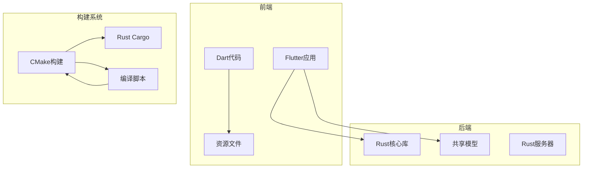
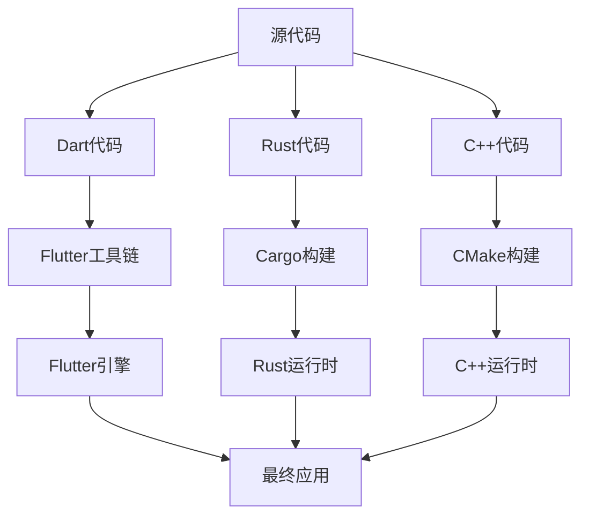
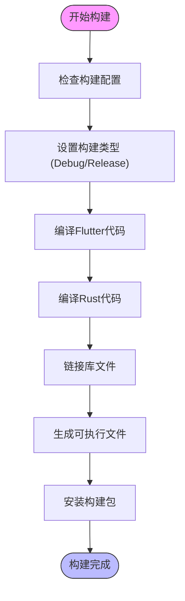
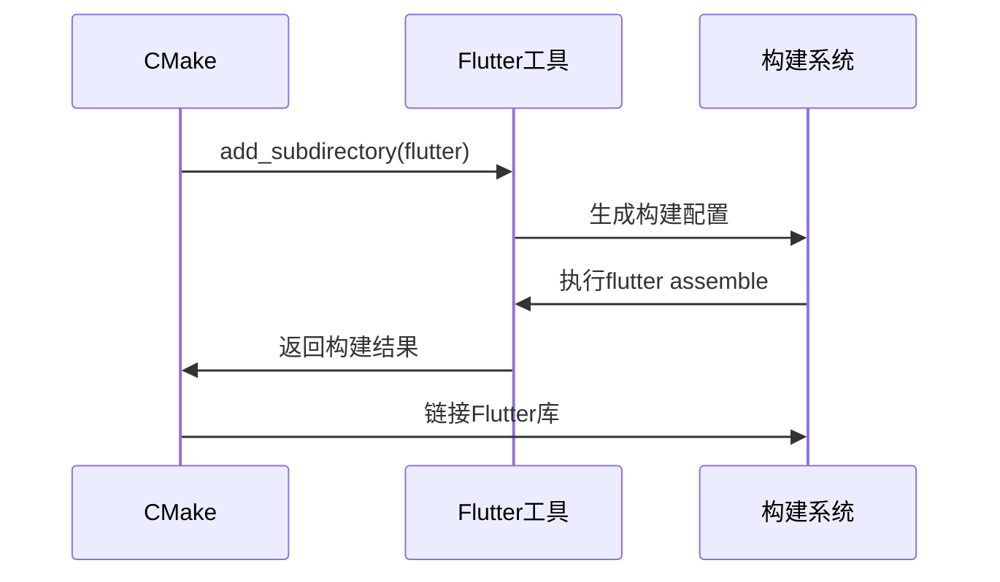
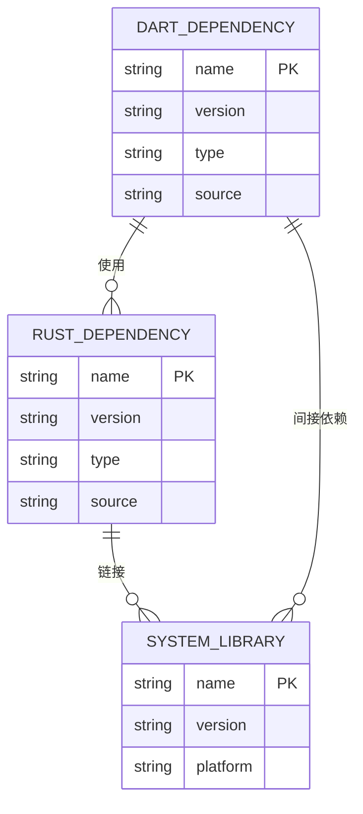

# 构建系统

<cite>
**本文档中引用的文件**  
- [CMakeLists.txt](file://app/linux/CMakeLists.txt)
- [flutter/CMakeLists.txt](file://app/linux/flutter/CMakeLists.txt)
- [rust_builder/linux/CMakeLists.txt](file://app/rust_builder/linux/CMakeLists.txt)
- [pubspec.yaml](file://app/pubspec.yaml)
- [Cargo.toml](file://app/rust/Cargo.toml)
- [cargokit.cmake](file://app/rust_builder/cargokit/cmake/cargokit.cmake)
- [run_build_tool.sh](file://app/rust_builder/cargokit/run_build_tool.sh)
- [compile_linux_appimage.sh](file://scripts/compile_linux_appimage.sh)
- [main.cc](file://app/linux/main.cc)
- [my_application.cc](file://app/linux/my_application.cc)
- [my_application.h](file://app/linux/my_application.h)
</cite>

## 目录
1. [简介](#简介)
2. [项目结构](#项目结构)
3. [核心组件](#核心组件)
4. [架构概述](#架构概述)
5. [详细组件分析](#详细组件分析)
6. [依赖分析](#依赖分析)
7. [性能考虑](#性能考虑)
8. [故障排除指南](#故障排除指南)
9. [结论](#结论)

## 简介
本项目是一个跨平台的开源文件传输应用，采用Flutter框架构建用户界面，并通过Rust实现核心功能。构建系统使用CMake作为Linux平台的主要构建工具，集成了Flutter引擎和Rust FFI（外部函数接口）来协调Dart、C++和Rust代码的编译过程。系统支持多种构建类型（Debug/Release），并提供了完整的交叉编译和优化构建性能的机制。

## 项目结构
项目采用模块化设计，主要分为以下几个部分：
- `app`：Flutter应用程序主目录，包含Dart代码、资源文件和平台特定代码
- `core`：Rust核心库，实现主要业务逻辑
- `common`：共享的Dart模型和工具
- `server`：独立的Rust服务器实现
- `rust`：Flutter应用的Rust绑定层
- `rust_builder`：Rust FFI构建工具和配置
- `scripts`：各种平台的编译脚本



**Diagram sources**
- [CMakeLists.txt](file://app/linux/CMakeLists.txt#L1-L140)
- [pubspec.yaml](file://app/pubspec.yaml#L1-L124)

**Section sources**
- [CMakeLists.txt](file://app/linux/CMakeLists.txt#L1-L140)
- [pubspec.yaml](file://app/pubspec.yaml#L1-L124)

## 核心组件
系统的核心组件包括Flutter引擎集成、Rust FFI链接、编译选项设置和依赖管理。构建脚本通过CMakeLists.txt文件协调Dart、C++和Rust代码的编译过程，确保各组件正确链接和打包。

**Section sources**
- [CMakeLists.txt](file://app/linux/CMakeLists.txt#L1-L140)
- [flutter/CMakeLists.txt](file://app/linux/flutter/CMakeLists.txt#L1-L89)

## 架构概述
系统采用分层架构，前端使用Flutter框架，后端使用Rust实现核心功能。构建系统通过CMake管理整个构建流程，包括Flutter引擎的集成、Rust库的编译和链接，以及最终可执行文件的生成。



**Diagram sources**
- [CMakeLists.txt](file://app/linux/CMakeLists.txt#L1-L140)
- [flutter/CMakeLists.txt](file://app/linux/flutter/CMakeLists.txt#L1-L89)

## 详细组件分析

### CMake构建系统分析
CMake构建系统负责协调整个项目的编译过程，包括Flutter引擎集成、Rust FFI链接和最终可执行文件的生成。

#### CMakeLists.txt配置
```mermaid
classDiagram
class CMakeLists {
+cmake_minimum_required(VERSION 3.10)
+project(runner LANGUAGES CXX)
+set(BINARY_NAME "localsend_app")
+set(APPLICATION_ID "org.localsend.localsend_app")
+add_executable(${BINARY_NAME})
+target_link_libraries(${BINARY_NAME})
+add_dependencies(${BINARY_NAME})
}
class FlutterIntegration {
+add_subdirectory(${FLUTTER_MANAGED_DIR})
+include(flutter/generated_plugins.cmake)
+add_dependencies(${BINARY_NAME} flutter_assemble)
}
class RustFFI {
+include("../cargokit/cmake/cargokit.cmake")
+apply_cargokit(${PROJECT_NAME} ../../rust rust_lib_localsend_app "")
}
CMakeLists --> FlutterIntegration : "集成"
CMakeLists --> RustFFI : "集成"
```

**Diagram sources**
- [CMakeLists.txt](file://app/linux/CMakeLists.txt#L1-L140)
- [flutter/CMakeLists.txt](file://app/linux/flutter/CMakeLists.txt#L1-L89)

#### 构建流程分析


**Diagram sources**
- [CMakeLists.txt](file://app/linux/CMakeLists.txt#L1-L140)
- [cargokit.cmake](file://app/rust_builder/cargokit/cmake/cargokit.cmake#L1-L100)

**Section sources**
- [CMakeLists.txt](file://app/linux/CMakeLists.txt#L1-L140)
- [cargokit.cmake](file://app/rust_builder/cargokit/cmake/cargokit.cmake#L1-L100)

### Flutter引擎集成分析
Flutter引擎集成通过CMakeLists.txt文件中的特定配置实现，确保Flutter框架能够正确编译和链接。

#### Flutter集成配置


**Diagram sources**
- [CMakeLists.txt](file://app/linux/CMakeLists.txt#L1-L140)
- [flutter/CMakeLists.txt](file://app/linux/flutter/CMakeLists.txt#L1-L89)

**Section sources**
- [CMakeLists.txt](file://app/linux/CMakeLists.txt#L1-L140)
- [flutter/CMakeLists.txt](file://app/linux/flutter/CMakeLists.txt#L1-L89)

### Rust FFI链接分析
Rust FFI链接通过cargokit系统实现，将Rust代码编译为动态库并链接到主应用程序。

#### Rust FFI链接流程


**Diagram sources**
- [Cargo.toml](file://app/rust/Cargo.toml#L1-L18)
- [cargokit.cmake](file://app/rust_builder/cargokit/cmake/cargokit.cmake#L1-L100)
- [run_build_tool.sh](file://app/rust_builder/cargokit/run_build_tool.sh#L1-L95)

**Section sources**
- [Cargo.toml](file://app/rust/Cargo.toml#L1-L18)
- [cargokit.cmake](file://app/rust_builder/cargokit/cmake/cargokit.cmake#L1-L100)
- [run_build_tool.sh](file://app/rust_builder/cargokit/run_build_tool.sh#L1-L95)

## 依赖分析
系统依赖关系复杂，涉及多个层次的依赖管理，包括Dart包依赖、Rust crate依赖和系统库依赖。



**Diagram sources**
- [pubspec.yaml](file://app/pubspec.yaml#L1-L124)
- [Cargo.toml](file://app/rust/Cargo.toml#L1-L18)
- [CMakeLists.txt](file://app/linux/CMakeLists.txt#L1-L140)

**Section sources**
- [pubspec.yaml](file://app/pubspec.yaml#L1-L124)
- [Cargo.toml](file://app/rust/Cargo.toml#L1-L18)
- [CMakeLists.txt](file://app/linux/CMakeLists.txt#L1-L140)

## 性能考虑
构建系统的性能优化主要体现在以下几个方面：
- 使用CMake的现代特性提高构建效率
- 通过预编译和缓存减少重复构建时间
- 优化链接过程，减少最终二进制文件大小
- 支持并行构建，充分利用多核处理器

## 故障排除指南
### 常见构建错误及解决方案

| 错误类型 | 可能原因 | 解决方案 |
|---------|--------|--------|
| 库路径问题 | 环境变量未正确设置 | 检查LD_LIBRARY_PATH和CMAKE_PREFIX_PATH |
| 编译器版本不兼容 | GCC/Clang版本过低 | 升级到支持C++14的编译器版本 |
| 架构匹配问题 | 目标架构与系统架构不匹配 | 确保使用正确的交叉编译工具链 |
| Flutter工具缺失 | Flutter SDK未正确安装 | 运行flutter doctor检查环境 |
| Rust工具链问题 | Cargo或Rust编译器缺失 | 安装最新稳定版Rust工具链 |

**Section sources**
- [compile_linux_appimage.sh](file://scripts/compile_linux_appimage.sh#L1-L40)
- [CMakeLists.txt](file://app/linux/CMakeLists.txt#L1-L140)

### 构建类型配置差异
不同构建类型的配置差异主要体现在优化级别和调试信息上：

| 配置类型 | 优化级别 | 调试信息 | 断言 |
|--------|--------|--------|------|
| Debug | -O0 | 包含 | 启用 |
| Profile | -O2 | 包含 | 禁用 |
| Release | -O3 | 不包含 | 禁用 |

**Section sources**
- [CMakeLists.txt](file://app/linux/CMakeLists.txt#L1-L140)
- [flutter/CMakeLists.txt](file://app/linux/flutter/CMakeLists.txt#L1-L89)

## 结论
本构建系统通过CMake、Cargo和Flutter工具链的协同工作，实现了Dart、C++和Rust代码的无缝集成。系统设计考虑了跨平台兼容性、构建性能和可维护性，为开发者提供了完整的构建解决方案。通过合理的配置和优化，可以有效解决常见的构建问题，确保项目在不同环境下都能顺利编译和运行。