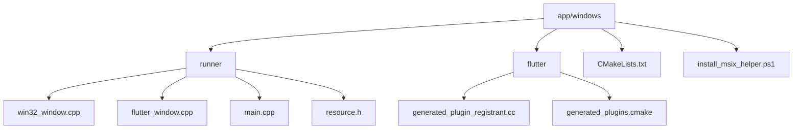
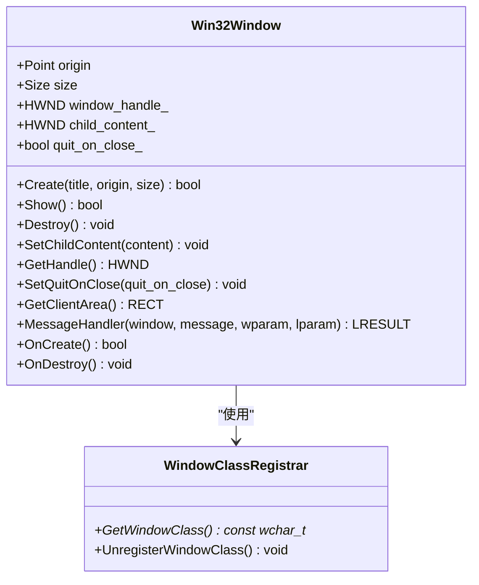
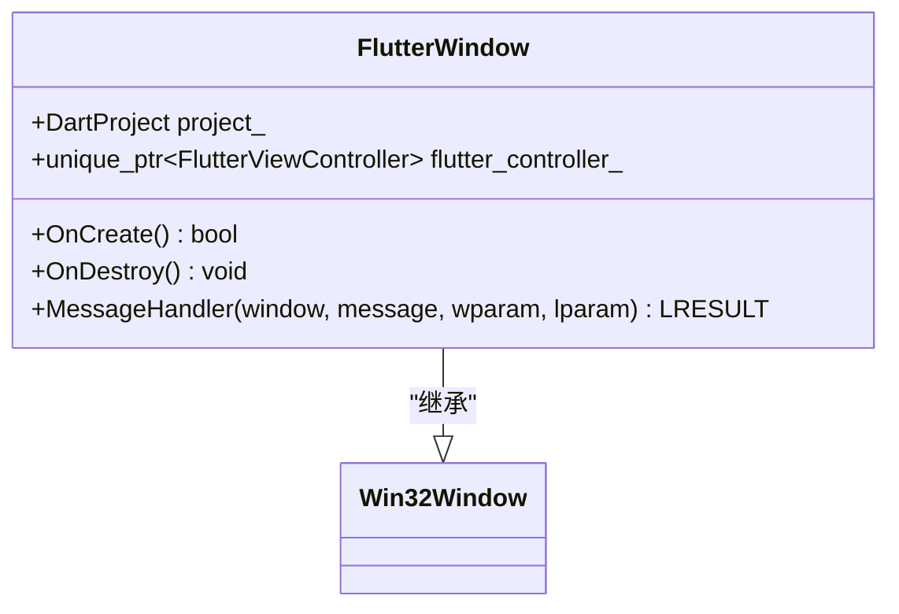
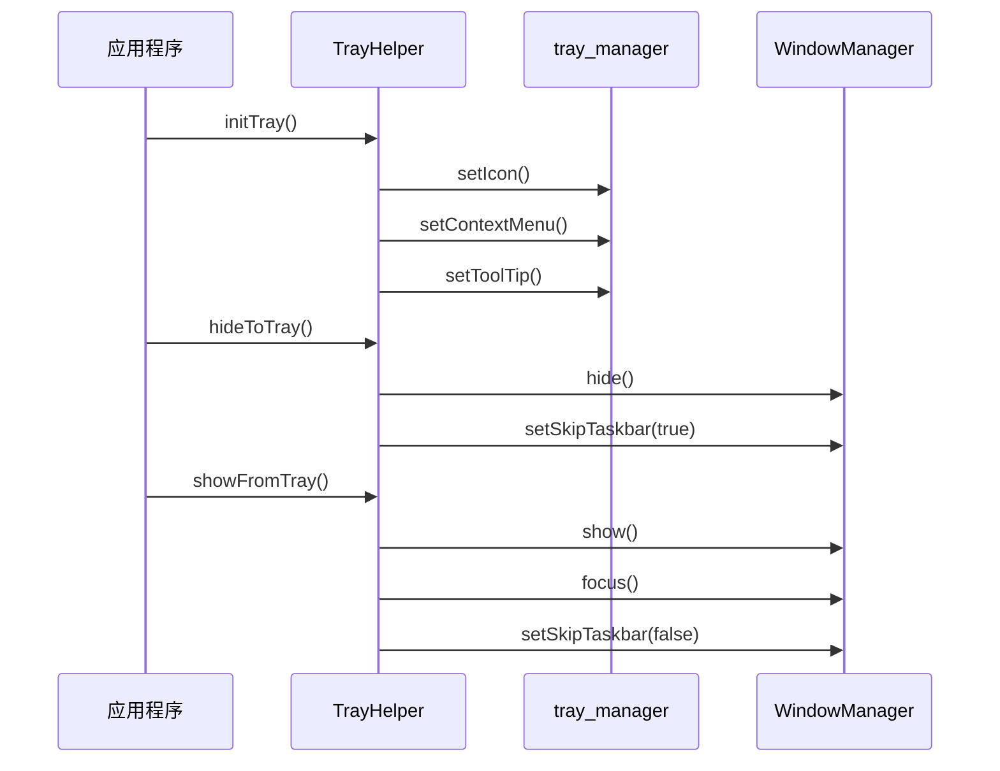
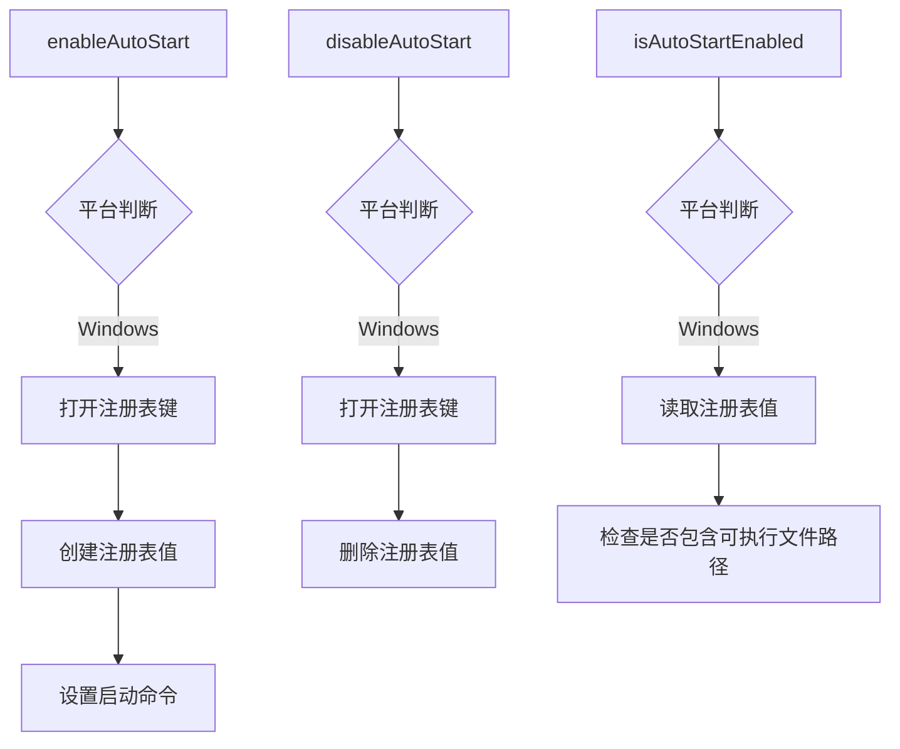
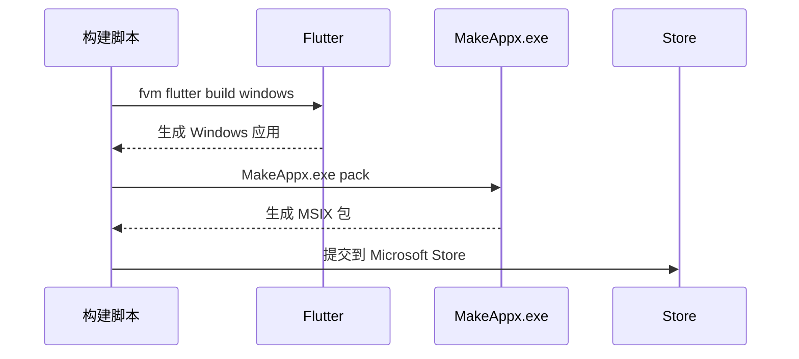
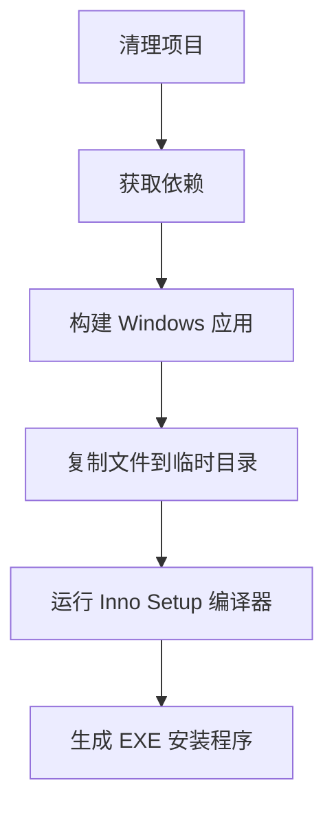
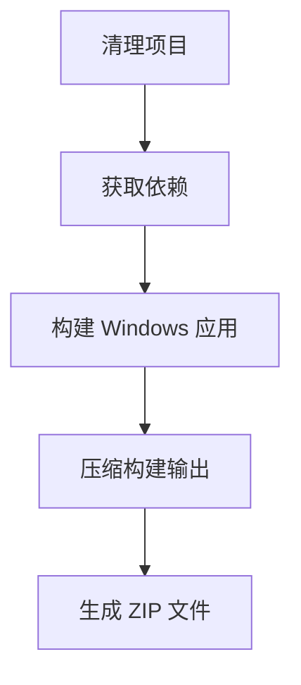

# Windows 实现

<cite>
**本文档引用的文件**   
- [win32_window.cpp](file://app/windows/runner/win32_window.cpp)
- [flutter_window.cpp](file://app/windows/runner/flutter_window.cpp)
- [tray_helper.dart](file://app/lib/util/native/tray_helper.dart)
- [taskbar_helper.dart](file://app/lib/util/native/taskbar_helper.dart)
- [autostart_helper.dart](file://app/lib/util/native/autostart_helper.dart)
- [win32_window.h](file://app/windows/runner/win32_window.h)
- [flutter_window.h](file://app/windows/runner/flutter_window.h)
- [AppxManifest.xml](file://msix/AppxManifest.xml)
- [compile_windows_exe.ps1](file://scripts/compile_windows_exe.ps1)
- [compile_windows_msix_store.ps1](file://scripts/compile_windows_msix_store.ps1)
- [compile_windows_zip.ps1](file://scripts/compile_windows_zip.ps1)
- [install_msix_helper.ps1](file://app/windows/install_msix_helper.ps1)
- [resource.h](file://app/windows/runner/resource.h)
</cite>

## 目录
1. [项目结构](#项目结构)
2. [核心组件](#核心组件)
3. [原生窗口管理](#原生窗口管理)
4. [系统托盘和任务栏集成](#系统托盘和任务栏集成)
5. [Windows 特定功能实现](#windows-特定功能实现)
6. [调试技巧](#调试技巧)
7. [打包和发布](#打包和发布)
8. [结论](#结论)

## 项目结构

LocalSend 项目的 Windows 平台实现主要位于 `app/windows` 目录下，包含原生 C++ 代码和相关配置文件。项目结构遵循 Flutter 桌面应用的标准布局，其中 Windows 特定的实现位于 `app/windows/runner` 目录中。



**Diagram sources**
- [win32_window.cpp](file://app/windows/runner/win32_window.cpp)
- [flutter_window.cpp](file://app/windows/runner/flutter_window.cpp)
- [main.cpp](file://app/windows/runner/main.cpp)

**Section sources**
- [win32_window.cpp](file://app/windows/runner/win32_window.cpp)
- [flutter_window.cpp](file://app/windows/runner/flutter_window.cpp)

## 核心组件

LocalSend 的 Windows 实现包含几个核心组件，这些组件协同工作以提供完整的桌面应用体验。主要组件包括原生窗口管理、系统托盘集成、任务栏进度显示、自动启动功能以及打包和发布工具。

**Section sources**
- [win32_window.cpp](file://app/windows/runner/win32_window.cpp)
- [flutter_window.cpp](file://app/windows/runner/flutter_window.cpp)
- [tray_helper.dart](file://app/lib/util/native/tray_helper.dart)
- [taskbar_helper.dart](file://app/lib/util/native/taskbar_helper.dart)

## 原生窗口管理

LocalSend 使用 C++ 实现了 Windows 平台的原生窗口管理，通过 `Win32Window` 和 `FlutterWindow` 两个类来处理窗口的创建、显示和事件处理。

### Win32Window 类

`Win32Window` 类是 Windows 窗口管理的基础，提供了高 DPI 感知的 Win32 窗口抽象。该类处理窗口的创建、销毁、消息处理和主题更新。



**Diagram sources**
- [win32_window.h](file://app/windows/runner/win32_window.h)
- [win32_window.cpp](file://app/windows/runner/win32_window.cpp)

**Section sources**
- [win32_window.h](file://app/windows/runner/win32_window.h)
- [win32_window.cpp](file://app/windows/runner/win32_window.cpp)

### FlutterWindow 类

`FlutterWindow` 类继承自 `Win32Window`，专门用于托管 Flutter 视图。它负责创建 Flutter 控制器并将其与原生窗口集成。



**Diagram sources**
- [flutter_window.h](file://app/windows/runner/flutter_window.h)
- [flutter_window.cpp](file://app/windows/runner/flutter_window.cpp)

**Section sources**
- [flutter_window.h](file://app/windows/runner/flutter_window.h)
- [flutter_window.cpp](file://app/windows/runner/flutter_window.cpp)

## 系统托盘和任务栏集成

LocalSend 通过 Dart 插件实现了系统托盘和任务栏的集成，提供了更好的用户体验。

### 系统托盘实现

系统托盘功能通过 `tray_helper.dart` 文件实现，使用 `tray_manager` 插件来管理系统托盘图标和菜单。



**Diagram sources**
- [tray_helper.dart](file://app/lib/util/native/tray_helper.dart)

**Section sources**
- [tray_helper.dart](file://app/lib/util/native/tray_helper.dart)

### 任务栏集成

任务栏集成通过 `taskbar_helper.dart` 文件实现，使用 `windows_taskbar` 插件来管理任务栏进度条和图标状态。

```mermaid
classDiagram
class TaskbarHelper {
+clearProgressBar() Future~void~
+setProgressBar(progress, total) Future~void~
+setProgressBarMode(mode) Future~void~
+setTaskbarIcon(icon) Future~void~
+visualizeStatus(status) Future~void~
}
enum TaskbarIcon {
regular
error
success
}
enum TaskbarProgressMode {
noProgress
indeterminate
normal
error
paused
}
TaskbarHelper --> TaskbarIcon : "使用"
TaskbarHelper --> TaskbarProgressMode : "使用"
```

**Diagram sources**
- [taskbar_helper.dart](file://app/lib/util/native/taskbar_helper.dart)

**Section sources**
- [taskbar_helper.dart](file://app/lib/util/native/taskbar_helper.dart)

## Windows 特定功能实现

LocalSend 实现了多个 Windows 特定的功能，包括自动启动、上下文菜单集成和注册表配置。

### 自动启动和注册表配置

自动启动功能通过 `autostart_helper.dart` 文件实现，使用 Windows 注册表来配置应用程序的自动启动行为。



**Diagram sources**
- [autostart_helper.dart](file://app/lib/util/native/autostart_helper.dart)

**Section sources**
- [autostart_helper.dart](file://app/lib/util/native/autostart_helper.dart)

### 上下文菜单集成

上下文菜单集成允许用户在文件资源管理器中右键点击文件并选择"通过 LocalSend 发送"。这一功能通过 Windows 注册表配置实现。

## 调试技巧

在开发和调试 LocalSend 的 Windows 实现时，以下技巧可以帮助解决常见问题。

### 系统托盘图标显示问题

系统托盘图标显示问题可能由以下原因引起：

1. **图标路径问题**：确保图标文件路径正确，特别是在不同平台上的路径差异。
2. **权限问题**：某些安全软件可能会阻止应用程序创建系统托盘图标。
3. **平台差异**：不同 Windows 版本对系统托盘的支持可能有所不同。

### 窗口管理异常处理

窗口管理异常可能包括窗口无法显示、DPI 缩放问题或窗口主题不匹配。以下是一些处理建议：

1. **DPI 感知**：确保应用程序正确处理高 DPI 显示器，使用 `EnableFullDpiSupportIfAvailable` 函数。
2. **主题同步**：通过监听 `WM_DWMCOLORIZATIONCOLORCHANGED` 消息来同步窗口主题与系统主题。
3. **资源清理**：在窗口销毁时正确清理资源，避免内存泄漏。

## 打包和发布

LocalSend 提供了多种打包和发布选项，包括 MSIX 包、传统 EXE 安装程序和 ZIP 压缩包。

### MSIX 包生成

MSIX 是 Windows 10 和 11 的现代应用程序包格式，提供了更好的安全性和部署体验。



**Diagram sources**
- [compile_windows_msix_store.ps1](file://scripts/compile_windows_msix_store.ps1)
- [AppxManifest.xml](file://msix/AppxManifest.xml)

**Section sources**
- [compile_windows_msix_store.ps1](file://scripts/compile_windows_msix_store.ps1)
- [AppxManifest.xml](file://msix/AppxManifest.xml)

### 传统 EXE 安装程序

对于需要传统安装程序的用户，LocalSend 使用 Inno Setup 生成 EXE 安装程序。



**Diagram sources**
- [compile_windows_exe.ps1](file://scripts/compile_windows_exe.ps1)

**Section sources**
- [compile_windows_exe.ps1](file://scripts/compile_windows_exe.ps1)

### ZIP 压缩包

对于便携式部署，LocalSend 提供了 ZIP 压缩包，用户可以直接解压并运行应用程序。



**Diagram sources**
- [compile_windows_zip.ps1](file://scripts/compile_windows_zip.ps1)

**Section sources**
- [compile_windows_zip.ps1](file://scripts/compile_windows_zip.ps1)

## 结论

LocalSend 的 Windows 实现提供了完整的桌面应用体验，包括原生窗口管理、系统托盘集成、任务栏进度显示和多种打包选项。通过深入理解这些实现细节，开发者可以更好地维护和扩展应用程序的功能，同时为用户提供更好的使用体验。