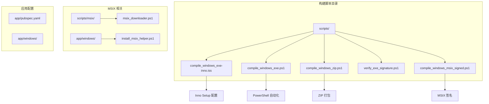
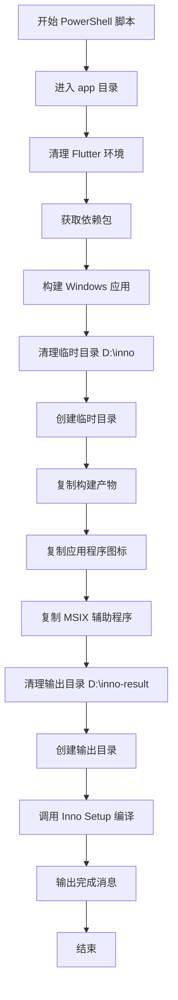
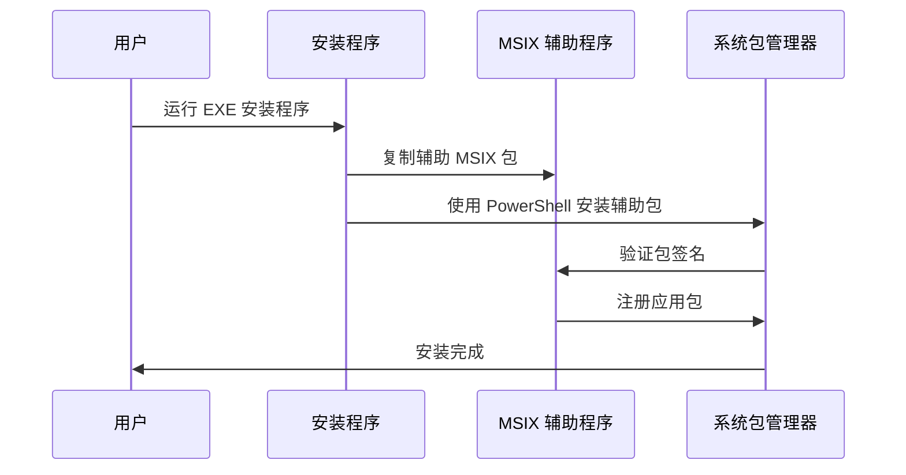
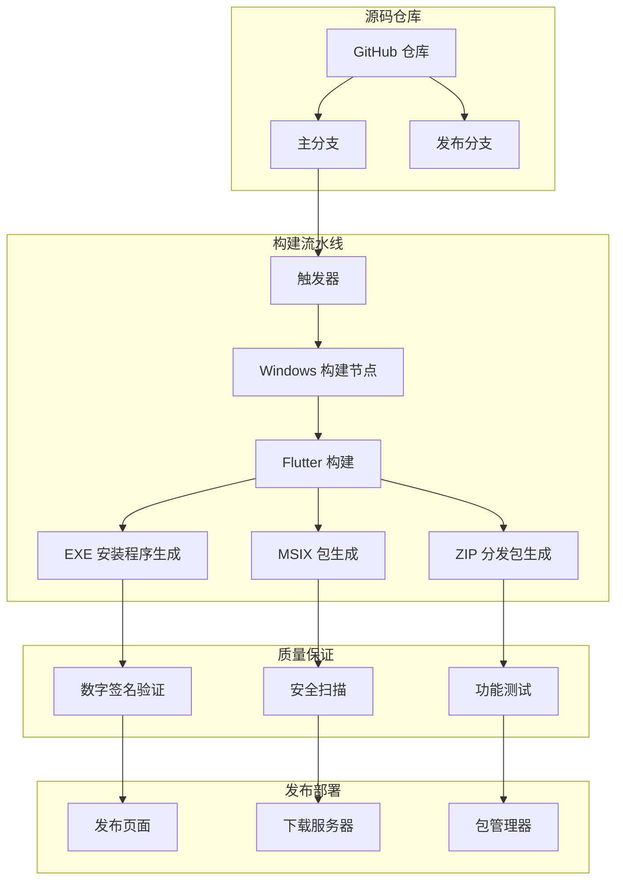

# EXE 安装程序技术文档

<cite>
**本文档中引用的文件**
- [compile_windows_exe-inno.iss](file://scripts/compile_windows_exe-inno.iss)
- [compile_windows_exe.ps1](file://scripts/compile_windows_exe.ps1)
- [compile_windows_zip.ps1](file://scripts/compile_windows_zip.ps1)
- [verify_exe_signature.ps1](file://scripts/verify_exe_signature.ps1)
- [compile_windows_msix_signed.ps1](file://scripts/compile_windows_msix_signed.ps1)
- [msix_downloader.ps1](file://scripts/msix/msix_downloader.ps1)
- [install_msix_helper.ps1](file://app/windows/install_msix_helper.ps1)
- [pubspec.yaml](file://app/pubspec.yaml)
- [README.md](file://README.md)
</cite>

## 目录
1. [简介](#简介)
2. [项目结构概览](#项目结构概览)
3. [Inno Setup 脚本详解](#inno-setup-脚本详解)
4. [PowerShell 构建脚本分析](#powershell-构建脚本分析)
5. [ZIP 分发包机制](#zip-分发包机制)
6. [MSIX 安装器对比](#msix-安装器对比)
7. [安全性与权限管理](#安全性与权限管理)
8. [自动化构建流程](#自动化构建流程)
9. [故障排除指南](#故障排除指南)
10. [最佳实践建议](#最佳实践建议)

## 简介

LocalSend 提供了两种主要的 Windows 分发方式：传统的 EXE 安装程序和现代的 MSIX 包。本文档详细解析了 EXE 安装程序的完整技术实现，包括 Inno Setup 脚本配置、PowerShell 构建自动化、ZIP 分发包创建以及两种分发方式的安全性差异和用户权限管理策略。

## 项目结构概览

LocalSend 的 Windows 安装程序相关文件组织结构如下：

**图表来源**
- [compile_windows_exe-inno.iss](file://scripts/compile_windows_exe-inno.iss#L1-L90)
- [compile_windows_exe.ps1](file://scripts/compile_windows_exe.ps1#L1-L20)

**章节来源**
- [README.md](file://README.md#L1-L276)
- [pubspec.yaml](file://app/pubspec.yaml#L1-L124)

## Inno Setup 脚本详解

### [Setup] 段配置

Inno Setup 脚本的核心配置段定义了应用程序的基本属性和安装行为：

#### 应用程序标识符
- **AppId**: 唯一的应用程序标识符，用于区分不同版本的安装程序
- **AppName**: 显示的应用程序名称 "LocalSend"
- **AppVersion**: 版本号 "1.17.0"
- **AppPublisher**: 发布者 "Tien Do Nam"
- **AppPublisherURL**: 官方网站 URL

#### 安装行为配置
- **DefaultDirName**: 默认安装目录为 `{autopf}\{#MyAppName}`
- **DisableProgramGroupPage**: 禁用程序组页面
- **PrivilegesRequiredOverridesAllowed**: 允许用户选择安装权限级别
- **OutputDir**: 输出目录设置为 `D:\inno-result`
- **OutputBaseFilename**: 输出文件名为 "localsend"

#### 技术特性
- **Compression**: 使用 LZMA 压缩算法
- **SolidCompression**: 启用固实压缩
- **WizardStyle**: 现代风格向导界面
- **ArchitecturesInstallIn64BitMode**: 支持 64 位架构

### [Files] 段配置

文件复制规则定义了哪些文件需要包含在安装包中：

#### 核心可执行文件
- 主程序: `D:\inno\{#MyAppExeName}` (localsend_app.exe)
- 清单文件: `D:\inno\{#MyAppExeName}.manifest`
- 动态链接库: `D:\inno\*.dll`

#### 数据资源文件
- 应用数据: `D:\inno\data\*` 复制到 `{app}\data` 目录
- MSIX 辅助程序: `D:\inno\{#MyAppMsixHelper}` (localsend_msix_helper.msix)

#### 文件处理标志
- **ignoreversion**: 忽略文件版本检查
- **recursesubdirs**: 递归复制子目录
- **createallsubdirs**: 创建所有必要的子目录

### [Icons] 段配置

图标创建规则定义了桌面和开始菜单的快捷方式：

#### 开始菜单图标
- 路径: `{autoprograms}\{#MyAppName}`
- 目标: `{app}\{#MyAppExeName}`

#### 桌面图标
- 条件任务: `desktopicon` (用户可选)
- 路径: `{autodesktop}\{#MyAppName}`
- 目标: `{app}\{#MyAppExeName}`

### [Run] 和 [UninstallRun] 段

#### 安装后运行命令
- 启动主程序: `"{app}\{#MyAppExeName}"` (非阻塞启动)
- 安装 MSIX 辅助程序: PowerShell 命令安装辅助包

#### 卸载时运行命令
- 移除 MSIX 包: PowerShell 命令移除已安装的应用包

**章节来源**
- [compile_windows_exe-inno.iss](file://scripts/compile_windows_exe-inno.iss#L1-L90)

## PowerShell 构建脚本分析

### compile_windows_exe.ps1 脚本功能

该脚本实现了完整的 Windows 应用程序构建和安装程序生成流程：

#### Flutter 应用构建阶段
1. **环境清理**: `fvm flutter clean` 清理构建缓存
2. **依赖获取**: `fvm flutter pub get` 获取最新依赖
3. **平台构建**: `fvm flutter build windows` 编译 Windows 版本

#### 文件准备阶段
1. **目标清理**: 删除旧的临时目录 `D:\inno`
2. **目录创建**: 创建新的临时目录 `D:\inno`
3. **文件复制**: 复制构建产物到临时目录
4. **资源复制**: 复制应用程序图标到临时目录

#### MSIX 辅助程序处理
1. **辅助程序复制**: 从 `scripts/windows\x64\*` 复制辅助文件
2. **输出目录准备**: 准备输出结果目录 `D:\inno-result`

#### 安装程序生成
1. **Inno Setup 调用**: 执行 `iscc .\scripts\compile_windows_exe-inno.iss`
2. **完成通知**: 输出生成成功的消息

### 构建流程图

**图表来源**
- [compile_windows_exe.ps1](file://scripts/compile_windows_exe.ps1#L1-L20)

**章节来源**
- [compile_windows_exe.ps1](file://scripts/compile_windows_exe.ps1#L1-L20)

## ZIP 分发包机制

### compile_windows_zip.ps1 脚本分析

ZIP 分发包提供了便携式部署选项，适用于不需要传统安装程序的场景：

#### 构建流程特点
1. **Git 状态重置** (可选): 回到最新提交状态
2. **Flutter 构建**: 执行完整的 Windows 应用构建
3. **压缩打包**: 使用 `Compress-Archive` 将构建产物打包

#### ZIP 包内容
- 包含所有必要的可执行文件和依赖
- 不包含安装程序特有的注册表项或系统集成
- 适合便携式部署和快速测试

### ZIP 分发的优势

#### 用户体验优势
- **即插即用**: 无需安装过程
- **无权限要求**: 可以在任何用户权限下运行
- **易于分发**: 单个文件便于传输和存储

#### 技术优势
- **简单可靠**: 最小化的部署复杂度
- **跨平台兼容**: 在各种 Windows 环境下表现一致
- **易于回滚**: 删除即可恢复原始状态

**章节来源**
- [compile_windows_zip.ps1](file://scripts/compile_windows_zip.ps1#L1-L15)

## MSIX 安装器对比

### MSIX vs EXE 安装器的安全性差异

#### 安全模型对比

| 特性 | EXE 安装程序 | MSIX 包 |
|------|-------------|---------|
| 权限模型 | 进程级权限提升 | 应用沙盒隔离 |
| 注册表访问 | 直接修改系统注册表 | 应用私有注册表 |
| 文件系统访问 | 系统目录写入权限 | 应用私有目录 |
| 网络权限 | 直接网络访问 | 需要显式权限声明 |
| 卸载处理 | 直接删除文件 | 应用包管理器 |

#### 权限管理差异

##### EXE 安装程序权限
- **管理员权限**: 默认需要管理员权限
- **系统集成**: 修改系统设置和注册表
- **全局可见性**: 在控制面板中显示为已安装程序

##### MSIX 包权限
- **沙盒隔离**: 应用运行在受限环境中
- **声明式权限**: 需要在清单中声明所需权限
- **用户空间**: 主要访问用户特定目录

### MSIX 辅助程序机制

#### localsend_msix_helper.msix
MSIX 辅助程序解决了传统 MSIX 包的一些限制：

**图表来源**
- [install_msix_helper.ps1](file://app/windows/install_msix_helper.ps1#L1-L1)
- [compile_windows_exe-inno.iss](file://scripts/compile_windows_exe-inno.iss#L75-L77)

#### 辅助程序功能
1. **包格式转换**: 将传统 EXE 包转换为 MSIX 格式
2. **权限代理**: 代表主应用程序请求系统权限
3. **卸载支持**: 提供 MSIX 标准的卸载接口

**章节来源**
- [compile_windows_msix_signed.ps1](file://scripts/compile_windows_msix_signed.ps1#L1-L20)
- [install_msix_helper.ps1](file://app/windows/install_msix_helper.ps1#L1-L1)

## 安全性与权限管理

### 数字签名验证

#### verify_exe_signature.ps1 脚本
该脚本提供了数字签名验证功能：

**图表来源**
- [verify_exe_signature.ps1](file://scripts/verify_exe_signature.ps1#L1-L2)

#### 签名验证流程
1. **工具定位**: 查找 Windows SDK 中的 signtool.exe
2. **文件验证**: 验证 localsend_app.exe 的数字签名
3. **证书检查**: 检查证书的有效性和信任链
4. **完整性验证**: 确保文件未被篡改

### 权限提升机制

#### Windows 平台权限管理
LocalSend 在 Windows 平台上实现了智能权限管理：

##### 权限检测与提升
- **自动权限检测**: 应用启动时检测当前权限级别
- **必要时提升**: 在需要管理员权限时提示用户
- **降级运行**: 在普通用户权限下正常运行大部分功能

##### 安全边界
- **最小权限原则**: 只在必要时请求最高权限
- **权限分离**: 将不同功能模块的权限需求分离
- **用户确认**: 所有权限提升都需要用户明确确认

**章节来源**
- [verify_exe_signature.ps1](file://scripts/verify_exe_signature.ps1#L1-L2)

## 自动化构建流程

### CI/CD 集成架构

### 构建优化策略

#### 并行构建
- **多架构支持**: 同时构建 x64 和 ARM64 版本
- **并行任务**: 利用多核处理器加速构建过程
- **缓存利用**: 重用依赖缓存减少重复下载

#### 质量控制
- **自动化测试**: 构建过程中执行单元测试和集成测试
- **代码签名**: 自动对可执行文件进行数字签名
- **完整性校验**: 验证构建产物的完整性和正确性

**章节来源**
- [compile_windows_exe.ps1](file://scripts/compile_windows_exe.ps1#L1-L20)
- [compile_windows_zip.ps1](file://scripts/compile_windows_zip.ps1#L1-L15)

## 故障排除指南

### 常见安装问题

#### 权限相关问题
1. **管理员权限不足**
   - 症状: 安装过程中出现权限错误
   - 解决方案: 以管理员身份运行安装程序
   - 预防措施: 使用 PrivilegesRequired=lowest 模式

2. **Windows Defender 拦截**
   - 症状: 安全软件阻止安装程序运行
   - 解决方案: 添加例外或暂时禁用实时保护
   - 预防措施: 对可执行文件进行数字签名

#### 文件系统问题
1. **磁盘空间不足**
   - 症状: 安装过程中提示空间不足
   - 解决方案: 清理磁盘空间或选择其他安装位置
   - 预防措施: 预先检查可用空间

2. **路径长度限制**
   - 症状: 安装失败或文件复制不完整
   - 解决方案: 使用较短的安装路径
   - 预防措施: 避免过深的目录层次

### MSIX 相关问题

#### 包安装失败
1. **依赖缺失**
   - 症状: MSIX 包无法安装
   - 解决方案: 安装必要的运行时组件
   - 预防措施: 包含所有必需的依赖

2. **签名验证失败**
   - 症状: 安装时提示证书无效
   - 解决方案: 验证证书链和时间有效性
   - 预防措施: 使用有效的代码签名证书

**章节来源**
- [msix_downloader.ps1](file://scripts/msix/msix_downloader.ps1#L1-L123)

## 最佳实践建议

### 开发阶段最佳实践

#### 构建脚本维护
1. **版本同步**: 确保 Inno Setup 脚本中的版本号与应用版本一致
2. **路径标准化**: 使用相对路径和环境变量避免硬编码
3. **错误处理**: 实现完善的错误检测和恢复机制

#### 安全考虑
1. **数字签名**: 对所有分发包进行数字签名
2. **完整性验证**: 在安装前验证文件完整性
3. **权限最小化**: 只请求必要的系统权限

### 部署阶段最佳实践

#### 用户体验优化
1. **静默安装**: 支持命令行参数实现无人值守安装
2. **进度反馈**: 提供清晰的安装进度指示
3. **回滚机制**: 确保可以安全地卸载和恢复

#### 兼容性保证
1. **向后兼容**: 维护对旧版本 Windows 的支持
2. **硬件适配**: 支持不同的 CPU 架构
3. **网络环境**: 适应各种网络配置和防火墙设置

### 维护阶段最佳实践

#### 更新策略
1. **增量更新**: 实现差分更新减少下载量
2. **回滚支持**: 提供快速回滚到稳定版本的能力
3. **测试验证**: 在正式发布前进行全面测试

#### 监控和日志
1. **安装监控**: 跟踪安装成功率和常见失败原因
2. **性能分析**: 监控安装时间和资源使用情况
3. **用户反馈**: 建立有效的用户问题报告机制

通过遵循这些最佳实践，可以确保 LocalSend 的 Windows 安装程序提供高质量、安全可靠的用户体验，同时保持良好的维护性和扩展性。