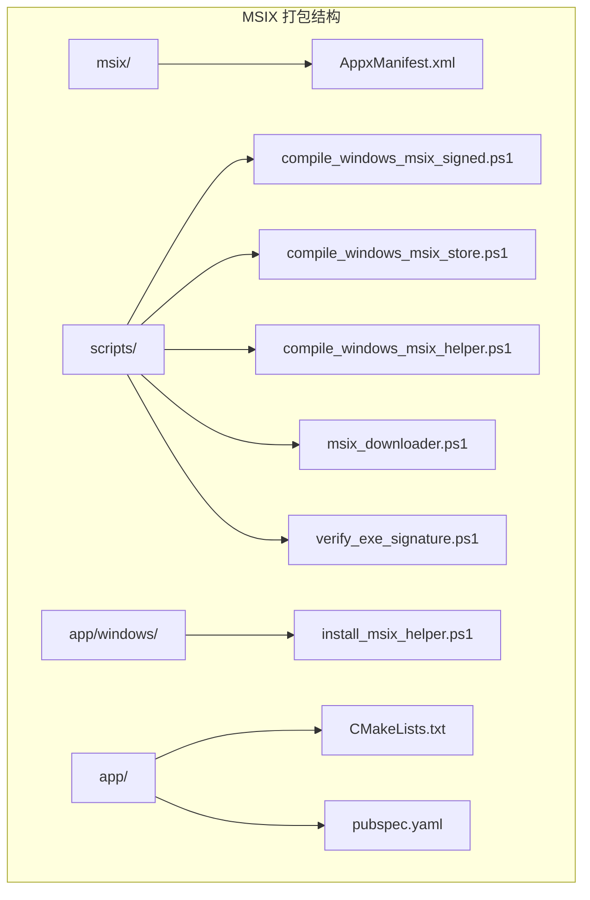
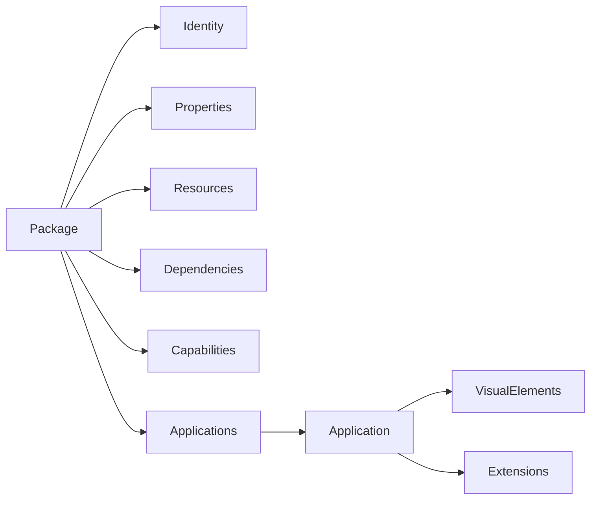
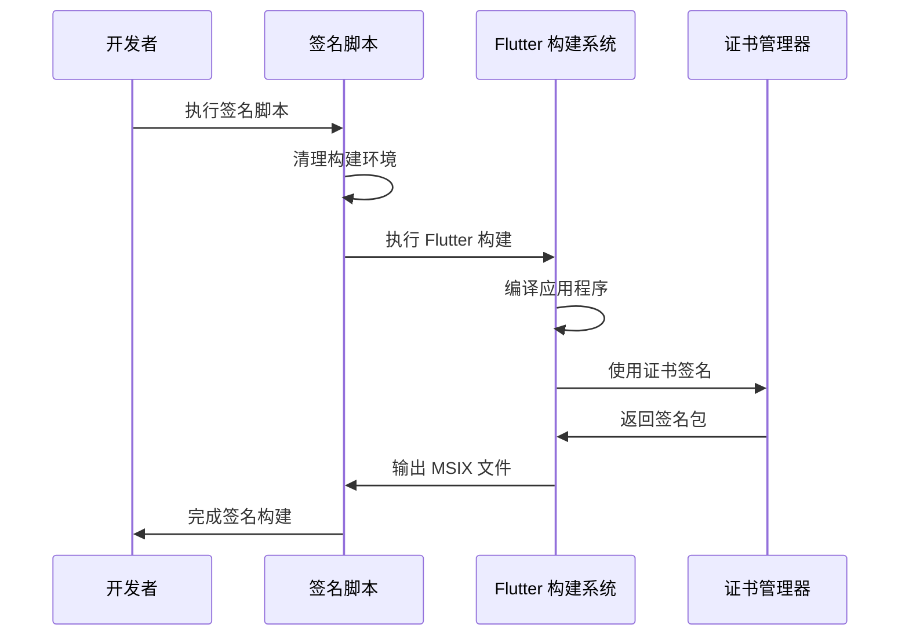
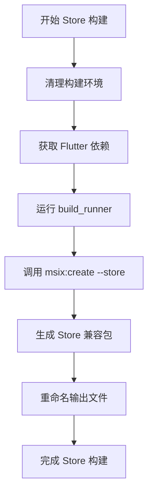
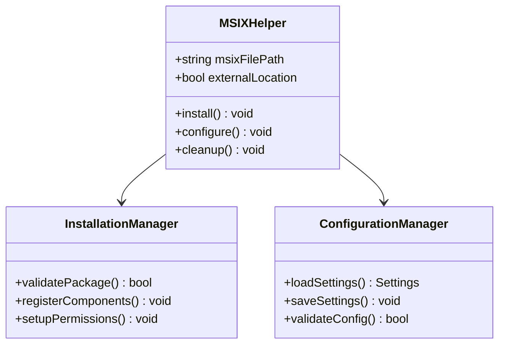
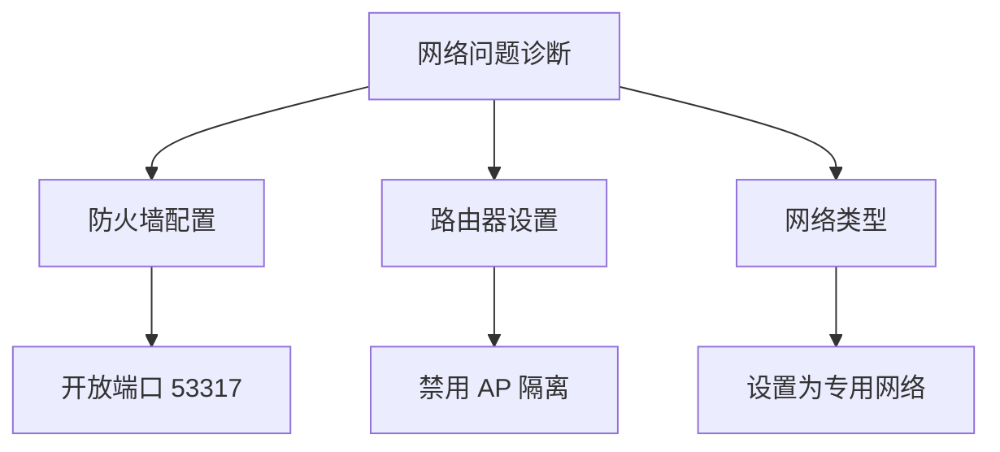

# MSIX 打包详细指南

<cite>
**本文档中引用的文件**
- [AppxManifest.xml](file://msix/AppxManifest.xml)
- [compile_windows_msix_signed.ps1](file://scripts/compile_windows_msix_signed.ps1)
- [compile_windows_msix_store.ps1](file://scripts/compile_windows_msix_store.ps1)
- [compile_windows_msix_helper.ps1](file://scripts/compile_windows_msix_helper.ps1)
- [install_msix_helper.ps1](file://app/windows/install_msix_helper.ps1)
- [msix_downloader.ps1](file://scripts/msix/msix_downloader.ps1)
- [download_windows_msix.ps1](file://scripts/download_windows_msix.ps1)
- [verify_exe_signature.ps1](file://scripts/verify_exe_signature.ps1)
- [pubspec.yaml](file://app/pubspec.yaml)
- [CMakeLists.txt](file://app/windows/CMakeLists.txt)
</cite>

## 目录
1. [简介](#简介)
2. [项目结构概览](#项目结构概览)
3. [AppxManifest.xml 文件详解](#appxmanifestxml-文件详解)
4. [MSIX 签名流程](#msix-签名流程)
5. [Microsoft Store 分发](#microsoft-store-分发)
6. [MSIX 助手应用](#msix-助手应用)
7. [故障排除指南](#故障排除指南)
8. [最佳实践建议](#最佳实践建议)
9. [总结](#总结)

## 简介

LocalSend 是一个开源的跨平台文件传输应用，支持通过本地网络在不同设备间安全传输文件和消息。本指南详细介绍了 LocalSend 项目中 MSIX 打包的完整流程，包括 AppxManifest.xml 配置、代码签名、Microsoft Store 分发以及故障排除。

MSIX（Microsoft Installer Package）是微软开发的新一代应用程序打包格式，提供了更好的安全性、可靠性和用户体验。LocalSend 使用 MSIX 格式为 Windows 平台提供官方安装包。

## 项目结构概览

LocalSend 的 MSIX 打包相关文件分布在以下目录结构中：



**图表来源**
- [AppxManifest.xml](file://msix/AppxManifest.xml#L1-L75)
- [compile_windows_msix_signed.ps1](file://scripts/compile_windows_msix_signed.ps1#L1-L20)
- [compile_windows_msix_store.ps1](file://scripts/compile_windows_msix_store.ps1#L1-L13)

## AppxManifest.xml 文件详解

AppxManifest.xml 是 MSIX 包的核心配置文件，定义了应用程序的所有元数据和权限要求。

### 基本结构分析

AppxManifest.xml 采用 XML 格式，包含多个命名空间声明：



**图表来源**
- [AppxManifest.xml](file://msix/AppxManifest.xml#L1-L75)

### 关键配置项详解

#### 应用标识配置

应用标识定义了应用程序的唯一标识符和发布者信息：

| 配置项 | 值 | 说明 |
|--------|-----|------|
| Name | 11157TienDoNam.LocalSend | 应用程序的唯一名称 |
| Version | 1.14.0.0 | 应用程序版本号 |
| Publisher | CN=Tien Do Nam, O=Tien Do Nam, S=Sachsen, C=DE | 发布者证书信息 |
| ProcessorArchitecture | x64 | 支持的处理器架构 |

#### 权限声明

LocalSend 的权限配置相对简单，主要声明了运行全信任应用程序的能力：

```xml
<rescap:Capability Name="runFullTrust" />
```

这允许应用程序执行需要管理员权限的操作，这对于文件传输功能至关重要。

#### 功能需求

应用程序的功能需求包括：
- **启动任务扩展**：支持开机自启动功能
- **共享目标扩展**：允许从其他应用程序直接分享文件
- **视觉元素配置**：定义应用程序图标、启动画面等界面元素

**章节来源**
- [AppxManifest.xml](file://msix/AppxManifest.xml#L1-L75)

## MSIX 签名流程

LocalSend 提供了两种不同的 MSIX 构建脚本，分别用于不同的部署场景。

### 代码签名脚本分析

#### compile_windows_msix_signed.ps1

该脚本专门用于创建已签名的 MSIX 包，适用于非 Store 分发渠道：



**图表来源**
- [compile_windows_msix_signed.ps1](file://scripts/compile_windows_msix_signed.ps1#L1-L20)

#### 签名流程详解

1. **环境准备**：清理旧的构建文件，确保干净的构建环境
2. **依赖管理**：使用 fvm 管理 Flutter 版本，确保构建一致性
3. **证书配置**：通过 `--certificate-path` 参数指定 PFX 证书文件
4. **密码验证**：通过 `$CERTIFICATE_PASSWORD` 参数提供证书密码
5. **输出重命名**：将生成的 MSIX 文件重命名为标准化格式

### 证书管理最佳实践

#### 证书类型选择

LocalSend 使用 PFX 格式的代码签名证书，这种格式包含私钥和证书链，适合自动化签名流程。

#### 证书安全存储

建议将证书文件存储在受保护的位置，如 `../secrets/windows-tienisto.pfx`，并确保：
- 证书文件权限设置正确
- 密码不硬编码在脚本中
- 使用环境变量或安全管道传递密码

**章节来源**
- [compile_windows_msix_signed.ps1](file://scripts/compile_windows_msix_signed.ps1#L1-L20)

## Microsoft Store 分发

### Store 分发脚本分析

#### compile_windows_msix_store.ps1

该脚本专为 Microsoft Store 分发设计，使用特殊的 Store 配置：



**图表来源**
- [compile_windows_msix_store.ps1](file://scripts/compile_windows_msix_store.ps1#L1-L13)

#### Store 特殊要求

Store 分发版本需要满足以下特殊要求：

1. **应用商店兼容性**：使用 `--store` 标志确保符合 Store 审核标准
2. **功能限制**：某些高级功能可能需要额外的 Store 审核批准
3. **隐私政策**：必须提供隐私政策链接和说明
4. **内容评级**：需要正确配置应用的内容评级信息

### Microsoft Store 审核标准

#### 技术要求

- **兼容性测试**：确保在目标 Windows 版本上正常工作
- **性能优化**：避免长时间阻塞 UI 线程
- **内存使用**：合理管理内存占用，避免内存泄漏
- **安全标准**：遵循 Windows 安全最佳实践

#### 内容要求

- **恶意软件检查**：确保应用不包含恶意代码
- **隐私合规**：正确处理用户数据，提供清晰的隐私政策
- **功能完整性**：确保所有声明的功能都正常工作

**章节来源**
- [compile_windows_msix_store.ps1](file://scripts/compile_windows_msix_store.ps1#L1-L13)

## MSIX 助手应用

LocalSend 实现了一个专门的 MSIX 助手应用来处理复杂的安装和配置任务。

### 助手应用架构



**图表来源**
- [install_msix_helper.ps1](file://app/windows/install_msix_helper.ps1#L1-L1)
- [compile_windows_msix_helper.ps1](file://scripts/compile_windows_msix_helper.ps1#L1-L5)

### 助手应用功能

#### 自动化安装

助手应用通过以下步骤实现自动化安装：

1. **包验证**：检查 MSIX 包的完整性和签名
2. **位置检测**：确定安装路径和外部位置
3. **权限检查**：验证必要的系统权限
4. **组件注册**：注册应用程序组件和服务

#### 配置管理

助手应用还负责管理应用程序的配置文件，包括：
- 用户偏好设置
- 网络配置
- 安全设置
- 日志配置

**章节来源**
- [install_msix_helper.ps1](file://app/windows/install_msix_helper.ps1#L1-L1)
- [compile_windows_msix_helper.ps1](file://scripts/compile_windows_msix_helper.ps1#L1-L5)

## 故障排除指南

### 常见签名错误

#### 证书相关问题

| 错误类型 | 可能原因 | 解决方案 |
|----------|----------|----------|
| 证书无效 | 证书过期或损坏 | 更新证书并重新签名 |
| 密码错误 | 提供的密码不正确 | 检查密码是否正确输入 |
| 证书链缺失 | 中间证书未包含 | 确保包含完整的证书链 |
| 权限不足 | 当前用户无签名权限 | 使用具有管理员权限的账户 |

#### 签名验证工具

LocalSend 提供了签名验证脚本来帮助诊断问题：


**图表来源**
- [verify_exe_signature.ps1](file://scripts/verify_exe_signature.ps1#L1-L2)

### 安装问题诊断

#### 权限问题

常见的权限问题及解决方案：

1. **管理员权限不足**
   - 确保以管理员身份运行安装程序
   - 检查组策略设置是否限制了安装

2. **Windows Defender 阻止**
   - 将应用程序添加到 Defender 排除列表
   - 检查 SmartScreen 设置

3. **依赖项缺失**
   - 确保安装了必要的 Visual C++ 运行时
   - 检查 .NET Framework 版本

#### 网络连接问题

对于 LocalSend 这样的网络应用，网络配置问题可能导致功能异常：



### 下载和分发问题

#### Store 下载失败

当从 Microsoft Store 下载应用时可能遇到的问题：

1. **地区限制**：某些应用可能在特定地区不可用
2. **网络连接**：稳定的互联网连接是必需的
3. **存储空间**：确保有足够的磁盘空间

#### 自定义分发问题

对于非 Store 分发渠道：

1. **信任链建立**：确保用户的系统信任发布者的证书
2. **自动更新**：手动配置更新机制
3. **卸载处理**：确保完全移除所有组件

**章节来源**
- [msix_downloader.ps1](file://scripts/msix/msix_downloader.ps1#L1-L123)
- [download_windows_msix.ps1](file://scripts/download_windows_msix.ps1#L1-L5)

## 最佳实践建议

### 开发阶段最佳实践

#### 版本管理

1. **语义化版本控制**：使用符合语义化版本规范的版本号
2. **构建标签**：为每个发布版本创建 Git 标签
3. **变更日志**：维护详细的变更记录

#### 测试策略

1. **多环境测试**：在不同 Windows 版本上测试
2. **权限测试**：验证不同权限级别下的行为
3. **网络测试**：测试各种网络条件下的功能

### 生产环境部署

#### 自动化构建

推荐使用 CI/CD 管道自动化 MSIX 构建过程：


#### 安全考虑

1. **密钥管理**：使用安全的密钥管理系统
2. **访问控制**：限制对构建系统的访问
3. **审计日志**：记录所有签名操作

### 维护和监控

#### 性能监控

定期监控应用程序的关键指标：

- 启动时间
- 内存使用情况
- 网络连接稳定性
- 用户满意度指标

#### 用户反馈

建立有效的用户反馈机制：

- 错误报告收集
- 功能请求处理
- 性能问题跟踪

## 总结

LocalSend 的 MSIX 打包解决方案展示了现代 Windows 应用程序开发的最佳实践。通过详细的配置文件管理、自动化构建流程和全面的故障排除机制，该项目为其他 Flutter 应用程序提供了宝贵的参考。

### 关键要点回顾

1. **配置文件重要性**：AppxManifest.xml 的正确配置是成功打包的基础
2. **签名流程自动化**：使用 PowerShell 脚本可以显著提高效率
3. **多渠道支持**：同时支持 Store 和非 Store 分发渠道
4. **质量保证**：完善的测试和验证流程确保产品质量
5. **持续改进**：根据用户反馈不断优化打包流程

### 未来发展方向

随着 Windows 平台的发展，MSIX 打包技术也在不断演进。LocalSend 的打包方案为未来的升级和扩展奠定了良好的基础，能够适应新的平台特性和用户需求。

通过遵循本指南中的最佳实践，开发者可以创建高质量、可信赖的 Windows 应用程序，为用户提供优秀的使用体验。