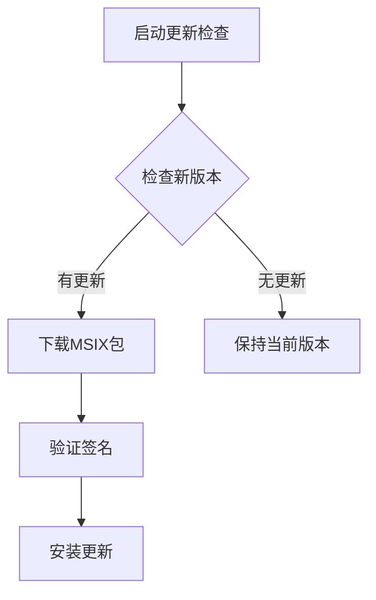

# 分发渠道与更新

<cite>
**本文档引用的文件**  
- [download_windows_msix.ps1](file://scripts/download_windows_msix.ps1)
- [verify_exe_signature.ps1](file://scripts/verify_exe_signature.ps1)
- [compile_windows_msix_helper.ps1](file://scripts/compile_windows_msix_helper.ps1)
- [install_msix_helper.ps1](file://app/windows/install_msix_helper.ps1)
- [msix_downloader.ps1](file://scripts/msix/msix_downloader.ps1)
- [compile_windows_exe.ps1](file://scripts/compile_windows_exe.ps1)
- [compile_windows_msix_signed.ps1](file://scripts/compile_windows_msix_signed.ps1)
- [compile_windows_msix_store.ps1](file://scripts/compile_windows_msix_store.ps1)
- [compile_windows_zip.ps1](file://scripts/compile_windows_zip.ps1)
- [AppxManifest.xml](file://msix/AppxManifest.xml)
- [pubspec.yaml](file://app/pubspec.yaml)
</cite>

## 目录
1. [简介](#简介)
2. [分发渠道](#分发渠道)
3. [自动更新机制](#自动更新机制)
4. [安全验证实践](#安全验证实践)
5. [部署辅助工具](#部署辅助工具)
6. [更新策略配置](#更新策略配置)

## 简介
LocalSend 是一个开源的跨平台文件传输应用，提供类似 AirDrop 的功能。本指南详细说明了通过不同渠道分发 Windows 应用的流程和优缺点，包括直接下载、Microsoft Store 和企业部署等渠道。同时，本文档还解释了自动更新机制的实现原理，以及如何使用相关脚本检查和下载更新。

## 分发渠道
LocalSend 提供了多种 Windows 应用分发渠道，以满足不同用户群体的需求。

### 直接下载
通过直接下载方式，用户可以从项目官网或 GitHub 发布页面获取应用安装包。这种方式适用于大多数普通用户，提供了便捷的安装体验。

### Microsoft Store
通过 Microsoft Store 分发应用，可以利用商店的自动更新机制，确保用户始终使用最新版本。Store 版本的应用具有更好的安全性和兼容性。

### 企业部署
对于企业用户，LocalSend 提供了企业部署选项，支持通过组策略或配置管理工具进行大规模部署。这种方式适合需要集中管理软件版本的企业环境。

**Section sources**
- [compile_windows_exe.ps1](file://scripts/compile_windows_exe.ps1)
- [compile_windows_zip.ps1](file://scripts/compile_windows_zip.ps1)
- [compile_windows_msix_store.ps1](file://scripts/compile_windows_msix_store.ps1)

## 自动更新机制
LocalSend 的自动更新机制通过 PowerShell 脚本实现，确保用户能够及时获取最新版本的应用。

### 更新检查与下载
`download_windows_msix.ps1` 脚本用于从 Microsoft Store 下载最新版本的 MSIX 包。该脚本调用 `msix_downloader.ps1`，通过访问 store.rg-adguard.net API 获取应用下载链接。



**Diagram sources**
- [download_windows_msix.ps1](file://scripts/download_windows_msix.ps1)
- [msix_downloader.ps1](file://scripts/msix/msix_downloader.ps1)

**Section sources**
- [download_windows_msix.ps1](file://scripts/download_windows_msix.ps1)
- [msix_downloader.ps1](file://scripts/msix/msix_downloader.ps1)

## 安全验证实践
为确保安装包的完整性和真实性，LocalSend 提供了签名验证脚本。

### 签名验证
`verify_exe_signature.ps1` 脚本使用 Windows SDK 中的 signtool 工具验证 EXE 文件的数字签名。该脚本检查文件是否由可信证书签名，防止恶意篡改。

```powershell
$signtoolPath = "C:\Program Files (x86)\Windows Kits\10\bin\10.0.19041.0\x64\signtool.exe"
& $signtoolPath verify build\windows\runner\Release\localsend_app.exe
```

**Section sources**
- [verify_exe_signature.ps1](file://scripts/verify_exe_signature.ps1)

## 部署辅助工具
LocalSend 提供了多个辅助脚本，简化 Windows 应用的部署过程。

### MSIX 打包助手
`compile_windows_msix_helper.ps1` 脚本用于创建 MSIX 安装包。该脚本使用 MakeAppx.exe 工具将应用文件打包成 MSIX 格式，便于分发和安装。

```powershell
MakeAppx.exe pack /o /d .\msix /nv /p .\app\windows\localsend_msix_helper.msix
```

### 安装助手
`install_msix_helper.ps1` 脚本用于安装 MSIX 包。该脚本使用 Add-AppxPackage 命令将 MSIX 包安装到系统中。

```powershell
Add-AppxPackage .\localsend_msix_helper.msix -ExternalLocation $(Get-Location)
```

**Section sources**
- [compile_windows_msix_helper.ps1](file://scripts/compile_windows_msix_helper.ps1)
- [install_msix_helper.ps1](file://app/windows/install_msix_helper.ps1)

## 更新策略配置
LocalSend 支持为不同用户群体配置适当的更新策略。

### 签名版本构建
`compile_windows_msix_signed.ps1` 脚本用于构建签名的 MSIX 版本。该脚本需要提供证书密码，确保应用包的安全性。

```powershell
fvm dart run msix:create --certificate-path ../secrets/windows-tienisto.pfx --certificate-password $CERTIFICATE_PASSWORD
```

### 商店版本构建
`compile_windows_msix_store.ps1` 脚本用于构建 Microsoft Store 版本。该脚本使用 --store 参数创建符合商店要求的安装包。

```powershell
fvm flutter pub run msix:create --store
```

**Section sources**
- [compile_windows_msix_signed.ps1](file://scripts/compile_windows_msix_signed.ps1)
- [compile_windows_msix_store.ps1](file://scripts/compile_windows_msix_store.ps1)
- [AppxManifest.xml](file://msix/AppxManifest.xml)