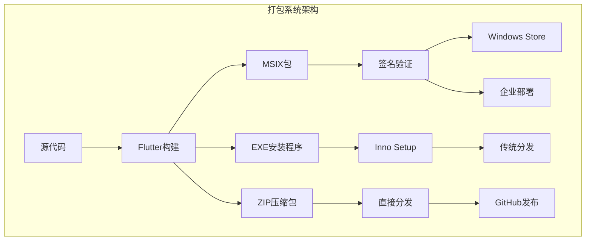
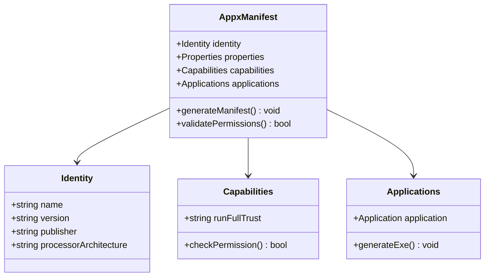
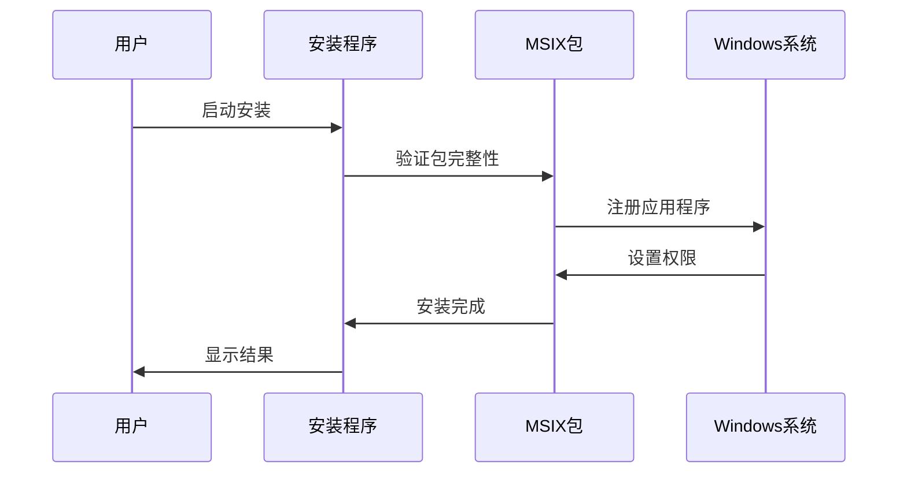
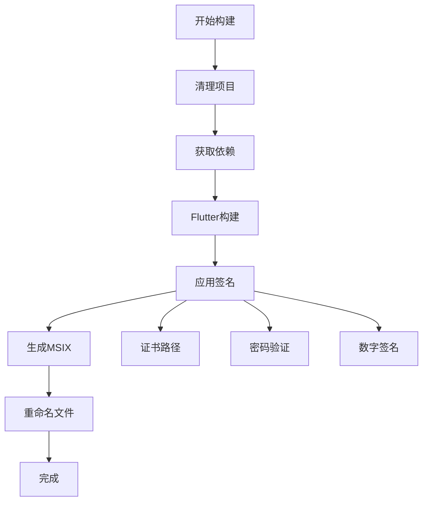
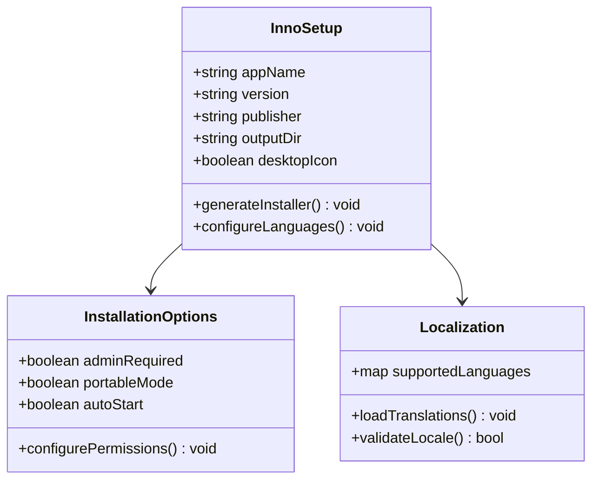
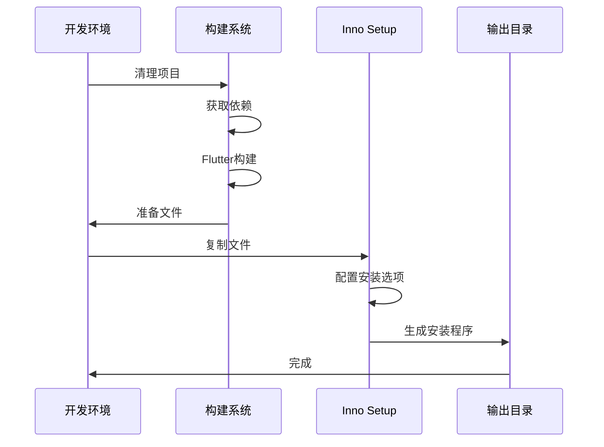
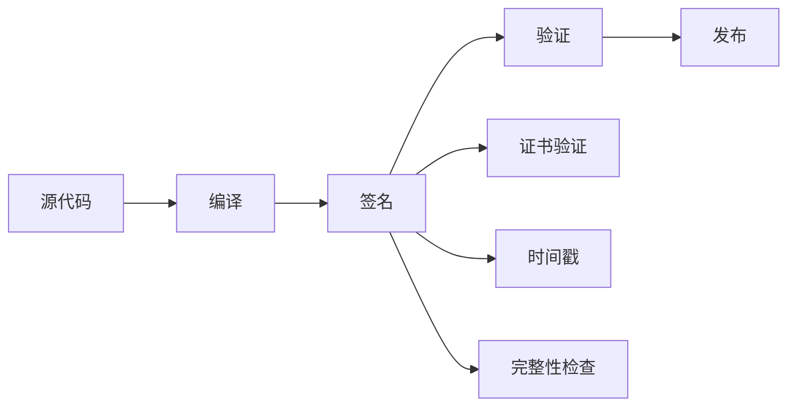
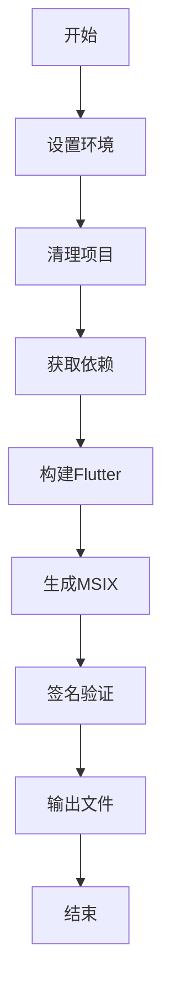
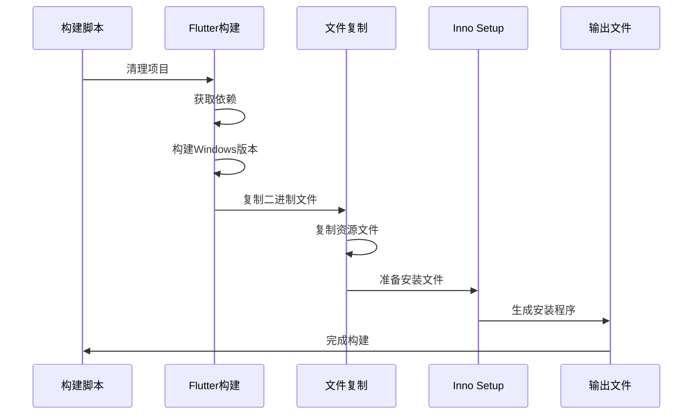

# 打包与分发

<cite>
**本文档中引用的文件**
- [AppxManifest.xml](file://msix/AppxManifest.xml)
- [compile_windows_exe-inno.iss](file://scripts/compile_windows_exe-inno.iss)
- [compile_windows_exe.ps1](file://scripts/compile_windows_exe.ps1)
- [compile_windows_msix_helper.ps1](file://scripts/compile_windows_msix_helper.ps1)
- [compile_windows_msix_signed.ps1](file://scripts/compile_windows_msix_signed.ps1)
- [compile_windows_msix_store.ps1](file://scripts/compile_windows_msix_store.ps1)
- [compile_windows_zip.ps1](file://scripts/compile_windows_zip.ps1)
- [install_msix_helper.ps1](file://app/windows/install_msix_helper.ps1)
- [download_windows_msix.ps1](file://scripts/download_windows_msix.ps1)
- [msix_downloader.ps1](file://scripts/msix/msix_downloader.ps1)
- [verify_exe_signature.ps1](file://scripts/verify_exe_signature.ps1)
- [pubspec.yaml](file://app/pubspec.yaml)
</cite>

## 目录
1. [简介](#简介)
2. [项目结构概览](#项目结构概览)
3. [MSIX包创建](#msix包创建)
4. [传统EXE安装程序](#传统exe安装程序)
5. [安全性和权限配置](#安全性和权限配置)
6. [自动更新机制](#自动更新机制)
7. [构建流程](#构建流程)
8. [签名验证](#签名验证)
9. [分发渠道](#分发渠道)
10. [最佳实践](#最佳实践)

## 简介

LocalSend提供了两种主要的Windows应用程序分发方式：MSIX包和传统EXE安装程序。每种方式都有其特定的优势和使用场景，适用于不同的部署需求和用户群体。

MSIX包是现代Windows应用程序的标准格式，提供更好的安全性、可管理性和用户体验。传统EXE安装程序则兼容更广泛的Windows版本，适合需要广泛兼容性的场景。

## 项目结构概览

LocalSend的Windows打包系统采用模块化设计，包含以下关键组件：

**图表来源**
- [compile_windows_exe.ps1](file://scripts/compile_windows_exe.ps1#L1-L20)
- [compile_windows_msix_signed.ps1](file://scripts/compile_windows_msix_signed.ps1#L1-L20)

**章节来源**
- [pubspec.yaml](file://app/pubspec.yaml#L1-L124)

## MSIX包创建

### AppxManifest.xml配置

MSIX包的核心是AppxManifest.xml文件，它定义了应用程序的所有元数据和权限要求。

#### 基本标识配置
- **应用程序标识**: `11157TienDoNam.LocalSend`
- **版本控制**: `1.14.0.0`
- **发布者信息**: `CN=Tien Do Nam, O=Tien Do Nam, S=Sachsen, C=DE`
- **处理器架构**: `x64`

#### 权限和功能配置
MSIX包通过受限能力（Restricted Capabilities）系统获得必要的系统权限：

**图表来源**
- [AppxManifest.xml](file://msix/AppxManifest.xml#L16-L32)

#### 应用程序入口点
MSIX包配置为运行全信任应用程序（Full Trust Application），允许访问系统资源和网络功能。

#### 多语言支持
清单文件支持超过30种语言，确保全球用户的本地化体验。

**章节来源**
- [AppxManifest.xml](file://msix/AppxManifest.xml#L1-L75)

### MSIX包生成流程

#### 辅助MSIX包
LocalSend包含一个辅助MSIX包用于处理应用程序的安装和卸载操作：

**图表来源**
- [compile_windows_msix_helper.ps1](file://scripts/compile_windows_msix_helper.ps1#L1-L5)
- [install_msix_helper.ps1](file://app/windows/install_msix_helper.ps1#L1-L1)

#### 签名MSIX包
签名MSIX包通过代码签名确保应用程序的完整性和可信度：

**图表来源**
- [compile_windows_msix_signed.ps1](file://scripts/compile_windows_msix_signed.ps1#L1-L20)

#### Windows Store MSIX包
Store版本的MSIX包经过特殊优化以满足Microsoft Store的要求：

**章节来源**
- [compile_windows_msix_helper.ps1](file://scripts/compile_windows_msix_helper.ps1#L1-L5)
- [compile_windows_msix_signed.ps1](file://scripts/compile_windows_msix_signed.ps1#L1-L20)
- [compile_windows_msix_store.ps1](file://scripts/compile_windows_msix_store.ps1#L1-L13)

## 传统EXE安装程序

### Inno Setup配置

LocalSend使用Inno Setup作为传统的Windows安装程序解决方案，提供广泛的兼容性和自定义选项。

#### 基本配置参数
- **应用程序名称**: `LocalSend`
- **版本号**: `1.17.0`
- **发布者**: `Tien Do Nam`
- **目标架构**: `x64compatible`

#### 多语言界面支持
Inno Setup配置支持多种语言界面，包括：
- 英语、法语、德语、西班牙语等主要欧洲语言
- 中文简体、繁体
- 日语、韩语等亚洲语言
- 阿拉伯语、希伯来语等中东语言

#### 安装选项配置
安装程序提供灵活的安装选项：

**图表来源**
- [compile_windows_exe-inno.iss](file://scripts/compile_windows_exe-inno.iss#L8-L25)

#### 文件和目录结构
安装程序配置包含以下核心组件：
- 主应用程序文件
- 动态链接库（DLL）
- 数据文件和资源
- MSIX辅助包

#### 自动启动配置
安装程序支持配置应用程序的自动启动功能。

**章节来源**
- [compile_windows_exe-inno.iss](file://scripts/compile_windows_exe-inno.iss#L1-L90)

### EXE安装程序生成流程

#### 构建步骤
EXE安装程序的生成遵循标准化的构建流程：

**图表来源**
- [compile_windows_exe.ps1](file://scripts/compile_windows_exe.ps1#L1-L20)

**章节来源**
- [compile_windows_exe.ps1](file://scripts/compile_windows_exe.ps1#L1-L20)

## 安全性和权限配置

### 权限模型

LocalSend在Windows平台上需要以下关键权限：

#### 网络通信权限
- **入站连接**: 允许接收来自其他设备的文件传输请求
- **出站连接**: 支持向其他设备发送文件
- **局域网访问**: 自动发现和连接同一网络中的设备

#### 文件系统权限
- **读取权限**: 访问选择要发送的文件
- **写入权限**: 接收和保存传入的文件
- **临时文件**: 创建临时文件进行传输

#### 系统集成权限
- **托盘图标**: 在系统托盘中显示状态指示器
- **开机启动**: 可选的自动启动功能
- **文件关联**: 支持拖放操作和右键菜单

### 安全最佳实践

#### 代码签名
所有发布的Windows应用程序都必须经过数字签名：

**图表来源**
- [verify_exe_signature.ps1](file://scripts/verify_exe_signature.ps1#L1-L2)

#### 沙盒隔离
MSIX包提供更强的安全隔离，限制应用程序对系统资源的访问。

#### 权限最小化原则
应用程序仅请求执行其功能所必需的最小权限集。

**章节来源**
- [verify_exe_signature.ps1](file://scripts/verify_exe_signature.ps1#L1-L2)

## 自动更新机制

### 更新策略

LocalSend实现了多层次的更新机制：

#### 版本检测
- **本地版本比较**: 检查当前安装版本
- **远程版本获取**: 从官方服务器获取最新版本信息
- **兼容性验证**: 确保新版本与当前系统兼容

#### 更新下载
- **增量更新**: 仅下载变更的部分
- **完整包下载**: 下载整个应用程序包
- **验证完整性**: 使用哈希值验证下载文件的完整性

#### 安装更新
- **静默更新**: 在后台自动安装更新
- **用户确认**: 提示用户确认更新
- **回滚机制**: 在更新失败时恢复到之前的版本

### 分发渠道更新

#### Windows Store更新
Store分发的应用程序通过Microsoft Store自动接收更新。

#### 直接分发更新
通过GitHub Releases和其他分发渠道的应用程序需要手动检查更新或实现自动更新机制。

## 构建流程

### 开发环境准备

#### 必需工具
- **Flutter SDK**: 3.25.0或更高版本
- **Visual Studio 2022**: 包含Windows SDK
- **Inno Setup**: 用于传统安装程序
- **PowerShell**: 脚本执行环境

#### 环境变量配置
确保以下路径包含在系统PATH中：
- Flutter工具链
- Windows SDK工具
- Inno Setup安装路径

### 构建命令序列

#### MSIX包构建

**图表来源**
- [compile_windows_msix_signed.ps1](file://scripts/compile_windows_msix_signed.ps1#L1-L20)

#### EXE安装程序构建
传统EXE安装程序的构建流程更加复杂，涉及多个步骤：

**图表来源**
- [compile_windows_exe.ps1](file://scripts/compile_windows_exe.ps1#L1-L20)

### 质量保证

#### 自动化测试
- **构建验证**: 确保构建过程无错误
- **功能测试**: 验证应用程序基本功能
- **兼容性测试**: 测试不同Windows版本的兼容性

#### 代码质量检查
- **静态分析**: 检查代码质量和潜在问题
- **安全扫描**: 识别安全漏洞和风险
- **性能分析**: 评估应用程序性能指标

**章节来源**
- [compile_windows_exe.ps1](file://scripts/compile_windows_exe.ps1#L1-L20)
- [compile_windows_zip.ps1](file://scripts/compile_windows_zip.ps1#L1-L15)

## 签名验证

### 数字签名验证

LocalSend提供了专门的签名验证脚本，确保应用程序的完整性和真实性：

#### 验证流程
1. **定位签名工具**: 查找Windows SDK中的signtool.exe
2. **执行验证**: 使用signtool验证PE文件签名
3. **报告结果**: 显示验证状态和相关信息

#### 签名类型
- **代码签名**: 确保应用程序未被篡改
- **时间戳**: 提供长期有效的签名验证
- **证书链**: 验证签名者的身份和权限

### 安全建议

#### 证书管理
- **定期更新**: 及时更新代码签名证书
- **安全存储**: 安全保管私钥和证书
- **访问控制**: 限制证书访问权限

#### 验证最佳实践
- **多层验证**: 结合多种验证方法
- **自动化**: 在CI/CD流程中集成验证
- **监控告警**: 监控签名失效情况

**章节来源**
- [verify_exe_signature.ps1](file://scripts/verify_exe_signature.ps1#L1-L2)

## 分发渠道

### Windows Store分发

#### Store优势
- **自动更新**: 用户自动接收更新
- **安全扫描**: Microsoft的安全审查
- **用户信任**: Store认证提高用户信任度
- **推广支持**: Microsoft的推广资源

#### 发布要求
- **应用审核**: 通过Microsoft的审核流程
- **隐私政策**: 提供隐私政策链接
- **内容评级**: 根据应用内容申请适当的年龄分级

### 传统分发渠道

#### GitHub Releases
- **直接下载**: 用户可以直接从GitHub下载
- **版本历史**: 完整的版本历史记录
- **社区反馈**: 用户可以直接提供反馈

#### 第三方分发平台
- **软件门户**: 在各种软件下载网站发布
- **企业内部分发**: 通过企业内部渠道分发
- **定制版本**: 为企业用户提供定制版本

### 辅助工具

#### MSIX下载器
LocalSend提供了专门的MSIX下载工具，可以从Microsoft Store下载已签名的MSIX包：

**图表来源**
- [msix_downloader.ps1](file://scripts/msix/msix_downloader.ps1#L1-L123)

#### 自动化脚本
所有分发渠道都配有自动化脚本，简化发布流程：

**章节来源**
- [download_windows_msix.ps1](file://scripts/download_windows_msix.ps1#L1-L5)
- [msix_downloader.ps1](file://scripts/msix/msix_downloader.ps1#L1-L123)

## 最佳实践

### 开发阶段

#### 版本管理
- **语义化版本**: 使用语义化版本控制
- **标签管理**: 为每个发布版本创建Git标签
- **变更日志**: 维护详细的变更日志

#### 构建自动化
- **CI/CD集成**: 将构建过程集成到CI/CD流水线
- **环境分离**: 区分开发、测试和生产环境
- **自动化测试**: 在构建过程中运行自动化测试

### 发布阶段

#### 质量保证
- **多环境测试**: 在不同环境中测试应用程序
- **兼容性验证**: 确保在目标Windows版本上正常工作
- **性能监控**: 监控应用程序的性能指标

#### 用户体验
- **清晰的说明**: 提供清晰的安装和使用说明
- **错误处理**: 实现友好的错误处理和用户提示
- **支持渠道**: 建立有效的用户支持渠道

### 维护阶段

#### 更新策略
- **定期更新**: 定期发布安全更新和功能改进
- **向后兼容**: 保持向后兼容性
- **迁移支持**: 为用户提供升级指导

#### 社区参与
- **开源协作**: 积极参与开源社区贡献
- **用户反馈**: 收集和响应用户反馈
- **文档维护**: 维护和更新技术文档

### 安全考虑

#### 持续监控
- **安全审计**: 定期进行安全审计
- **漏洞扫描**: 使用自动化工具扫描漏洞
- **威胁情报**: 关注相关的安全威胁情报

#### 合规性
- **隐私保护**: 遵守相关的隐私保护法规
- **许可证合规**: 确保使用的第三方库符合许可证要求
- **行业标准**: 遵循行业安全标准和最佳实践

通过遵循这些最佳实践，可以确保LocalSend在Windows平台上的成功部署和持续发展，为用户提供安全、可靠、高质量的应用程序体验。