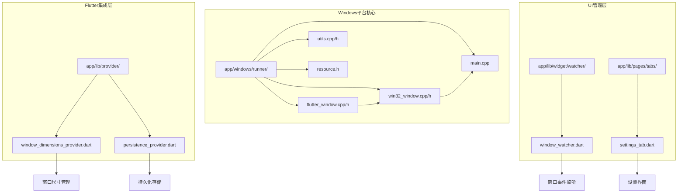
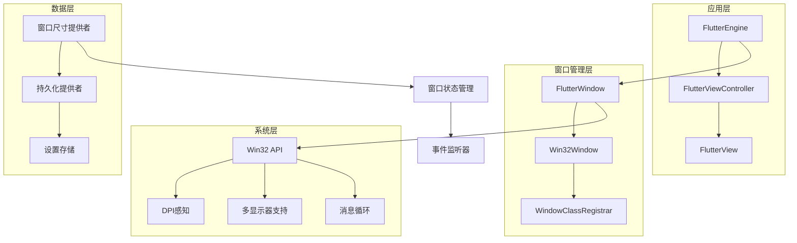
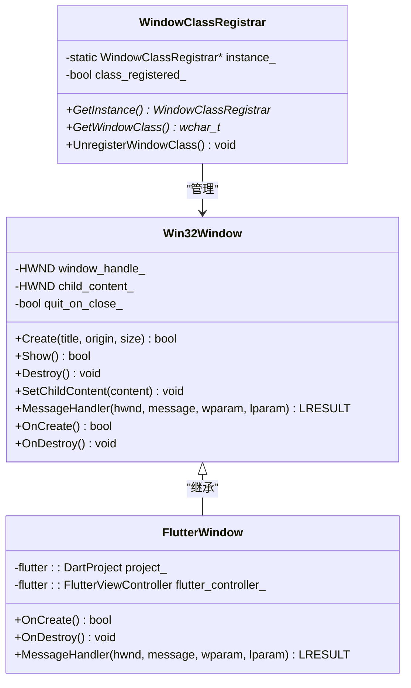
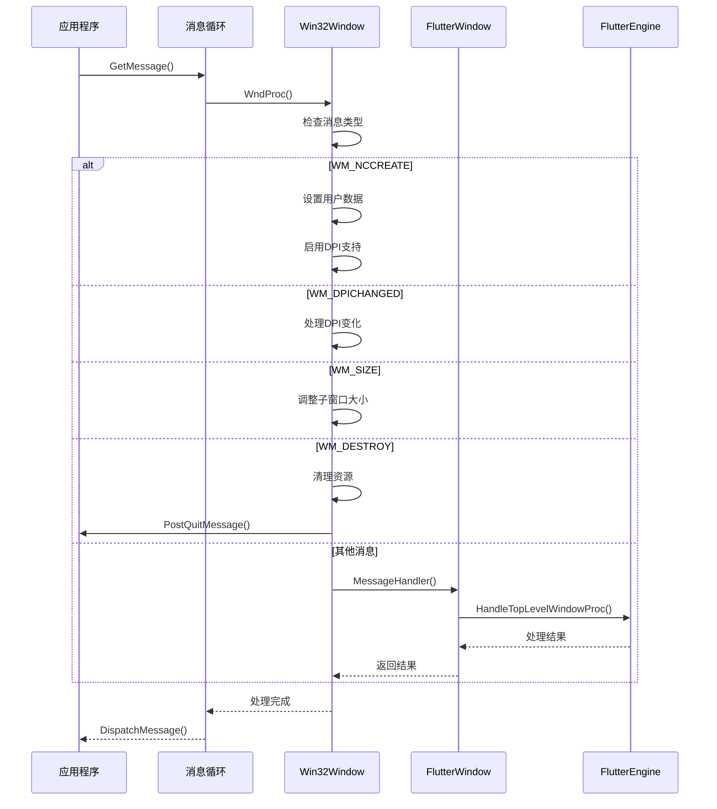
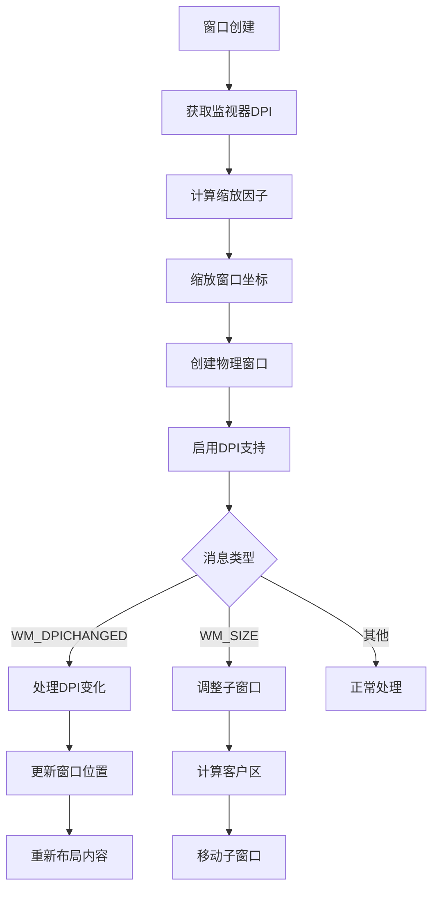
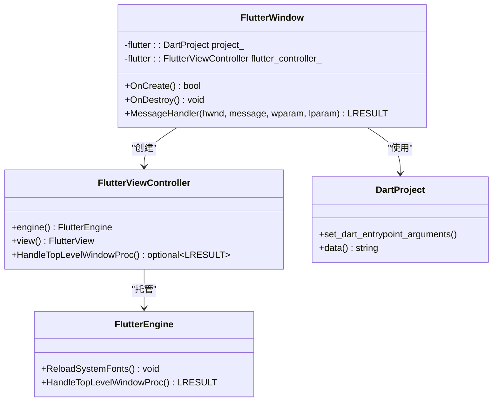
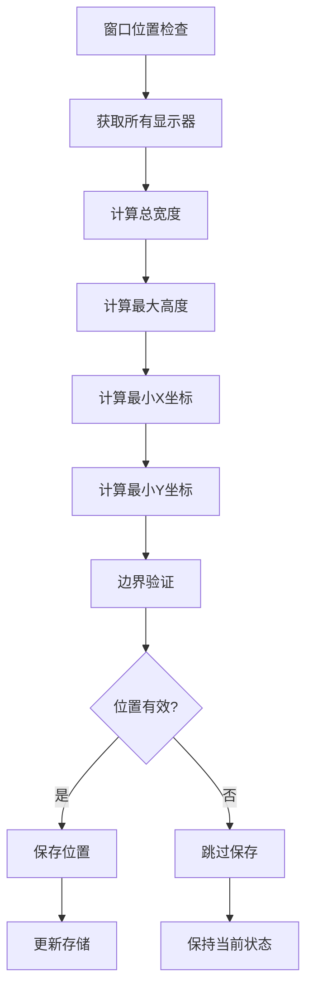
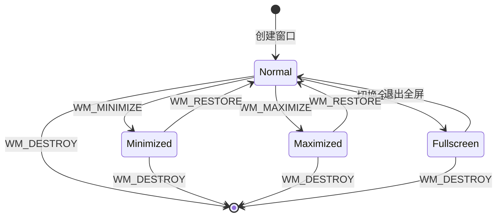
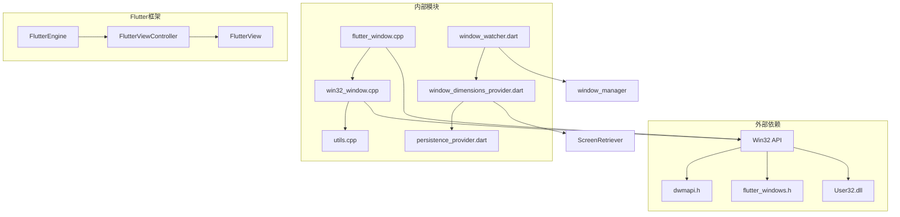

# 窗口管理

<cite>
**本文档中引用的文件**
- [flutter_window.cpp](file://app/windows/runner/flutter_window.cpp)
- [flutter_window.h](file://app/windows/runner/flutter_window.h)
- [win32_window.cpp](file://app/windows/runner/win32_window.cpp)
- [win32_window.h](file://app/windows/runner/win32_window.h)
- [main.cpp](file://app/windows/runner/main.cpp)
- [utils.cpp](file://app/windows/runner/utils.cpp)
- [utils.h](file://app/windows/runner/utils.h)
- [resource.h](file://app/windows/runner/resource.h)
- [window_dimensions_provider.dart](file://app/lib/provider/window_dimensions_provider.dart)
- [window_watcher.dart](file://app/lib/widget/watcher/window_watcher.dart)
- [persistence_provider.dart](file://app/lib/provider/persistence_provider.dart)
- [settings_tab.dart](file://app/lib/pages/tabs/settings_tab.dart)
</cite>

## 目录
1. [简介](#简介)
2. [项目结构](#项目结构)
3. [核心组件](#核心组件)
4. [架构概览](#架构概览)
5. [详细组件分析](#详细组件分析)
6. [依赖关系分析](#依赖关系分析)
7. [性能考虑](#性能考虑)
8. [故障排除指南](#故障排除指南)
9. [结论](#结论)

## 简介

LocalSend是一个跨平台的文件传输应用程序，其Windows平台的窗口管理系统采用了现代的Win32 API和Flutter引擎集成技术。该系统提供了完整的窗口生命周期管理、高DPI感知、多显示器支持以及窗口状态管理功能。

本文档深入分析了Windows窗口管理的核心实现，包括Win32 API的使用、FlutterEngine与原生窗口的集成机制、DPI感知实现以及多显示器支持等关键技术。

## 项目结构

LocalSend的Windows窗口管理系统主要分布在以下目录结构中：

**图表来源**
- [flutter_window.cpp](file://app/windows/runner/flutter_window.cpp#L1-L62)
- [win32_window.cpp](file://app/windows/runner/win32_window.cpp#L1-L289)
- [main.cpp](file://app/windows/runner/main.cpp#L1-L54)

**章节来源**
- [flutter_window.cpp](file://app/windows/runner/flutter_window.cpp#L1-L62)
- [win32_window.cpp](file://app/windows/runner/win32_window.cpp#L1-L289)
- [main.cpp](file://app/windows/runner/main.cpp#L1-L54)

## 核心组件

### Win32Window基类

Win32Window是整个窗口管理系统的基础抽象类，提供了高DPI感知的Win32窗口封装。它定义了窗口的基本操作接口，包括创建、显示、销毁和消息处理。

### FlutterWindow子类

FlutterWindow继承自Win32Window，专门用于托管Flutter视图控制器。它负责FlutterEngine的初始化、插件注册以及Flutter视图与原生窗口的集成。

### 窗口类注册器

WindowClassRegistrar管理窗口类的注册和注销，确保窗口类在整个应用程序生命周期中的正确管理。

**章节来源**
- [win32_window.h](file://app/windows/runner/win32_window.h#L1-L103)
- [flutter_window.h](file://app/windows/runner/flutter_window.h#L1-L34)

## 架构概览

LocalSend的窗口管理系统采用分层架构设计，从底层的Win32 API到上层的Flutter集成，形成了完整的窗口管理生态。

**图表来源**
- [flutter_window.cpp](file://app/windows/runner/flutter_window.cpp#L10-L30)
- [win32_window.cpp](file://app/windows/runner/win32_window.cpp#L88-L128)
- [main.cpp](file://app/windows/runner/main.cpp#L30-L45)

## 详细组件分析

### Win32 API窗口类注册

窗口类注册是Windows窗口系统的基础，LocalSend通过WindowClassRegistrar实现了高效的窗口类管理。

**图表来源**
- [win32_window.cpp](file://app/windows/runner/win32_window.cpp#L88-L128)
- [flutter_window.cpp](file://app/windows/runner/flutter_window.cpp#L10-L30)

#### 窗口类注册流程

窗口类注册过程包括以下关键步骤：

1. **单例模式管理**：WindowClassRegistrar采用单例模式，确保窗口类只注册一次
2. **窗口类属性配置**：设置窗口样式、光标、图标、背景色等属性
3. **消息处理函数绑定**：将WndProc静态方法绑定为窗口的消息处理函数
4. **动态库加载**：在需要时动态加载User32.dll以启用非客户端DPI缩放

**章节来源**
- [win32_window.cpp](file://app/windows/runner/win32_window.cpp#L88-L128)

### 消息循环处理机制

LocalSend的窗口消息处理采用了分层的消息路由机制，确保Flutter引擎和原生窗口都能正确处理系统消息。

**图表来源**
- [win32_window.cpp](file://app/windows/runner/win32_window.cpp#L165-L207)
- [flutter_window.cpp](file://app/windows/runner/flutter_window.cpp#L33-L60)

#### 关键消息处理

系统实现了以下关键消息的处理：

1. **WM_NCCREATE**：处理窗口创建前的初始化工作
2. **WM_DPICHANGED**：响应DPI变化，调整窗口大小
3. **WM_SIZE**：处理窗口大小变化，重新布局子窗口
4. **WM_DESTROY**：清理资源，退出应用程序
5. **WM_FONTCHANGE**：通知Flutter引擎重新加载字体

**章节来源**
- [win32_window.cpp](file://app/windows/runner/win32_window.cpp#L165-L207)
- [flutter_window.cpp](file://app/windows/runner/flutter_window.cpp#L33-L60)

### DPI感知实现

LocalSend实现了完整的高DPI感知功能，支持不同DPI设置下的窗口适配。

**图表来源**
- [win32_window.cpp](file://app/windows/runner/win32_window.cpp#L130-L163)
- [win32_window.cpp](file://app/windows/runner/win32_window.cpp#L195-L207)

#### DPI缩放算法

DPI感知实现包含以下核心算法：

1. **监视器检测**：使用MonitorFromPoint确定窗口所在的显示器
2. **DPI查询**：通过FlutterDesktopGetDpiForMonitor获取显示器DPI
3. **缩放计算**：scale_factor = dpi / 96.0
4. **坐标转换**：Scale(source, scale_factor)进行逻辑坐标到物理坐标的转换

**章节来源**
- [win32_window.cpp](file://app/windows/runner/win32_window.cpp#L130-L163)
- [win32_window.cpp](file://app/windows/runner/win32_window.cpp#L33-L37)

### FlutterEngine集成

FlutterEngine与原生窗口的集成是LocalSend窗口管理系统的核心创新点。

**图表来源**
- [flutter_window.cpp](file://app/windows/runner/flutter_window.cpp#L10-L30)
- [flutter_window.cpp](file://app/windows/runner/flutter_window.cpp#L33-L60)

#### 生命周期管理

FlutterEngine的生命周期与原生窗口紧密耦合：

1. **OnCreate阶段**：
   - 调用父类Win32Window::OnCreate()
   - 创建FlutterViewController实例
   - 验证FlutterEngine和FlutterView的有效性
   - 注册插件
   - 设置子内容为Flutter视图

2. **OnDestroy阶段**：
   - 清理FlutterViewController资源
   - 调用父类Win32Window::OnDestroy()

**章节来源**
- [flutter_window.cpp](file://app/windows/runner/flutter_window.cpp#L10-L30)
- [flutter_window.cpp](file://app/windows/runner/flutter_window.cpp#L31-L40)

### 多显示器支持

LocalSend提供了完整的多显示器支持，包括显示器检测、边界检查和位置记忆功能。

**图表来源**
- [window_dimensions_provider.dart](file://app/lib/provider/window_dimensions_provider.dart#L47-L78)

#### 显示器信息获取

系统通过ScreenRetriever获取显示器信息：

1. **显示器列表**：getAllDisplays()返回所有可用显示器
2. **尺寸计算**：计算总宽度和最大高度
3. **边界检测**：验证窗口位置是否在有效区域内
4. **坐标转换**：处理可见区域和完整区域的差异

**章节来源**
- [window_dimensions_provider.dart](file://app/lib/provider/window_dimensions_provider.dart#L47-L78)

### 窗口状态管理

窗口状态管理涵盖了最小化、最大化、全屏等各种窗口状态的处理。

**图表来源**
- [window_watcher.dart](file://app/lib/widget/watcher/window_watcher.dart#L89-L126)

#### 状态事件处理

窗口状态变化通过WindowWatcher进行统一管理：

1. **窗口关闭**：保存窗口尺寸和位置，决定最小化到托盘或完全退出
2. **窗口最小化**：暂停睡眠检测
3. **窗口恢复**：恢复睡眠检测
4. **窗口移动**：保存新的位置信息
5. **窗口调整大小**：保存新的尺寸信息

**章节来源**
- [window_watcher.dart](file://app/lib/widget/watcher/window_watcher.dart#L89-L126)

## 依赖关系分析

LocalSend窗口管理系统的依赖关系体现了清晰的分层架构设计。

**图表来源**
- [flutter_window.cpp](file://app/windows/runner/flutter_window.cpp#L1-L5)
- [win32_window.cpp](file://app/windows/runner/win32_window.cpp#L1-L5)
- [main.cpp](file://app/windows/runner/main.cpp#L1-L10)

### 核心依赖关系

1. **Win32 API依赖**：直接依赖Windows API进行窗口操作
2. **Flutter引擎依赖**：通过flutter_windows.h与Flutter框架集成
3. **系统服务依赖**：依赖DWM API进行主题设置
4. **工具函数依赖**：utils模块提供UTF-8编码转换等工具函数

**章节来源**
- [flutter_window.cpp](file://app/windows/runner/flutter_window.cpp#L1-L5)
- [win32_window.cpp](file://app/windows/runner/win32_window.cpp#L1-L5)
- [utils.cpp](file://app/windows/runner/utils.cpp#L1-L10)

## 性能考虑

### 窗口创建优化

LocalSend在窗口创建过程中实现了多项性能优化：

1. **延迟加载**：窗口类只在首次使用时注册
2. **资源池化**：通过全局计数器管理窗口实例
3. **批量操作**：在窗口创建完成后一次性设置所有属性
4. **内存管理**：智能指针自动管理FlutterViewController生命周期

### DPI处理优化

DPI感知实现采用了高效的算法：

1. **缓存机制**：避免重复查询显示器DPI
2. **增量计算**：只在必要时重新计算缩放因子
3. **批量更新**：在DPI变化时批量更新所有相关参数

### 消息处理优化

消息循环采用了分层处理策略：

1. **快速路径**：对于常见消息提供快速处理路径
2. **条件分支**：根据消息类型选择最优处理路径
3. **早期返回**：在不需要进一步处理时尽早返回

## 故障排除指南

### 常见问题及解决方案

#### 窗口闪烁问题

**问题描述**：窗口在调整大小或重绘时出现闪烁现象

**解决方案**：
1. 检查双缓冲设置
2. 确保正确处理WM_ERASEBKGND消息
3. 使用CS_OWNDC类风格减少背景擦除

**章节来源**
- [win32_window.cpp](file://app/windows/runner/win32_window.cpp#L88-L128)

#### DPI缩放异常

**问题描述**：高DPI显示器下窗口显示模糊或尺寸不正确

**解决方案**：
1. 确保启用了PerMonitorV2 DPI感知
2. 检查EnableNonClientDpiScaling调用
3. 验证Scale函数的正确性

**章节来源**
- [win32_window.cpp](file://app/windows/runner/win32_window.cpp#L39-L50)
- [win32_window.cpp](file://app/windows/runner/win32_window.cpp#L33-L37)

#### 多显示器定位错误

**问题描述**：窗口在多显示器环境下无法正确定位

**解决方案**：
1. 使用MonitorFromPoint确定正确的显示器
2. 检查显示器边界计算逻辑
3. 验证坐标转换的准确性

**章节来源**
- [win32_window.cpp](file://app/windows/runner/win32_window.cpp#L130-L140)
- [window_dimensions_provider.dart](file://app/lib/provider/window_dimensions_provider.dart#L47-L78)

#### Flutter集成问题

**问题描述**：FlutterEngine与原生窗口集成失败

**解决方案**：
1. 检查FlutterViewController的创建参数
2. 验证FlutterEngine和FlutterView的有效性
3. 确保插件正确注册

**章节来源**
- [flutter_window.cpp](file://app/windows/runner/flutter_window.cpp#L15-L30)
- [flutter_window.cpp](file://app/windows/runner/flutter_window.cpp#L25-L30)

### 调试技巧

1. **消息跟踪**：使用调试输出跟踪窗口消息
2. **DPI监控**：监控DPI变化事件
3. **内存检查**：使用智能指针确保资源正确释放
4. **异常捕获**：添加异常处理确保系统稳定性

## 结论

LocalSend的Windows窗口管理系统展现了现代C++与Flutter集成的最佳实践。通过精心设计的分层架构，系统成功实现了以下关键目标：

1. **完整的DPI感知**：支持各种DPI设置下的完美显示
2. **高效的多显示器支持**：无缝处理多显示器环境
3. **稳定的Flutter集成**：实现原生窗口与FlutterEngine的深度集成
4. **优雅的状态管理**：提供完整的窗口状态生命周期管理
5. **优秀的性能表现**：通过多种优化技术确保流畅的用户体验

该系统的设计理念和实现技术为其他跨平台应用程序的窗口管理提供了宝贵的参考价值。随着Windows平台的不断发展，这套窗口管理系统也具备良好的扩展性和适应性，能够应对未来的技术挑战。