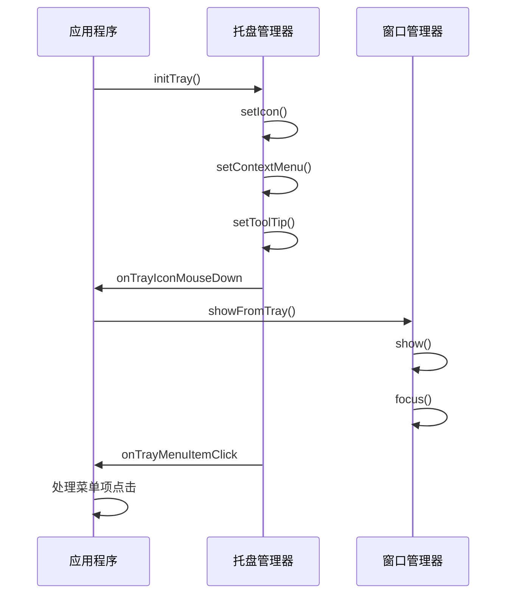
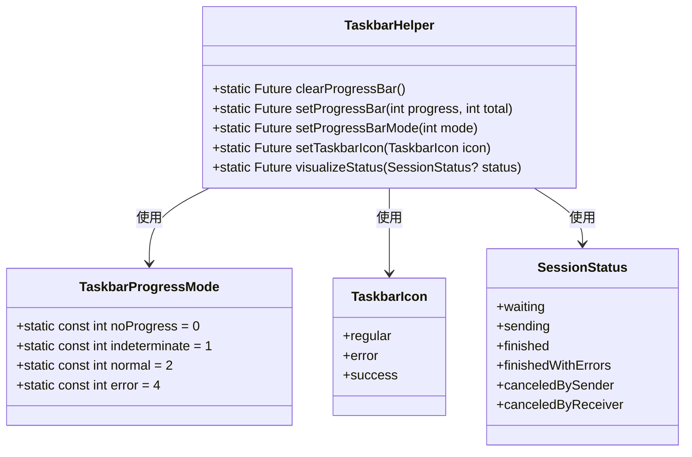
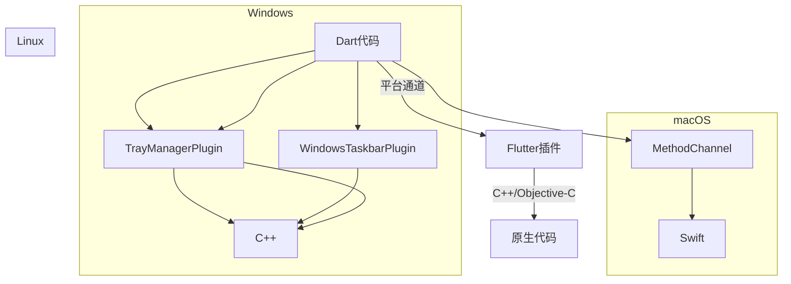
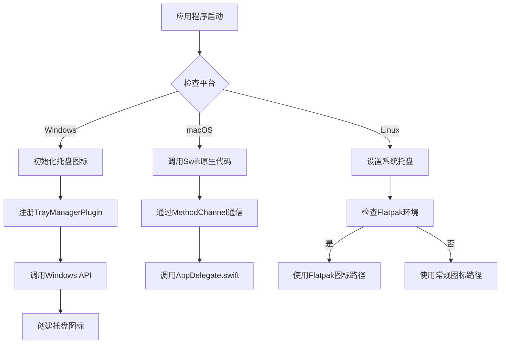
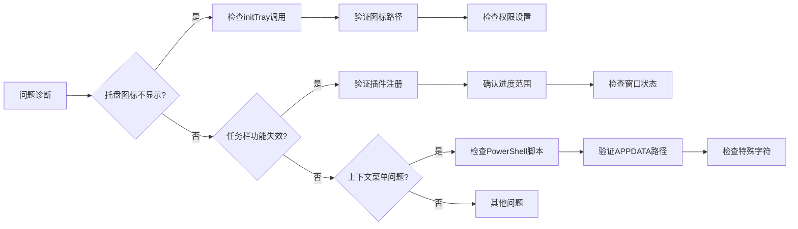

# 系统集成

<cite>
**本文档引用的文件**
- [tray_helper.dart](file://app/lib/util/native/tray_helper.dart)
- [taskbar_helper.dart](file://app/lib/util/native/taskbar_helper.dart)
- [tray_watcher.dart](file://app/lib/widget/watcher/tray_watcher.dart)
- [platform_check.dart](file://app/lib/util/native/platform_check.dart)
- [macos_channel.dart](file://app/lib/util/native/macos_channel.dart)
- [generated_plugin_registrant.cc](file://app/windows/flutter/generated_plugin_registrant.cc)
- [win32_window.cpp](file://app/windows/runner/win32_window.cpp)
- [win32_window.h](file://app/windows/runner/win32_window.h)
- [context_menu_helper.dart](file://app/lib/util/native/context_menu_helper.dart)
- [window_watcher.dart](file://app/lib/widget/watcher/window_watcher.dart)
- [progress_page.dart](file://app/lib/pages/progress_page.dart)
</cite>

## 目录
1. [系统托盘图标集成](#系统托盘图标集成)
2. [任务栏功能集成](#任务栏功能集成)
3. [平台通道通信机制](#平台通道通信机制)
4. [跨Windows版本兼容性](#跨windows版本兼容性)
5. [常见问题与调试](#常见问题与调试)

## 系统托盘图标集成

系统托盘图标的实现主要通过`tray_helper.dart`和`tray_watcher.dart`两个文件完成。`initTray()`函数负责初始化系统托盘，根据不同的操作系统平台设置相应的图标和上下文菜单。在Windows平台上，使用`Assets.img.logo`作为托盘图标；在Linux平台上，根据是否为Flatpak包来选择不同的图标路径。

托盘右键菜单包含"打开"和"关闭"两个选项，通过`TrayEntry`枚举定义菜单项。当用户点击菜单项时，`onTrayMenuItemClick`回调函数会根据菜单项的键值执行相应的操作，如显示窗口或退出应用。

**图示来源**
- [tray_helper.dart](file://app/lib/util/native/tray_helper.dart#L0-L95)
- [tray_watcher.dart](file://app/lib/widget/watcher/tray_watcher.dart#L0-L61)

**章节来源**
- [tray_helper.dart](file://app/lib/util/native/tray_helper.dart#L0-L95)
- [tray_watcher.dart](file://app/lib/widget/watcher/tray_watcher.dart#L0-L61)

## 任务栏功能集成

任务栏功能的集成通过`taskbar_helper.dart`文件实现，主要包含进度条、覆盖图标和状态可视化等功能。`TaskbarHelper`类提供了`setProgressBar`、`setProgressBarMode`和`visualizeStatus`等静态方法来控制任务栏的显示状态。

进度条功能通过`setProgressBar`方法实现，该方法会将实际的进度值缩放到0-100范围内，以适应Windows任务栏对32位整数的支持限制。`visualizeStatus`方法根据传输会话的状态（如等待、完成、出错等）自动更新任务栏的进度条模式和覆盖图标。

**图示来源**
- [taskbar_helper.dart](file://app/lib/util/native/taskbar_helper.dart#L0-L88)
- [common/model/session_status.dart](file://common/lib/model/session_status.dart)

**章节来源**
- [taskbar_helper.dart](file://app/lib/util/native/taskbar_helper.dart#L0-L88)

## 平台通道通信机制

Windows系统集成功能通过Flutter的平台通道与原生代码进行通信。在Windows平台上，`generated_plugin_registrant.cc`文件注册了多个插件，包括`TrayManagerPlugin`和`WindowsTaskbarPlugin`，这些插件为Dart代码提供了访问原生功能的接口。

对于macOS平台，通过`MethodChannel`与Swift原生代码通信。`macos_channel.dart`文件定义了多个异步方法，如`setupStatusBar`、`updateDockProgress`和`setDockIcon`，这些方法通过`main-delegate-channel`通道调用原生代码。

**图示来源**
- [generated_plugin_registrant.cc](file://app/windows/flutter/generated_plugin_registrant.cc#L0-L55)
- [macos_channel.dart](file://app/lib/util/native/macos_channel.dart#L0-L93)
- [win32_window.cpp](file://app/windows/runner/win32_window.cpp#L88-L128)

**章节来源**
- [generated_plugin_registrant.cc](file://app/windows/flutter/generated_plugin_registrant.cc#L0-L55)
- [macos_channel.dart](file://app/lib/util/native/macos_channel.dart#L0-L93)

## 跨Windows版本兼容性

系统托盘和任务栏功能在不同Windows版本（7、10、11）中的兼容性处理主要通过条件编译和运行时检查实现。`platform_check.dart`文件提供了`checkPlatform`和`checkPlatformHasTray`等工具函数，用于检测当前运行平台。

在Windows 7上，任务栏预览功能受限，但基本的进度条和覆盖图标功能仍然可用。Windows 10和11提供了更丰富的任务栏功能，包括缩略图预览和跳转列表。代码中通过检查`_isWindows`标志来确定是否启用Windows特定功能。

对于系统托盘图标，Windows平台使用`tray_manager`插件，该插件封装了底层的Windows API调用。`win32_window.cpp`文件中的`Win32Window`类负责创建和管理窗口，包括设置窗口图标和处理窗口事件。

**图示来源**
- [platform_check.dart](file://app/lib/util/native/platform_check.dart#L0-L61)
- [win32_window.cpp](file://app/windows/runner/win32_window.cpp#L88-L128)
- [win32_window.h](file://app/windows/runner/win32_window.h#L0-L45)

**章节来源**
- [platform_check.dart](file://app/lib/util/native/platform_check.dart#L0-L61)
- [win32_window.cpp](file://app/windows/runner/win32_window.cpp#L88-L128)

## 常见问题与调试

### 系统托盘图标不显示

当系统托盘图标不显示时，可能的原因包括：
1. 应用程序未正确初始化托盘管理器
2. 图标路径配置错误
3. 操作系统权限限制

解决方案：
- 确保`initTray()`函数被正确调用
- 检查图标文件路径是否正确
- 验证应用程序是否有足够的权限访问系统托盘

### 任务栏功能失效

任务栏功能失效的常见原因：
1. `WindowsTaskbarPlugin`未正确注册
2. 进度值超出有效范围
3. 窗口管理器状态异常

调试步骤：
1. 检查`generated_plugin_registrant.cc`中是否包含`WindowsTaskbarPluginRegisterWithRegistrar`
2. 验证传递给`setProgressBar`的进度值是否在0-100范围内
3. 确认窗口管理器是否正常工作

### 上下文菜单无法启用

在Windows系统中，上下文菜单通过PowerShell脚本创建快捷方式实现。如果上下文菜单无法启用，可能是因为：
1. PowerShell脚本执行失败
2. 目标路径权限不足
3. 应用程序路径包含特殊字符

解决方案：
- 检查`context_menu_helper.dart`中的PowerShell脚本是否正确
- 验证`APPDATA`环境变量是否可写
- 确保应用程序路径不包含特殊字符

**图示来源**
- [context_menu_helper.dart](file://app/lib/util/native/context_menu_helper.dart#L0-L64)
- [tray_helper.dart](file://app/lib/util/native/tray_helper.dart#L0-L95)
- [window_watcher.dart](file://app/lib/widget/watcher/window_watcher.dart#L89-L126)

**章节来源**
- [context_menu_helper.dart](file://app/lib/util/native/context_menu_helper.dart#L0-L64)
- [tray_helper.dart](file://app/lib/util/native/tray_helper.dart#L0-L95)
- [window_watcher.dart](file://app/lib/widget/watcher/window_watcher.dart#L89-L126)