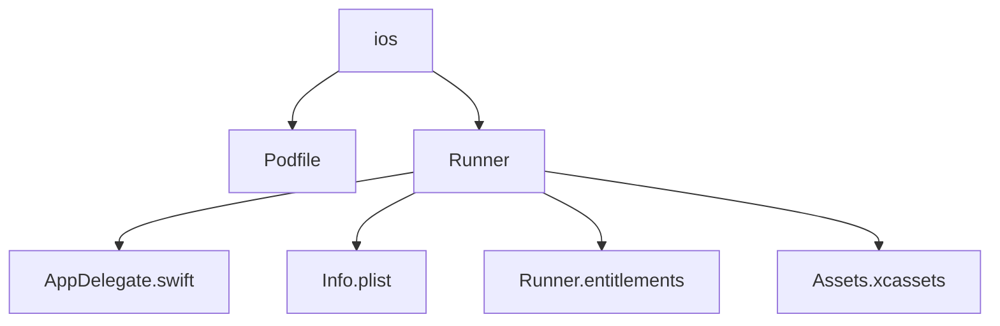
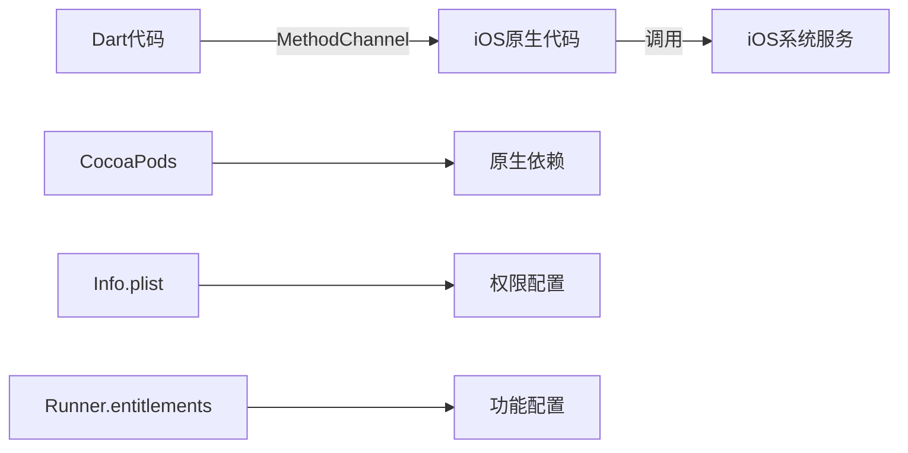
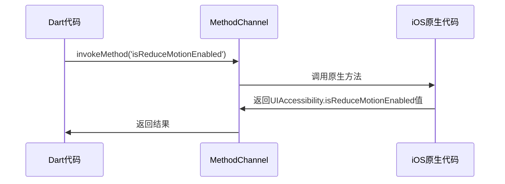
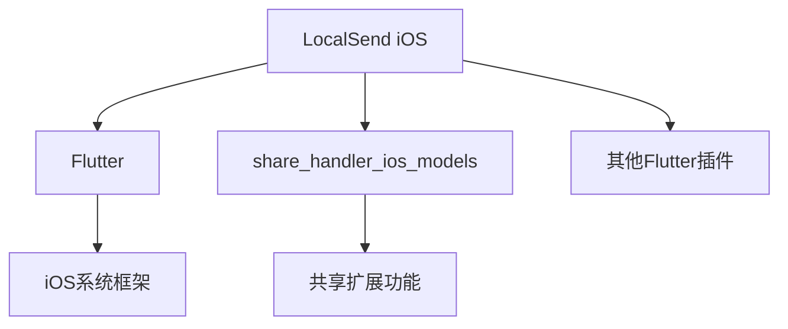

# iOS 实现

<cite>
**本文档引用的文件**
- [Podfile](file://app/ios/Podfile)
- [AppDelegate.swift](file://app/ios/Runner/AppDelegate.swift)
- [Info.plist](file://app/ios/Runner/Info.plist)
- [Runner.entitlements](file://app/ios/Runner/Runner.entitlements)
- [ios_channel.dart](file://app/lib/util/native/ios_channel.dart)
- [ios_network_permission_dialog.dart](file://app/lib/widget/dialogs/ios_network_permission_dialog.dart)
</cite>

## 目录
1. [简介](#简介)
2. [项目结构](#项目结构)
3. [核心组件](#核心组件)
4. [架构概述](#架构概述)
5. [详细组件分析](#详细组件分析)
6. [依赖分析](#依赖分析)
7. [性能考虑](#性能考虑)
8. [故障排除指南](#故障排除指南)
9. [结论](#结论)

## 简介
本文件详细说明了LocalSend应用在iOS平台上的实现。文档涵盖了CocoaPods依赖管理、Dart与iOS原生代码通信机制、iOS权限系统配置、iOS特有功能实现以及调试和发布指南。

## 项目结构
iOS项目位于`app/ios`目录下，遵循标准的Flutter iOS项目结构。项目包含Podfile用于依赖管理，Info.plist用于应用配置，以及Runner目录包含主要的iOS应用代码。



**图示来源**
- [Podfile](file://app/ios/Podfile)
- [AppDelegate.swift](file://app/ios/Runner/AppDelegate.swift)
- [Info.plist](file://app/ios/Runner/Info.plist)

## 核心组件
iOS实现的核心组件包括CocoaPods依赖管理、原生通信通道、权限系统和特有功能。这些组件共同确保应用在iOS平台上的正常运行和最佳用户体验。

**本节来源**
- [Podfile](file://app/ios/Podfile)
- [ios_channel.dart](file://app/lib/util/native/ios_channel.dart)
- [Info.plist](file://app/ios/Runner/Info.plist)

## 架构概述
LocalSend的iOS架构基于Flutter框架，通过MethodChannel实现Dart代码与原生iOS代码的通信。应用使用CocoaPods管理原生依赖，并通过Info.plist配置必要的权限和功能。



**图示来源**
- [ios_channel.dart](file://app/lib/util/native/ios_channel.dart)
- [AppDelegate.swift](file://app/ios/Runner/AppDelegate.swift)
- [Info.plist](file://app/ios/Runner/Info.plist)
- [Runner.entitlements](file://app/ios/Runner/Runner.entitlements)

## 详细组件分析

### CocoaPods依赖管理
Podfile配置了iOS项目的依赖管理，设置了iOS最低版本为12.0，并包含了Flutter工具的集成。文件还配置了共享扩展所需的依赖。

```ruby
platform :ios, '12.0'
ENV['COCOAPODS_DISABLE_STATS'] = 'true'

flutter_ios_podfile_setup

target 'Runner' do
  use_frameworks!
  use_modular_headers!
  flutter_install_all_ios_pods File.dirname(File.realpath(__FILE__))
  
  # share_handler addition start
  target 'ShareExtension' do
    inherit! :search_paths
    pod "share_handler_ios_models", :path => ".symlinks/plugins/share_handler_ios/ios/Models"
  end
  # share_handler addition end
end
```

**本节来源**
- [Podfile](file://app/ios/Podfile)

### Dart与iOS原生通信机制
通过`ios_channel.dart`文件实现Dart与iOS原生代码的通信。使用MethodChannel创建名为'ios-delegate-channel'的通信通道，允许Dart代码调用原生功能。



**图示来源**
- [ios_channel.dart](file://app/lib/util/native/ios_channel.dart)
- [AppDelegate.swift](file://app/ios/Runner/AppDelegate.swift)

**本节来源**
- [ios_channel.dart](file://app/lib/util/native/ios_channel.dart)
- [AppDelegate.swift](file://app/ios/Runner/AppDelegate.swift)

### iOS权限系统
iOS权限系统通过Info.plist文件配置，包括本地网络访问、照片库访问和位置信息访问等权限。这些权限对于应用的核心功能至关重要。

#### 网络访问权限配置
Info.plist中配置了本地网络使用描述和Bonjour服务，允许应用发现和连接同一网络中的其他设备。

```xml
<key>NSLocalNetworkUsageDescription</key>
<string>该应用使用本地网络来查找和连接附近的设备。</string>
<key>NSBonjourServices</key>
<array>
    <string>_http._tcp</string>
    <string>_bonjour._tcp</string>
    <string>_lnp._tcp.</string>
</array>
```

#### 运行时权限请求
应用在运行时请求必要的权限，用户可以在系统设置中管理这些权限。

**本节来源**
- [Info.plist](file://app/ios/Runner/Info.plist)

### iOS特有功能实现

#### 后台模式配置
通过Runner.entitlements文件配置了多播网络权限，允许应用在后台继续网络通信。

```xml
<key>com.apple.developer.networking.multicast</key>
<true/>
```

#### 状态栏图标显示
应用支持在状态栏显示图标，提高用户可见性。

#### 文件共享扩展
实现了文件共享扩展，允许用户从其他应用分享文件到LocalSend。

```xml
<key>CFBundleURLTypes</key>
<array>
    <dict>
        <key>CFBundleTypeRole</key>
        <string>Editor</string>
        <key>CFBundleURLSchemes</key>
        <array>
            <string>ShareMedia-$(PRODUCT_BUNDLE_IDENTIFIER)</string>
        </array>
    </dict>
</array>
```

**本节来源**
- [Info.plist](file://app/ios/Runner/Info.plist)
- [Runner.entitlements](file://app/ios/Runner/Runner.entitlements)

## 依赖分析
iOS项目的依赖通过CocoaPods管理，主要包括Flutter框架本身和各种功能插件。Podfile.lock文件记录了所有依赖的具体版本。



**图示来源**
- [Podfile](file://app/ios/Podfile)
- [Podfile.lock](file://app/ios/Podfile.lock)

**本节来源**
- [Podfile](file://app/ios/Podfile)
- [Podfile.lock](file://app/ios/Podfile.lock)

## 性能考虑
iOS实现考虑了多个性能方面，包括减少动画效果的选项、高效的网络通信和内存管理。通过原生通道调用可以减少不必要的开销，提高应用响应速度。

## 故障排除指南

### 网络权限对话框
当应用缺少本地网络权限时，会显示权限对话框引导用户前往设置。

```dart
class IosLocalNetworkDialog extends StatelessWidget {
  @override
  Widget build(BuildContext context) {
    return CustomBottomSheet(
      title: t.dialogs.localNetworkUnauthorized.title,
      description: t.dialogs.localNetworkUnauthorized.description,
      child: Row(
        mainAxisAlignment: MainAxisAlignment.spaceEvenly,
        children: [
          TextButton(
            onPressed: () => context.pop(),
            child: Text(t.general.close),
          ),
          ElevatedButton.icon(
            onPressed: () async => SystemSettings.app(),
            icon: const Icon(Icons.settings),
            label: Text(t.dialogs.localNetworkUnauthorized.gotoSettings),
          ),
        ],
      ),
    );
  }
}
```

### 后台任务处理问题
确保在Runner.entitlements中正确配置了多播网络权限，以避免后台网络通信中断。

**本节来源**
- [ios_network_permission_dialog.dart](file://app/lib/widget/dialogs/ios_network_permission_dialog.dart)
- [Runner.entitlements](file://app/ios/Runner/Runner.entitlements)

## 结论
LocalSend的iOS实现充分利用了Flutter框架的优势，同时通过原生集成提供了完整的iOS用户体验。通过合理的权限管理、高效的通信机制和特有功能实现，确保了应用在iOS平台上的稳定性和功能性。