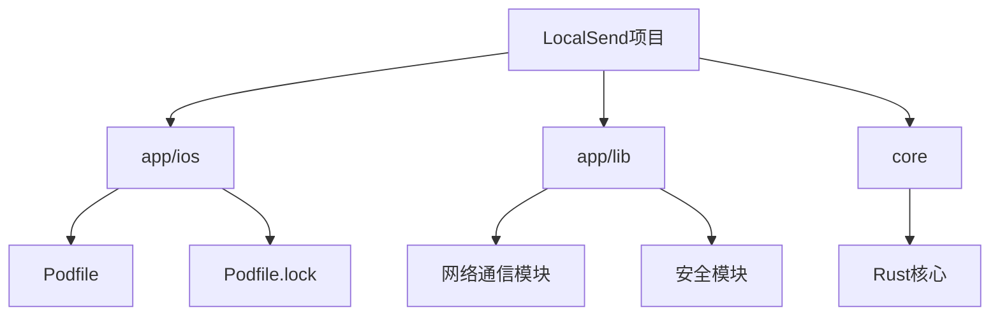
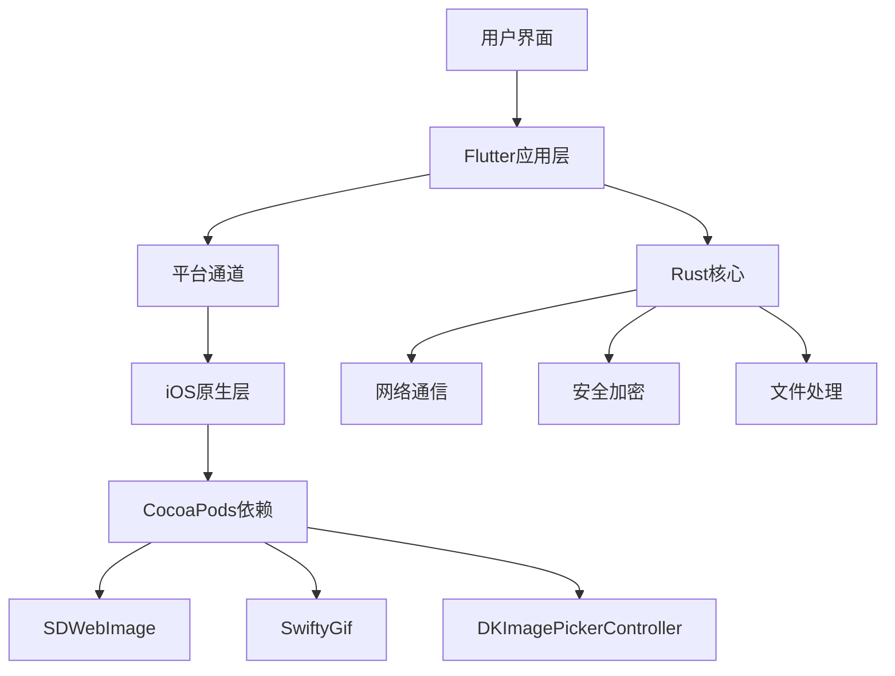
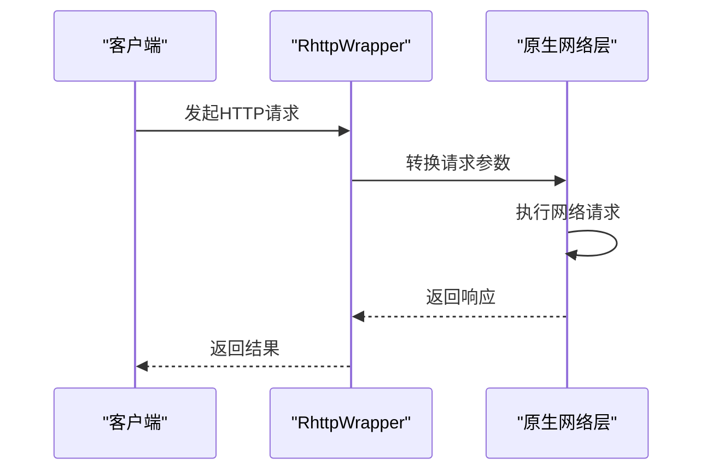
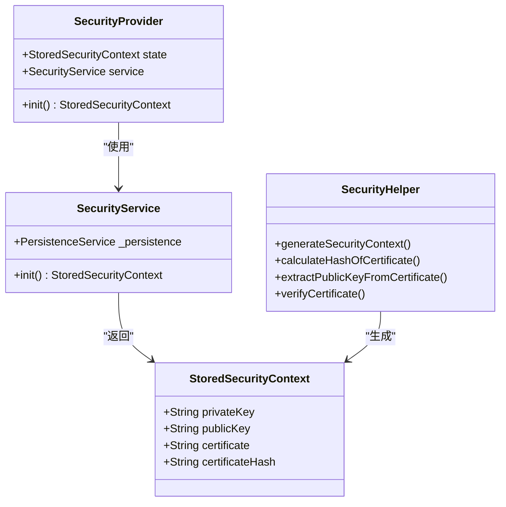
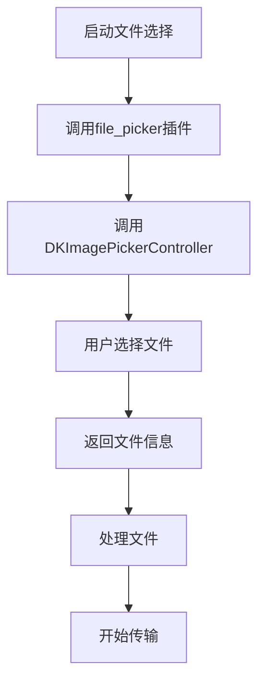
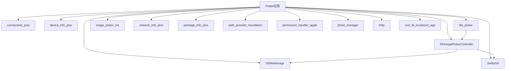

# 依赖管理

<cite>
**本文档中引用的文件**  
- [Podfile](file://app/ios/Podfile)
- [Podfile.lock](file://app/ios/Podfile.lock)
- [rhttp.dart](file://app/lib/util/rhttp.dart)
- [http_provider.dart](file://app/lib/provider/http_provider.dart)
- [security_provider.dart](file://app/lib/provider/security_provider.dart)
- [nearby_devices_provider.dart](file://app/lib/provider/network/nearby_devices_provider.dart)
- [server_provider.dart](file://app/lib/provider/server/server_provider.dart)
- [security_helper.dart](file://app/lib/util/security_helper.dart)
</cite>

## 目录
1. [简介](#简介)
2. [项目结构](#项目结构)
3. [核心组件](#核心组件)
4. [架构概述](#架构概述)
5. [详细组件分析](#详细组件分析)
6. [依赖分析](#依赖分析)
7. [性能考虑](#性能考虑)
8. [故障排除指南](#故障排除指南)
9. [结论](#结论)

## 简介
本文件详细分析了LocalSend项目中iOS平台的依赖管理机制，重点研究Podfile中的CocoaPods配置。文档解释了每个依赖库的作用，特别是与网络通信、安全传输和文件处理相关的库。详细说明了如何添加、更新和锁定iOS原生依赖，以及如何解决依赖冲突。提供了Podfile的最佳实践，包括版本控制策略和环境配置。结合项目实际配置，展示了依赖管理如何支持应用的核心功能，如本地网络发现和安全文件传输。

## 项目结构
LocalSend项目是一个跨平台文件共享应用，其iOS部分依赖于CocoaPods进行原生依赖管理。项目结构清晰地分离了平台特定代码和共享代码，iOS特定的依赖配置位于app/ios目录下。

**Diagram sources**
- [Podfile](file://app/ios/Podfile)
- [Podfile.lock](file://app/ios/Podfile.lock)

**Section sources**
- [Podfile](file://app/ios/Podfile)
- [Podfile.lock](file://app/ios/Podfile.lock)

## 核心组件
本项目的核心组件包括网络通信、安全传输和文件处理模块。这些组件通过精心设计的依赖管理机制协同工作，实现了跨平台文件共享功能。iOS平台的依赖通过CocoaPods管理，确保了原生功能的稳定性和性能。

**Section sources**
- [rhttp.dart](file://app/lib/util/rhttp.dart)
- [http_provider.dart](file://app/lib/provider/http_provider.dart)
- [security_provider.dart](file://app/lib/provider/security_provider.dart)

## 架构概述
LocalSend的架构采用分层设计，将UI、业务逻辑和底层网络通信分离。iOS平台通过CocoaPods集成必要的原生库，同时利用Flutter插件机制与Dart代码进行交互。网络通信层使用自定义的rhttp库，基于Rust实现，确保了跨平台的一致性和高性能。

**Diagram sources**
- [Podfile](file://app/ios/Podfile)
- [rhttp.dart](file://app/lib/util/rhttp.dart)

## 详细组件分析

### 网络通信组件分析
LocalSend的网络通信组件基于rhttp库实现，该库提供了HTTP/HTTPS客户端功能，支持流式传输和进度报告。通过CocoaPods集成的底层网络库确保了iOS平台的高性能网络通信。

#### 网络通信流程

**Diagram sources**
- [rhttp.dart](file://app/lib/util/rhttp.dart)
- [http_provider.dart](file://app/lib/provider/http_provider.dart)

### 安全传输组件分析
安全传输组件负责管理HTTPS通信所需的安全上下文，包括证书生成、验证和存储。通过CocoaPods集成的安全相关库确保了iOS平台的安全性。

#### 安全上下文管理

**Diagram sources**
- [security_provider.dart](file://app/lib/provider/security_provider.dart)
- [security_helper.dart](file://app/lib/util/security_helper.dart)

### 文件处理组件分析
文件处理组件负责文件选择、预览和传输。通过CocoaPods集成的DKImagePickerController和SDWebImage等库提供了强大的文件处理能力。

#### 文件选择流程

**Diagram sources**
- [Podfile](file://app/ios/Podfile)
- [nearby_devices_provider.dart](file://app/lib/provider/network/nearby_devices_provider.dart)

**Section sources**
- [Podfile](file://app/ios/Podfile)
- [nearby_devices_provider.dart](file://app/lib/provider/network/nearby_devices_provider.dart)
- [server_provider.dart](file://app/lib/provider/server/server_provider.dart)

## 依赖分析
LocalSend项目的iOS依赖通过CocoaPods进行管理，主要依赖包括网络通信、图像处理和文件选择等库。这些依赖在Podfile中定义，并通过Podfile.lock锁定版本，确保了构建的一致性。

**Diagram sources**
- [Podfile.lock](file://app/ios/Podfile.lock)
- [Podfile](file://app/ios/Podfile)

**Section sources**
- [Podfile.lock](file://app/ios/Podfile.lock)
- [Podfile](file://app/ios/Podfile)

## 性能考虑
在依赖管理方面，LocalSend项目通过以下方式优化性能：
1. 使用Podfile.lock锁定依赖版本，避免每次构建时解析依赖
2. 通过CocoaPods的use_frameworks!和use_modular_headers!优化编译性能
3. 选择轻量级的原生库，减少应用体积
4. 使用Rust实现核心网络通信，提高执行效率

## 故障排除指南
在管理iOS依赖时可能遇到的常见问题及解决方案：

**Section sources**
- [Podfile](file://app/ios/Podfile)
- [Podfile.lock](file://app/ios/Podfile.lock)
- [rhttp.dart](file://app/lib/util/rhttp.dart)

## 结论
LocalSend项目通过精心设计的依赖管理机制，成功实现了跨平台文件共享功能。iOS平台的依赖通过CocoaPods进行管理，确保了原生功能的稳定性和性能。通过分析Podfile配置和相关代码，我们可以看到项目如何有效地整合网络通信、安全传输和文件处理等关键功能，为用户提供安全、高效的文件共享体验。