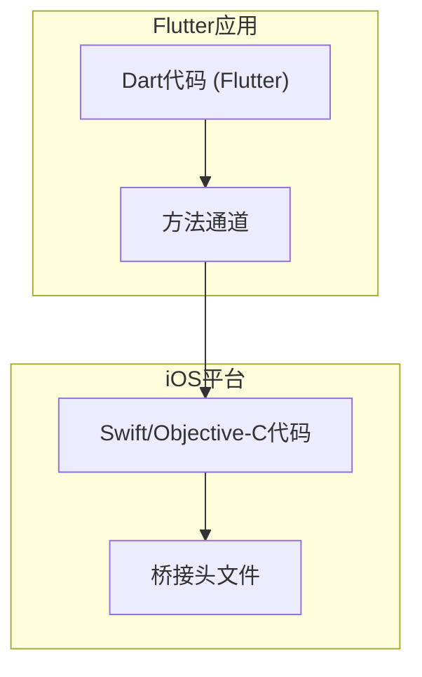
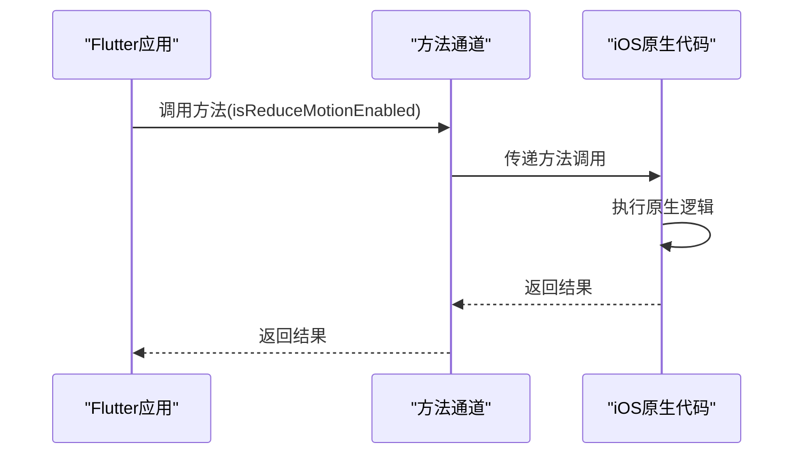
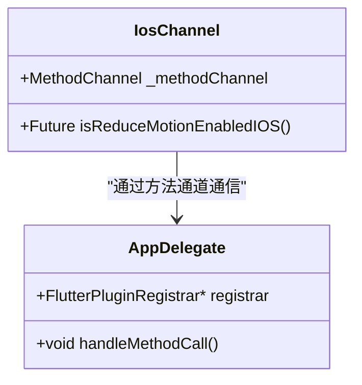
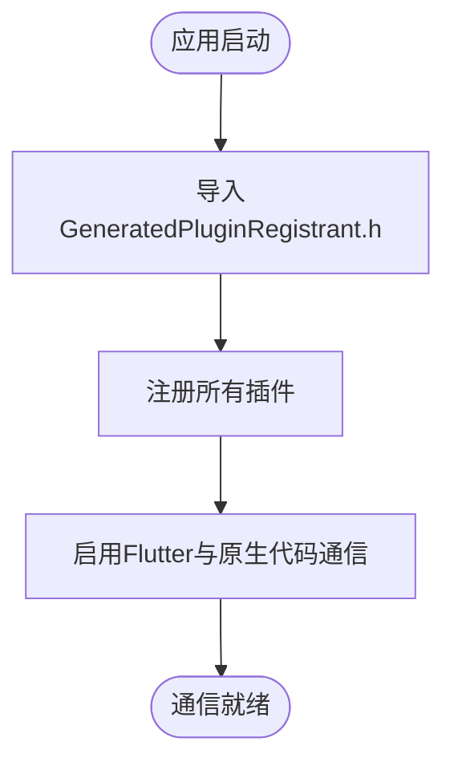
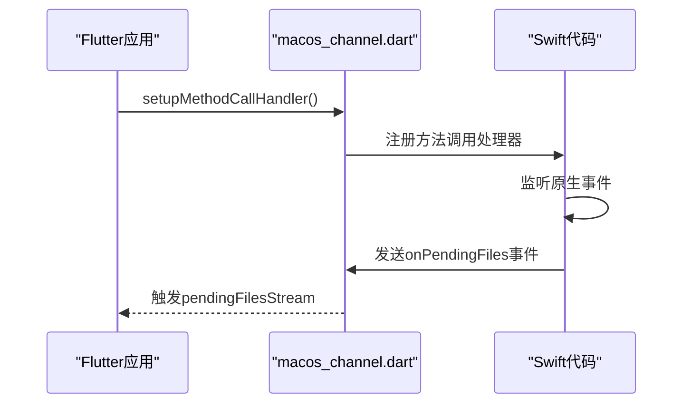
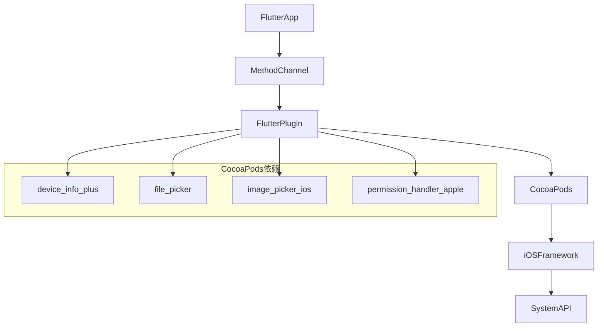

# 原生通信机制

<cite>
**本文档引用的文件**
- [ios_channel.dart](file://app/lib/util/native/ios_channel.dart)
- [Runner-Bridging-Header.h](file://app/ios/Runner/Runner-Bridging-Header.h)
- [AppDelegate.swift](file://app/ios/Runner/AppDelegate.swift)
- [macos_channel.dart](file://app/lib/util/native/macos_channel.dart)
- [MainFlutterWindow.swift](file://app/macos/Runner/MainFlutterWindow.swift)
- [Shared.swift](file://app/macos/Runner/Shared.swift)
</cite>

## 目录
1. [简介](#简介)
2. [项目结构](#项目结构)
3. [核心组件](#核心组件)
4. [架构概述](#架构概述)
5. [详细组件分析](#详细组件分析)
6. [依赖分析](#依赖分析)
7. [性能考虑](#性能考虑)
8. [故障排除指南](#故障排除指南)
9. [结论](#结论)

## 简介
本文件详细记录了LocalSend应用中Dart与iOS原生代码之间的通信机制。重点分析了方法通道（Method Channel）如何实现跨平台调用，包括数据序列化和错误处理。文档还描述了Runner-Bridging-Header.h在Swift/Objective-C与Flutter集成中的桥梁作用，并提供了文件操作、设备信息获取等场景下的通信流程示例。同时，文档说明了通信的安全考虑和性能优化策略。

## 项目结构
LocalSend项目的结构清晰地分离了平台特定代码和共享代码。iOS相关的原生代码位于`app/ios`目录下，包含Swift实现和桥接头文件。Dart代码中的平台通信逻辑主要位于`app/lib/util/native`目录下，其中`ios_channel.dart`和`macos_channel.dart`文件定义了与iOS和macOS原生代码的通信接口。

**图示来源**
- [ios_channel.dart](file://app/lib/util/native/ios_channel.dart)
- [Runner-Bridging-Header.h](file://app/ios/Runner/Runner-Bridging-Header.h)

**章节来源**
- [ios_channel.dart](file://app/lib/util/native/ios_channel.dart)
- [Runner-Bridging-Header.h](file://app/ios/Runner/Runner-Bridging-Header.h)

## 核心组件
本项目的核心通信组件包括Dart侧的方法通道定义和iOS侧的原生实现。`ios_channel.dart`文件定义了与iOS平台通信的方法通道，而`AppDelegate.swift`文件则实现了相应的原生功能。通过`Runner-Bridging-Header.h`文件，Swift代码能够与Flutter框架进行互操作。

**章节来源**
- [ios_channel.dart](file://app/lib/util/native/ios_channel.dart)
- [AppDelegate.swift](file://app/ios/Runner/AppDelegate.swift)

## 架构概述
LocalSend应用的原生通信架构基于Flutter的方法通道机制，实现了Dart代码与iOS原生代码的双向通信。该架构允许Flutter应用调用iOS平台特有的功能，如访问系统设置、处理文件共享等。

**图示来源**
- [ios_channel.dart](file://app/lib/util/native/ios_channel.dart)
- [AppDelegate.swift](file://app/ios/Runner/AppDelegate.swift)

## 详细组件分析

### iOS通信通道分析
`ios_channel.dart`文件定义了一个名为`ios-delegate-channel`的方法通道，用于与iOS原生代码通信。该文件中的`isReduceMotionEnabledIOS`函数通过方法通道调用iOS原生代码，查询系统是否启用了减少运动效果的辅助功能设置。

**图示来源**
- [ios_channel.dart](file://app/lib/util/native/ios_channel.dart)
- [AppDelegate.swift](file://app/ios/Runner/AppDelegate.swift)

### 桥接头文件作用分析
`Runner-Bridging-Header.h`文件是Swift与Flutter集成的关键组件。它通过导入`GeneratedPluginRegistrant.h`头文件，使Swift代码能够访问Flutter插件注册机制。这个桥接头文件允许Swift代码与Objective-C API进行互操作，从而实现Flutter应用与iOS原生功能的集成。

**图示来源**
- [Runner-Bridging-Header.h](file://app/ios/Runner/Runner-Bridging-Header.h)

### macOS通信机制分析
虽然重点是iOS通信，但项目也包含了macOS的通信实现。`macos_channel.dart`文件定义了`main-delegate-channel`方法通道，用于与macOS原生代码通信。该实现支持更多功能，如设置Dock图标、处理菜单栏交互和管理启动项。

**图示来源**
- [macos_channel.dart](file://app/lib/util/native/macos_channel.dart)
- [Shared.swift](file://app/macos/Runner/Shared.swift)

**章节来源**
- [macos_channel.dart](file://app/lib/util/native/macos_channel.dart)
- [MainFlutterWindow.swift](file://app/macos/Runner/MainFlutterWindow.swift)

## 依赖分析
项目的原生通信功能依赖于多个Flutter插件和原生框架。通过Podfile文件可以看出，项目集成了`device_info_plus`、`file_picker`、`image_picker_ios`等插件，这些插件通过CocoaPods进行管理。`Runner-Bridging-Header.h`文件的存在表明项目使用了Swift与Objective-C的互操作性来实现Flutter插件的集成。

**图示来源**
- [Podfile](file://app/ios/Podfile)
- [Runner-Bridging-Header.h](file://app/ios/Runner/Runner-Bridging-Header.h)

**章节来源**
- [Podfile](file://app/ios/Podfile)
- [Podfile.lock](file://app/ios/Podfile.lock)

## 性能考虑
在实现Dart与iOS原生代码通信时，需要考虑性能影响。方法通道的调用涉及跨平台序列化和反序列化，这会带来一定的性能开销。对于频繁的通信场景，应考虑批量处理请求或使用更高效的通信机制。此外，原生代码的执行时间也会影响UI响应性，因此耗时的操作应在后台线程中执行。

## 故障排除指南
当遇到原生通信问题时，可以按照以下步骤进行排查：
1. 确认`Runner-Bridging-Header.h`文件存在且正确配置
2. 检查方法通道名称是否匹配
3. 验证原生代码中的方法调用处理器是否正确注册
4. 检查iOS权限设置是否允许应用访问所需功能
5. 查看Xcode控制台日志以获取详细的错误信息

**章节来源**
- [ios_channel.dart](file://app/lib/util/native/ios_channel.dart)
- [AppDelegate.swift](file://app/ios/Runner/AppDelegate.swift)

## 结论
LocalSend应用通过Flutter的方法通道机制实现了Dart代码与iOS原生代码的有效通信。`ios_channel.dart`文件定义了清晰的通信接口，而`Runner-Bridging-Header.h`文件则提供了Swift与Flutter集成的桥梁。这种架构允许应用充分利用iOS平台的原生功能，同时保持了跨平台代码的可维护性。通过合理的设计和实现，项目成功地平衡了功能需求和代码复杂性。