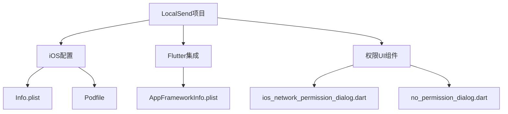
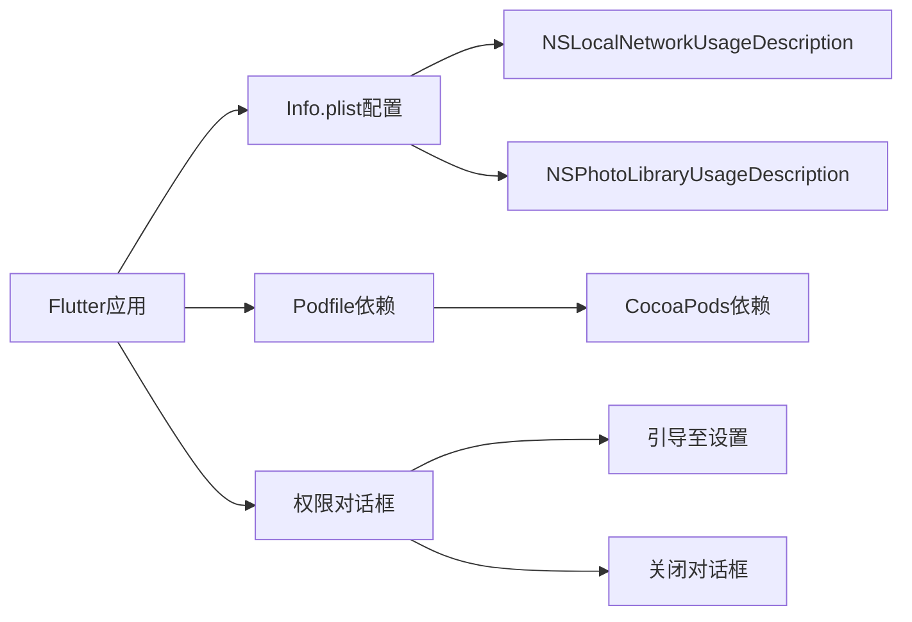
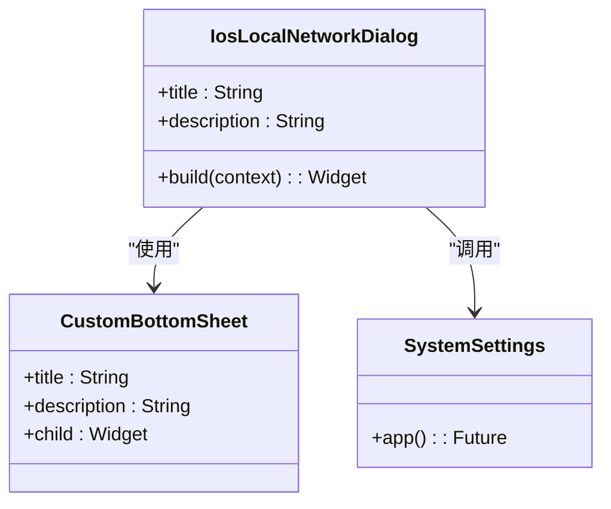
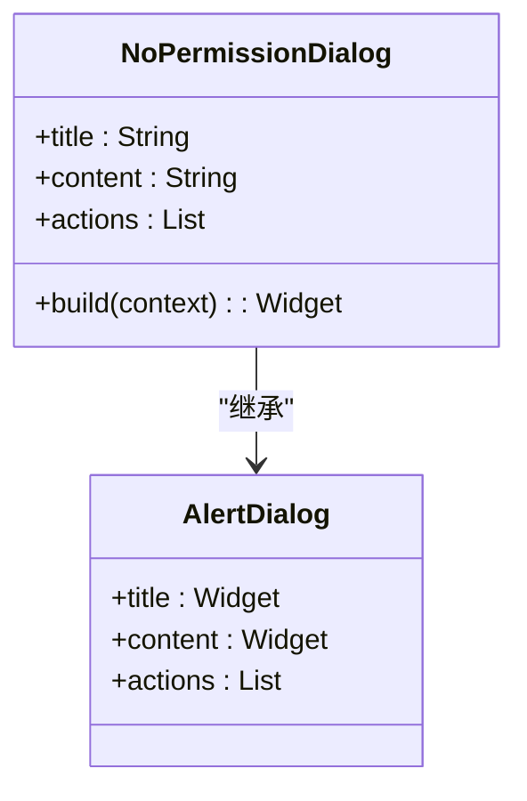
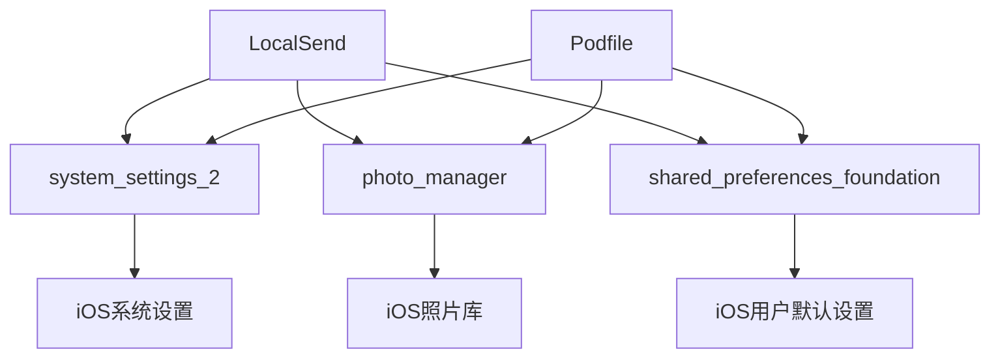
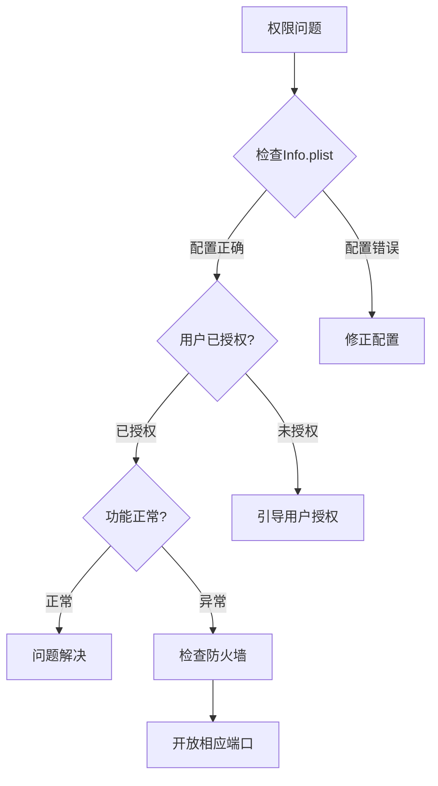

# 权限与配置

<cite>
**本文档引用的文件**  
- [Info.plist](file://app/ios/Runner/Info.plist)
- [AppFrameworkInfo.plist](file://app/ios/Flutter/AppFrameworkInfo.plist)
- [ios_network_permission_dialog.dart](file://app/lib/widget/dialogs/ios_network_permission_dialog.dart)
- [troubleshoot_page.dart](file://app/lib/pages/troubleshoot_page.dart)
- [discovery_logs_provider.dart](file://app/lib/provider/logging/discovery_logs_provider.dart)
- [Podfile](file://app/ios/Podfile)
</cite>

## 目录
1. [简介](#简介)
2. [项目结构](#项目结构)
3. [核心组件](#核心组件)
4. [架构概述](#架构概述)
5. [详细组件分析](#详细组件分析)
6. [依赖分析](#依赖分析)
7. [性能考虑](#性能考虑)
8. [故障排除指南](#故障排除指南)
9. [结论](#结论)

## 简介
本文档全面记录了iOS平台的权限配置要求，重点解释LocalSend应用在iOS系统中的权限配置、用户界面最佳实践以及调试技巧。文档详细说明了Info.plist中网络访问、文件共享等关键权限的配置方法，分析了AppFrameworkInfo.plist在Flutter框架集成中的作用，并提供了处理权限拒绝的应对策略。

## 项目结构
LocalSend项目是一个跨平台应用，包含iOS、macOS、Android等多个平台的实现。iOS相关的配置文件主要位于app/ios目录下，包括Info.plist、Podfile等关键文件。Flutter框架的集成通过AppFrameworkInfo.plist实现，而权限相关的UI组件则分布在lib/widget/dialogs等目录中。

**图源**  
- [Info.plist](file://app/ios/Runner/Info.plist)
- [AppFrameworkInfo.plist](file://app/ios/Flutter/AppFrameworkInfo.plist)
- [ios_network_permission_dialog.dart](file://app/lib/widget/dialogs/ios_network_permission_dialog.dart)

**本节来源**  
- [Info.plist](file://app/ios/Runner/Info.plist)
- [AppFrameworkInfo.plist](file://app/ios/Flutter/AppFrameworkInfo.plist)

## 核心组件
本项目的核心组件包括iOS权限配置系统、网络发现机制和用户界面反馈系统。Info.plist文件中的NSLocalNetworkUsageDescription键值对是实现本地网络发现功能的关键配置，而AppFrameworkInfo.plist则确保了Flutter框架在iOS平台的正确集成。

**本节来源**  
- [Info.plist](file://app/ios/Runner/Info.plist)
- [AppFrameworkInfo.plist](file://app/ios/Flutter/AppFrameworkInfo.plist)

## 架构概述
LocalSend的iOS权限架构基于Flutter框架，通过原生iOS配置文件与Flutter插件的协同工作实现。应用使用system_settings_2插件引导用户到系统设置页面，同时通过自定义对话框提供清晰的权限请求说明。

**图源**  
- [Info.plist](file://app/ios/Runner/Info.plist)
- [Podfile](file://app/ios/Podfile)
- [ios_network_permission_dialog.dart](file://app/lib/widget/dialogs/ios_network_permission_dialog.dart)

## 详细组件分析

### iOS网络权限对话框分析
当用户拒绝本地网络权限时，应用会显示IosLocalNetworkDialog对话框，提供"关闭"和"前往设置"两个选项。该对话框使用CustomBottomSheet样式，通过system_settings_2插件的SystemSettings.app()方法直接跳转到应用设置页面。

**图源**  
- [ios_network_permission_dialog.dart](file://app/lib/widget/dialogs/ios_network_permission_dialog.dart)

**本节来源**  
- [ios_network_permission_dialog.dart](file://app/lib/widget/dialogs/ios_network_permission_dialog.dart)

### 通用权限拒绝处理
对于其他类型的权限拒绝，应用使用NoPermissionDialog进行统一处理。该对话框采用标准的AlertDialog样式，仅提供"关闭"选项，适用于存储权限等场景。

**图源**  
- [no_permission_dialog.dart](file://app/lib/widget/dialogs/no_permission_dialog.dart)

**本节来源**  
- [no_permission_dialog.dart](file://app/lib/widget/dialogs/no_permission_dialog.dart)

## 依赖分析
LocalSend的iOS权限功能依赖于多个Flutter插件和原生配置。CocoaPods通过Podfile管理原生依赖，而Flutter插件如system_settings_2则提供了访问系统设置的能力。

**图源**  
- [Podfile](file://app/ios/Podfile)
- [Podfile.lock](file://app/ios/Podfile.lock)

**本节来源**  
- [Podfile](file://app/ios/Podfile)
- [Podfile.lock](file://app/ios/Podfile.lock)

## 性能考虑
权限请求和网络发现功能对应用性能有重要影响。建议在应用启动时异步检查权限状态，避免阻塞主线程。对于网络发现，应合理设置超时时间，平衡发现速度和电池消耗。

## 故障排除指南
当遇到权限相关问题时，可参考以下步骤进行排查：

1. 检查Info.plist中的权限描述是否准确
2. 确认用户已在系统设置中授予相应权限
3. 使用调试页面查看网络发现日志
4. 检查防火墙设置是否阻止了应用通信

**图源**  
- [troubleshoot_page.dart](file://app/lib/pages/troubleshoot_page.dart)
- [discovery_logs_provider.dart](file://app/lib/provider/logging/discovery_logs_provider.dart)

**本节来源**  
- [troubleshoot_page.dart](file://app/lib/pages/troubleshoot_page.dart)
- [discovery_logs_provider.dart](file://app/lib/provider/logging/discovery_logs_provider.dart)

## 结论
LocalSend通过合理的权限配置和用户友好的界面设计，实现了iOS平台上的高效文件传输功能。开发者应重点关注Info.plist中的权限描述配置，确保为用户提供清晰的权限使用说明。同时，通过完善的错误处理和调试工具，可以有效提升用户体验和应用稳定性。