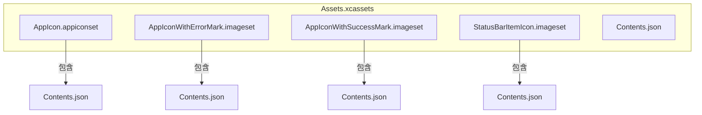
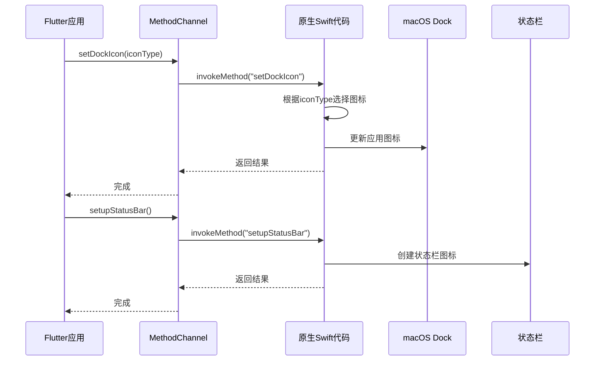
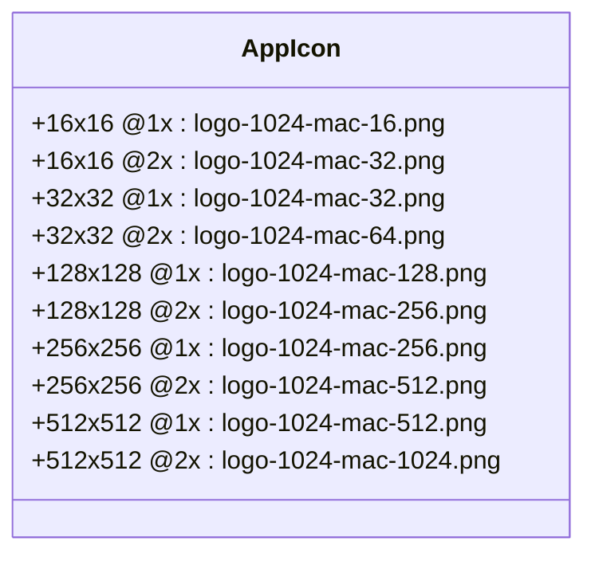
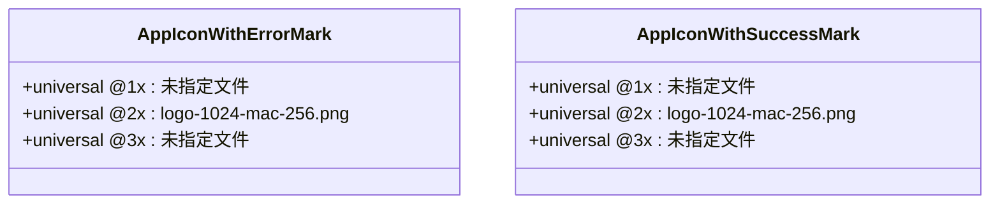
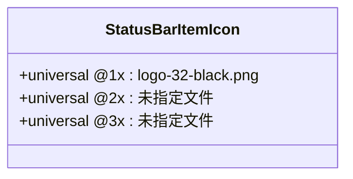
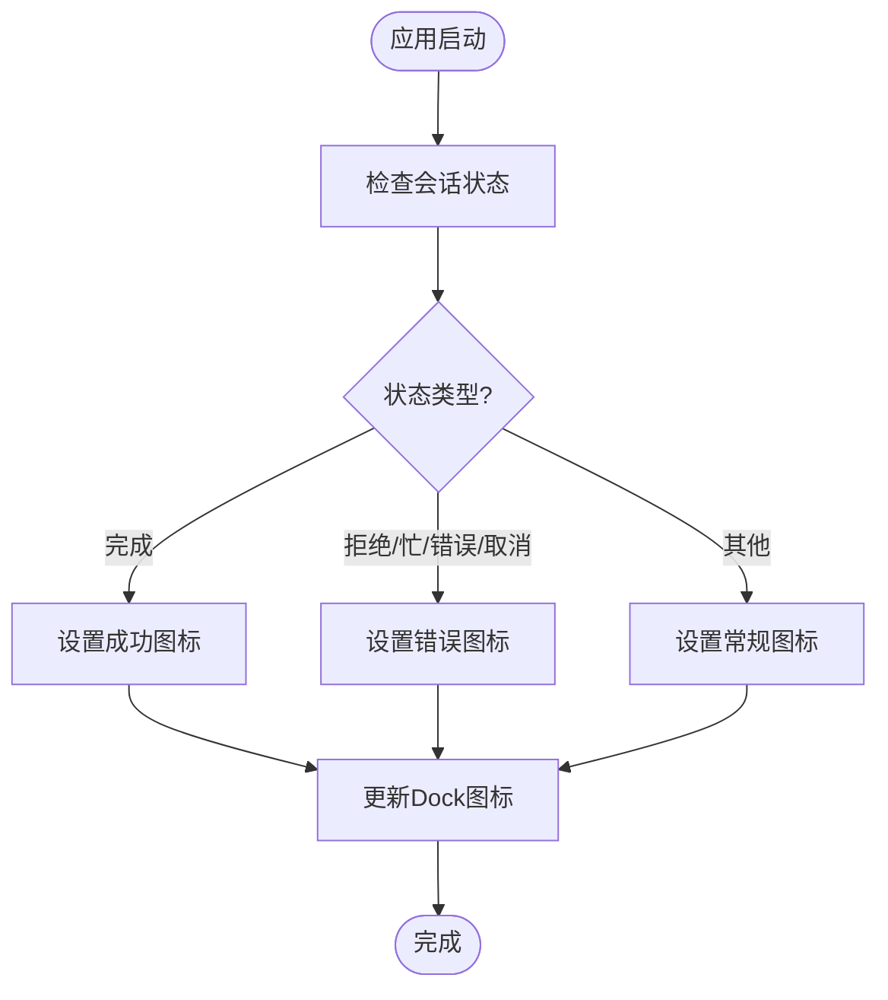
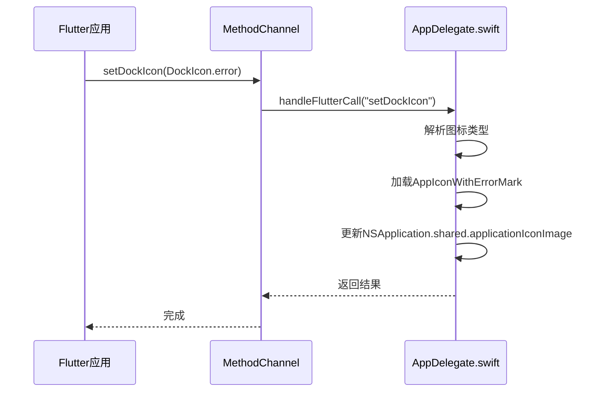
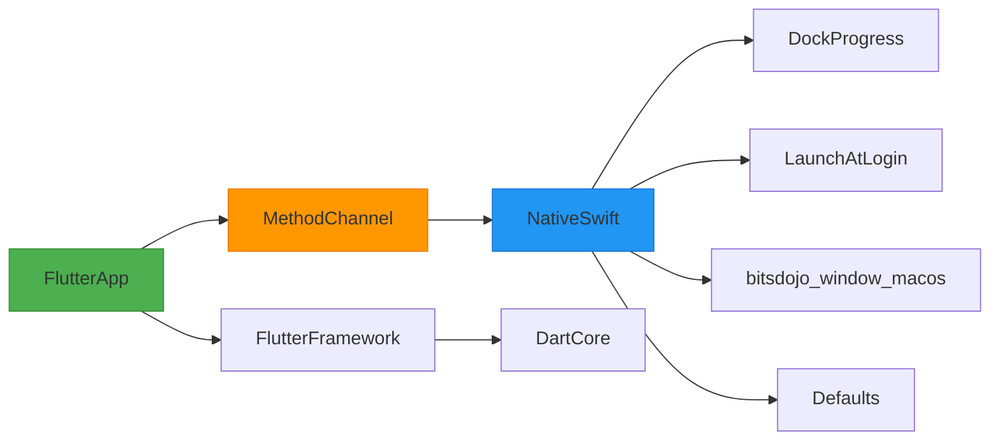

# macOS UI 资源配置

<cite>
**本文档引用的文件**  
- [AppIcon.appiconset/Contents.json](file://app/macos/Runner/Assets.xcassets/AppIcon.appiconset/Contents.json)
- [AppIconWithErrorMark.imageset/Contents.json](file://app/macos/Runner/Assets.xcassets/AppIconWithErrorMark.imageset/Contents.json)
- [AppIconWithSuccessMark.imageset/Contents.json](file://app/macos/Runner/Assets.xcassets/AppIconWithSuccessMark.imageset/Contents.json)
- [StatusBarItemIcon.imageset/Contents.json](file://app/macos/Runner/Assets.xcassets/StatusBarItemIcon.imageset/Contents.json)
- [Contents.json](file://app/macos/Runner/Assets.xcassets/Contents.json)
- [macos_channel.dart](file://app/lib/util/native/macos_channel.dart)
- [taskbar_helper.dart](file://app/lib/util/native/taskbar_helper.dart)
- [AppDelegate.swift](file://app/macos/Runner/AppDelegate.swift)
</cite>

## 目录
1. [简介](#简介)
2. [项目结构](#项目结构)
3. [核心组件](#核心组件)
4. [架构概述](#架构概述)
5. [详细组件分析](#详细组件分析)
6. [依赖分析](#依赖分析)
7. [性能考虑](#性能考虑)
8. [故障排除指南](#故障排除指南)
9. [结论](#结论)

## 简介
本文件详细说明了 LocalSend 应用在 macOS 平台上的 UI 资源配置，重点介绍 Assets.xcassets 中的应用图标（AppIcon）和状态栏图标（StatusBarItemIcon）的配置。文档解释了不同图标集（正常、带错误标记、带成功标记）的用途和切换逻辑，说明了 Contents.json 文件中定义的图标尺寸规格及其在不同 macOS 界面（Dock、Finder、应用切换器）中的显示效果。同时提供图标设计规范和替换指南，确保符合 Apple Human Interface Guidelines，并包含常见问题如图标不显示或模糊的解决方案。

## 项目结构
LocalSend 项目的 macOS UI 资源主要位于 `app/macos/Runner/Assets.xcassets` 目录下，该目录包含了应用图标、状态栏图标以及其他相关资源。Assets.xcassets 是 Xcode 使用的资源目录，用于管理应用的各种图像资源。

**图示来源**
- [AppIcon.appiconset/Contents.json](file://app/macos/Runner/Assets.xcassets/AppIcon.appiconset/Contents.json)
- [AppIconWithErrorMark.imageset/Contents.json](file://app/macos/Runner/Assets.xcassets/AppIconWithErrorMark.imageset/Contents.json)
- [AppIconWithSuccessMark.imageset/Contents.json](file://app/macos/Runner/Assets.xcassets/AppIconWithSuccessMark.imageset/Contents.json)
- [StatusBarItemIcon.imageset/Contents.json](file://app/macos/Runner/Assets.xcassets/StatusBarItemIcon.imageset/Contents.json)

**本节来源**
- [AppIcon.appiconset/Contents.json](file://app/macos/Runner/Assets.xcassets/AppIcon.appiconset/Contents.json)
- [AppIconWithErrorMark.imageset/Contents.json](file://app/macos/Runner/Assets.xcassets/AppIconWithErrorMark.imageset/Contents.json)
- [AppIconWithSuccessMark.imageset/Contents.json](file://app/macos/Runner/Assets.xcassets/AppIconWithSuccessMark.imageset/Contents.json)
- [StatusBarItemIcon.imageset/Contents.json](file://app/macos/Runner/Assets.xcassets/StatusBarItemIcon.imageset/Contents.json)

## 核心组件
macOS UI 资源的核心组件包括应用图标（AppIcon）、带错误标记的应用图标（AppIconWithErrorMark）、带成功标记的应用图标（AppIconWithSuccessMark）以及状态栏图标（StatusBarItemIcon）。这些图标通过 Contents.json 文件进行配置，定义了不同尺寸和分辨率的图标文件。

**本节来源**
- [AppIcon.appiconset/Contents.json](file://app/macos/Runner/Assets.xcassets/AppIcon.appiconset/Contents.json)
- [AppIconWithErrorMark.imageset/Contents.json](file://app/macos/Runner/Assets.xcassets/AppIconWithErrorMark.imageset/Contents.json)
- [AppIconWithSuccessMark.imageset/Contents.json](file://app/macos/Runner/Assets.xcassets/AppIconWithSuccessMark.imageset/Contents.json)
- [StatusBarItemIcon.imageset/Contents.json](file://app/macos/Runner/Assets.xcassets/StatusBarItemIcon.imageset/Contents.json)

## 架构概述
LocalSend 在 macOS 上的 UI 资源管理采用了标准的 Xcode Assets Catalog 结构。应用通过 Flutter 与原生 macOS 代码（Swift）进行通信，实现图标切换和状态更新。Flutter 端通过 MethodChannel 调用原生方法，原生代码则负责更新 Dock 图标和状态栏图标。

**图示来源**
- [macos_channel.dart](file://app/lib/util/native/macos_channel.dart)
- [AppDelegate.swift](file://app/macos/Runner/AppDelegate.swift)

## 详细组件分析

### 应用图标配置分析
LocalSend 的应用图标配置遵循 Apple 的 Human Interface Guidelines，提供了多种尺寸和分辨率的图标以适应不同的显示环境。

#### 应用图标（AppIcon）
应用图标配置文件定义了从 16x16 到 512x512 的多种尺寸，每种尺寸都有 @1x 和 @2x 两种分辨率版本，以支持普通屏幕和 Retina 显示屏。

**图示来源**
- [AppIcon.appiconset/Contents.json](file://app/macos/Runner/Assets.xcassets/AppIcon.appiconset/Contents.json)

#### 状态指示图标
应用提供了两种状态指示图标：带错误标记的图标和带成功标记的图标，用于在特定状态下更新 Dock 中的应用图标。

**图示来源**
- [AppIconWithErrorMark.imageset/Contents.json](file://app/macos/Runner/Assets.xcassets/AppIconWithErrorMark.imageset/Contents.json)
- [AppIconWithSuccessMark.imageset/Contents.json](file://app/macos/Runner/Assets.xcassets/AppIconWithSuccessMark.imageset/Contents.json)

#### 状态栏图标
状态栏图标用于在 macOS 菜单栏中显示应用图标，用户可以通过点击图标与应用交互。

**图示来源**
- [StatusBarItemIcon.imageset/Contents.json](file://app/macos/Runner/Assets.xcassets/StatusBarItemIcon.imageset/Contents.json)

**本节来源**
- [AppIcon.appiconset/Contents.json](file://app/macos/Runner/Assets.xcassets/AppIcon.appiconset/Contents.json)
- [AppIconWithErrorMark.imageset/Contents.json](file://app/macos/Runner/Assets.xcassets/AppIconWithErrorMark.imageset/Contents.json)
- [AppIconWithSuccessMark.imageset/Contents.json](file://app/macos/Runner/Assets.xcassets/AppIconWithSuccessMark.imageset/Contents.json)
- [StatusBarItemIcon.imageset/Contents.json](file://app/macos/Runner/Assets.xcassets/StatusBarItemIcon.imageset/Contents.json)

### 图标切换逻辑分析
应用通过 Flutter 与原生代码的通信机制实现图标的动态切换。当应用状态发生变化时，Flutter 端会调用相应的原生方法来更新图标。

#### 图标切换流程

**图示来源**
- [taskbar_helper.dart](file://app/lib/util/native/taskbar_helper.dart)
- [AppDelegate.swift](file://app/macos/Runner/AppDelegate.swift)

#### 原生代码实现
Swift 代码中的 `setDockIcon` 方法负责根据传入的图标类型更新 Dock 中的应用图标。

**图示来源**
- [AppDelegate.swift](file://app/macos/Runner/AppDelegate.swift)
- [macos_channel.dart](file://app/lib/util/native/macos_channel.dart)

**本节来源**
- [AppDelegate.swift](file://app/macos/Runner/AppDelegate.swift)
- [taskbar_helper.dart](file://app/lib/util/native/taskbar_helper.dart)
- [macos_channel.dart](file://app/lib/util/native/macos_channel.dart)

## 依赖分析
LocalSend 的 macOS UI 资源配置依赖于多个组件和框架的协同工作。

**图示来源**
- [AppDelegate.swift](file://app/macos/Runner/AppDelegate.swift)
- [macos_channel.dart](file://app/lib/util/native/macos_channel.dart)

**本节来源**
- [AppDelegate.swift](file://app/macos/Runner/AppDelegate.swift)
- [macos_channel.dart](file://app/lib/util/native/macos_channel.dart)

## 性能考虑
在 macOS 平台上管理 UI 资源时，需要考虑以下几个性能方面：

1. **图标文件大小**：确保图标文件经过优化，避免过大文件影响应用启动时间和内存使用
2. **Retina 显示支持**：提供 @2x 分辨率的图标以确保在 Retina 显示屏上的清晰度
3. **内存管理**：原生代码中正确管理图标资源的加载和释放
4. **通信效率**：MethodChannel 调用应尽量减少不必要的通信开销

虽然这些方面在当前代码中没有直接体现，但它们是设计高性能 macOS 应用时需要考虑的重要因素。

## 故障排除指南
### 图标不显示问题
如果应用图标在 Dock 中不显示或显示异常，可以检查以下几点：

1. **文件路径正确性**：确保 Contents.json 中引用的图标文件名与实际文件名完全匹配
2. **文件存在性**：确认所有引用的图标文件都存在于项目中
3. **Xcode 配置**：检查 Xcode 项目设置中是否正确包含了 Assets.xcassets
4. **权限问题**：确保应用有权限访问和显示图标资源

### 图标模糊问题
如果图标在 Retina 显示屏上显示模糊，可能的原因包括：

1. **缺少 @2x 版本**：确保为每个尺寸都提供了 @2x 分辨率的图标
2. **文件质量**：检查图标文件本身的质量，确保源文件是高分辨率的
3. **缩放问题**：避免使用过小的图标文件并放大显示

### 状态栏图标不工作
如果状态栏图标无法正常显示或交互，可以检查：

1. **权限设置**：确保应用有权限在菜单栏中创建图标
2. **代码执行**：确认 setupStatusBar 方法被正确调用
3. **图标格式**：确保图标文件格式兼容 macOS 状态栏

**本节来源**
- [AppDelegate.swift](file://app/macos/Runner/AppDelegate.swift)
- [taskbar_helper.dart](file://app/lib/util/native/taskbar_helper.dart)

## 结论
LocalSend 在 macOS 平台上的 UI 资源配置遵循了 Apple 的最佳实践，通过 Assets Catalog 管理各种图标资源，并利用 Flutter 与原生代码的桥接机制实现动态图标更新。应用提供了完整的图标集，包括常规图标、错误状态图标和成功状态图标，能够根据应用状态动态更新 Dock 中的显示。状态栏图标的实现也符合 macOS 用户界面规范，为用户提供了便捷的访问入口。整体设计既保证了视觉一致性，又实现了功能的灵活性。