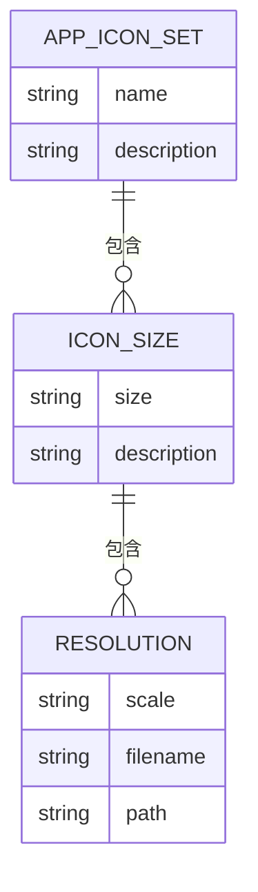
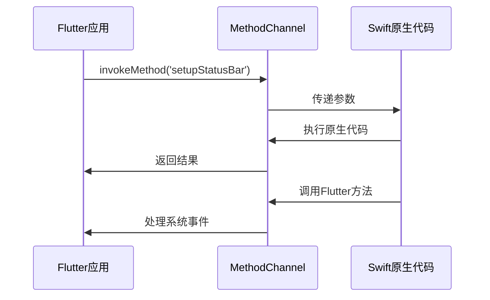
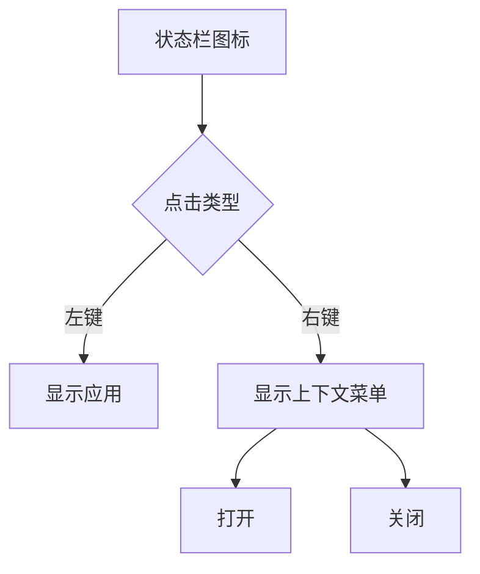
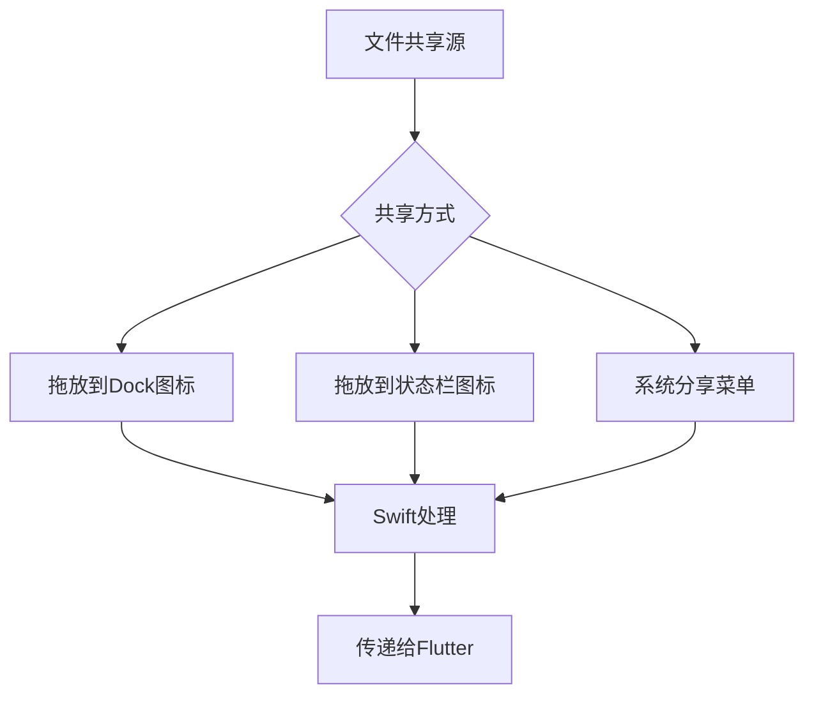
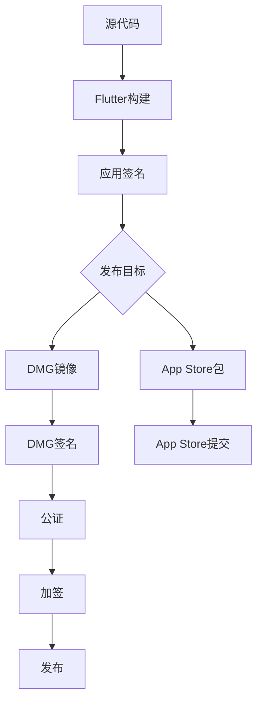

# macOS 实现

<cite>
**本文档引用的文件**  
- [Assets.xcassets](file://app/macos/Runner/Assets.xcassets)
- [AppDelegate.swift](file://app/macos/Runner/AppDelegate.swift)
- [Info.plist](file://app/macos/Runner/Info.plist)
- [Release.entitlements](file://app/macos/Runner/Release.entitlements)
- [macos_channel.dart](file://app/lib/util/native/macos_channel.dart)
- [tray_helper.dart](file://app/lib/util/native/tray_helper.dart)
- [taskbar_helper.dart](file://app/lib/util/native/taskbar_helper.dart)
- [TrayWatcher.dart](file://app/lib/widget/watcher/tray_watcher.dart)
- [WindowWatcher.dart](file://app/lib/widget/watcher/window_watcher.dart)
- [compile_mac_dmg.sh](file://scripts/compile_mac_dmg.sh)
- [compile_mac_appstore.sh](file://scripts/compile_mac_appstore.sh)
</cite>

## 目录
1. [简介](#简介)
2. [应用图标与状态栏图标资源配置](#应用图标与状态栏图标资源配置)
3. [Dart与macOS原生代码通信机制](#dart与macos原生代码通信机制)
4. [状态栏图标集成](#状态栏图标集成)
5. [macOS特有功能实现](#macos特有功能实现)
6. [调试技巧](#调试技巧)
7. [DMG镜像与App Store发布包生成](#dmg镜像与app-store发布包生成)
8. [Apple Developer证书管理](#apple-developer证书管理)

## 简介
本项目在macOS平台上的实现充分利用了Flutter框架与原生Swift代码的集成能力，通过MethodChannel实现Dart与macOS原生代码的双向通信。系统集成了状态栏图标、Dock菜单、文件共享、沙盒权限管理等macOS特有功能，并提供了完整的构建和发布流程。

## 应用图标与状态栏图标资源配置

### 应用图标资源配置
在`app/macos/Runner/Assets.xcassets/AppIcon.appiconset/Contents.json`中定义了完整的macOS应用图标集，包含多种尺寸和分辨率：

- **16x16**: 1x和2x缩放
- **32x32**: 1x和2x缩放
- **128x128**: 1x和2x缩放
- **256x256**: 1x和2x缩放
- **512x512**: 1x和2x缩放

这些图标使用`logo-1024-mac-*`系列的PNG文件，确保在不同显示设备上都能呈现清晰的视觉效果。

### 状态栏图标资源配置
项目包含三个状态栏图标资源集：

1. **常规状态图标**: `StatusBarItemIcon.imageset` - 使用`logo-32-black.png`作为基础图标
2. **错误状态图标**: `AppIconWithErrorMark.imageset` - 在基础图标上叠加错误标记
3. **成功状态图标**: `AppIconWithSuccessMark.imageset` - 在基础图标上叠加成功标记

所有图标集都遵循macOS的图标设计规范，包含1x、2x和3x缩放版本，确保在Retina显示屏上的清晰显示。



**图表来源**
- [AppIcon.appiconset/Contents.json](file://app/macos/Runner/Assets.xcassets/AppIcon.appiconset/Contents.json)
- [StatusBarItemIcon.imageset/Contents.json](file://app/macos/Runner/Assets.xcassets/StatusBarItemIcon.imageset/Contents.json)

**本节来源**
- [Assets.xcassets](file://app/macos/Runner/Assets.xcassets)

## Dart与macOS原生代码通信机制

### MethodChannel通信架构
项目通过`main-delegate-channel` MethodChannel实现Dart与Swift代码的双向通信。这种架构允许Flutter应用调用原生macOS功能，同时接收来自系统的事件通知。



**图表来源**
- [macos_channel.dart](file://app/lib/util/native/macos_channel.dart)
- [AppDelegate.swift](file://app/macos/Runner/AppDelegate.swift)

### 通信方法实现
在`macos_channel.dart`中定义了以下主要通信方法：

- `setupStatusBar()`: 设置状态栏图标和菜单
- `updateDockProgress()`: 更新Dock图标进度
- `setDockIcon()`: 设置Dock图标状态
- `setLaunchAtLogin()`: 配置开机启动
- `persistDestinationFolderAccess()`: 持久化文件夹访问权限

这些方法通过`_methodChannel.invokeMethod()`调用Swift端的对应实现。

### 原生事件处理
Swift端通过`handleFlutterCall`方法处理来自Dart的调用，并通过`channel?.invokeMethod()`向Dart端发送事件，如文件拖放、文本共享等系统事件。

**本节来源**
- [macos_channel.dart](file://app/lib/util/native/macos_channel.dart)
- [AppDelegate.swift](file://app/macos/Runner/AppDelegate.swift)

## 状态栏图标集成

### TrayHelper实现
`tray_helper.dart`文件实现了跨平台的状态栏图标管理，针对macOS平台有特殊处理：

```dart
Future<void> initTray() async {
  if (!checkPlatformHasTray()) {
    return;
  }
  try {
    if (checkPlatform([TargetPlatform.windows])) {
      await tm.trayManager.setIcon(Assets.img.logo);
    } else if (checkPlatform([TargetPlatform.macOS])) {
      // 状态栏图标在AppDelegate.swift中创建
      return;
    } else if (checkPlatform([TargetPlatform.linux])) {
      // Linux平台特殊处理
    }
  } catch (e) {
    _logger.warning('Failed to init tray', e);
  }
}
```

### 状态栏交互处理
`TrayWatcher`组件监听状态栏图标的交互事件：

- `onTrayIconMouseDown()`: 左键点击显示应用
- `onTrayIconRightMouseDown()`: 右键点击显示上下文菜单
- `onTrayMenuItemClick()`: 菜单项点击处理



**图表来源**
- [tray_helper.dart](file://app/lib/util/native/tray_helper.dart)
- [TrayWatcher.dart](file://app/lib/widget/watcher/tray_watcher.dart)

### 上下文菜单配置
状态栏图标的上下文菜单包含两个主要选项：
- **打开**: 显示应用主窗口
- **关闭**: 退出应用

菜单项通过`setContextMenu()`方法动态创建，并根据平台显示不同的关闭选项文本。

**本节来源**
- [tray_helper.dart](file://app/lib/util/native/tray_helper.dart)
- [TrayWatcher.dart](file://app/lib/widget/watcher/tray_watcher.dart)

## macOS特有功能实现

### Dock菜单与进度显示
通过`DockProgress`库实现Dock图标进度显示：

```dart
Future<void> updateDockProgress(double progress) async {
  await _methodChannel.invokeMethod('updateDockProgress', progress);
}
```

Swift端使用`DockProgress.style`和`DockProgress.progress`属性控制进度条样式和进度。

### 开机启动配置
利用`LaunchAtLogin`库实现开机启动功能：

```dart
Future<void> setLaunchAtLogin(bool value) async {
  await _methodChannel.invokeMethod('setLaunchAtLogin', value);
}

Future<bool> getLaunchAtLogin() async {
  return await _methodChannel.invokeMethod('getLaunchAtLogin');
}
```

### 沙盒权限管理
macOS应用运行在沙盒环境中，需要特殊处理文件访问权限：

```dart
Future<void> persistDestinationFolderAccess(String path) async {
  await _methodChannel.invokeMethod('persistDestinationFolderAccess', path);
}
```

Swift端使用`SecurityScopedResourceManager`和书签数据（bookmark data）持久化文件夹访问权限，确保应用重启后仍能访问用户选择的文件夹。

### 文件共享与拖放
支持多种文件共享方式：
- 拖放文件到Dock图标
- 拖放文件到状态栏图标
- 通过系统分享菜单共享



**图表来源**
- [AppDelegate.swift](file://app/macos/Runner/AppDelegate.swift)
- [macos_channel.dart](file://app/lib/util/native/macos_channel.dart)

### 通知中心集成
通过`NSUserNotificationCenter`实现系统通知，但具体实现细节在原生代码中处理，Flutter层通过MethodChannel触发通知。

**本节来源**
- [AppDelegate.swift](file://app/macos/Runner/AppDelegate.swift)
- [macos_channel.dart](file://app/lib/util/native/macos_channel.dart)

## 调试技巧

### 状态栏图标显示问题
常见问题及解决方案：

1. **图标不显示**
   - 检查`Info.plist`中的`LSUIElement`设置
   - 确保`AppDelegate.swift`中正确初始化状态栏项

2. **图标点击无响应**
   - 检查`TrayWatcher`是否正确添加了监听器
   - 验证MethodChannel连接是否正常

3. **上下文菜单不显示**
   - 确认菜单项数据正确传递
   - 检查平台特定的菜单创建逻辑

### 权限请求问题
沙盒权限相关调试技巧：

1. **文件访问被拒绝**
   - 检查`persistDestinationFolderAccess`调用是否成功
   - 验证书签数据是否正确保存和恢复

2. **网络权限问题**
   - 确认`Info.plist`中包含`NSLocalNetworkUsageDescription`
   - 检查`NSBonjourServices`配置是否正确

3. **照片库访问问题**
   - 验证`NSPhotoLibraryUsageDescription`和`NSPhotoLibraryAddUsageDescription`是否设置

### 调试工具
使用以下工具辅助调试：
- `Console.app`: 查看系统日志
- `Xcode`: 调试原生代码
- `Flutter DevTools`: 调试Dart代码

**本节来源**
- [AppDelegate.swift](file://app/macos/Runner/AppDelegate.swift)
- [macos_channel.dart](file://app/lib/util/native/macos_channel.dart)
- [Info.plist](file://app/macos/Runner/Info.plist)

## DMG镜像与App Store发布包生成

### DMG镜像生成流程
`scripts/compile_mac_dmg.sh`脚本实现了完整的DMG镜像生成流程：

1. **清理和构建**
   ```bash
   fvm flutter clean
   fvm flutter pub get
   fvm flutter build macos
   ```

2. **应用签名**
   ```bash
   codesign --deep --force --verbose --options runtime \
     --entitlements macos/Runner/Release.entitlements \
     --sign "$SIGN_ID" build/macos/Build/Products/Release/LocalSend.app
   ```

3. **创建DMG**
   ```bash
   create-dmg \
     --volname "LocalSend" \
     --window-size 500 300 \
     --background "../scripts/dmg/background.png" \
     --icon LocalSend.app 130 110 \
     --app-drop-link 360 110 \
     LocalSend.dmg \
     build/macos/Build/Products/Release/LocalSend.app
   ```

4. **DMG签名与公证**
   ```bash
   codesign --force --verbose --sign "$SIGN_ID" LocalSend.dmg
   xcrun notarytool submit LocalSend.dmg --wait --apple-id $DEV_EMAIL --password "$APP_PASSWORD" --team-id "$TEAM_ID"
   xcrun stapler staple LocalSend.dmg
   ```

### App Store发布包生成
`scripts/compile_mac_appstore.sh`脚本用于生成App Store发布包，流程与DMG类似但针对App Store要求进行优化。



**图表来源**
- [compile_mac_dmg.sh](file://scripts/compile_mac_dmg.sh)
- [compile_mac_appstore.sh](file://scripts/compile_mac_appstore.sh)

**本节来源**
- [compile_mac_dmg.sh](file://scripts/compile_mac_dmg.sh)
- [compile_mac_appstore.sh](file://scripts/compile_mac_appstore.sh)

## Apple Developer证书管理

### 证书配置
在`compile_mac_dmg.sh`脚本中配置了开发者证书：

```bash
SIGN_ID="Developer ID Application: Tien Do Nam (3W7H4PYMCV)"
```

### 权限配置
`macos/Runner/Release.entitlements`文件定义了应用所需的权限：

- 应用沙盒
- 网络访问
- 文件系统访问
- 照片库访问

### 公证流程
完整的公证流程包括：

1. **提交公证**
   ```bash
   xcrun notarytool submit LocalSend.dmg --wait --apple-id $DEV_EMAIL --password "$APP_PASSWORD" --team-id "$TEAM_ID"
   ```

2. **加签**
   ```bash
   xcrun stapler staple LocalSend.dmg
   ```

3. **验证**
   ```bash
   spctl -a -t open --context context:primary-signature LocalSend.dmg
   ```

### 证书环境变量
脚本中使用环境变量管理证书信息：
- `DEV_EMAIL`: Apple ID邮箱
- `APP_PASSWORD`: 应用专用密码
- `TEAM_ID`: 开发者团队ID

**本节来源**
- [Release.entitlements](file://app/macos/Runner/Release.entitlements)
- [compile_mac_dmg.sh](file://scripts/compile_mac_dmg.sh)