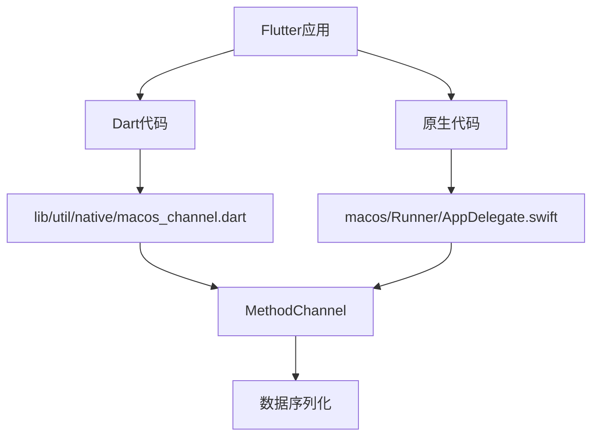
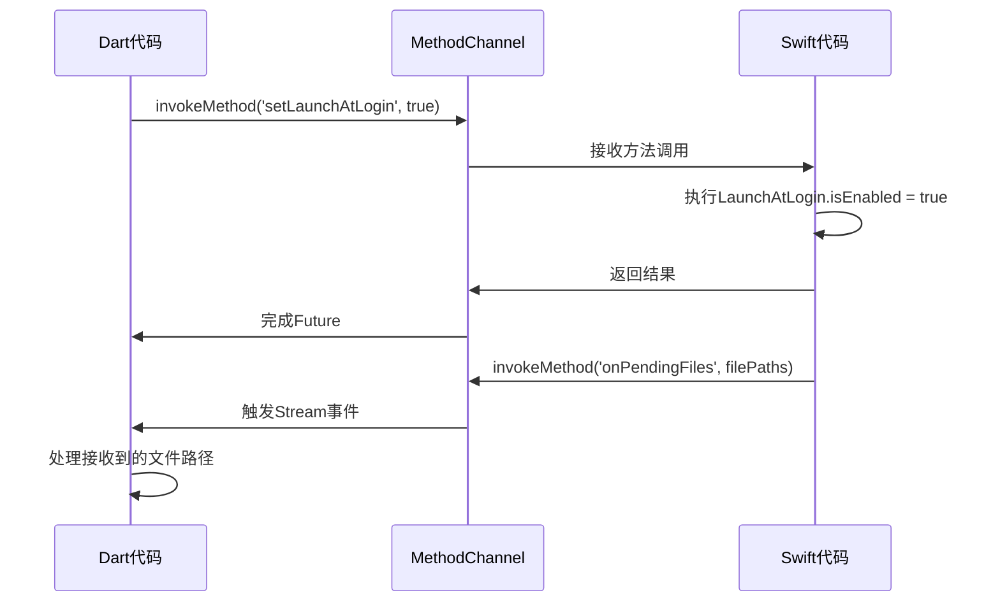
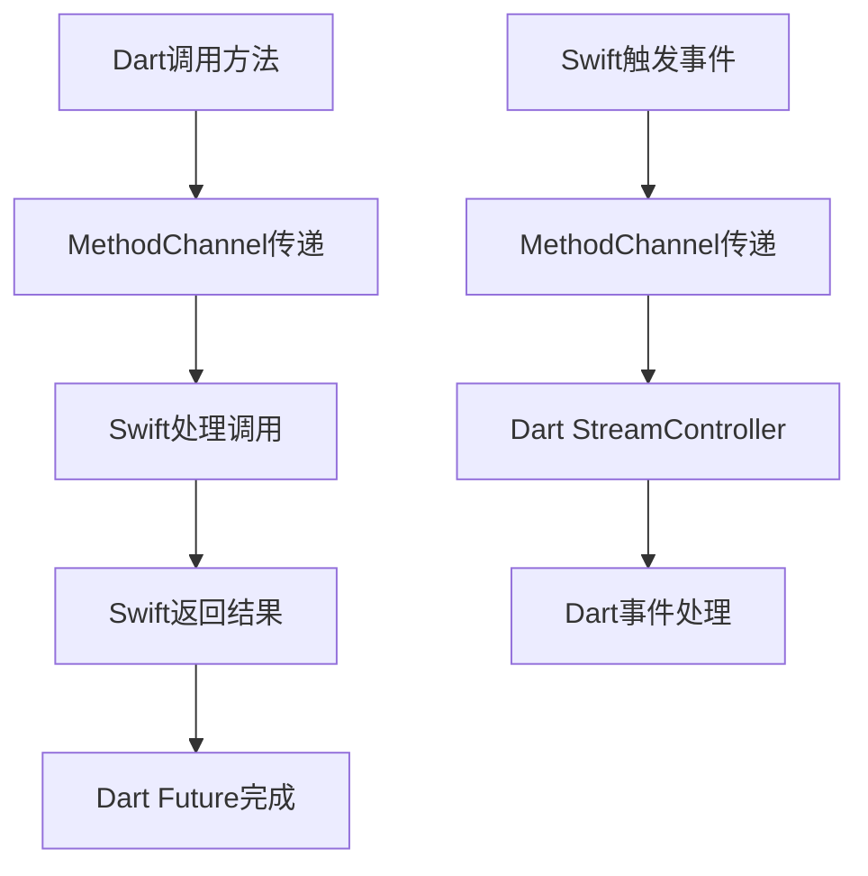
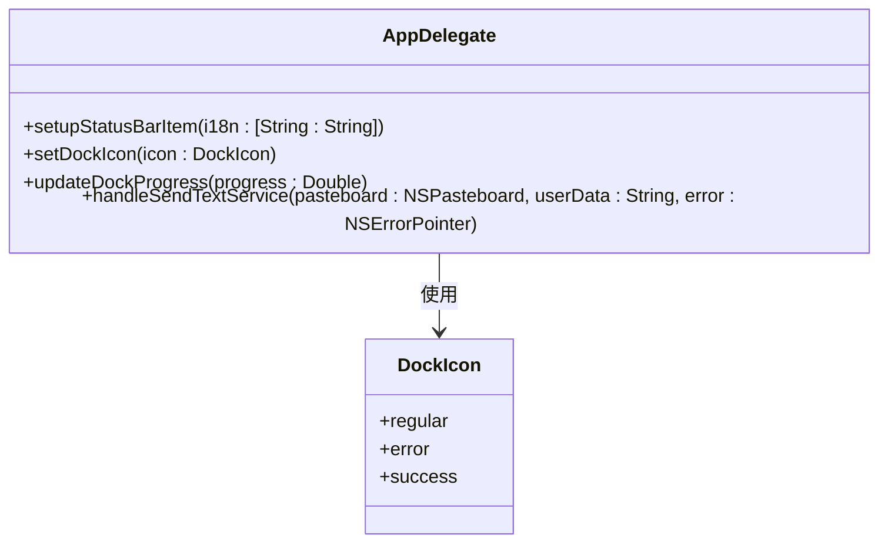
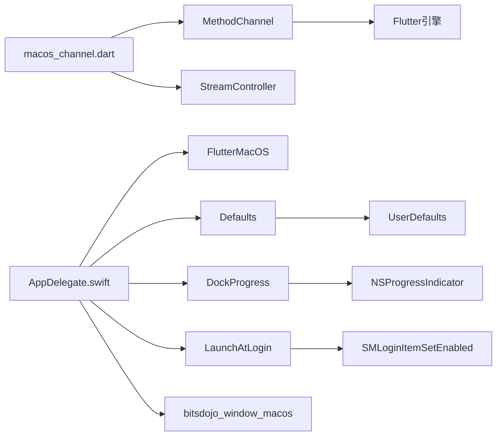

# 原生通信机制

<cite>
**本文档引用的文件**  
- [macos_channel.dart](file://app/lib/util/native/macos_channel.dart)
- [AppDelegate.swift](file://app/macos/Runner/AppDelegate.swift)
- [init.dart](file://app/lib/config/init.dart)
- [settings_tab.dart](file://app/lib/pages/tabs/settings_tab.dart)
- [troubleshoot_page.dart](file://app/lib/pages/troubleshoot_page.dart)
- [autostart_helper.dart](file://app/lib/util/native/autostart_helper.dart)
- [taskbar_helper.dart](file://app/lib/util/native/taskbar_helper.dart)
- [animations_status.dart](file://app/lib/util/ui/animations_status.dart)
</cite>

## 目录
1. [项目结构](#项目结构)
2. [核心组件](#核心组件)
3. [架构概述](#架构概述)
4. [详细组件分析](#详细组件分析)
5. [依赖分析](#依赖分析)
6. [性能考虑](#性能考虑)
7. [故障排除指南](#故障排除指南)
8. [结论](#结论)

## 项目结构

本项目采用Flutter框架开发跨平台应用，macOS原生通信机制主要通过`MethodChannel`实现Dart与Swift代码的交互。项目结构清晰地分离了平台相关代码和共享业务逻辑。



**图表来源**
- [macos_channel.dart](file://app/lib/util/native/macos_channel.dart)
- [AppDelegate.swift](file://app/macos/Runner/AppDelegate.swift)

**章节来源**
- [macos_channel.dart](file://app/lib/util/native/macos_channel.dart)
- [AppDelegate.swift](file://app/macos/Runner/AppDelegate.swift)

## 核心组件

macOS平台的原生通信机制主要由两个核心组件构成：Dart端的`macos_channel.dart`和Swift端的`AppDelegate.swift`。这两个文件通过`MethodChannel`建立双向通信通道，实现了Flutter应用与macOS系统功能的深度集成。

Dart端定义了多个异步方法用于调用原生功能，包括启动项管理、Dock图标控制、辅助功能检测等。同时，通过`StreamController`实现了从原生代码到Dart的事件推送机制，处理文件拖放、文本共享等系统事件。

**章节来源**
- [macos_channel.dart](file://app/lib/util/native/macos_channel.dart)
- [AppDelegate.swift](file://app/macos/Runner/AppDelegate.swift)

## 架构概述



**图表来源**
- [macos_channel.dart](file://app/lib/util/native/macos_channel.dart#L1-L93)
- [AppDelegate.swift](file://app/macos/Runner/AppDelegate.swift#L1-L269)

## 详细组件分析

### 方法通道设计模式

本项目采用单例`MethodChannel`模式，通过预定义的方法名称实现Dart与Swift代码的通信。通道名称为"main-delegate-channel"，所有通信都通过这个单一通道完成，简化了通信架构。

```dart
const _methodChannel = MethodChannel('main-delegate-channel');
```

这种设计模式的优点是维护简单，所有通信逻辑集中管理；缺点是随着功能增加，方法调用的switch语句可能变得复杂。项目通过将相关功能分组和良好的注释来缓解这一问题。

**章节来源**
- [macos_channel.dart](file://app/lib/util/native/macos_channel.dart#L1-L10)

### 调用流程分析

方法调用流程遵循标准的Flutter原生通信模式：

1. Dart代码调用`invokeMethod`发送请求
2. 原生代码通过`setMethodCallHandler`接收并处理请求
3. 原生代码执行相应操作并返回结果
4. Dart端的Future完成，返回结果

对于从原生到Dart的事件推送，采用Stream模式：
1. Swift代码调用`invokeMethod`发送事件
2. Dart端的MethodCallHandler接收并转发到相应的StreamController
3. 订阅该Stream的Dart代码接收事件并处理



**图表来源**
- [macos_channel.dart](file://app/lib/util/native/macos_channel.dart#L74-L92)
- [AppDelegate.swift](file://app/macos/Runner/AppDelegate.swift#L200-L260)

**章节来源**
- [macos_channel.dart](file://app/lib/util/native/macos_channel.dart#L74-L92)
- [AppDelegate.swift](file://app/macos/Runner/AppDelegate.swift#L200-L260)

### 数据序列化机制

通信中的数据序列化采用Flutter标准的JSON编码格式。基本数据类型（String、int、double、bool）和List、Map等集合类型可以直接传输。复杂对象需要转换为Map<String, dynamic>格式。

在本项目中，文件路径以String列表形式传输，国际化文本以Map<String, String>形式传输。这种序列化机制确保了数据在Dart和Swift之间的正确转换。

**章节来源**
- [macos_channel.dart](file://app/lib/util/native/macos_channel.dart#L44-L72)
- [AppDelegate.swift](file://app/macos/Runner/AppDelegate.swift#L230-L240)

### macOS特有API调用

与Android和iOS平台相比，macOS实现了一些特有的功能：

1. **Dock进度条**：使用DockProgress库在Dock图标上显示进度
2. **状态栏图标**：创建菜单栏状态图标，支持拖放操作
3. **启动项管理**：使用LaunchAtLogin库管理应用启动设置
4. **辅助功能集成**：检测系统是否启用减少运动效果

这些功能通过原生代码实现，并通过MethodChannel暴露给Dart层使用。



**图表来源**
- [AppDelegate.swift](file://app/macos/Runner/AppDelegate.swift#L50-L100)

**章节来源**
- [AppDelegate.swift](file://app/macos/Runner/AppDelegate.swift#L50-L100)

### 事件处理机制

项目实现了复杂的事件处理机制，主要处理以下三种系统事件：

1. **文件拖放**：用户将文件拖放到Dock图标或菜单栏图标
2. **文本共享**：通过系统分享菜单分享文本或链接
3. **URL处理**：打开文件或URL的系统事件

这些事件通过Defaults库持久化存储，然后通过MethodChannel推送到Dart层处理，确保了事件的可靠传递。

**章节来源**
- [AppDelegate.swift](file://app/macos/Runner/AppDelegate.swift#L150-L180)
- [macos_channel.dart](file://app/lib/util/native/macos_channel.dart#L44-L72)

## 依赖分析



**图表来源**
- [macos_channel.dart](file://app/lib/util/native/macos_channel.dart)
- [AppDelegate.swift](file://app/macos/Runner/AppDelegate.swift)
- [Podfile](file://app/macos/Podfile)

**章节来源**
- [macos_channel.dart](file://app/lib/util/native/macos_channel.dart)
- [AppDelegate.swift](file://app/macos/Runner/AppDelegate.swift)
- [Podfile](file://app/macos/Podfile)

## 性能考虑

原生通信机制的性能主要受以下因素影响：

1. **序列化开销**：每次方法调用都需要对参数和返回值进行JSON序列化和反序列化
2. **线程切换**：Dart代码运行在UI线程，原生代码可能需要在主线程执行
3. **频繁调用**：过于频繁的方法调用会导致性能下降

本项目通过以下方式优化性能：
- 减少不必要的方法调用
- 批量处理相关操作
- 使用Stream而不是频繁的方法调用进行事件推送

**章节来源**
- [macos_channel.dart](file://app/lib/util/native/macos_channel.dart)
- [AppDelegate.swift](file://app/macos/Runner/AppDelegate.swift)

## 故障排除指南

### 调试通道通信

1. **日志跟踪**：在Swift代码中添加print语句，观察方法调用流程
2. **断点设置**：在`handleFlutterCall`方法和Dart的`invokeMethod`调用处设置断点
3. **错误处理**：检查FlutterError的返回值，确定错误类型和原因

### 常见问题

1. **方法未实现**：确保Dart端调用的方法在Swift端有对应处理
2. **类型不匹配**：检查参数和返回值的类型是否匹配
3. **权限问题**：macOS沙盒环境下需要适当的权限才能访问文件系统

**章节来源**
- [macos_channel.dart](file://app/lib/util/native/macos_channel.dart#L200-L260)
- [AppDelegate.swift](file://app/macos/Runner/AppDelegate.swift#L200-L260)

## 结论

本项目的macOS原生通信机制设计良好，通过MethodChannel实现了Dart与Swift代码的有效交互。系统充分利用了macOS平台特性，提供了丰富的原生功能集成。代码结构清晰，职责分离明确，便于维护和扩展。

未来可以考虑的改进方向包括：
- 增加类型安全的通信接口
- 实现更复杂的错误处理机制
- 优化频繁通信场景的性能表现