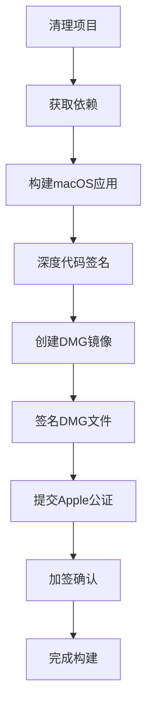
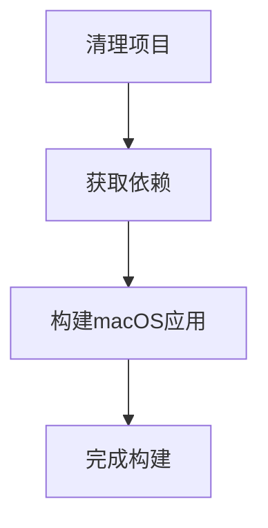
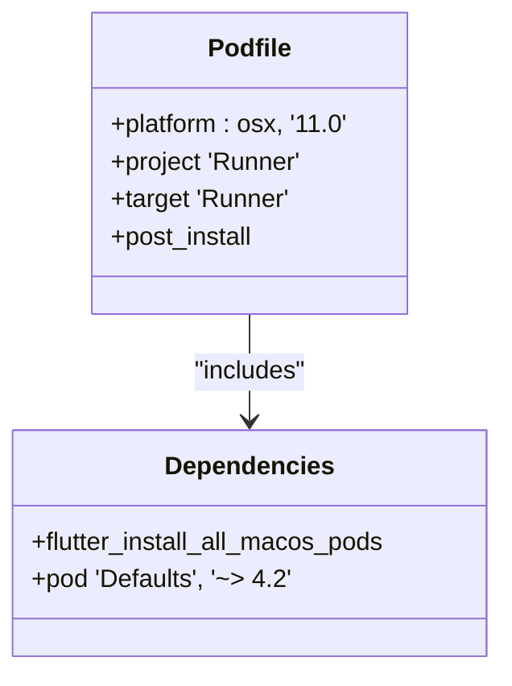
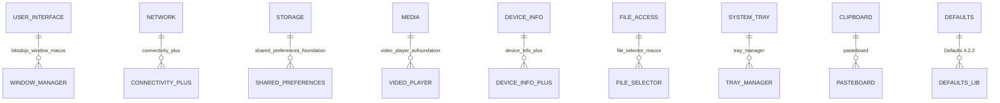
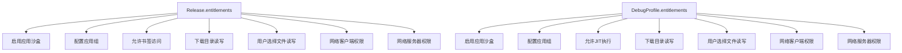
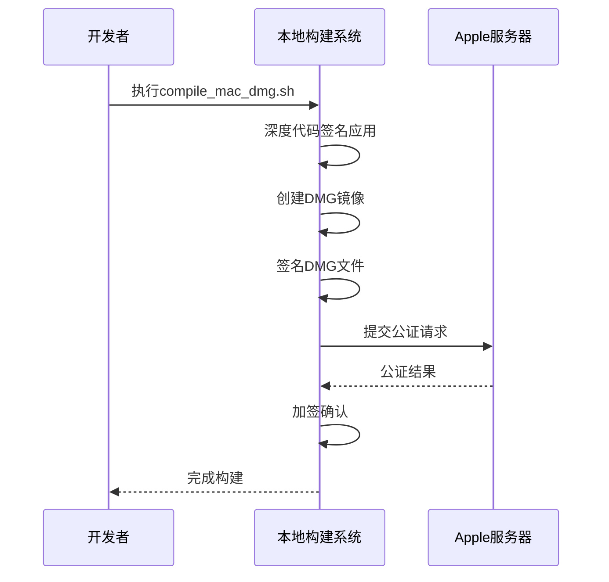
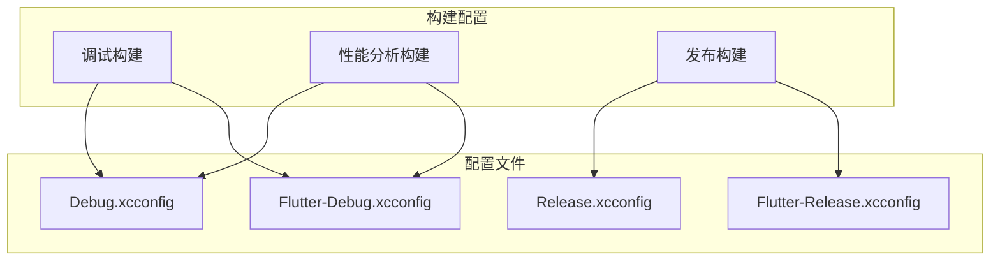
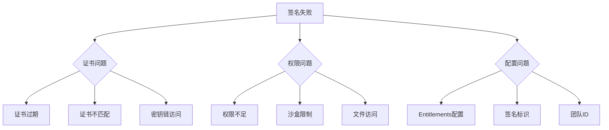
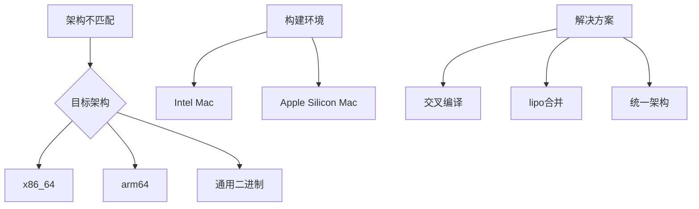

# 构建与部署流程

<cite>
**本文档中引用的文件**  
- [compile_mac_dmg.sh](file://scripts/compile_mac_dmg.sh)
- [compile_mac_appstore.sh](file://scripts/compile_mac_appstore.sh)
- [Podfile](file://app/macos/Podfile)
- [Podfile.lock](file://app/macos/Podfile.lock)
- [Release.entitlements](file://app/macos/Runner/Release.entitlements)
- [DebugProfile.entitlements](file://app/macos/Runner/DebugProfile.entitlements)
- [pubspec.yaml](file://app/pubspec.yaml)
- [build_pod.sh](file://app/rust_builder/cargokit/build_pod.sh)
</cite>

## 目录
1. [简介](#简介)
2. [项目结构](#项目结构)
3. [核心构建脚本分析](#核心构建脚本分析)
4. [依赖管理机制](#依赖管理机制)
5. [代码签名与安全配置](#代码签名与安全配置)
6. [构建变体配置差异](#构建变体配置差异)
7. [常见构建错误排查](#常见构建错误排查)
8. [结论](#结论)

## 简介
本指南详细说明了LocalSend项目在macOS平台上的完整构建和部署流程。涵盖了从开发到发布的全流程，包括Podfile中依赖库的管理机制、DMG镜像和App Store发布包的生成步骤、Apple Developer证书和Provisioning Profile的配置方法，以及不同构建变体的配置差异和常见构建错误的排查方案。

## 项目结构
LocalSend项目的目录结构清晰，主要包含应用代码、脚本、服务器代码和构建工具等部分。macOS相关的构建配置和脚本位于`app/macos`和`scripts`目录下。

**Section sources**
- [project_structure](file://project_structure)

## 核心构建脚本分析

### DMG镜像构建流程
`compile_mac_dmg.sh`脚本用于构建可分发的DMG安装包，包含完整的代码签名、公证和加签流程。



**Diagram sources**
- [compile_mac_dmg.sh](file://scripts/compile_mac_dmg.sh#L1-L53)

**Section sources**
- [compile_mac_dmg.sh](file://scripts/compile_mac_dmg.sh#L1-L53)

### App Store发布包构建流程
`compile_mac_appstore.sh`脚本用于构建App Store版本的应用程序，流程相对简化。



**Diagram sources**
- [compile_mac_appstore.sh](file://scripts/compile_mac_appstore.sh#L1-L9)

**Section sources**
- [compile_mac_appstore.sh](file://scripts/compile_mac_appstore.sh#L1-L9)

## 依赖管理机制

### Podfile依赖配置
macOS平台使用CocoaPods管理原生依赖，Podfile中定义了目标平台和具体依赖库。



**Diagram sources**
- [Podfile](file://app/macos/Podfile#L1-L46)

**Section sources**
- [Podfile](file://app/macos/Podfile#L1-L46)
- [Podfile.lock](file://app/macos/Podfile.lock#L1-L175)

### 关键依赖库及其功能
根据Podfile.lock文件，项目依赖多个关键库：



**Section sources**
- [Podfile.lock](file://app/macos/Podfile.lock#L1-L175)
- [pubspec.yaml](file://app/pubspec.yaml#L1-L124)

## 代码签名与安全配置

### Entitlements权限配置
应用程序通过Entitlements文件声明所需的安全权限和沙盒配置。



**Diagram sources**
- [Release.entitlements](file://app/macos/Runner/Release.entitlements#L1-L23)
- [DebugProfile.entitlements](file://app/macos/Runner/DebugProfile.entitlements#L1-L23)

**Section sources**
- [Release.entitlements](file://app/macos/Runner/Release.entitlements#L1-L23)
- [DebugProfile.entitlements](file://app/macos/Runner/DebugProfile.entitlements#L1-L23)

### 代码签名流程
完整的代码签名流程包括应用签名、DMG签名、Apple公证和加签确认。



**Section sources**
- [compile_mac_dmg.sh](file://scripts/compile_mac_dmg.sh#L1-L53)

## 构建变体配置差异

### 不同构建环境的配置
项目通过不同的配置文件区分开发、测试和发布环境。



**Section sources**
- [Flutter-Release.xcconfig](file://app/macos/Flutter/Flutter-Release.xcconfig#L1-L3)
- [Flutter-Debug.xcconfig](file://app/macos/Flutter/Flutter-Debug.xcconfig#L1-L3)

### 构建变体功能差异
不同构建变体在功能和权限上存在差异：

```mermaid
table
| 构建变体 | JIT执行 | 沙盒 | 应用组 | 网络权限 | 文件访问 |
|---------|--------|------|-------|---------|---------|
| Debug/Profile | 启用 | 启用 | 启用 | 启用 | 启用 |
| Release | 禁用 | 启用 | 启用 | 启用 | 启用 |
```

**Section sources**
- [Release.entitlements](file://app/macos/Runner/Release.entitlements#L1-L23)
- [DebugProfile.entitlements](file://app/macos/Runner/DebugProfile.entitlements#L1-L23)

## 常见构建错误排查

### 签名失败问题
签名失败是常见的构建问题，可能由多种原因引起。



**Section sources**
- [compile_mac_dmg.sh](file://scripts/compile_mac_dmg.sh#L1-L53)

### 架构不匹配问题
架构不匹配可能导致构建失败或运行时错误。



**Section sources**
- [build_pod.sh](file://app/rust_builder/cargokit/build_pod.sh#L1-L57)

## 结论
LocalSend项目的macOS构建和部署流程设计完善，通过自动化脚本实现了从代码构建到分发的完整流程。项目使用CocoaPods管理原生依赖，通过Entitlements文件配置安全权限，并实现了完整的代码签名和公证流程。开发者可以根据不同需求选择合适的构建变体，并通过详细的错误排查指南解决常见问题。