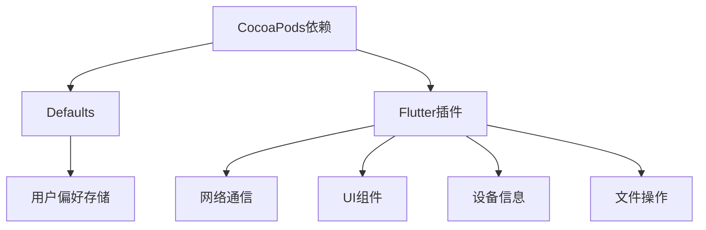
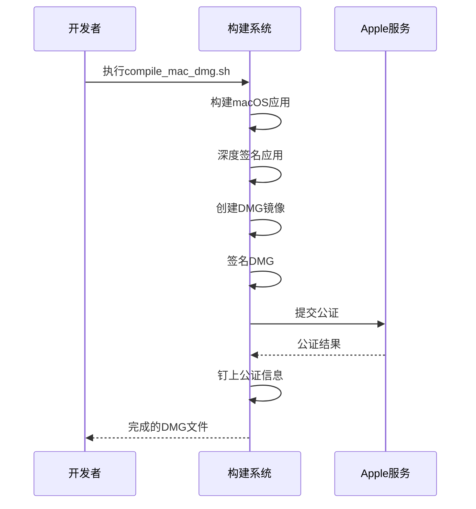

# 构建流程

<cite>
**本文档中引用的文件**  
- [Podfile](file://app/macos/Podfile)
- [Podfile.lock](file://app/macos/Podfile.lock)
- [pubspec.yaml](file://app/pubspec.yaml)
- [compile_mac_dmg.sh](file://scripts/compile_mac_dmg.sh)
- [compile_mac_appstore.sh](file://scripts/compile_mac_appstore.sh)
- [Release.entitlements](file://app/macos/Runner/Release.entitlements)
- [DebugProfile.entitlements](file://app/macos/Runner/DebugProfile.entitlements)
- [build.yaml](file://app/build.yaml)
- [rust_builder/pubspec.yaml](file://app/rust_builder/pubspec.yaml)
</cite>

## 目录
1. [开发环境配置](#开发环境配置)
2. [依赖管理](#依赖管理)
3. [编译参数设置](#编译参数设置)
4. [CocoaPods依赖分析](#cocoapods依赖分析)
5. [完整构建流程](#完整构建流程)
6. [DMG镜像构建](#dmg镜像构建)
7. [App Store发布包构建](#app-store发布包构建)
8. [构建脚本关键参数](#构建脚本关键参数)
9. [目标环境调整策略](#目标环境调整策略)

## 开发环境配置

macOS平台的构建需要配置特定的开发环境。项目要求最低macOS版本为11.0，这在Podfile中通过`platform :osx, '11.0'`指定。构建环境使用FVM（Flutter Version Management）来确保Flutter版本的一致性，通过`fvm flutter`命令调用特定版本的Flutter工具链。开发环境还需要安装CocoaPods作为依赖管理工具，版本要求为1.16.2或更高。

**Section sources**
- [Podfile](file://app/macos/Podfile#L1)
- [Podfile.lock](file://app/macos/Podfile.lock#L174)

## 依赖管理

项目采用多层依赖管理机制。Dart/Flutter依赖在pubspec.yaml文件中定义，而原生macOS依赖则通过CocoaPods管理。在pubspec.yaml中，项目声明了多个功能依赖，包括网络通信（connectivity_plus、rhttp）、UI组件（bitsdojo_window、dynamic_color）、文件操作（file_picker、path_provider）等。对于Rust核心库的集成，项目使用rust_lib_localsend_app作为FFI绑定库。

CocoaPods依赖在Podfile中声明，主要包含Defaults库（版本4.2），用于简化UserDefaults的访问。所有Flutter插件的原生依赖都通过flutter_install_all_macos_pods方法自动集成，这些信息记录在Podfile.lock中。

**Section sources**
- [pubspec.yaml](file://app/pubspec.yaml#L1)
- [Podfile](file://app/macos/Podfile#L30)
- [Podfile.lock](file://app/macos/Podfile.lock#L1)

## 编译参数设置

编译参数通过多个配置文件进行设置。在Xcode项目配置中，通过Flutter-Debug.xcconfig和Flutter-Release.xcconfig文件传递Flutter特定的构建设置。macOS的部署目标版本在Podfile的post_install钩子中统一设置为11.0。项目还使用自定义的xcconfig文件（如AppInfo.xcconfig）来管理应用信息和构建配置。

Rust代码的构建参数通过Cargokit工具链管理，构建配置（Debug/Release）通过环境变量CARGOKIT_CONFIGURATION传递。对于不同架构的支持，通过CARGOKIT_DARWIN_ARCHS环境变量指定活动架构（arm64, x86_64）。

**Section sources**
- [Podfile](file://app/macos/Podfile#L40)
- [rust_builder/cargokit/build_pod.sh](file://app/rust_builder/cargokit/build_pod.sh#L25)

## CocoaPods依赖分析

Podfile中定义的CocoaPods依赖对应用功能有重要影响。核心依赖Defaults（~> 4.2）提供了类型安全的UserDefaults访问，用于持久化应用设置和用户偏好。该库简化了布尔值、字符串、整数等基本类型的数据存储和检索，增强了代码的可读性和安全性。

所有Flutter插件的原生组件都作为CocoaPods依赖集成，包括：
- 网络通信：connectivity_plus和rhttp插件提供网络状态检测和HTTP请求功能
- UI组件：bitsdojo_window和window_manager插件实现自定义窗口控制
- 设备信息：device_info_plus插件获取设备硬件信息
- 文件操作：path_provider_foundation插件确定文件系统路径

这些依赖通过模块化头文件（use_modular_headers!）和动态框架（use_frameworks!）的方式集成，确保了良好的封装性和兼容性。



**Diagram sources**
- [Podfile](file://app/macos/Podfile#L30)
- [Podfile.lock](file://app/macos/Podfile.lock#L1)

**Section sources**
- [Podfile](file://app/macos/Podfile#L1)
- [pubspec.yaml](file://app/pubspec.yaml#L1)

## 完整构建流程

从源码到可执行文件的完整构建流程包含多个阶段。首先执行`fvm flutter clean`清除之前的构建产物，然后运行`fvm flutter pub get`获取所有Dart依赖。核心构建命令`fvm flutter build macos`触发整个构建过程，该过程包括：

1. Dart代码编译为机器码
2. Rust核心库交叉编译为macOS原生库
3. CocoaPods依赖的集成和构建
4. 应用程序包的组装和签名

Rust代码的构建由Cargokit工具链管理，通过build_pod.sh脚本在Xcode构建过程中调用。构建过程针对arm64和x86_64架构分别编译，然后使用lipo工具合并为通用二进制文件。

**Section sources**
- [compile_mac_dmg.sh](file://scripts/compile_mac_dmg.sh#L5)
- [build_pod.sh](file://app/rust_builder/cargokit/build_pod.sh#L1)

## DMG镜像构建

DMG镜像的构建流程在compile_mac_dmg.sh脚本中定义，包含签名、镜像创建和公证等关键步骤。构建完成后，首先对应用程序进行深度签名，使用Developer ID证书和Release.entitlements权限配置文件：

```bash
codesign --deep --force --verbose --options runtime --entitlements macos/Runner/Release.entitlements --sign "$SIGN_ID" build/macos/Build/Products/Release/LocalSend.app
```

签名后使用create-dmg工具创建磁盘镜像，配置卷名、窗口大小和背景图片。创建的DMG文件随后再次签名，并提交到Apple的公证服务进行验证。公证完成后，使用stapler工具将公证信息"钉"到DMG文件上，确保用户下载时不会遇到安全警告。



**Diagram sources**
- [compile_mac_dmg.sh](file://scripts/compile_mac_dmg.sh#L1)

**Section sources**
- [compile_mac_dmg.sh](file://scripts/compile_mac_dmg.sh#L1)
- [Release.entitlements](file://app/macos/Runner/Release.entitlements#L1)

## App Store发布包构建

App Store发布包的构建流程在compile_mac_appstore.sh脚本中定义。与DMG构建相比，此流程更为简化，主要包含基本的构建命令：

```bash
cd app
fvm flutter clean
fvm flutter pub get
fvm flutter build macos
cd ..
```

App Store版本的构建依赖Xcode的归档功能，而不是直接生成可分发的包。构建后的应用需要在Xcode中进行归档和验证，然后通过App Store Connect提交审核。App Store版本使用不同的权限配置，可能包含App Store特定的API访问权限。

**Section sources**
- [compile_mac_appstore.sh](file://scripts/compile_mac_appstore.sh#L1)

## 构建脚本关键参数

构建脚本中的关键参数决定了构建输出的特性和质量。在compile_mac_dmg.sh中，SIGN_ID环境变量定义了代码签名的证书标识，格式为"Developer ID Application: 证书持有者 (团队ID)"。DEV_EMAIL、APP_PASSWORD和TEAM_ID参数用于Apple公证服务的身份验证。

create-dmg工具的参数包括：
- --volname：DMG卷名
- --window-size：安装窗口大小
- --background：背景图片路径
- --icon：应用图标位置
- --app-drop-link：应用程序文件夹链接位置

这些参数共同决定了DMG镜像的用户体验和外观。

**Section sources**
- [compile_mac_dmg.sh](file://scripts/compile_mac_dmg.sh#L1)

## 目标环境调整策略

根据目标环境的不同，构建策略需要相应调整。对于开发和测试环境，使用Debug或Profile配置，启用调试符号和性能分析工具。对于生产环境，使用Release配置，启用代码优化和混淆。

权限配置文件根据环境选择：
- Release.entitlements：用于生产发布，包含应用沙盒、网络访问等必要权限
- DebugProfile.entitlements：用于调试，额外包含JIT执行权限

通过修改构建脚本中的条件语句，可以为不同分发渠道（如官网下载、App Store）生成定制化的构建产物。例如，可以为测试版本添加额外的日志记录，或为生产版本移除调试功能以减小包体积。

**Section sources**
- [Release.entitlements](file://app/macos/Runner/Release.entitlements#L1)
- [DebugProfile.entitlements](file://app/macos/Runner/DebugProfile.entitlements#L1)
- [compile_mac_dmg.sh](file://scripts/compile_mac_dmg.sh#L1)