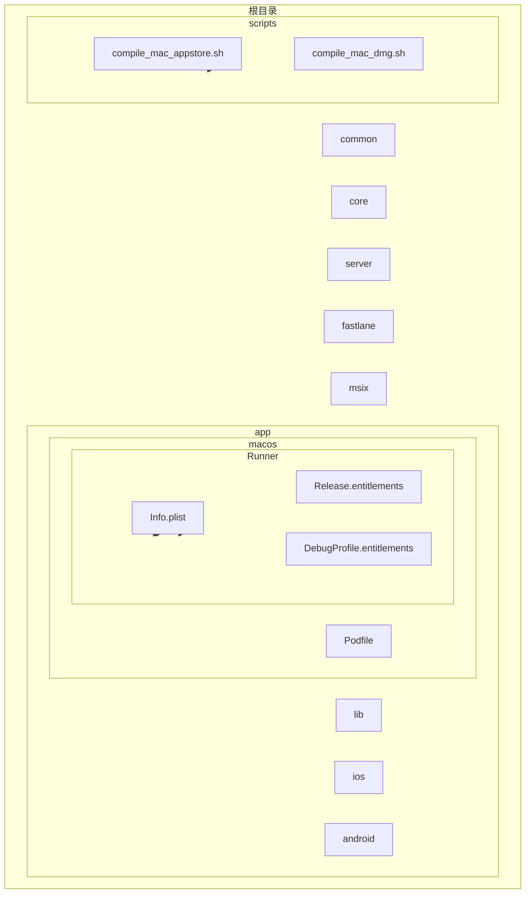
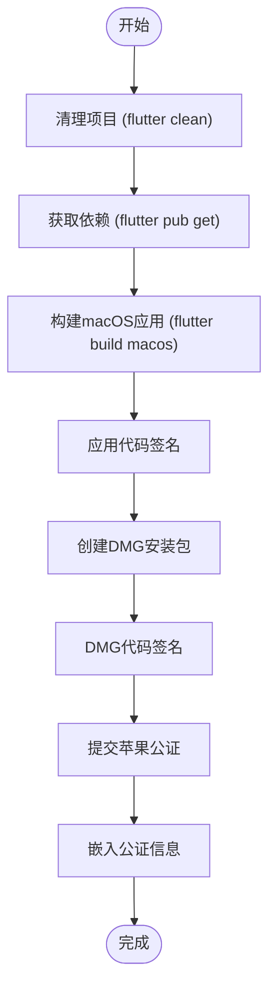
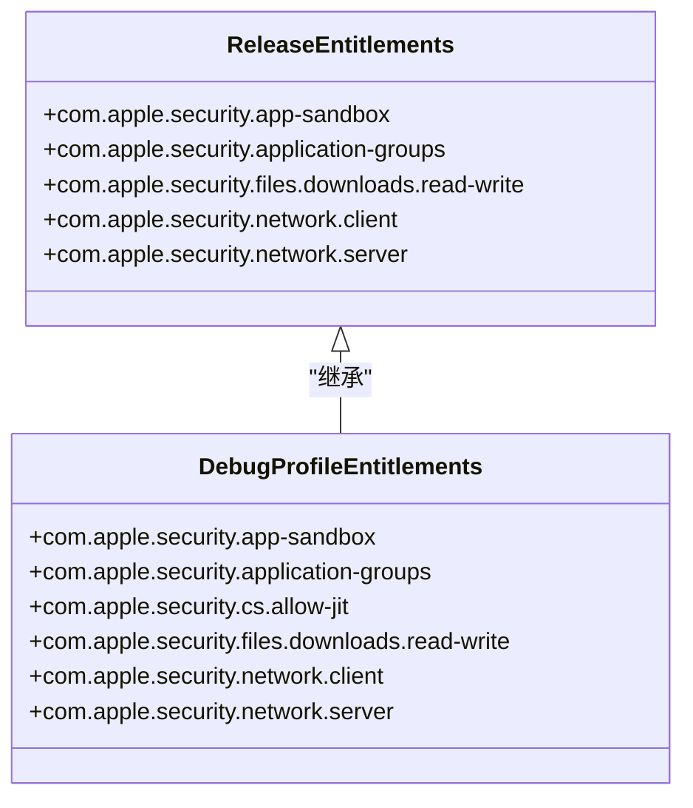
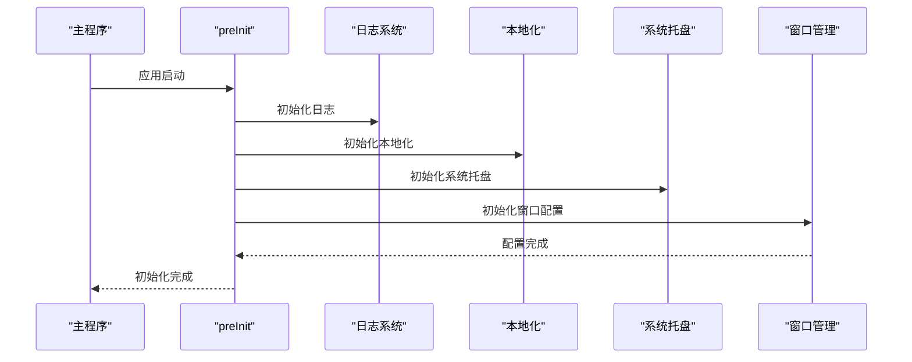
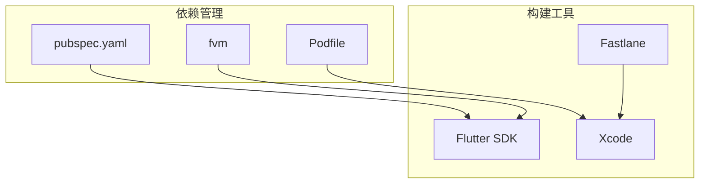

# 部署流程

<cite>
**本文档中引用的文件**  
- [compile_mac_appstore.sh](file://scripts/compile_mac_appstore.sh)
- [compile_mac_dmg.sh](file://scripts/compile_mac_dmg.sh)
- [init.dart](file://app/lib/config/init.dart)
- [Info.plist](file://app/macos/Runner/Info.plist)
- [Release.entitlements](file://app/macos/Runner/Release.entitlements)
- [DebugProfile.entitlements](file://app/macos/Runner/DebugProfile.entitlements)
- [pubspec.yaml](file://app/pubspec.yaml)
</cite>

## 目录
1. [简介](#简介)
2. [项目结构](#项目结构)
3. [核心组件](#核心组件)
4. [架构概述](#架构概述)
5. [详细组件分析](#详细组件分析)
6. [依赖分析](#依赖分析)
7. [性能考虑](#性能考虑)
8. [故障排除指南](#故障排除指南)
9. [结论](#结论)
10. [附录](#附录)（如有必要）

## 简介
本文档全面介绍macOS应用的部署流程，特别是针对App Store发布的具体要求和步骤。文档详细说明Apple Developer证书的申请与配置、Provisioning Profile的管理、代码签名机制的实现。同时解释compile_mac_appstore.sh脚本中涉及的发布流程自动化，包括版本号管理、构建归档、验证和上传等环节。此外，文档还涵盖内部测试部署的方法，以及如何通过配置init.dart中的参数来区分不同部署环境。

## 项目结构
本项目采用Flutter框架开发跨平台应用，其结构清晰地分为多个模块：app（主应用）、cli（命令行工具）、common（共享代码）、core（核心功能）、server（服务器端）和scripts（构建脚本）。其中，macOS应用的部署主要涉及app/macos目录下的配置文件和scripts目录下的构建脚本。

**Diagram sources**
- [scripts/compile_mac_appstore.sh](file://scripts/compile_mac_appstore.sh)
- [app/macos/Runner/Info.plist](file://app/macos/Runner/Info.plist)
- [app/macos/Runner/Release.entitlements](file://app/macos/Runner/Release.entitlements)

**Section sources**
- [scripts/compile_mac_appstore.sh](file://scripts/compile_mac_appstore.sh)
- [app/macos/Runner/Info.plist](file://app/macos/Runner/Info.plist)

## 核心组件
核心组件包括macOS应用的构建脚本、配置文件和初始化代码。compile_mac_appstore.sh脚本负责自动化构建和发布流程，而Info.plist和entitlements文件则定义了应用的元数据和安全权限。init.dart文件中的代码负责应用启动时的初始化工作，包括日志配置、本地化初始化和系统托盘设置。

**Section sources**
- [scripts/compile_mac_appstore.sh](file://scripts/compile_mac_appstore.sh)
- [app/lib/config/init.dart](file://app/lib/config/init.dart)
- [app/macos/Runner/Info.plist](file://app/macos/Runner/Info.plist)

## 架构概述
系统架构采用分层设计，前端使用Flutter框架构建用户界面，后端通过Rust实现核心功能。部署流程通过shell脚本自动化，利用codesign工具进行代码签名，xcrun notarytool进行苹果官方公证，并通过stapler工具将公证结果嵌入应用包中。

**Diagram sources**
- [scripts/compile_mac_dmg.sh](file://scripts/compile_mac_dmg.sh)
- [app/macos/Runner/Release.entitlements](file://app/macos/Runner/Release.entitlements)

## 详细组件分析

### macOS应用商店部署分析
macOS应用商店部署流程通过compile_mac_appstore.sh脚本实现自动化。该脚本首先清理并获取依赖，然后构建macOS应用。虽然脚本本身不包含完整的签名和公证流程，但compile_mac_dmg.sh脚本提供了完整的部署流程参考。

**Diagram sources**
- [scripts/compile_mac_appstore.sh](file://scripts/compile_mac_appstore.sh)
- [scripts/compile_mac_dmg.sh](file://scripts/compile_mac_dmg.sh)

**Section sources**
- [scripts/compile_mac_appstore.sh](file://scripts/compile_mac_appstore.sh)
- [scripts/compile_mac_dmg.sh](file://scripts/compile_mac_dmg.sh)

### 代码签名与权限配置
代码签名和权限配置是macOS应用部署的关键环节。Release.entitlements文件定义了应用沙盒、网络访问、文件系统访问等权限，确保应用在App Store审核中符合安全要求。

**Diagram sources**
- [app/macos/Runner/Release.entitlements](file://app/macos/Runner/Release.entitlements)
- [app/macos/Runner/DebugProfile.entitlements](file://app/macos/Runner/DebugProfile.entitlements)

### 应用初始化配置
init.dart文件中的preInit函数负责应用启动时的初始化工作，包括日志配置、本地化初始化、系统托盘设置和窗口管理。这些配置对于不同部署环境的区分至关重要。

**Diagram sources**
- [app/lib/config/init.dart](file://app/lib/config/init.dart)

**Section sources**
- [app/lib/config/init.dart](file://app/lib/config/init.dart)

## 依赖分析
项目依赖管理通过pubspec.yaml文件实现，其中包含了Flutter框架、第三方插件和本地依赖。scripts目录下的构建脚本依赖fvm（Flutter Version Management）工具来确保构建环境的一致性。

**Diagram sources**
- [app/pubspec.yaml](file://app/pubspec.yaml)
- [app/macos/Podfile](file://app/macos/Podfile)

**Section sources**
- [app/pubspec.yaml](file://app/pubspec.yaml)

## 性能考虑
在部署流程中，性能考虑主要体现在构建速度和应用启动时间上。通过fvm工具管理Flutter版本，可以确保构建环境的一致性，避免因版本差异导致的构建问题。同时，合理的代码签名和公证流程可以减少用户安装应用时的安全警告。

## 故障排除指南
部署过程中常见的问题包括代码签名失败、公证拒绝和权限配置错误。解决这些问题的关键是仔细检查entitlements文件的配置，确保所有必要的权限都已正确声明，并使用正确的开发者ID进行签名。

**Section sources**
- [scripts/compile_mac_dmg.sh](file://scripts/compile_mac_dmg.sh)
- [app/macos/Runner/Release.entitlements](file://app/macos/Runner/Release.entitlements)

## 结论
本文档详细介绍了macOS应用的部署流程，特别是针对App Store发布的具体要求和步骤。通过自动化脚本和合理的配置管理，可以高效地完成应用的构建、签名、公证和分发。未来可以考虑集成Fastlane工具来进一步简化部署流程。