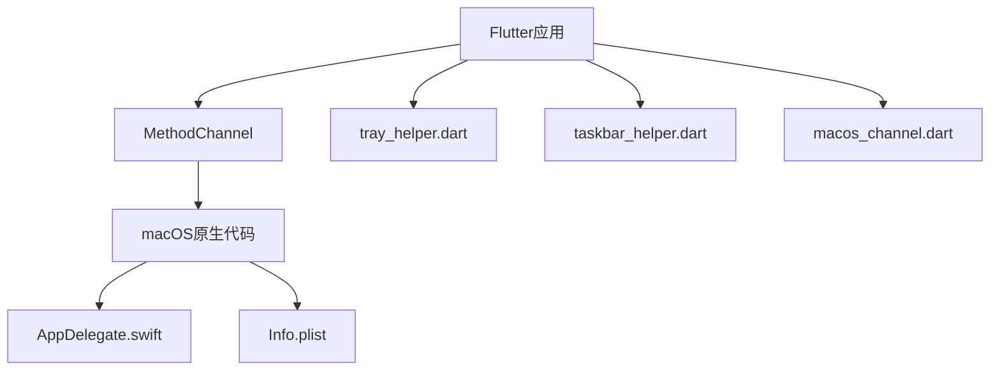
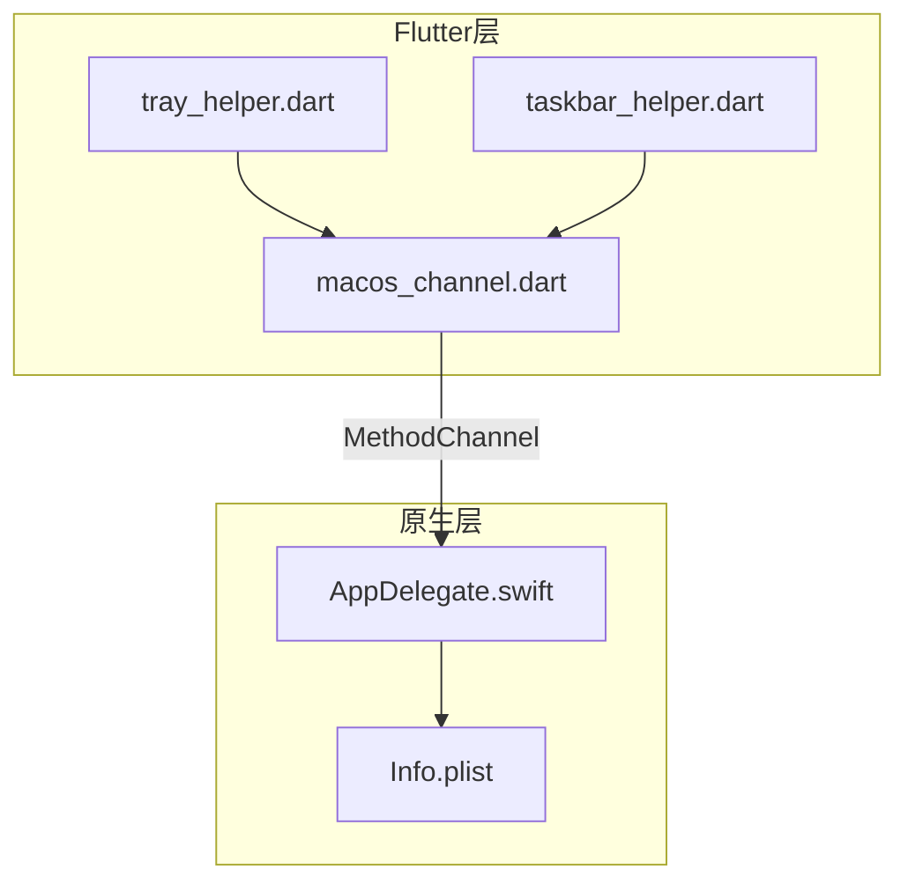
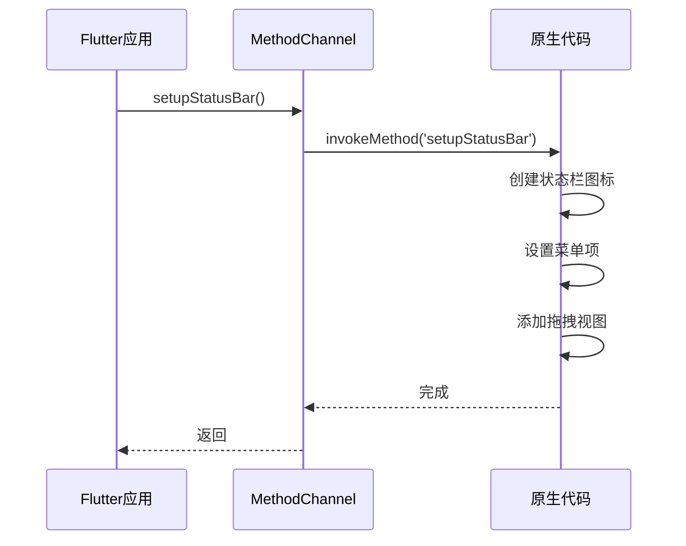
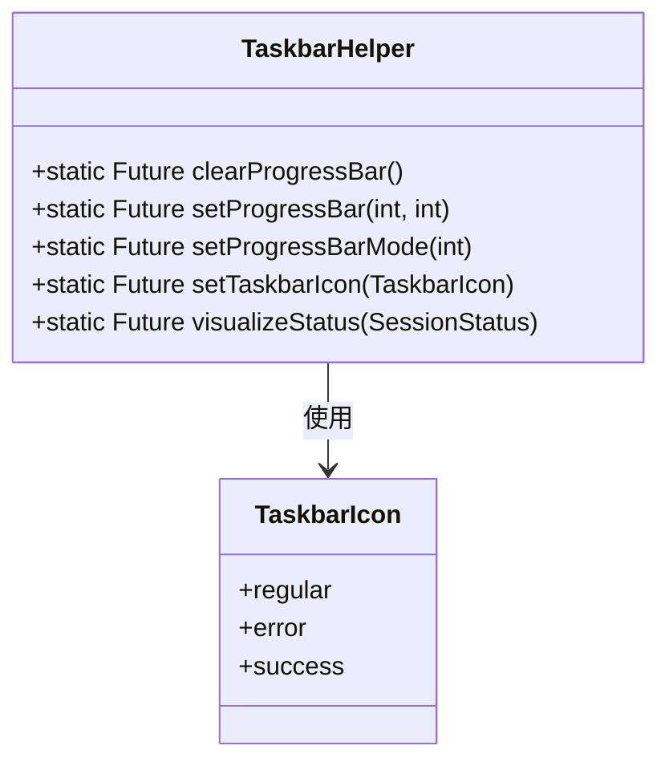
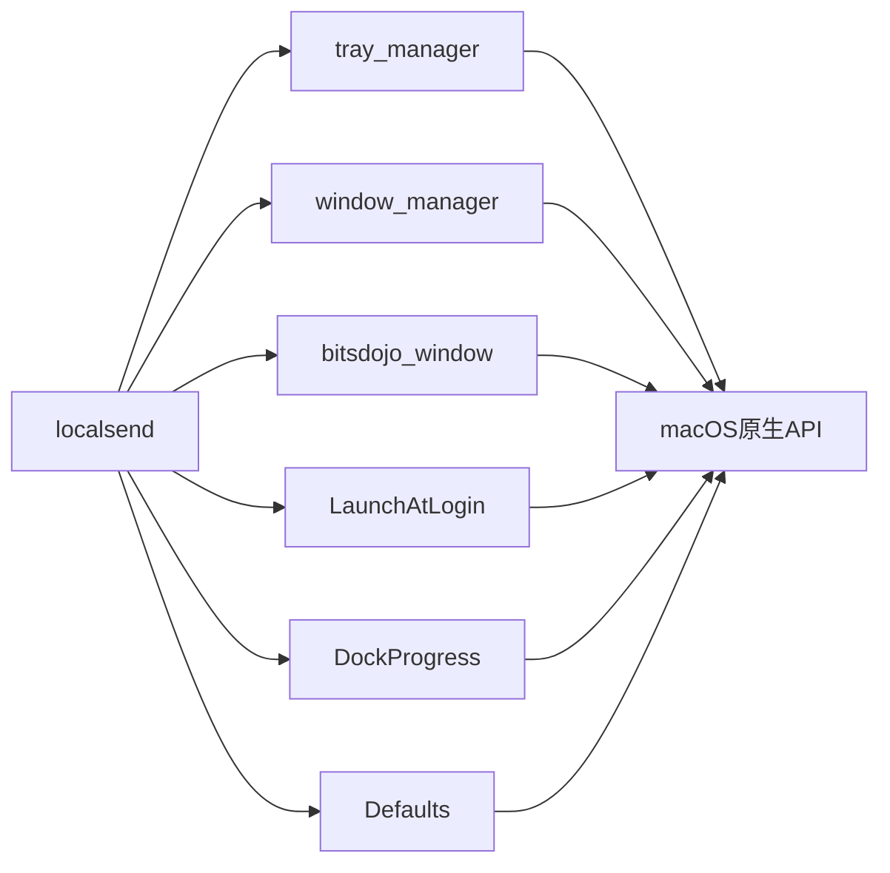

# 系统集成功能

<cite>
**本文档引用的文件**  
- [tray_helper.dart](file://app/lib/util/native/tray_helper.dart)
- [taskbar_helper.dart](file://app/lib/util/native/taskbar_helper.dart)
- [macos_channel.dart](file://app/lib/util/native/macos_channel.dart)
- [AppDelegate.swift](file://app/macos/Runner/AppDelegate.swift)
- [Info.plist](file://app/macos/Runner/Info.plist)
</cite>

## 目录
1. [简介](#简介)
2. [项目结构](#项目结构)
3. [核心组件](#核心组件)
4. [架构概述](#架构概述)
5. [详细组件分析](#详细组件分析)
6. [依赖分析](#依赖分析)
7. [性能考虑](#性能考虑)
8. [故障排除指南](#故障排除指南)
9. [结论](#结论)

## 简介
本项目是一个跨平台的文件共享应用，支持macOS系统深度集成。文档重点介绍状态栏图标管理、Dock集成、系统偏好设置联动等macOS特定功能的实现机制。通过Flutter插件与原生Swift代码的结合，实现了丰富的系统级交互功能，包括状态栏菜单、拖拽操作、启动项管理等。

## 项目结构
项目采用标准的Flutter多平台架构，macOS相关代码位于`app/macos`目录下，Flutter层的系统集成逻辑位于`app/lib/util/native`目录中。通过MethodChannel实现Flutter与原生代码的通信。



**图示来源**
- [tray_helper.dart](file://app/lib/util/native/tray_helper.dart)
- [macos_channel.dart](file://app/lib/util/native/macos_channel.dart)
- [AppDelegate.swift](file://app/macos/Runner/AppDelegate.swift)

**章节来源**
- [app/lib/util/native](file://app/lib/util/native)
- [app/macos](file://app/macos)

## 核心组件
核心系统集成功能由`tray_helper.dart`和`taskbar_helper.dart`两个文件实现，通过`macos_channel.dart`与原生代码通信。状态栏图标管理、Dock进度显示、启动项配置等功能构成了系统集成的核心。

**章节来源**
- [tray_helper.dart](file://app/lib/util/native/tray_helper.dart#L1-L96)
- [taskbar_helper.dart](file://app/lib/util/native/taskbar_helper.dart#L1-L88)

## 架构概述
系统集成架构采用分层设计，Flutter层负责业务逻辑和UI，通过MethodChannel与原生层通信，原生层处理系统级API调用。这种设计实现了跨平台抽象与平台特定功能的平衡。



**图示来源**
- [tray_helper.dart](file://app/lib/util/native/tray_helper.dart)
- [taskbar_helper.dart](file://app/lib/util/native/taskbar_helper.dart)
- [macos_channel.dart](file://app/lib/util/native/macos_channel.dart)
- [AppDelegate.swift](file://app/macos/Runner/AppDelegate.swift)

## 详细组件分析

### 状态栏图标管理分析
`tray_helper.dart`文件实现了跨平台的状态栏图标管理，但在macOS上部分功能由原生代码处理。`initTray()`函数初始化系统托盘，但在macOS上直接返回，因为状态栏图标在`AppDelegate.swift`中创建。



**图示来源**
- [tray_helper.dart](file://app/lib/util/native/tray_helper.dart#L28-L30)
- [macos_channel.dart](file://app/lib/util/native/macos_channel.dart#L7-L12)
- [AppDelegate.swift](file://app/macos/Runner/AppDelegate.swift#L100-L140)

**章节来源**
- [tray_helper.dart](file://app/lib/util/native/tray_helper.dart#L1-L96)
- [AppDelegate.swift](file://app/macos/Runner/AppDelegate.swift#L100-L140)

### 跨平台抽象设计分析
`taskbar_helper.dart`实现了Windows任务栏和macOS Dock的统一抽象。通过`TaskbarIcon`枚举和相关方法，提供了跨平台的图标状态管理。



**图示来源**
- [taskbar_helper.dart](file://app/lib/util/native/taskbar_helper.dart#L1-L88)
- [tray_helper.dart](file://app/lib/util/native/tray_helper.dart#L4-L9)

**章节来源**
- [taskbar_helper.dart](file://app/lib/util/native/taskbar_helper.dart#L1-L88)

### 系统集成事件流分析
系统集成功能涉及多种事件的处理，包括状态栏点击、文件拖拽、URL打开等。这些事件通过MethodChannel从原生层传递到Flutter层。

```mermaid
flowchart TD
A[状态栏点击] --> B[showLocalSendFromMenuBar]
C[文件拖拽到Dock] --> D[application(_:openFile:)]
E[URL打开] --> F[application(_:open:urls:)]
G[文本服务] --> H[handleSendTextService]
B --> I[Flutter层处理]
D --> I
F --> I
H --> I
```

**图示来源**
- [AppDelegate.swift](file://app/macos/Runner/AppDelegate.swift#L150-L260)
- [macos_channel.dart](file://app/lib/util/native/macos_channel.dart#L74-L92)

**章节来源**
- [AppDelegate.swift](file://app/macos/Runner/AppDelegate.swift#L150-L260)

## 依赖分析
系统集成功能依赖多个Flutter插件和原生库，通过Podfile.lock可以查看具体的依赖关系。



**图示来源**
- [Podfile.lock](file://app/macos/Podfile.lock)
- [pubspec.yaml](file://app/pubspec.yaml)

**章节来源**
- [Podfile.lock](file://app/macos/Podfile.lock)
- [pubspec.yaml](file://app/pubspec.yaml)

## 性能考虑
系统集成相关的性能考虑主要包括：
1. 状态栏图标的创建和更新应尽量减少资源消耗
2. 拖拽操作的响应应快速流畅
3. 事件处理应避免阻塞主线程
4. 内存管理应避免泄漏

在实现中，通过异步调用和适当的资源管理来确保性能。例如，`setupPendingItemsObservation()`使用观察者模式来响应数据变化，而不是轮询。

## 故障排除指南
系统集成相关的常见问题和解决方案：

**章节来源**
- [tray_helper.dart](file://app/lib/util/native/tray_helper.dart#L50-L55)
- [AppDelegate.swift](file://app/macos/Runner/AppDelegate.swift#L200-L220)

### 状态栏图标不显示
- 检查Info.plist中的配置
- 确保AppDelegate.swift中正确调用了setupStatusBarItem
- 验证图标资源文件是否存在

### 拖拽功能失效
- 检查应用是否具有必要的文件访问权限
- 验证ContentDropView是否正确添加到状态栏按钮
- 确认SecurityScopedResourceManager配置正确

### 启动项配置不生效
- 检查LaunchAtLogin插件是否正确集成
- 验证UserDefaults存储是否正常
- 确认应用已获得必要的系统权限

## 结论
本项目的macOS系统集成实现了一个功能完整且用户体验良好的系统级应用。通过合理的架构设计，实现了跨平台抽象与平台特定功能的平衡。`tray_helper.dart`和`taskbar_helper.dart`提供了清晰的API，`macos_channel.dart`作为桥梁连接Flutter与原生代码，`AppDelegate.swift`处理复杂的系统级交互。这种分层设计使得代码易于维护和扩展，为未来的功能添加奠定了良好的基础。