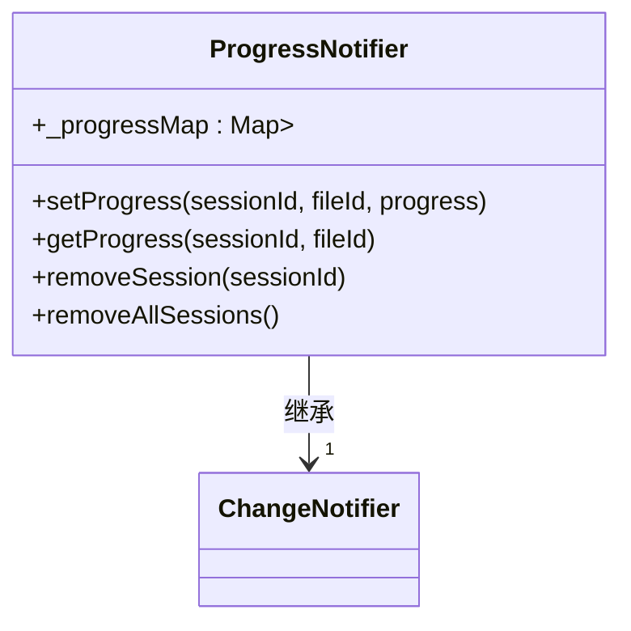
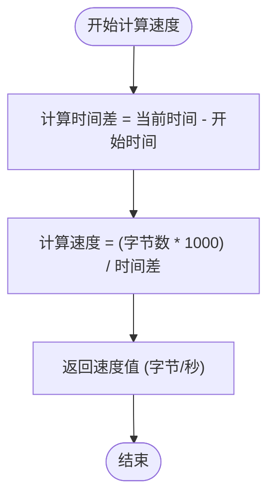
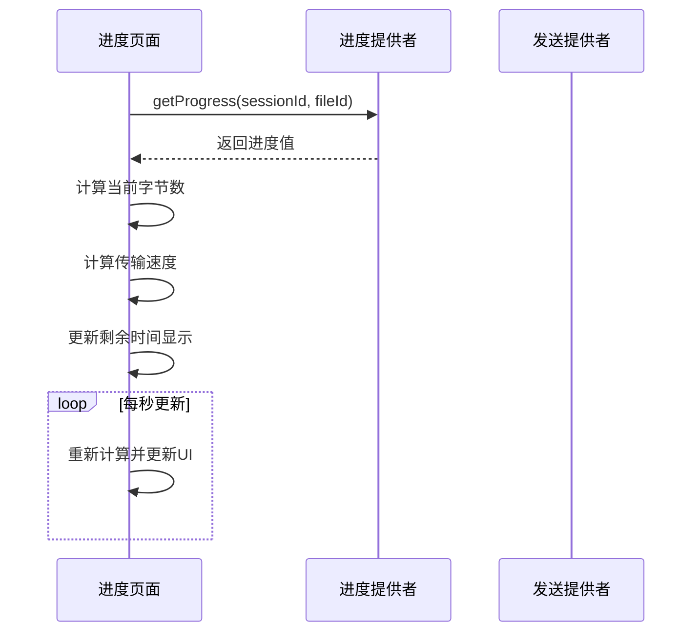
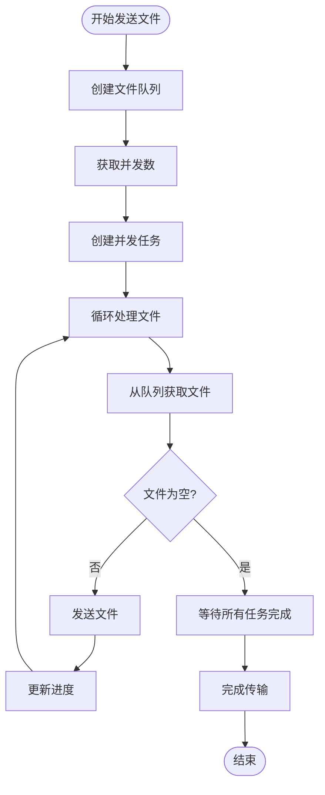

# 性能问题

<cite>
**本文档中引用的文件**   
- [progress_page.dart](file://app/lib/pages/progress_page.dart)
- [file_speed_helper.dart](file://app/lib/util/file_speed_helper.dart)
- [send_provider.dart](file://app/lib/provider/network/send_provider.dart)
- [settings_provider.dart](file://app/lib/provider/settings_provider.dart)
- [network_interfaces.dart](file://common/lib/util/network_interfaces.dart)
- [progress_provider.dart](file://app/lib/provider/progress_provider.dart)
</cite>

## 目录
1. [介绍](#介绍)
2. [影响文件传输性能的因素](#影响文件传输性能的因素)
3. [性能监控方法](#性能监控方法)
4. [性能瓶颈识别](#性能瓶颈识别)
5. [性能优化建议](#性能优化建议)
6. [传输速度计算与显示机制](#传输速度计算与显示机制)
7. [代码示例](#代码示例)

## 介绍
LocalSend 是一个跨平台的文件传输应用，通过局域网实现设备间的快速文件共享。本文档详细分析了影响文件传输性能的各种因素，包括网络带宽、设备性能、加密开销和并发连接数等。同时，文档还介绍了性能监控方法、性能瓶颈识别技术以及优化建议，帮助用户提升文件传输效率。

## 影响文件传输性能的因素

### 网络带宽
网络带宽是影响文件传输速度的最主要因素。LocalSend 通过局域网进行文件传输，传输速度直接受到网络环境的影响。Wi-Fi 网络的信号强度、干扰程度以及网络拥塞情况都会影响实际的传输带宽。有线网络通常能提供更稳定和更高的带宽。

### 设备性能
发送和接收设备的性能也会影响传输速度。设备的 CPU 处理能力、内存大小以及磁盘 I/O 速度都会成为性能瓶颈。特别是在处理大文件或多个文件同时传输时，设备性能的影响更加明显。

### 加密开销
LocalSend 使用 HTTPS 协议进行安全传输，这需要进行加密和解密操作。加密过程会消耗 CPU 资源，特别是在使用较弱的加密算法或在性能较差的设备上运行时，加密开销会显著影响传输速度。

### 并发连接数
LocalSend 支持并发传输多个文件。并发连接数的设置会影响整体传输性能。过多的并发连接可能导致网络拥塞和设备资源过度消耗，而过少的并发连接则无法充分利用网络带宽。

**Section sources**
- [send_provider.dart](file://app/lib/provider/network/send_provider.dart#L322-L355)
- [settings_provider.dart](file://app/lib/provider/settings_provider.dart#L0-L243)

## 性能监控方法

### 进度提供者跟踪传输速度
LocalSend 使用 `ProgressProvider` 来跟踪文件传输的进度。该提供者维护一个进度映射，记录每个会话中每个文件的传输进度。

**Diagram sources**
- [progress_provider.dart](file://app/lib/provider/progress_provider.dart#L0-L37)

### 分析速度波动模式
通过定期计算和更新传输速度，可以分析速度波动模式。LocalSend 在传输过程中持续监控速度变化，帮助识别网络不稳定或设备性能波动等问题。

**Section sources**
- [progress_provider.dart](file://app/lib/provider/progress_provider.dart#L0-L37)
- [progress_page.dart](file://app/lib/pages/progress_page.dart#L178-L211)

## 性能瓶颈识别

### 网络瓶颈
网络瓶颈通常表现为传输速度远低于网络理论带宽。可以通过以下方法识别网络瓶颈：
- 检查网络连接类型（Wi-Fi 或有线）
- 监控网络信号强度
- 检测网络拥塞情况
- 检查防火墙或安全软件是否限制了网络访问

### CPU 限制
CPU 限制表现为设备 CPU 使用率接近 100%，同时传输速度无法提升。这通常发生在加密/解密操作或文件压缩/解压缩过程中。

### 磁盘 I/O 限制
磁盘 I/O 限制表现为磁盘读写速度成为瓶颈。这在处理大量小文件或大文件时尤为明显。可以通过监控磁盘使用率来识别此问题。

**Section sources**
- [send_provider.dart](file://app/lib/provider/network/send_provider.dart#L427-L463)
- [file_speed_helper.dart](file://app/lib/util/file_speed_helper.dart#L0-L50)

## 性能优化建议

### 关闭其他网络应用
在进行文件传输时，建议关闭其他占用网络带宽的应用程序，如视频流媒体、在线游戏等，以确保 LocalSend 能够充分利用可用带宽。

### 使用有线连接替代 Wi-Fi
如果可能，使用有线网络连接替代 Wi-Fi 连接。有线连接通常能提供更稳定和更高的传输速度。

### 减少并发传输数量
根据网络环境和设备性能，适当调整并发传输文件的数量。过多的并发传输可能导致网络拥塞和设备资源过度消耗。

### 优化网络配置
- 确保设备在同一局域网内
- 检查并优化路由器设置
- 避免使用自定义端口，除非必要
- 确保多播地址设置正确

**Section sources**
- [settings_provider.dart](file://app/lib/provider/settings_provider.dart#L0-L243)
- [network_interfaces.dart](file://common/lib/util/network_interfaces.dart#L0-L68)

## 传输速度计算与显示机制

### 速度计算实现
LocalSend 通过计算单位时间内传输的字节数来确定传输速度。具体实现如下：

**Diagram sources**
- [file_speed_helper.dart](file://app/lib/util/file_speed_helper.dart#L0-L24)

### 处理速度波动
为了提供更稳定的用户体验，LocalSend 对速度计算结果进行平滑处理，避免显示过于频繁的速度波动。

### 平均速度计算
平均速度通过总传输字节数除以总传输时间来计算，为用户提供整体传输效率的参考。

**Section sources**
- [file_speed_helper.dart](file://app/lib/util/file_speed_helper.dart#L0-L50)
- [progress_page.dart](file://app/lib/pages/progress_page.dart#L178-L211)

## 代码示例

### 性能监控代码示例
以下代码展示了如何在传输过程中监控和更新传输速度：

**Diagram sources**
- [progress_page.dart](file://app/lib/pages/progress_page.dart#L178-L211)
- [progress_provider.dart](file://app/lib/provider/progress_provider.dart#L0-L37)

### 优化策略代码示例
以下代码展示了并发传输的实现机制：

**Diagram sources**
- [send_provider.dart](file://app/lib/provider/network/send_provider.dart#L322-L355)
- [send_provider.dart](file://app/lib/provider/network/send_provider.dart#L427-L463)

**Section sources**
- [send_provider.dart](file://app/lib/provider/network/send_provider.dart#L322-L463)
- [progress_provider.dart](file://app/lib/provider/progress_provider.dart#L0-L37)