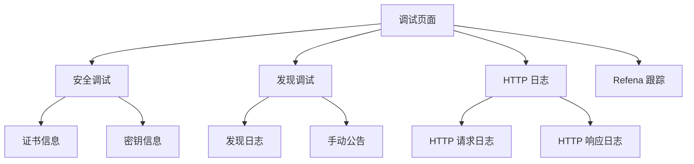

# 故障排除

<cite>
**本文档中引用的文件**
- [troubleshoot_page.dart](file://app/lib/pages/troubleshoot_page.dart)
- [http_logs_provider.dart](file://app/lib/provider/logging/http_logs_provider.dart)
- [http_provider.dart](file://app/lib/provider/http_provider.dart)
- [debug_page.dart](file://app/lib/pages/debug/debug_page.dart)
- [http_logs_page.dart](file://app/lib/pages/debug/http_logs_page.dart)
- [discovery_debug_page.dart](file://app/lib/pages/debug/discovery_debug_page.dart)
- [security_debug_page.dart](file://app/lib/pages/debug/security_debug_page.dart)
- [network_interfaces_page.dart](file://app/lib/pages/settings/network_interfaces_page.dart)
- [logging.rs](file://app/rust/src/api/logging.rs)
- [network_interfaces.dart](file://common/lib/util/network_interfaces.dart)
</cite>

## 目录
1. [简介](#简介)
2. [常见问题类别](#常见问题类别)
3. [日志分析方法](#日志分析方法)
4. [调试工具和技巧](#调试工具和技巧)
5. [网络诊断步骤](#网络诊断步骤)
6. [高级调试方法](#高级调试方法)
7. [结论](#结论)

## 简介
本故障排除指南旨在帮助用户和开发者解决 LocalSend 应用程序中的常见问题。LocalSend 是一个跨平台的文件共享应用程序，允许设备在局域网内直接传输文件。本指南系统性地列出了最常见的问题类别，包括设备发现失败、文件传输中断、连接超时和性能问题，并为每个问题提供详细的症状描述、可能原因分析和逐步解决方案。

**Section sources**
- [troubleshoot_page.dart](file://app/lib/pages/troubleshoot_page.dart)

## 常见问题类别

### 设备发现失败
**症状**: 设备无法发现其他设备，或只能单向发现。
**可能原因**:
- 设备不在同一个 Wi-Fi 网络中
- 防火墙阻止了必要的端口
- 路由器启用了 AP 隔离（客户端隔离）
- 网络接口配置不正确
- 自定义端口或组播地址导致无法通过标准发现机制找到设备

**解决方案**:
1. 确保所有设备都连接到同一个 Wi-Fi 网络。
2. 检查防火墙设置，允许 LocalSend 通过指定端口进行通信。
3. 在路由器设置中禁用 AP 隔离功能。
4. 在应用程序设置中检查网络接口配置，确保选择了正确的网络接口。
5. 如果使用了自定义端口或组播地址，请确保所有设备都使用相同的配置。

**Section sources**
- [troubleshoot_page.dart](file://app/lib/pages/troubleshoot_page.dart)
- [network_interfaces_page.dart](file://app/lib/pages/settings/network_interfaces_page.dart)

### 文件传输中断
**症状**: 文件传输过程中断，无法完成文件发送或接收。
**可能原因**:
- 网络连接不稳定
- 接收设备存储空间不足
- 防火墙或安全软件阻止了连接
- 设备在传输过程中进入休眠状态
- 文件权限问题

**解决方案**:
1. 确保发送和接收设备的网络连接稳定。
2. 检查接收设备是否有足够的存储空间。
3. 暂时禁用防火墙或安全软件进行测试。
4. 确保设备在传输过程中保持唤醒状态。
5. 检查文件权限，确保应用程序有读取和写入权限。

**Section sources**
- [troubleshoot_page.dart](file://app/lib/pages/troubleshoot_page.dart)

### 连接超时
**症状**: 设备之间无法建立连接，出现连接超时错误。
**可能原因**:
- 网络延迟过高
- 设备之间的距离过远导致信号弱
- 网络拥塞
- 应用程序发现超时设置过短

**解决方案**:
1. 将设备移近以改善信号强度。
2. 减少网络上的其他流量以降低拥塞。
3. 在应用程序设置中增加发现超时时间。
4. 重启路由器和设备以刷新网络连接。

**Section sources**
- [troubleshoot_page.dart](file://app/lib/pages/tabs/settings_tab.dart#L412-L438)

### 性能问题
**症状**: 文件传输速度慢，应用程序响应迟缓。
**可能原因**:
- 网络带宽限制
- 设备硬件性能不足
- 后台进程占用过多资源
- 无线网络信号质量差

**解决方案**:
1. 确保使用 5GHz Wi-Fi 网络以获得更高的传输速度。
2. 关闭不必要的后台应用程序以释放系统资源。
3. 检查设备的 CPU 和内存使用情况。
4. 将设备移至路由器附近以获得更好的信号质量。

## 日志分析方法

### 访问日志
LocalSend 提供了多种日志类型，可以通过内置的调试页面访问：

1. **HTTP 日志**: 记录所有 HTTP 请求和响应
2. **发现日志**: 记录设备发现过程中的信息
3. **安全日志**: 记录与安全相关的事件，如证书信息

要访问这些日志，请导航到应用程序的"调试"页面，然后选择相应的日志类型。

### 解读日志
**HTTP 日志**:
- 记录格式: `[时间戳] HTTP Request: 方法 URL`
- 示例: `[14:30:25] HTTP Request: POST http://192.168.1.100:53317/api/send`
- 用途: 用于诊断文件传输过程中的问题，查看请求是否成功发送和接收

**发现日志**:
- 记录设备发现过程中的详细信息
- 包括成功发现的设备和发现失败的尝试
- 用于诊断设备发现失败的问题

**错误日志**:
- 记录应用程序运行过程中的错误和异常
- 包含详细的错误信息和堆栈跟踪
- 用于诊断应用程序崩溃或功能异常的问题

**Section sources**
- [http_logs_provider.dart](file://app/lib/provider/logging/http_logs_provider.dart)
- [http_provider.dart](file://app/lib/provider/http_provider.dart)
- [http_logs_page.dart](file://app/lib/pages/debug/http_logs_page.dart)
- [discovery_debug_page.dart](file://app/lib/pages/debug/discovery_debug_page.dart)

## 调试工具和技巧

### 内置调试页面
LocalSend 提供了多个内置调试页面，可通过"设置" -> "高级" -> "调试"访问：

- **安全调试**: 显示当前的安全上下文，包括证书 SHA-256 指纹、证书、私钥和公钥
- **发现调试**: 显示设备发现过程中的详细日志，可以手动触发设备公告
- **HTTP 日志**: 显示所有 HTTP 请求和响应的详细日志
- **Refena 跟踪**: 在调试模式下可用，显示状态管理的详细跟踪信息



**Diagram sources**
- [debug_page.dart](file://app/lib/pages/debug/debug_page.dart)
- [security_debug_page.dart](file://app/lib/pages/debug/security_debug_page.dart)

### 日志查看器
日志查看器允许用户实时查看应用程序的运行日志：

1. **HTTP 日志查看器**: 显示所有 HTTP 请求和响应，包括方法、URL 和响应体大小
2. **发现日志查看器**: 显示设备发现过程中的详细信息，包括发现的设备和发现失败的尝试
3. **清除日志**: 可以随时清除日志以开始新的诊断会话

**Section sources**
- [http_logs_page.dart](file://app/lib/pages/debug/http_logs_page.dart)
- [discovery_debug_page.dart](file://app/lib/pages/debug/discovery_debug_page.dart)

## 网络诊断步骤

### 检查防火墙设置
防火墙是导致 LocalSend 无法正常工作的最常见原因之一。以下是检查和配置防火墙的步骤：

1. **Windows**:
   - 打开"Windows 安全中心"
   - 选择"防火墙和网络保护"
   - 点击"允许应用通过防火墙"
   - 确保 LocalSend 在允许的应用列表中
   - 或者使用管理员权限运行以下命令:
     ```
     netsh advfirewall firewall add rule name="LocalSend" dir=in action=allow protocol=TCP localport=53317
     netsh advfirewall firewall add rule name="LocalSend" dir=in action=allow protocol=UDP localport=53317
     ```

2. **macOS**:
   - 打开"系统设置"
   - 选择"网络"
   - 选择当前使用的网络接口
   - 点击"防火墙"选项卡
   - 确保 LocalSend 被允许通过防火墙

3. **Linux**:
   - 使用相应的防火墙管理工具（如 ufw、iptables）允许 LocalSend 使用的端口

**Section sources**
- [troubleshoot_page.dart](file://app/lib/pages/troubleshoot_page.dart)

### 检查路由器配置
路由器配置可能会影响 LocalSend 的正常工作：

1. **AP 隔离（客户端隔离）**:
   - 登录路由器管理界面
   - 查找"无线设置"或"安全设置"
   - 禁用"AP 隔离"或"客户端隔离"功能
   - 保存设置并重启路由器

2. **组播设置**:
   - 确保路由器支持并启用了组播功能
   - 检查组播地址设置是否正确（默认为 239.1.2.3）

**Section sources**
- [troubleshoot_page.dart](file://app/lib/pages/troubleshoot_page.dart)

### 检查设备网络状态
确保所有设备的网络状态正常：

1. **检查 IP 地址**:
   - 确保所有设备都在同一个子网内
   - 例如，所有设备的 IP 地址都应以相同的前缀开头（如 192.168.1.x）

2. **测试网络连接**:
   - 使用 ping 命令测试设备之间的连接
   - 例如: `ping 192.168.1.100`

3. **检查网络接口**:
   - 在 LocalSend 设置中查看网络接口列表
   - 确保选择了正确的网络接口
   - 可以使用白名单或黑名单功能来指定允许或禁止的网络接口

**Section sources**
- [network_interfaces_page.dart](file://app/lib/pages/settings/network_interfaces_page.dart)
- [network_interfaces.dart](file://common/lib/util/network_interfaces.dart)

## 高级调试方法

### 使用网络抓包工具
对于高级用户，可以使用网络抓包工具来分析 LocalSend 的通信：

1. **Wireshark**:
   - 捕获网络流量以分析 LocalSend 的通信协议
   - 过滤特定端口的流量（默认为 53317）
   - 分析 UDP 组播和 TCP 连接

2. **tcpdump**:
   - 在命令行中使用 tcpdump 捕获网络流量
   - 例如: `tcpdump -i any port 53317`

### 启用调试日志
可以通过 Rust 后端 API 启用调试日志以获取更详细的运行信息：

```rust
pub fn enable_debug_logging() -> Result<()> {
    tracing_subscriber::fmt()
        .with_max_level(Level::DEBUG)
        .try_init()
        .map_err(|e| anyhow::anyhow!(e.to_string()))?;

    Ok(())
}
```

此函数会启用调试级别的日志记录，提供更详细的运行时信息。

**Section sources**
- [logging.rs](file://app/rust/src/api/logging.rs)

### 分析网络接口配置
LocalSend 允许用户配置网络接口的白名单和黑名单：

1. **白名单**: 只允许指定的网络接口
2. **黑名单**: 禁止指定的网络接口

这些配置可以通过正则表达式进行精细控制，例如:
- `192.168.1.*` 匹配 192.168.1.0/24 网络中的所有 IP 地址
- `10.*` 匹配所有以 10 开头的 IP 地址

**Section sources**
- [network_interfaces_page.dart](file://app/lib/pages/settings/network_interfaces_page.dart)
- [network_interfaces.dart](file://common/lib/util/network_interfaces.dart)

## 结论
本故障排除指南提供了系统性的方法来解决 LocalSend 应用程序中的常见问题。通过理解常见的问题类别、掌握日志分析方法、使用内置的调试工具、执行网络诊断步骤以及应用高级调试技术，用户和开发者可以有效地诊断和解决各种问题。记住，大多数问题都可以通过检查网络连接、防火墙设置和应用程序配置来解决。对于更复杂的问题，可以使用日志分析和网络抓包工具进行深入诊断。