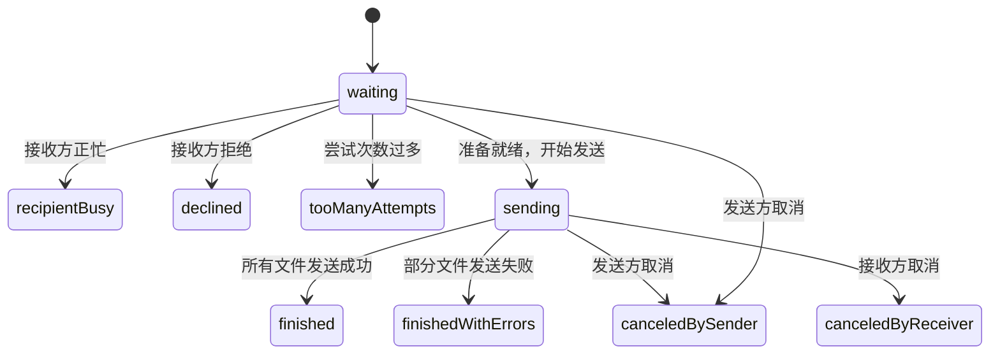
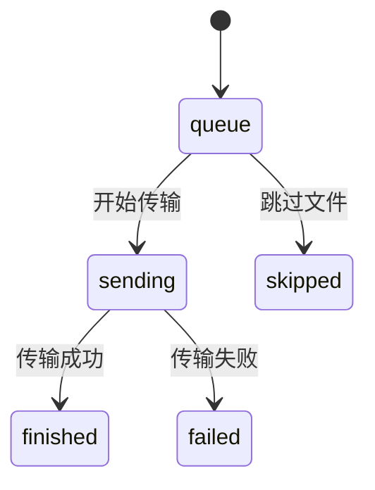
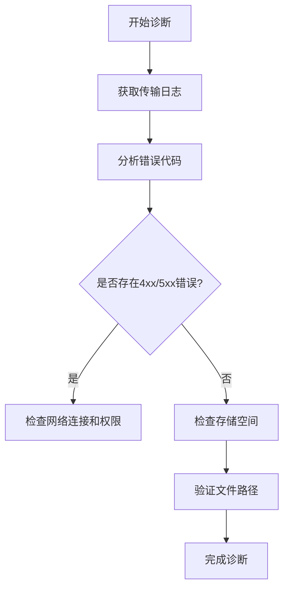
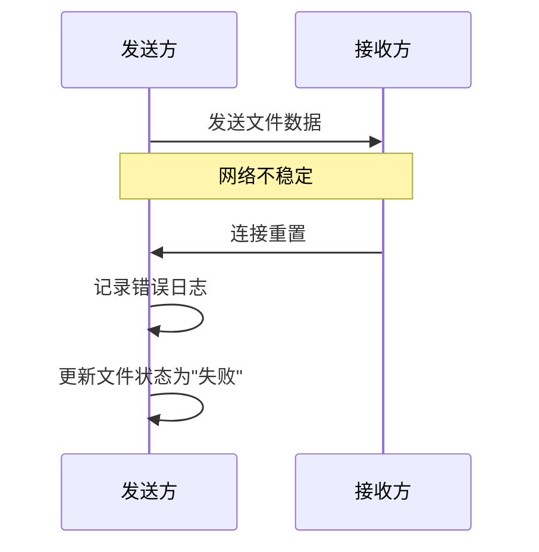

# 文件传输中断

<cite>
**本文档中引用的文件**  
- [file_status.dart](file://common/lib/model/file_status.dart)
- [session_status.dart](file://common/lib/model/session_status.dart)
- [send_provider.dart](file://app/lib/provider/network/send_provider.dart)
- [receive_controller.dart](file://app/lib/provider/network/server/controller/receive_controller.dart)
- [progress_provider.dart](file://app/lib/provider/progress_provider.dart)
- [file_saver.dart](file://app/lib/util/native/file_saver.dart)
- [settings_provider.dart](file://app/lib/provider/settings_provider.dart)
</cite>

## 目录
1. [引言](#引言)
2. [文件传输状态机](#文件传输状态机)
3. [传输中断的可能原因](#传输中断的可能原因)
4. [诊断方法](#诊断方法)
5. [错误处理机制](#错误处理机制)
6. [解决方案与最佳实践](#解决方案与最佳实践)
7. [重试机制与代码示例](#重试机制与代码示例)
8. [结论](#结论)

## 引言

文件传输中断是用户在使用LocalSend进行跨设备文件共享时可能遇到的常见问题。本故障排除指南深入分析了导致传输中断的各种原因，包括网络不稳定、设备睡眠、存储空间不足、文件路径问题和权限限制。通过详细解析传输状态机的工作流程，从准备上传到数据传输完成的各个阶段，本文提供了全面的诊断方法和解决方案。此外，还介绍了如何处理不同类型的传输错误，如连接重置、超时和文件写入失败，并提供了确保设备保持唤醒状态、清理存储空间和使用有效文件路径的具体建议。

**Section sources**
- [send_provider.dart](file://app/lib/provider/network/send_provider.dart#L0-L634)
- [receive_controller.dart](file://app/lib/provider/network/server/controller/receive_controller.dart#L0-L799)

## 文件传输状态机

文件传输过程由一个明确定义的状态机管理，确保发送方和接收方之间的同步。该状态机分为会话级别和文件级别两种状态。

### 会话状态（SessionStatus）

会话状态表示整个文件传输会话的生命周期：



**Diagram sources**
- [session_status.dart](file://common/lib/model/session_status.dart#L0-L13)

### 文件状态（FileStatus）

文件状态表示单个文件在传输过程中的具体状态：



**Diagram sources**
- [file_status.dart](file://common/lib/model/file_status.dart#L0-L13)

**Section sources**
- [file_status.dart](file://common/lib/model/file_status.dart#L0-L13)
- [session_status.dart](file://common/lib/model/session_status.dart#L0-L13)

## 传输中断的可能原因

文件传输中断可能由多种因素引起，以下是最常见的几种情况：

### 网络不稳定

网络连接不稳定是导致传输中断的最常见原因。当设备之间的网络信号弱或存在干扰时，数据包可能会丢失，导致连接超时或重置。

### 设备睡眠

移动设备在一段时间不活动后会自动进入睡眠模式，这可能导致网络连接被关闭，从而中断正在进行的文件传输。

### 存储空间不足

如果接收设备的存储空间不足以容纳要接收的文件，文件写入操作将失败，导致传输中断。

### 文件路径问题

文件路径中包含非法字符或路径过长可能导致文件系统无法正确处理文件保存操作。

### 权限限制

在Android等操作系统上，应用需要特定的权限才能访问外部存储或SD卡。如果权限未被授予，文件保存将失败。

**Section sources**
- [receive_controller.dart](file://app/lib/provider/network/server/controller/receive_controller.dart#L398-L437)
- [file_saver.dart](file://app/lib/util/native/file_saver.dart#L191-L231)

## 诊断方法

为了有效诊断文件传输中断问题，可以采用以下几种方法：

### 检查传输日志

通过分析传输日志，可以获取详细的错误信息和传输过程中的关键事件。



**Diagram sources**
- [send_provider.dart](file://app/lib/provider/network/send_provider.dart#L593-L633)

### 验证目标设备存储空间

在开始传输前，应检查接收设备是否有足够的存储空间来容纳要接收的文件。

### 确认文件路径有效性

确保文件路径不包含非法字符，并且路径长度在文件系统限制范围内。

**Section sources**
- [file_saver.dart](file://app/lib/util/native/file_saver.dart#L161-L189)
- [send_provider.dart](file://app/lib/provider/network/send_provider.dart#L175-L229)

## 错误处理机制

LocalSend实现了全面的错误处理机制，以应对各种传输错误。

### 连接重置和超时

当发生连接重置或超时错误时，系统会记录详细的错误信息并更新会话状态。



**Diagram sources**
- [send_provider.dart](file://app/lib/provider/network/send_provider.dart#L427-L463)

### 文件写入失败

当文件写入失败时，系统会捕获异常并提供具体的错误消息。

**Section sources**
- [receive_controller.dart](file://app/lib/provider/network/server/controller/receive_controller.dart#L465-L498)
- [file_saver.dart](file://app/lib/util/native/file_saver.dart#L0-L232)

## 解决方案与最佳实践

### 确保设备保持唤醒状态

在文件传输过程中，应确保设备不会进入睡眠模式。

```dart
// 在ProgressPage中启用Wakelock
WidgetsBinding.instance.addPostFrameCallback((_) {
  try {
    unawaited(WakelockPlus.enable());
  } catch (_) {}

  _wakelockPlusTimer = Timer.periodic(const Duration(seconds: 30), (timer) {
    final finished = ref.read(serverProvider)?.session?.files.values.map((e) => e.status).isFinishedOrSkipped ??
        ref.read(sendProvider)[widget.sessionId]?.files.values.map((e) => e.status).isFinishedOrSkipped ??
        true;
    if (finished) {
      timer.cancel();
      try {
        unawaited(WakelockPlus.disable());
      } catch (_) {}
    } else {
      try {
        unawaited(WakelockPlus.enable());
      } catch (_) {}
    }
  });
});
```

**Section sources**
- [progress_provider.dart](file://app/lib/provider/progress_provider.dart#L0-L37)
- [settings_provider.dart](file://app/lib/provider/settings_provider.dart#L0-L243)

### 清理存储空间

定期清理接收设备的存储空间，确保有足够的空间来接收新文件。

### 使用有效的文件路径

确保文件路径符合目标文件系统的命名规则和长度限制。

## 重试机制与代码示例

LocalSend实现了智能的重试机制，允许用户重新发送失败的文件。

```dart
Future<bool> sendFile({
  required String sessionId,
  required int isolateIndex,
  required SendingFile file,
  required bool isRetry,
}) async {
  // ... 传输逻辑 ...
  try {
    await for (final progress in taskResult.progress) {
      ref.notifier(progressProvider).setProgress(
            sessionId: sessionId,
            fileId: file.file.id,
            progress: progress,
          );
    }
  } catch (e, st) {
    fileError = e.humanErrorMessage;
    _logger.warning('Error while sending file ${file.file.fileName}', e, st);
  } finally {
    state = state.updateSession(
      sessionId: sessionId,
      state: (s) => s?.copyWith(
          sendingTasks: s.sendingTasks?.where((task) => !(task.isolateIndex == isolateIndex && task.taskId == taskResult.taskId)).toList()),
    );
  }

  state = state.updateSession(
    sessionId: sessionId,
    state: (s) => s?.withFileStatus(file.file.id, fileError != null ? FileStatus.failed : FileStatus.finished, fileError),
  );

  return true;
}
```

**Section sources**
- [send_provider.dart](file://app/lib/provider/network/send_provider.dart#L427-L463)

## 结论

文件传输中断问题可以通过理解传输状态机、识别常见原因、使用适当的诊断方法和实施有效的解决方案来解决。通过确保设备保持唤醒状态、验证存储空间和文件路径，以及利用内置的错误处理和重试机制，用户可以显著提高文件传输的成功率。LocalSend的设计考虑了各种可能的故障场景，并提供了相应的处理机制，以确保文件传输的可靠性和用户体验。