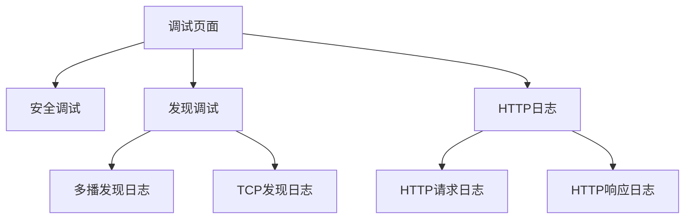
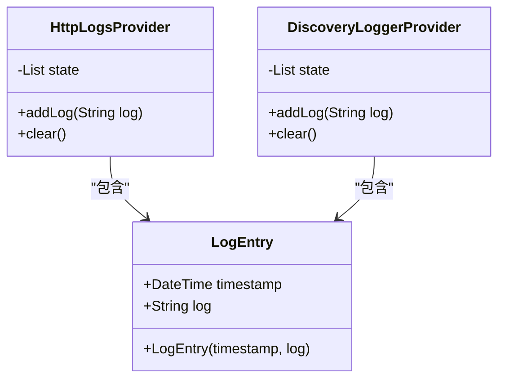
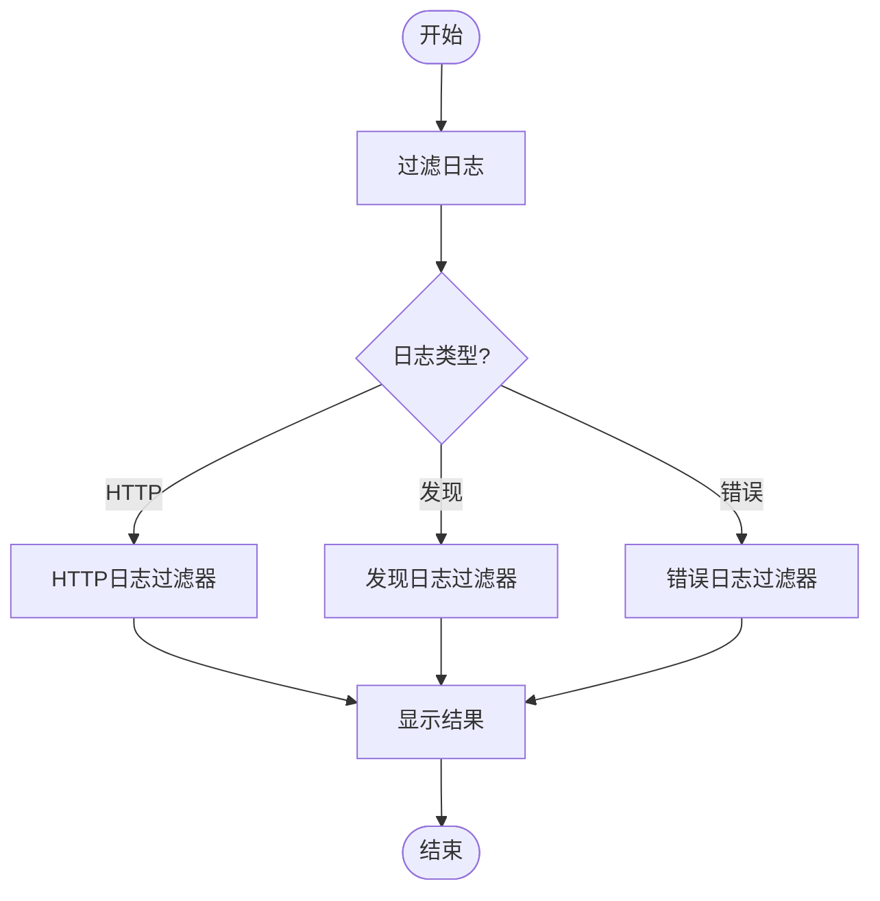
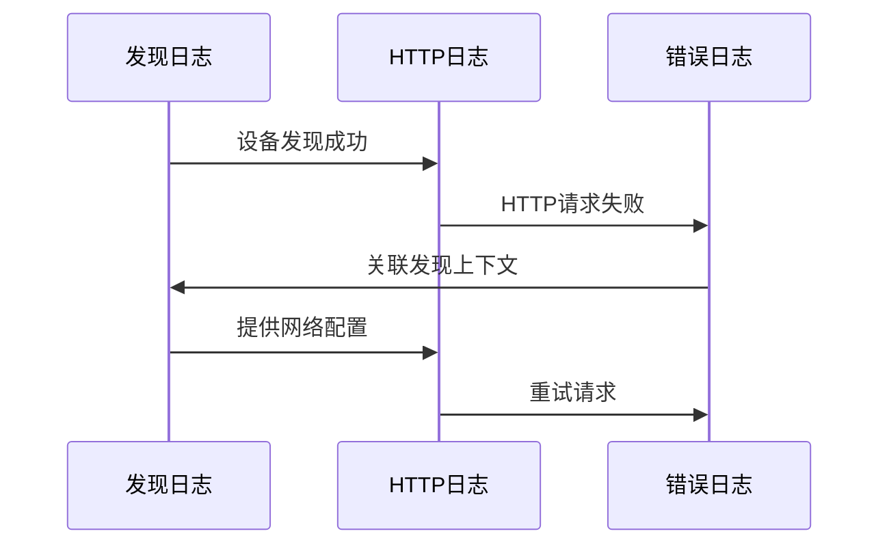

# 日志分析方法

<cite>
**本文档引用的文件**
- [log_entry.dart](file://app/lib/model/log_entry.dart)
- [logger.dart](file://common/lib/util/logger.dart)
- [http_logs_provider.dart](file://app/lib/provider/logging/http_logs_provider.dart)
- [discovery_logs_provider.dart](file://app/lib/provider/logging/discovery_logs_provider.dart)
- [http_provider.dart](file://app/lib/provider/http_provider.dart)
- [logging.rs](file://app/rust/src/api/logging.rs)
- [server/src/config/error.rs](file://server/src/config/error.rs)
</cite>

## 目录
1. [简介](#简介)
2. [日志类型](#日志类型)
3. [日志访问方法](#日志访问方法)
4. [日志格式与关键字段](#日志格式与关键字段)
5. [日志分析技巧](#日志分析技巧)
6. [常见问题诊断](#常见问题诊断)
7. [实际日志示例](#实际日志示例)
8. [结论](#结论)

## 简介
LocalSend 应用程序提供了全面的日志记录系统，用于调试和监控应用程序的运行状态。本指南详细介绍了系统中不同类型的日志，包括HTTP日志、发现日志和错误日志，以及如何访问、查看和分析这些日志来诊断常见问题。

**Section sources**
- [log_entry.dart](file://app/lib/model/log_entry.dart#L1-L20)
- [logger.dart](file://common/lib/util/logger.dart#L1-L20)

## 日志类型
LocalSend 系统实现了多种类型的日志记录，每种日志都有特定的用途和关注点。

### HTTP日志
HTTP日志记录了所有HTTP请求和响应的详细信息。这些日志对于调试网络通信问题、分析API调用和监控数据传输非常有用。HTTP日志包括请求方法、URL、状态码和响应体等关键信息。

**Section sources**
- [http_logs_provider.dart](file://app/lib/provider/logging/http_logs_provider.dart#L1-L31)
- [http_provider.dart](file://app/lib/provider/http_provider.dart#L1-L52)

### 发现日志
发现日志记录了设备发现过程中的所有活动。这些日志跟踪设备如何通过多播、HTTP扫描和信号服务器等方式相互发现。发现日志对于诊断设备发现失败、网络连接问题和设备可见性问题至关重要。

**Section sources**
- [discovery_logs_provider.dart](file://app/lib/provider/logging/discovery_logs_provider.dart#L1-L31)
- [common/lib/src/task/discovery/multicast_discovery.dart](file://common/lib/src/task/discovery/multicast_discovery.dart#L129-L157)

### 错误日志
错误日志捕获系统中发生的各种错误和异常情况。这些日志包括详细的错误消息、堆栈跟踪和上下文信息，对于诊断和修复问题至关重要。错误日志由Rust后端和Dart前端共同生成。

**Section sources**
- [server/src/config/error.rs](file://server/src/config/error.rs#L1-L58)
- [logger.dart](file://common/lib/util/logger.dart#L1-L20)

## 日志访问方法
LocalSend 提供了多种访问和查看日志的方法，包括内置的调试页面和日志提供者。

### 内置调试页面
应用程序提供了专门的调试页面来查看不同类型的日志。用户可以通过主调试页面导航到特定的日志查看器。



**Diagram sources**
- [debug_page.dart](file://app/lib/pages/debug/debug_page.dart#L1-L94)
- [http_logs_page.dart](file://app/lib/pages/debug/http_logs_page.dart#L1-L45)

### 日志提供者
日志提供者是管理日志数据的核心组件。它们负责收集、存储和提供日志条目给UI组件。每个日志类型都有对应的提供者。



**Diagram sources**
- [log_entry.dart](file://app/lib/model/log_entry.dart#L1-L20)
- [http_logs_provider.dart](file://app/lib/provider/logging/http_logs_provider.dart#L1-L31)
- [discovery_logs_provider.dart](file://app/lib/provider/logging/discovery_logs_provider.dart#L1-L31)

## 日志格式与关键字段
了解日志的格式和关键字段对于有效分析日志至关重要。

### 日志格式
LocalSend 的日志遵循统一的格式，包含时间戳、日志级别和日志消息。日志消息通常包含操作类型、目标地址和结果状态。

**Section sources**
- [logger.dart](file://common/lib/util/logger.dart#L1-L20)
- [logging.rs](file://app/rust/src/api/logging.rs#L1-L10)

### 关键字段
日志中的关键字段提供了诊断问题所需的重要信息。

| 字段 | 描述 | 示例 |
|------|------|------|
| 时间戳 | 日志条目生成的时间 | 2023-12-01 14:30:25 |
| 日志级别 | 消息的严重程度 | INFO, WARNING, ERROR |
| 请求方法 | HTTP请求方法 | GET, POST, PUT |
| 状态码 | HTTP响应状态码 | 200, 404, 500 |
| 错误信息 | 错误的详细描述 | "Connection refused" |

**Section sources**
- [http_provider.dart](file://app/lib/provider/http_provider.dart#L1-L52)
- [server/src/config/error.rs](file://server/src/config/error.rs#L1-L58)

## 日志分析技巧
有效的日志分析需要掌握一些技巧和方法。

### 过滤特定类型的日志
通过日志提供者的API，可以轻松过滤特定类型的日志。例如，只查看HTTP错误或发现失败的日志。



**Diagram sources**
- [http_logs_provider.dart](file://app/lib/provider/logging/http_logs_provider.dart#L1-L31)
- [discovery_logs_provider.dart](file://app/lib/provider/logging/discovery_logs_provider.dart#L1-L31)

### 搜索关键错误信息
使用内置的搜索功能或文本编辑器的搜索功能，可以快速定位关键错误信息。常见的搜索关键词包括"error"、"failed"和"exception"。

**Section sources**
- [logger.dart](file://common/lib/util/logger.dart#L1-L20)
- [server/src/config/error.rs](file://server/src/config/error.rs#L1-L58)

### 关联多个日志条目分析问题
复杂问题通常需要关联多个日志条目来分析。例如，一个HTTP错误可能与之前的发现日志和后续的安全日志相关联。



**Diagram sources**
- [discovery_logs_provider.dart](file://app/lib/provider/logging/discovery_logs_provider.dart#L1-L31)
- [http_logs_provider.dart](file://app/lib/provider/logging/http_logs_provider.dart#L1-L31)

## 常见问题诊断
日志分析是诊断常见问题的关键工具。

### 连接失败
连接失败通常由网络配置、防火墙设置或服务未运行引起。检查发现日志和HTTP日志可以帮助确定问题根源。

**Section sources**
- [common/lib/src/task/discovery/http_target_discovery.dart](file://common/lib/src/task/discovery/http_target_discovery.dart#L1-L47)
- [http_provider.dart](file://app/lib/provider/http_provider.dart#L1-L52)

### 认证错误
认证错误通常与证书、指纹或安全上下文有关。安全调试页面和相关日志可以提供详细的认证信息。

**Section sources**
- [security_debug_page.dart](file://app/lib/pages/debug/security_debug_page.dart#L1-L48)
- [server/src/config/error.rs](file://server/src/config/error.rs#L1-L58)

### 数据传输问题
数据传输问题可能由网络带宽、文件大小或传输协议引起。HTTP日志和性能监控可以帮助诊断这些问题。

**Section sources**
- [http_provider.dart](file://app/lib/provider/http_provider.dart#L1-L52)
- [common/lib/src/task/discovery/http_scan_discovery.dart](file://common/lib/src/task/discovery/http_scan_discovery.dart#L34-L66)

## 实际日志示例
以下是一些实际的日志示例及其解读方法。

### HTTP请求日志示例
```
2023-12-01 14:30:25 [INFO] [HTTP] HTTP Request: POST http://192.168.1.100:53317/register
```
此日志表示向指定地址发起了POST请求以注册设备。

**Section sources**
- [http_provider.dart](file://app/lib/provider/http_provider.dart#L1-L52)

### 发现日志示例
```
2023-12-01 14:31:10 [INFO] [Discovery] [DISCOVER/TCP] Received "/register" HTTP request: MyPhone (192.168.1.101)
```
此日志表示通过TCP接收到了来自另一台设备的注册请求。

**Section sources**
- [discovery_logs_provider.dart](file://app/lib/provider/logging/discovery_logs_provider.dart#L1-L31)

### 错误日志示例
```
2023-12-01 14:32:15 [ERROR] [Server] Connection refused: http://192.168.1.102:53317/info
```
此日志表示连接到指定地址时被拒绝，可能是目标设备未运行或防火墙阻止了连接。

**Section sources**
- [server/src/config/error.rs](file://server/src/config/error.rs#L1-L58)

## 结论
LocalSend 的日志系统为开发者和用户提供了强大的调试和监控工具。通过理解不同类型的日志、掌握访问方法、熟悉日志格式和关键字段，以及应用有效的分析技巧，可以快速诊断和解决各种问题。内置的调试页面和日志提供者使得日志查看和分析变得简单直观，大大提高了问题解决的效率。