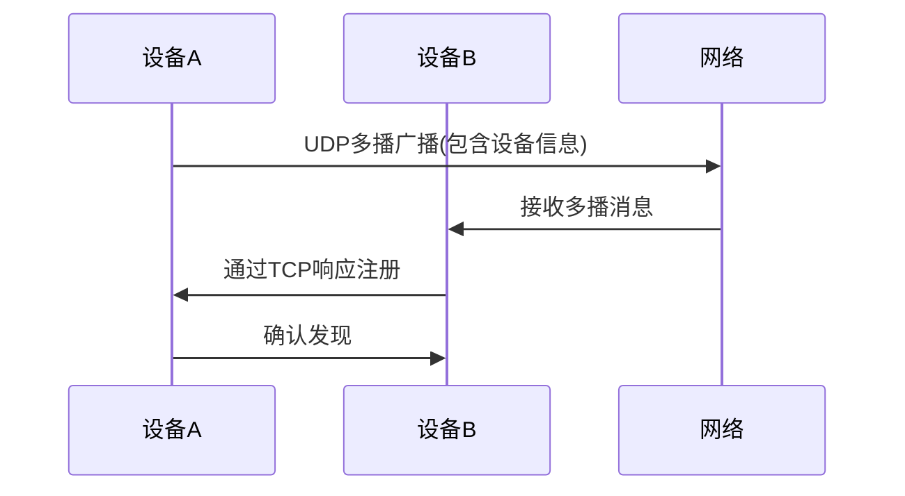
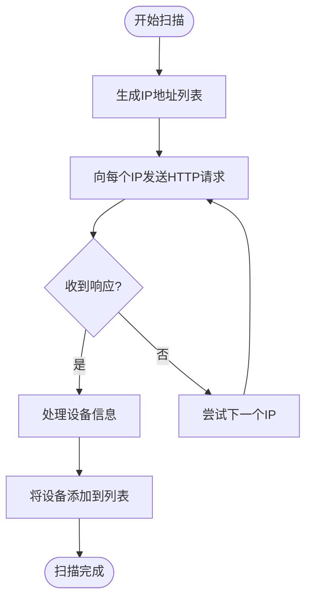
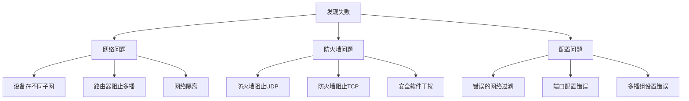
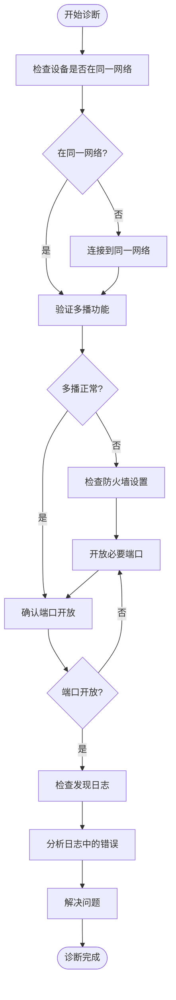
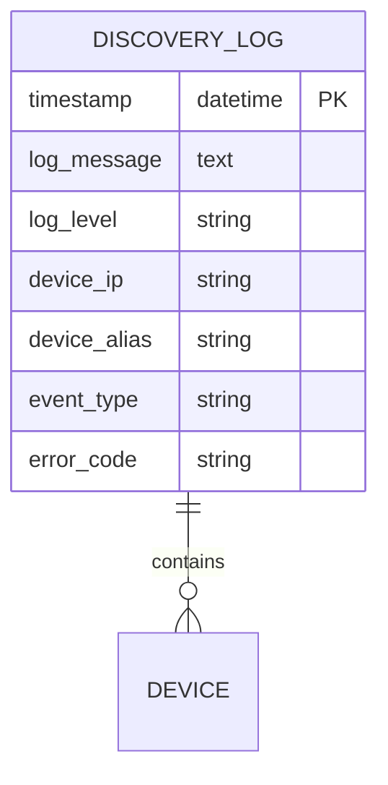

# 设备发现失败

<cite>
**本文档中引用的文件**
- [multicast_discovery.dart](file://common/lib/src/task/discovery/multicast_discovery.dart)
- [http_scan_discovery.dart](file://common/lib/src/task/discovery/http_scan_discovery.dart)
- [http_target_discovery.dart](file://common/lib/src/task/discovery/http_target_discovery.dart)
- [network_interfaces.dart](file://common/lib/util/network_interfaces.dart)
- [device.dart](file://common/lib/model/device.dart)
- [multicast_dto.dart](file://common/lib/model/dto/multicast_dto.dart)
- [troubleshoot_page.dart](file://app/lib/pages/troubleshoot_page.dart)
- [discovery_logs_provider.dart](file://app/lib/provider/logging/discovery_logs_provider.dart)
- [constants.dart](file://common/lib/constants.dart)
</cite>

## 目录
1. [介绍](#介绍)
2. [设备发现机制](#设备发现机制)
3. [常见发现失败原因](#常见发现失败原因)
4. [诊断流程](#诊断流程)
5. [日志分析](#日志分析)
6. [解决方案](#解决方案)
7. [代码示例](#代码示例)

## 介绍
本指南详细说明了LocalSend应用中设备发现失败的故障排除方法。LocalSend使用多播和HTTP扫描两种机制来发现网络中的设备。当设备无法被发现时，可能是由于网络配置、防火墙设置或设备隔离等问题。本文档将解释发现机制的工作原理，列出常见问题，并提供详细的诊断和解决方案。

## 设备发现机制
LocalSend应用使用两种主要机制来发现网络中的设备：多播发现和HTTP扫描发现。

### 多播发现
多播发现使用UDP协议在局域网中广播设备信息。设备会定期向多播组地址发送包含其信息的UDP数据包。其他设备监听这个多播组，当收到广播时，就能发现新设备。



**Diagram sources**
- [multicast_discovery.dart](file://common/lib/src/task/discovery/multicast_discovery.dart#L1-L225)
- [multicast_dto.dart](file://common/lib/model/dto/multicast_dto.dart#L1-L54)

多播发现的核心流程包括：
1. 设备绑定到UDP多播端口并加入多播组
2. 定期向多播组发送包含设备信息的UDP数据包
3. 监听来自其他设备的多播消息
4. 当收到其他设备的广播时，通过TCP连接响应注册

### HTTP扫描发现
HTTP扫描发现通过向网络中的IP地址范围发送HTTP请求来发现设备。系统会扫描同一子网内的所有IP地址，尝试连接到指定端口以确认设备是否存在。



**Diagram sources**
- [http_scan_discovery.dart](file://common/lib/src/task/discovery/http_scan_discovery.dart#L1-L67)
- [http_target_discovery.dart](file://common/lib/src/task/discovery/http_target_discovery.dart#L1-L48)

HTTP扫描发现的关键特点：
- 扫描同一子网内的256个IP地址（基于网络接口的前三个八位字节）
- 使用50个并发连接以提高扫描效率
- 通过GET请求访问设备的info端点来验证设备存在

**Section sources**
- [http_scan_discovery.dart](file://common/lib/src/task/discovery/http_scan_discovery.dart#L1-L67)
- [http_target_discovery.dart](file://common/lib/src/task/discovery/http_target_discovery.dart#L1-L48)

## 常见发现失败原因
设备发现失败可能由多种网络和配置问题引起。

### 网络隔离
当设备位于不同的子网或Wi-Fi网络时，无法相互发现。多播流量通常不会跨子网路由，而HTTP扫描只能在同一子网内工作。

### 防火墙阻止
防火墙可能阻止必要的UDP多播或TCP连接，导致发现失败。需要确保以下端口开放：
- UDP端口用于多播通信
- TCP端口用于设备间通信

### 路由器配置问题
某些路由器配置可能阻止多播流量或限制设备间的通信。特别是企业级路由器可能有严格的安全策略。

### 设备处于不同子网
如果设备连接到不同的网络段（例如，一个在2.4GHz Wi-Fi，另一个在5GHz Wi-Fi），它们可能无法直接通信。

### 网络接口过滤
应用支持网络接口白名单和黑名单功能。如果设备的网络接口被错误地列入黑名单，将无法参与发现过程。



**Diagram sources**
- [network_interfaces.dart](file://common/lib/util/network_interfaces.dart#L1-L68)
- [constants.dart](file://common/lib/constants.dart#L1-L31)

**Section sources**
- [network_interfaces.dart](file://common/lib/util/network_interfaces.dart#L1-L68)
- [constants.dart](file://common/lib/constants.dart#L1-L31)

## 诊断流程
当遇到设备发现失败时，应遵循以下系统化的诊断流程。

### 检查网络连接
首先确认所有设备是否连接到同一网络：
1. 检查设备是否连接到相同的Wi-Fi网络
2. 验证设备是否在同一子网内
3. 确认网络基础设施支持设备间通信

### 验证多播功能
测试多播功能是否正常工作：
1. 检查设备是否能够发送和接收多播数据包
2. 验证多播组地址和端口配置是否正确
3. 确认网络设备（路由器、交换机）支持多播

### 确认端口开放
确保必要的端口没有被防火墙阻止：
1. 检查UDP端口是否开放用于多播
2. 验证TCP端口是否开放用于设备通信
3. 确认安全软件没有阻止应用



**Diagram sources**
- [multicast_discovery.dart](file://common/lib/src/task/discovery/multicast_discovery.dart#L1-L225)
- [http_scan_discovery.dart](file://common/lib/src/task/discovery/http_scan_discovery.dart#L1-L67)

**Section sources**
- [multicast_discovery.dart](file://common/lib/src/task/discovery/multicast_discovery.dart#L1-L225)
- [http_scan_discovery.dart](file://common/lib/src/task/discovery/http_scan_discovery.dart#L1-L67)

## 日志分析
发现日志是诊断问题的关键工具，提供了设备发现过程的详细信息。

### 日志收集
应用维护专门的发现日志，记录所有发现相关的活动：
- 多播消息的发送和接收
- HTTP扫描请求和响应
- 设备发现和注册事件
- 网络错误和超时

### 日志解读
日志中的关键信息包括：
- **设备广播信息**: 记录设备发送的多播消息，包含设备别名、IP地址、设备型号等
- **响应超时**: 当设备未在指定时间内响应时记录的超时事件
- **网络错误**: 包括连接拒绝、主机不可达等网络层错误



**Diagram sources**
- [discovery_logs_provider.dart](file://app/lib/provider/logging/discovery_logs_provider.dart#L1-L31)
- [device.dart](file://common/lib/model/device.dart#L1-L118)

日志分析步骤：
1. 查找"Could not bind UDP multicast port"错误，表明多播绑定失败
2. 检查"Could not parse multicast message"错误，表明消息解析问题
3. 查找"Requesting [IP]"和相关响应，分析HTTP扫描过程
4. 识别重复的超时错误，可能表明网络连接问题

**Section sources**
- [discovery_logs_provider.dart](file://app/lib/provider/logging/discovery_logs_provider.dart#L1-L31)
- [multicast_discovery.dart](file://common/lib/src/task/discovery/multicast_discovery.dart#L1-L225)

## 解决方案
针对常见的发现问题，提供以下解决方案。

### 检查路由器设置
1. 登录路由器管理界面
2. 确保多播转发已启用
3. 检查是否有任何阻止设备间通信的访问控制规则
4. 确认UPnP（通用即插即用）已启用

### 防火墙配置
根据操作系统配置防火墙规则：

#### Windows
```powershell
# 添加防火墙规则允许LocalSend
netsh advfirewall firewall add rule name="LocalSend" dir=in action=allow protocol=TCP localport=53317
netsh advfirewall firewall add rule name="LocalSend" dir=in action=allow protocol=UDP localport=53317
```

#### macOS
1. 打开系统设置
2. 进入"隐私与安全性"
3. 选择"防火墙"
4. 添加LocalSend应用到允许列表

#### Linux
```bash
# 使用ufw防火墙
sudo ufw allow 53317/tcp
sudo ufw allow 53317/udp
```

### 网络配置
确保所有设备连接到同一网络：
1. 统一Wi-Fi网络名称和密码
2. 避免使用访客网络，因为它们通常隔离设备
3. 确认所有设备使用相同的网络段

### 应用设置
在LocalSend应用中检查以下设置：
- 网络接口白名单/黑名单配置
- 发现超时设置
- 端口配置是否与防火墙规则匹配

**Section sources**
- [troubleshoot_page.dart](file://app/lib/pages/troubleshoot_page.dart#L1-L227)
- [constants.dart](file://common/lib/constants.dart#L1-L31)

## 代码示例
以下是设备发现相关的核心代码示例。

### 多播发现实现
多播发现服务负责发送和接收UDP多播消息：

```dart
// 多播发现服务
class MulticastService {
  // 启动多播监听器
  Stream<Device> startListener() async* {
    final sockets = await _getSockets(
      whitelist: syncState.networkWhitelist,
      blacklist: syncState.networkBlacklist,
      multicastGroup: syncState.multicastGroup,
      port: syncState.port,
    );
    
    for (final socket in sockets) {
      socket.socket.listen((_) {
        final datagram = socket.socket.receive();
        if (datagram == null) return;
        
        try {
          final dto = MulticastDto.fromJson(jsonDecode(utf8.decode(datagram.data)));
          final ip = datagram.address.address;
          final peer = dto.toDevice(ip, syncState.port, syncState.protocol == ProtocolType.https);
          streamController.add(peer);
        } catch (e) {
          _logger.warning('Could not parse multicast message', e);
        }
      });
    }
  }
}
```

**Section sources**
- [multicast_discovery.dart](file://common/lib/src/task/discovery/multicast_discovery.dart#L1-L225)

### HTTP扫描发现实现
HTTP扫描发现通过向IP范围发送请求来发现设备：

```dart
// HTTP扫描发现服务
class HttpScanDiscoveryService {
  Stream<Device> getStream({required String networkInterface, required int port, required bool https}) {
    // 生成同一子网的所有IP地址
    final ipList = List.generate(256, (i) => '${networkInterface.split('.').take(3).join('.')}.$i')
        .where((ip) => ip != networkInterface).toList();
    
    // 创建任务运行器并发执行请求
    final runner = TaskRunner<Device?>(
      initialTasks: List.generate(
        ipList.length,
        (index) => () async => _doRequest(ipList[index], port, https),
      ),
      concurrency: 50,
    );
    
    return runner.stream.where((device) => device != null).cast<Device>();
  }
  
  Future<Device?> _doRequest(String currentIp, int port, bool https) async {
    final device = await _targetedDiscoveryService.state.discover(
      ip: currentIp,
      port: port,
      https: https,
      onError: null,
    );
    return device;
  }
}
```

**Section sources**
- [http_scan_discovery.dart](file://common/lib/src/task/discovery/http_scan_discovery.dart#L1-L67)
- [http_target_discovery.dart](file://common/lib/src/task/discovery/http_target_discovery.dart#L1-L48)

### 设备模型定义
设备模型包含发现方法和设备信息：

```dart
// 设备类型枚举
enum DeviceType {
  mobile,
  desktop,
  web,
  headless,
  server,
}

// 发现方法基类
sealed class DiscoveryMethod with DiscoveryMethodMappable {
  const DiscoveryMethod();
}

// 多播发现方法
class MulticastDiscovery extends DiscoveryMethod with MulticastDiscoveryMappable {
  const MulticastDiscovery();
}

// HTTP发现方法
class HttpDiscovery extends DiscoveryMethod with HttpDiscoveryMappable {
  final String ip;
  const HttpDiscovery({required this.ip});
}

// 设备模型
class Device with DeviceMappable {
  final String? signalingId;
  final String? ip;
  final String version;
  final int port;
  final bool https;
  final String fingerprint;
  final String alias;
  final String? deviceModel;
  final DeviceType deviceType;
  final bool download;
  final Set<DiscoveryMethod> discoveryMethods;
  
  // 传输方法基于发现方法
  Set<TransmissionMethod> get transmissionMethods {
    bool http = false;
    bool webrtc = false;
    
    for (final method in discoveryMethods) {
      if (method is SignalingDiscovery) {
        webrtc = true;
      } else {
        http = true;
      }
    }
    
    final methods = <TransmissionMethod>{};
    if (http) methods.add(TransmissionMethod.http);
    if (webrtc) methods.add(TransmissionMethod.webrtc);
    return methods;
  }
}
```

**Section sources**
- [device.dart](file://common/lib/model/device.dart#L1-L118)
- [multicast_dto.dart](file://common/lib/model/dto/multicast_dto.dart#L1-L54)