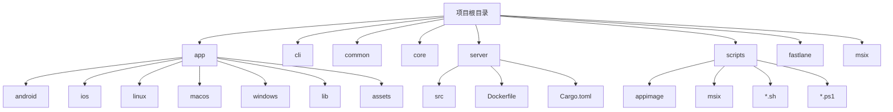
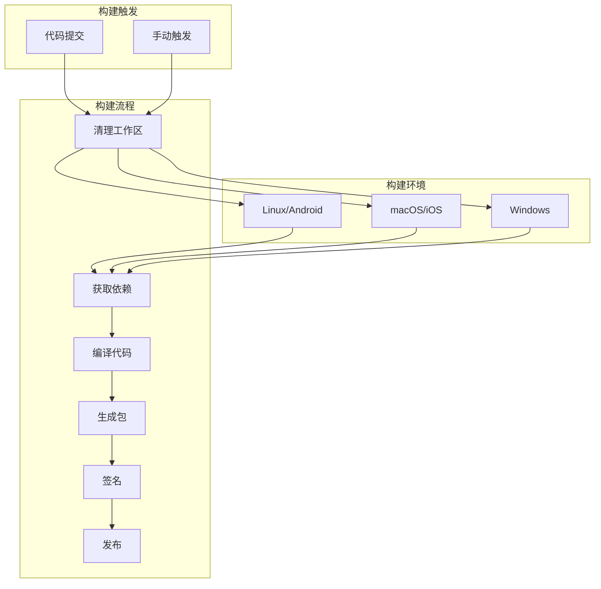
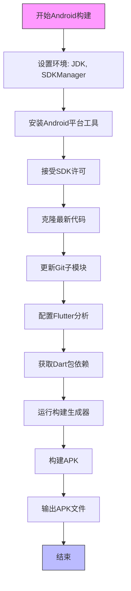
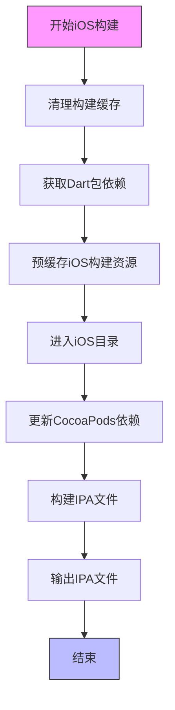
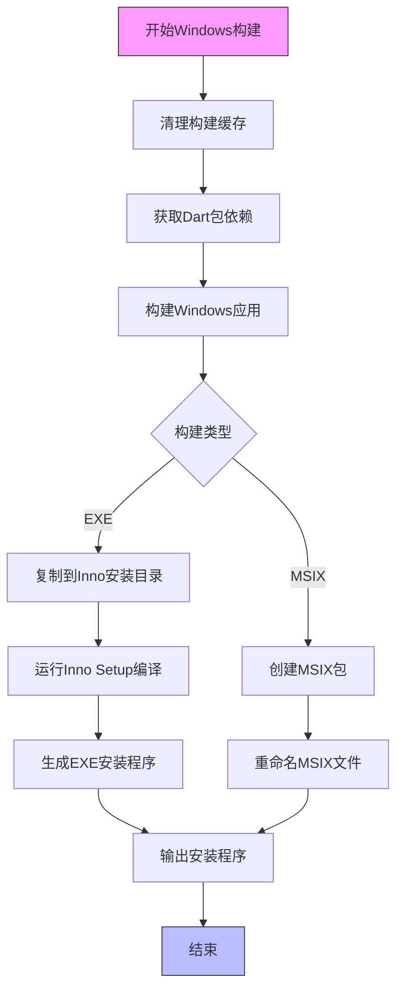
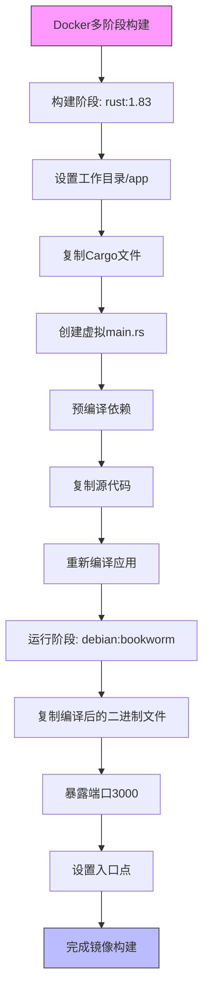
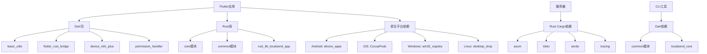

# CI/CD集成

<cite>
**本文档中引用的文件**  
- [compile_android_apk.sh](file://scripts/compile_android_apk.sh)
- [compile_android_appbundle.ps1](file://scripts/compile_android_appbundle.ps1)
- [compile_ios.sh](file://scripts/compile_ios.sh)
- [compile_windows_exe.ps1](file://scripts/compile_windows_exe.ps1)
- [compile_windows_msix_store.ps1](file://scripts/compile_windows_msix_store.ps1)
- [Dockerfile](file://server/Dockerfile)
- [pubspec.yaml](file://app/pubspec.yaml)
- [build.yaml](file://app/build.yaml)
- [AppImageBuilder_x86_64.yml](file://scripts/appimage/AppImageBuilder_x86_64.yml)
- [AppImageBuilder_arm_64.yml](file://scripts/appimage/AppImageBuilder_arm_64.yml)
</cite>

## 目录
1. [简介](#简介)
2. [项目结构](#项目结构)
3. [核心组件](#核心组件)
4. [架构概述](#架构概述)
5. [详细组件分析](#详细组件分析)
6. [依赖分析](#依赖分析)
7. [性能考虑](#性能考虑)
8. [故障排除指南](#故障排除指南)
9. [结论](#结论)

## 简介
LocalSend是一个开源的跨平台文件传输应用，提供类似AirDrop的功能。本CI/CD集成文档详细介绍了该项目的持续集成和持续部署流水线配置，包括自动化构建、测试、签名和发布流程。文档涵盖了多个平台的发布要求，包括Android、iOS、Windows和Linux，以及Docker容器化部署的配置。

## 项目结构
LocalSend项目采用多平台架构，包含Flutter前端、Rust后端和独立的CLI工具。项目结构清晰地分离了不同平台的构建配置和资源文件。

**Diagram sources**
- [scripts/compile_android_apk.sh](file://scripts/compile_android_apk.sh)
- [scripts/compile_ios.sh](file://scripts/compile_ios.sh)
- [scripts/compile_windows_exe.ps1](file://scripts/compile_windows_exe.ps1)

**Section sources**
- [scripts/compile_android_apk.sh](file://scripts/compile_android_apk.sh#L1-L32)
- [scripts/compile_ios.sh](file://scripts/compile_ios.sh#L1-L14)
- [scripts/compile_windows_exe.ps1](file://scripts/compile_windows_exe.ps1#L1-L20)

## 核心组件
LocalSend的核心组件包括Flutter应用前端、Rust后端服务器和共享的公共库。CI/CD系统需要协调这些组件的构建和集成。

**Section sources**
- [app/pubspec.yaml](file://app/pubspec.yaml#L1-L124)
- [server/Cargo.toml](file://server/Cargo.toml#L1-L19)
- [common/pubspec.yaml](file://common/pubspec.yaml#L1-L20)

## 架构概述
LocalSend的CI/CD架构采用多平台并行构建策略，每个目标平台都有专门的构建脚本。系统通过Shell和PowerShell脚本实现跨平台构建自动化。

**Diagram sources**
- [scripts/compile_android_apk.sh](file://scripts/compile_android_apk.sh#L1-L32)
- [scripts/compile_ios.sh](file://scripts/compile_ios.sh#L1-L14)
- [scripts/compile_windows_exe.ps1](file://scripts/compile_windows_exe.ps1#L1-L20)

## 详细组件分析

### Android构建流程
Android构建流程设计为符合F-Droid的可重现构建要求，使用特定的SDK路径和构建参数确保构建的一致性。

**Diagram sources**
- [scripts/compile_android_apk.sh](file://scripts/compile_android_apk.sh#L1-L32)

**Section sources**
- [scripts/compile_android_apk.sh](file://scripts/compile_android_apk.sh#L1-L32)
- [app/android/build.gradle](file://app/android/build.gradle#L1-L35)

### iOS构建流程
iOS构建流程使用fvm（Flutter Version Management）确保Flutter版本的一致性，并通过CocoaPods管理原生依赖。

**Diagram sources**
- [scripts/compile_ios.sh](file://scripts/compile_ios.sh#L1-L14)
- [app/ios/Podfile](file://app/ios/Podfile#L1-L49)

**Section sources**
- [scripts/compile_ios.sh](file://scripts/compile_ios.sh#L1-L14)
- [app/ios/Podfile](file://app/ios/Podfile#L1-L49)

### Windows构建流程
Windows构建流程包括生成MSIX包，用于Microsoft Store发布，以及生成传统的EXE安装程序。

**Diagram sources**
- [scripts/compile_windows_exe.ps1](file://scripts/compile_windows_exe.ps1#L1-L20)
- [scripts/compile_windows_msix_store.ps1](file://scripts/compile_windows_msix_store.ps1#L1-L13)

**Section sources**
- [scripts/compile_windows_exe.ps1](file://scripts/compile_windows_exe.ps1#L1-L20)
- [scripts/compile_windows_msix_store.ps1](file://scripts/compile_windows_msix_store.ps1#L1-L13)
- [app/windows/CMakeLists.txt](file://app/windows/CMakeLists.txt#L1-L109)

### Linux构建流程
Linux构建流程使用AppImage格式，支持x86_64和ARM64架构，通过AppImageBuilder工具生成可执行文件。

**Section sources**
- [scripts/appimage/AppImageBuilder_x86_64.yml](file://scripts/appimage/AppImageBuilder_x86_64.yml)
- [scripts/appimage/AppImageBuilder_arm_64.yml](file://scripts/appimage/AppImageBuilder_arm_64.yml)

### 服务器Docker化
服务器组件通过Dockerfile进行容器化，采用多阶段构建优化镜像大小。

**Diagram sources**
- [server/Dockerfile](file://server/Dockerfile#L1-L25)

**Section sources**
- [server/Dockerfile](file://server/Dockerfile#L1-L25)
- [server/Cargo.toml](file://server/Cargo.toml#L1-L19)

## 依赖分析
LocalSend项目的依赖关系复杂，涉及多个语言和平台的依赖管理。

**Diagram sources**
- [app/pubspec.yaml](file://app/pubspec.yaml#L1-L124)
- [server/Cargo.toml](file://server/Cargo.toml#L1-L19)
- [common/pubspec.yaml](file://common/pubspec.yaml#L1-L20)

**Section sources**
- [app/pubspec.yaml](file://app/pubspec.yaml#L1-L124)
- [server/Cargo.toml](file://server/Cargo.toml#L1-L19)
- [common/pubspec.yaml](file://common/pubspec.yaml#L1-L20)

## 性能考虑
CI/CD流程中的性能优化主要体现在构建缓存、并行构建和镜像优化等方面。

- **构建缓存**: 使用fvm确保Flutter版本一致性，避免重复下载
- **多阶段Docker构建**: 分离构建和运行环境，减小最终镜像大小
- **依赖预编译**: 在Docker构建中预编译Rust依赖，提高后续构建速度
- **并行构建**: 不同平台的构建可以并行执行，减少总构建时间

## 故障排除指南
CI/CD流程中常见的问题及解决方案：

**Section sources**
- [scripts/compile_android_apk.sh](file://scripts/compile_android_apk.sh#L1-L32)
- [scripts/compile_ios.sh](file://scripts/compile_ios.sh#L1-L14)
- [scripts/compile_windows_exe.ps1](file://scripts/compile_windows_exe.ps1#L1-L20)

### Android构建问题
- **问题**: SDK许可未接受
- **解决方案**: 运行`sdkmanager --licenses`并接受所有许可
- **问题**: Gradle版本冲突
- **解决方案**: 确保使用项目指定的Gradle版本

### iOS构建问题
- **问题**: CocoaPods依赖更新失败
- **解决方案**: 运行`pod repo update`更新本地仓库
- **问题**: 代码签名错误
- **解决方案**: 检查Apple开发者账户和证书配置

### Windows构建问题
- **问题**: Inno Setup未安装
- **解决方案**: 安装Inno Setup并确保在系统路径中
- **问题**: MSIX签名失败
- **解决方案**: 检查代码签名证书配置

### Docker构建问题
- **问题**: 基础镜像拉取失败
- **解决方案**: 检查网络连接和Docker Hub访问权限
- **问题**: 依赖编译失败
- **解决方案**: 确保Rust工具链版本兼容

## 结论
LocalSend项目的CI/CD系统设计完善，支持多平台构建和发布。通过Shell和PowerShell脚本实现跨平台自动化，确保了构建过程的一致性和可重现性。Docker化部署简化了服务器组件的部署流程，而详细的构建脚本提供了灵活性和可定制性。建议进一步集成GitHub Actions或GitLab CI等CI系统，实现完全自动化的持续集成和部署流程。