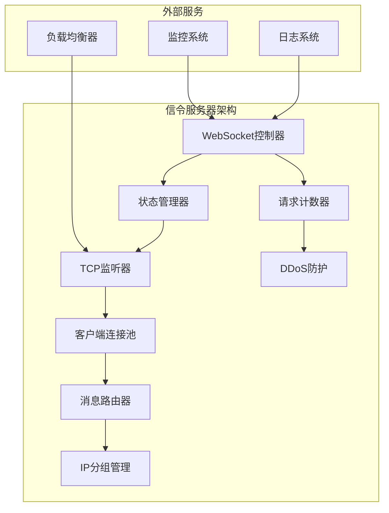
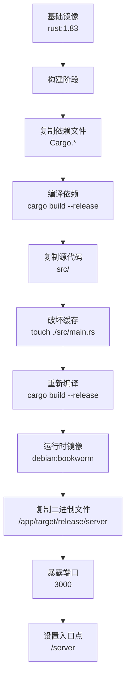
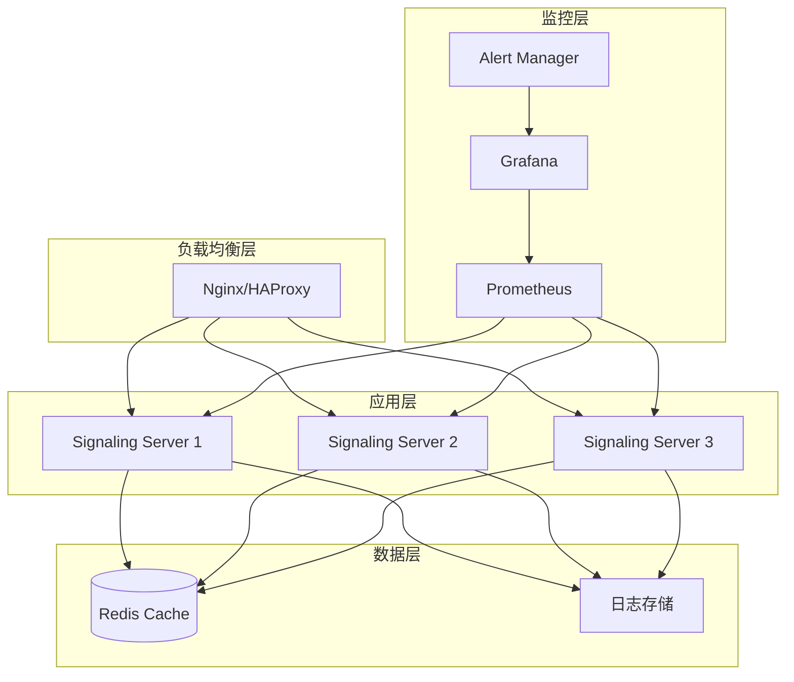

# Docker部署

<cite>
**本文档中引用的文件**
- [server/Dockerfile](file://server/Dockerfile)
- [server/README.md](file://server/README.md)
- [server/Cargo.toml](file://server/Cargo.toml)
- [server/src/main.rs](file://server/src/main.rs)
- [server/src/config/init.rs](file://server/src/config/init.rs)
- [server/src/config/state.rs](file://server/src/config/state.rs)
- [server/src/controller/ws_controller.rs](file://server/src/controller/ws_controller.rs)
- [README.md](file://README.md)
</cite>

## 目录
1. [简介](#简介)
2. [项目架构概述](#项目架构概述)
3. [Dockerfile详细分析](#dockerfile详细分析)
4. [容器运行配置](#容器运行配置)
5. [Docker Compose配置](#docker-compose配置)
6. [环境变量配置](#环境变量配置)
7. [容器化最佳实践](#容器化最佳实践)
8. [镜像优化策略](#镜像优化策略)
9. [生产环境部署指南](#生产环境部署指南)
10. [监控与日志管理](#监控与日志管理)
11. [故障排除指南](#故障排除指南)
12. [总结](#总结)

## 简介

LocalSend是一个跨平台的本地文件传输应用，其信令服务器采用Rust语言开发，使用WebSocket协议进行实时通信。本文档详细介绍如何将LocalSend信令服务器容器化部署，包括完整的Docker构建流程、配置管理和生产环境部署策略。

信令服务器作为LocalSend生态系统的核心组件，负责设备发现、连接建立和WebRTC信令交换。通过容器化部署，可以实现快速部署、环境隔离和可扩展性。

## 项目架构概述

LocalSend信令服务器采用模块化架构设计，主要包含以下核心组件：



**图表来源**
- [server/src/controller/ws_controller.rs](file://server/src/controller/ws_controller.rs#L1-L370)
- [server/src/config/state.rs](file://server/src/config/state.rs#L1-L34)

**章节来源**
- [server/src/main.rs](file://server/src/main.rs#L1-L34)
- [server/src/config/mod.rs](file://server/src/config/mod.rs#L1-L5)

## Dockerfile详细分析

LocalSend信令服务器使用了多阶段构建策略，确保最终镜像的轻量化和安全性。

### 多阶段构建结构



**图表来源**
- [server/Dockerfile](file://server/Dockerfile#L1-L25)

### 构建阶段详解

#### 第一阶段：构建环境配置
- **基础镜像**: 使用官方Rust镜像 `rust:1.83`，提供稳定的编译环境
- **工作目录**: 设置 `/app` 为工作目录，便于文件组织
- **依赖编译**: 先复制 `Cargo.*` 文件，仅编译依赖项以利用Docker缓存
- **占位程序**: 创建临时主程序文件，确保依赖编译成功

#### 第二阶段：运行时环境
- **基础镜像**: 使用轻量级Debian Bookworm镜像
- **二进制复制**: 从构建阶段复制编译好的可执行文件
- **端口暴露**: 暴露默认的3000端口
- **入口点**: 设置容器启动时的默认命令

**章节来源**
- [server/Dockerfile](file://server/Dockerfile#L1-L25)

## 容器运行配置

### 基本运行命令

```bash
# 基本运行
docker run -d \
  --name localsend-signaling \
  -p 3000:3000 \
  localsend/signaling-server

# 带环境变量的运行
docker run -d \
  --name localsend-signaling \
  -p 3000:3000 \
  -e SERVER_IP=0.0.0.0 \
  -e SERVER_PORT=3000 \
  -e MAX_CONNECTIONS_PER_IP=10 \
  -e MAX_REQUESTS_PER_IP_PER_HOUR=1000 \
  localsend/signaling-server
```

### 卷挂载配置

```bash
# 日志卷挂载
docker run -d \
  --name localsend-signaling \
  -p 3000:3000 \
  -v /data/localsend/logs:/app/logs \
  -v /data/localsend/config:/app/config \
  localsend/signaling-server

# 数据持久化
docker run -d \
  --name localsend-signaling \
  -p 3000:3000 \
  -v localsend_data:/app/data \
  localsend/signaling-server
```

### 网络配置

```bash
# 自定义网络
docker network create localsend-net

docker run -d \
  --name localsend-signaling \
  --network localsend-net \
  -p 3000:3000 \
  localsend/signaling-server

# 设备访问
docker run -d \
  --name localsend-signaling \
  --network host \
  localsend/signaling-server
```

## Docker Compose配置

### 基础Compose配置

```yaml
version: '3.8'

services:
  signaling-server:
    build: ./server
    ports:
      - "3000:3000"
    environment:
      - SERVER_IP=0.0.0.0
      - SERVER_PORT=3000
      - MAX_CONNECTIONS_PER_IP=10
      - MAX_REQUESTS_PER_IP_PER_HOUR=1000
    volumes:
      - logs:/app/logs
      - config:/app/config
    restart: unless-stopped
    healthcheck:
      test: ["CMD", "curl", "-f", "http://localhost:3000/health"]
      interval: 30s
      timeout: 10s
      retries: 3
      start_period: 40s

  nginx-proxy:
    image: nginx:alpine
    ports:
      - "80:80"
      - "443:443"
    volumes:
      - ./nginx.conf:/etc/nginx/nginx.conf:ro
      - ./ssl:/etc/nginx/ssl:ro
    depends_on:
      - signaling-server
    restart: unless-stopped

volumes:
  logs:
  config:
```

### 生产环境Compose配置

```yaml
version: '3.8'

services:
  signaling-server:
    build:
      context: ./server
      target: production
    image: localsend/signaling-server:${VERSION:-latest}
    ports:
      - "3000:3000"
    environment:
      - SERVER_IP=0.0.0.0
      - SERVER_PORT=3000
      - MAX_CONNECTIONS_PER_IP=20
      - MAX_REQUESTS_PER_IP_PER_HOUR=2000
      - RUST_LOG=info
    volumes:
      - logs:/app/logs
      - config:/app/config
    networks:
      - localsend-network
    deploy:
      resources:
        limits:
          memory: 512M
          cpus: '0.5'
        reservations:
          memory: 256M
          cpus: '0.25'
    healthcheck:
      test: ["CMD", "wget", "--quiet", "--tries=1", "--spider", "http://localhost:3000/health"]
      interval: 30s
      timeout: 10s
      retries: 3
      start_period: 40s
    restart: unless-stopped

  prometheus:
    image: prom/prometheus:latest
    ports:
      - "9090:9090"
    volumes:
      - ./prometheus.yml:/etc/prometheus/prometheus.yml
      - prometheus-data:/prometheus
    command:
      - '--config.file=/etc/prometheus/prometheus.yml'
      - '--storage.tsdb.path=/prometheus'
      - '--web.console.libraries=/etc/prometheus/console_libraries'
      - '--web.console.templates=/etc/prometheus/consoles'
      - '--storage.tsdb.retention.time=15d'
      - '--web.enable-lifecycle'
    networks:
      - localsend-network

  grafana:
    image: grafana/grafana:latest
    ports:
      - "3000:3000"
    volumes:
      - grafana-data:/var/lib/grafana
    environment:
      - GF_SECURITY_ADMIN_PASSWORD=admin
    networks:
      - localsend-network
    depends_on:
      - prometheus

volumes:
  logs:
  config:
  prometheus-data:
  grafana-data:

networks:
  localsend-network:
    driver: bridge
    ipam:
      config:
        - subnet: 172.20.0.0/16
```

## 环境变量配置

### 核心配置参数

| 环境变量 | 默认值 | 描述 | 示例 |
|---------|--------|------|------|
| `SERVER_IP` | `0.0.0.0` | 绑定的IP地址 | `0.0.0.0`, `127.0.0.1` |
| `SERVER_PORT` | `3000` | 服务器监听端口 | `3000`, `8080` |
| `MAX_CONNECTIONS_PER_IP` | `10` | 每个IP的最大连接数 | `5`, `20` |
| `MAX_REQUESTS_PER_IP_PER_HOUR` | `1000` | 每小时最大请求数 | `500`, `2000` |

### 高级配置选项

```bash
# 性能调优
export MAX_CONNECTIONS_PER_IP=15
export MAX_REQUESTS_PER_IP_PER_HOUR=1500

# 调试模式
export RUST_LOG=debug
export SERVER_IP=0.0.0.0

# 安全配置
export ALLOWED_ORIGINS=https://localsend.org,https://app.localsend.org
export CORS_ENABLED=true
```

### 配置文件挂载

```bash
# 挂载配置文件
docker run -d \
  --name localsend-signaling \
  -p 3000:3000 \
  -v ./config/envoy:/app/config/envoy \
  -v ./config/security:/app/config/security \
  localsend/signaling-server
```

**章节来源**
- [server/src/controller/ws_controller.rs](file://server/src/controller/ws_controller.rs#L25-L40)
- [server/src/main.rs](file://server/src/main.rs#L18-L25)

## 容器化最佳实践

### 安全配置

#### 用户权限控制
```dockerfile
# 在Dockerfile中添加非root用户
RUN useradd -r -s /bin/false localsend
USER localsend
```

#### 安全标签
```bash
# 运行时安全配置
docker run -d \
  --security-opt=no-new-privileges:true \
  --cap-drop=ALL \
  --cap-add=NET_BIND_SERVICE \
  localsend/signaling-server
```

### 资源限制

```yaml
services:
  signaling-server:
    deploy:
      resources:
        limits:
          memory: 512M
          cpus: '0.5'
        reservations:
          memory: 256M
          cpus: '0.25'
```

### 健康检查

```yaml
healthcheck:
  test: ["CMD", "curl", "-f", "http://localhost:3000/health"]
  interval: 30s
  timeout: 10s
  retries: 3
  start_period: 40s
```

### 启动顺序控制

```yaml
services:
  signaling-server:
    depends_on:
      database:
        condition: service_healthy
      redis:
        condition: service_started
```

## 镜像优化策略

### 多阶段构建优化

```dockerfile
# 生产环境优化版本
FROM rust:1.83-alpine AS builder

# 安装构建工具
RUN apk add --no-cache musl-dev gcc

WORKDIR /app

# 缓存依赖
COPY Cargo.* ./
RUN cargo build --release --target-dir=target

# 复制源码
COPY src ./src

# 最终构建
RUN cargo build --release --target-dir=target

# 生产运行时
FROM alpine:latest AS production

# 安装运行时依赖
RUN apk add --no-cache ca-certificates tzdata

# 复制二进制文件
COPY --from=builder /app/target/release/server /server

# 设置非root用户
RUN addgroup -g 1001 -S localsend && \
    adduser -S localsend -u 1001 -G localsend

USER localsend
EXPOSE 3000
ENTRYPOINT ["/server"]
```

### 镜像大小优化

```dockerfile
# 使用Alpine基础镜像
FROM rust:1.83-alpine AS builder

# 清理包缓存
RUN cargo build --release && \
    rm -rf ~/.cargo/registry && \
    rm -rf ~/.cargo/git

# 最终镜像
FROM alpine:latest
RUN apk add --no-cache ca-certificates tzdata
COPY --from=builder /app/target/release/server /server
```

### 缓存策略

```dockerfile
# 利用Docker层缓存
COPY Cargo.lock Cargo.toml ./
RUN cargo fetch

# 只在依赖变化时重新构建
COPY src ./src/
RUN cargo build --release
```

**章节来源**
- [server/Dockerfile](file://server/Dockerfile#L1-L25)

## 生产环境部署指南

### 部署架构



### 高可用配置

```yaml
version: '3.8'

services:
  signaling-server-1:
    image: localsend/signaling-server:${VERSION:-latest}
    ports:
      - "3000:3000"
    environment:
      - SERVER_IP=0.0.0.0
      - SERVER_PORT=3000
    volumes:
      - logs:/app/logs
    networks:
      - localsend-network
    deploy:
      replicas: 1
      placement:
        constraints:
          - node.labels.zone == zone-a
      
  signaling-server-2:
    image: localsend/signaling-server:${VERSION:-latest}
    ports:
      - "3000:3000"
    environment:
      - SERVER_IP=0.0.0.0
      - SERVER_PORT=3000
    volumes:
      - logs:/app/logs
    networks:
      - localsend-network
    deploy:
      replicas: 1
      placement:
        constraints:
          - node.labels.zone == zone-b

networks:
  localsend-network:
    driver: overlay
    attachable: true
    internal: false
```

### 数据备份策略

```bash
#!/bin/bash
# 备份脚本

BACKUP_DIR="/backup/localsend/$(date +%Y%m%d)"
mkdir -p $BACKUP_DIR

# 备份配置
docker cp localsend_signaling_1:/app/config $BACKUP_DIR/

# 备份日志
docker exec localsend_signaling_1 tar czf /tmp/logs.tar.gz /app/logs
docker cp localsend_signaling_1:/tmp/logs.tar.gz $BACKUP_DIR/

# 备份数据库（如果有）
# docker exec postgres pg_dump -U postgres localsend > $BACKUP_DIR/db.sql
```

## 监控与日志管理

### Prometheus监控配置

```yaml
# prometheus.yml
global:
  scrape_interval: 15s

scrape_configs:
  - job_name: 'localsend-signaling'
    static_configs:
      - targets: ['signaling-server:3000']
    metrics_path: /metrics
    scrape_interval: 10s

  - job_name: 'docker'
    static_configs:
      - targets: ['cadvisor:8080']
```

### 日志收集配置

```yaml
services:
  signaling-server:
    logging:
      driver: "json-file"
      options:
        max-size: "10m"
        max-file: "3"
        compress: "true"
        
  fluentd:
    image: fluent/fluentd:v1.14
    volumes:
      - ./fluentd.conf:/fluentd/etc/fluent.conf
      - /var/log/containers:/var/log/containers:ro
    networks:
      - localsend-network
```

### 关键指标监控

| 指标名称 | 类型 | 描述 | 告警阈值 |
|---------|------|------|----------|
| `connections_active` | Gauge | 当前活跃连接数 | > 1000 |
| `requests_per_hour` | Counter | 每小时请求数 | > 5000 |
| `response_time` | Histogram | 响应时间分布 | P95 > 500ms |
| `error_rate` | Gauge | 错误率 | > 5% |
| `memory_usage` | Gauge | 内存使用量 | > 400MB |

### Grafana仪表板配置

```json
{
  "dashboard": {
    "title": "LocalSend Signaling Server",
    "panels": [
      {
        "title": "活跃连接数",
        "type": "stat",
        "targets": [
          {
            "expr": "connections_active"
          }
        ]
      },
      {
        "title": "请求处理速率",
        "type": "graph",
        "targets": [
          {
            "expr": "rate(requests_total[5m])"
          }
        ]
      }
    ]
  }
}
```

**章节来源**
- [server/src/config/init.rs](file://server/src/config/init.rs#L1-L21)

## 故障排除指南

### 常见问题诊断

#### 连接问题

```bash
# 检查容器状态
docker ps -a
docker logs localsend-signaling

# 检查端口占用
docker exec localsend-signaling netstat -tlnp

# 测试网络连通性
docker exec localsend-signaling curl -I http://localhost:3000/v1/ws
```

#### 性能问题

```bash
# 检查资源使用
docker stats localsend-signaling

# 分析日志
docker logs --tail 100 localsend-signaling | grep ERROR

# 性能分析
docker exec localsend-signaling top
```

### 配置验证

```bash
# 环境变量验证
docker exec localsend-signaling env | grep -E "(SERVER_|MAX_)"

# 端口监听验证
docker exec localsend-signaling ss -tlnp | grep :3000

# 健康检查验证
docker exec localsend-signaling curl -f http://localhost:3000/health
```

### 故障恢复流程

```bash
#!/bin/bash
# 故障恢复脚本

echo "开始故障恢复..."

# 1. 检查容器状态
if ! docker ps --format '{{.Names}}' | grep -q localsend-signaling; then
    echo "容器未运行，尝试重启..."
    docker start localsend-signaling
fi

# 2. 检查服务响应
if ! curl -f http://localhost:3000/health >/dev/null 2>&1; then
    echo "服务无响应，重新部署..."
    docker restart localsend-signaling
fi

# 3. 检查资源使用
MEMORY_USAGE=$(docker stats --no-stream --format "table {{.MemUsage}}" localsend-signaling | head -1 | cut -d'/' -f1 | sed 's/MiB//')
if (( MEMORY_USAGE > 400 )); then
    echo "内存使用过高，重启容器..."
    docker restart localsend-signaling
fi

echo "故障恢复完成"
```

### 日志分析工具

```bash
# 实时日志监控
docker logs -f localsend-signaling | grep -E "(ERROR|WARN)"

# 错误统计
docker logs localsend-signaling | grep ERROR | wc -l

# 性能分析
docker logs localsend-signaling | awk '/took/{print $NF}' | sort -n
```

## 总结

LocalSend信令服务器的Docker部署提供了完整、可靠的容器化解决方案。通过多阶段构建、环境变量配置和生产级监控，确保了应用在各种部署场景下的稳定性和可维护性。

### 关键优势

1. **快速部署**: 通过Docker容器化，实现一键部署和快速扩展
2. **环境隔离**: 容器提供独立的运行环境，避免依赖冲突
3. **可扩展性**: 支持水平扩展和负载均衡
4. **监控完善**: 集成Prometheus和Grafana监控体系
5. **安全可靠**: 多层次的安全配置和故障恢复机制

### 最佳实践要点

- 使用多阶段构建优化镜像大小
- 合理配置资源限制和健康检查
- 实施完善的日志和监控策略
- 建立自动化部署和回滚机制
- 定期进行安全扫描和更新

通过遵循本文档的指导原则和配置建议，可以确保LocalSend信令服务器在生产环境中稳定、高效地运行，为用户提供可靠的本地文件传输服务。