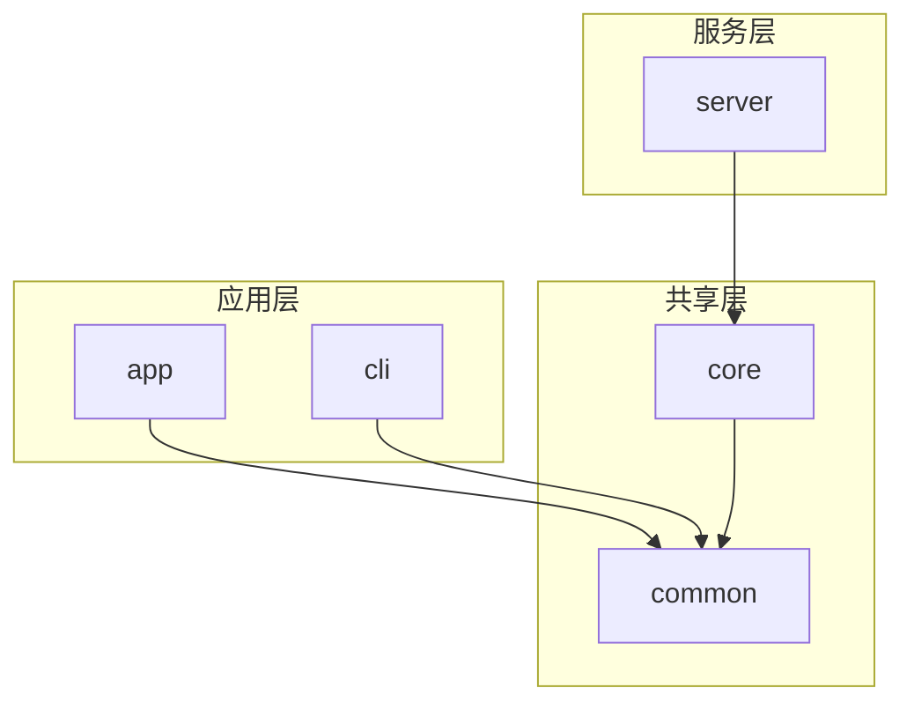
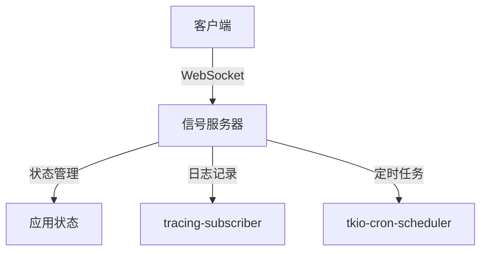
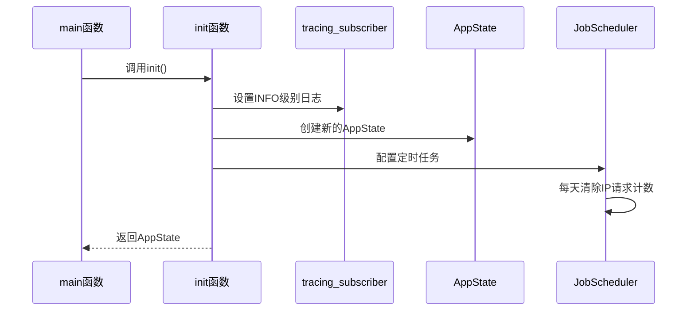
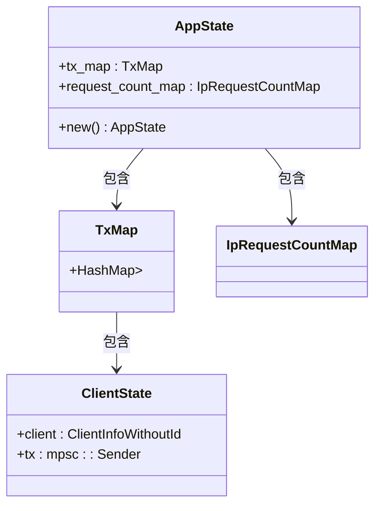
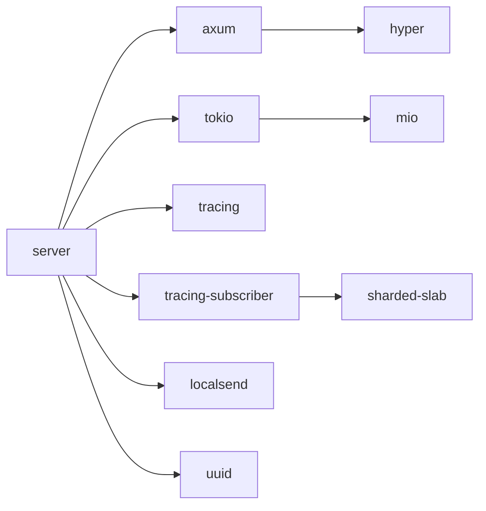

# 容器运行

<cite>
**本文档中引用的文件**  
- [Dockerfile](file://server/Dockerfile)
- [main.rs](file://server/src/main.rs)
- [init.rs](file://server/src/config/init.rs)
- [state.rs](file://server/src/config/state.rs)
- [Cargo.toml](file://server/Cargo.toml)
</cite>

## 目录
1. [简介](#简介)
2. [项目结构](#项目结构)
3. [核心组件](#核心组件)
4. [架构概述](#架构概述)
5. [详细组件分析](#详细组件分析)
6. [依赖分析](#依赖分析)
7. [性能考虑](#性能考虑)
8. [故障排除指南](#故障排除指南)
9. [结论](#结论)

## 简介
本指南提供关于如何在容器环境中运行LocalSend服务的详细说明。文档涵盖了容器启动配置、运行时安全设置、健康检查、日志收集、监控指标暴露以及调试配置等方面的内容。此外，还提供了不同运行场景下的示例命令和资源限制配置建议。

## 项目结构
LocalSend项目采用多模块架构，主要包含app、cli、common、core和server等目录。其中server目录包含了用于构建和运行信号服务器的关键文件，包括Dockerfile、main.rs、配置文件和Cargo.toml等。

**Diagram sources**
- [server/Dockerfile](file://server/Dockerfile)
- [server/src/main.rs](file://server/src/main.rs)

**Section sources**
- [server/Dockerfile](file://server/Dockerfile)
- [server/src/main.rs](file://server/src/main.rs)

## 核心组件
核心组件包括信号服务器的主程序、配置管理系统和状态管理器。这些组件共同协作以提供稳定可靠的WebRTC信令服务。

**Section sources**
- [server/src/main.rs](file://server/src/main.rs)
- [server/src/config/init.rs](file://server/src/config/init.rs)
- [server/src/config/state.rs](file://server/src/config/state.rs)

## 架构概述
LocalSend信号服务器采用Rust语言编写，基于Axum框架构建HTTP/WebSocket服务。服务器使用Tokio作为异步运行时，支持高并发连接处理。

**Diagram sources**
- [server/src/main.rs](file://server/src/main.rs)
- [server/src/config/init.rs](file://server/src/config/init.rs)

## 详细组件分析

### 服务器初始化分析
服务器初始化过程包括设置日志级别、创建应用状态和配置定时任务调度器。

**Diagram sources**
- [server/src/main.rs](file://server/src/main.rs#L15-L33)
- [server/src/config/init.rs](file://server/src/config/init.rs#L1-L20)

### 应用状态分析
应用状态管理器负责维护WebSocket连接映射和IP请求计数。

**Diagram sources**
- [server/src/config/state.rs](file://server/src/config/state.rs#L0-L33)

**Section sources**
- [server/src/config/state.rs](file://server/src/config/state.rs#L0-L33)

## 依赖分析
服务器依赖于多个Rust crate，包括axum用于Web服务、tokio用于异步运行时、tracing用于日志记录等。

**Diagram sources**
- [server/Cargo.toml](file://server/Cargo.toml)
- [server/Cargo.lock](file://server/Cargo.lock)

**Section sources**
- [server/Cargo.toml](file://server/Cargo.toml)
- [server/Cargo.lock](file://server/Cargo.lock)

## 性能考虑
服务器设计考虑了高性能和可扩展性：
- 使用Tokio异步运行时处理高并发连接
- 采用Arc<Mutex<HashMap<>>>实现线程安全的状态共享
- 通过定时任务定期清理过期数据
- 利用Rust的所有权系统避免内存泄漏

## 故障排除指南
常见问题及解决方案：
- 如果服务器无法启动，请检查端口是否被占用
- 如果WebSocket连接失败，请验证TLS配置
- 如果出现性能瓶颈，可以调整Tokio运行时参数
- 日志级别可以通过环境变量控制

**Section sources**
- [server/src/main.rs](file://server/src/main.rs)
- [server/src/config/init.rs](file://server/src/config/init.rs)

## 结论
LocalSend信号服务器提供了一个高效、安全的WebRTC信令解决方案。通过容器化部署，可以轻松实现服务的快速部署和扩展。建议在生产环境中使用非root用户运行容器，并配置适当的资源限制和监控告警。