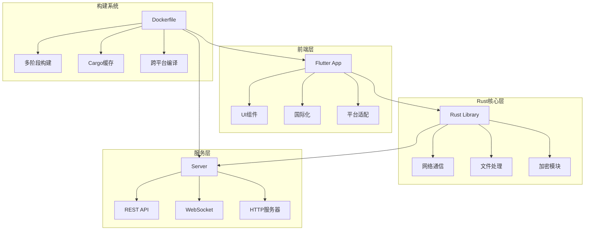
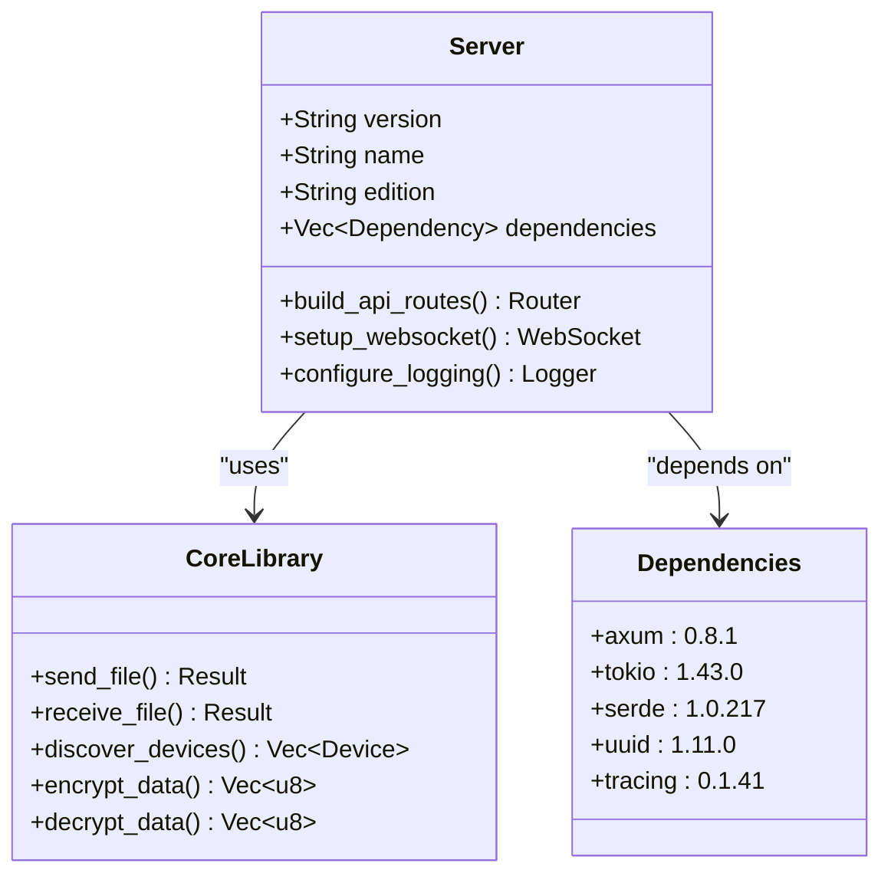
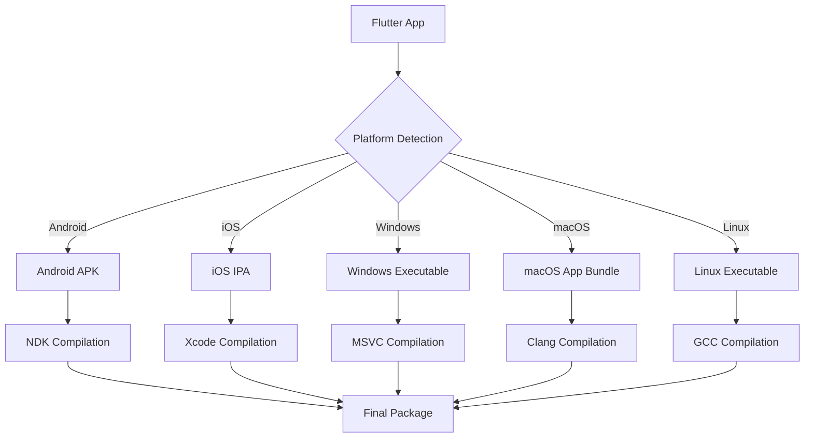
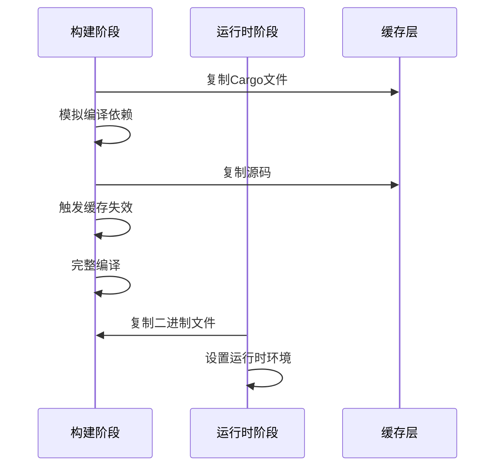
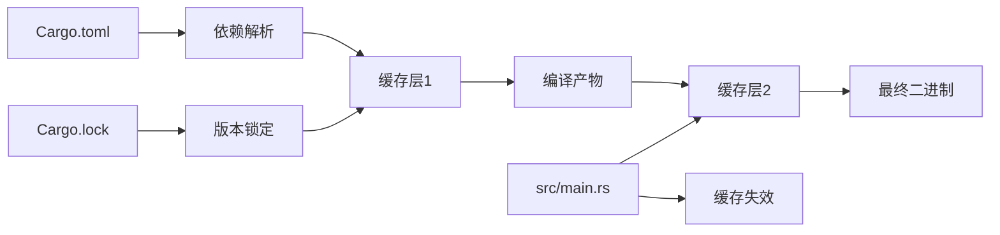
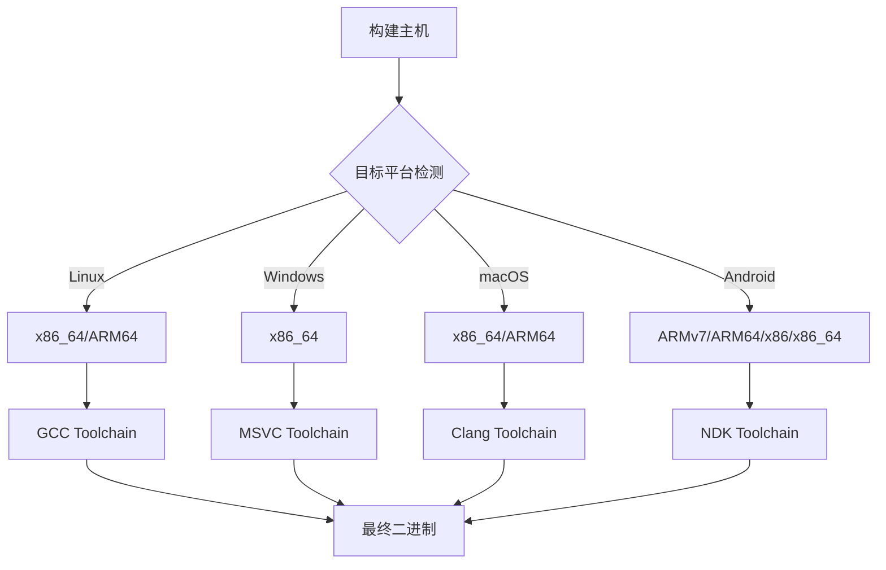
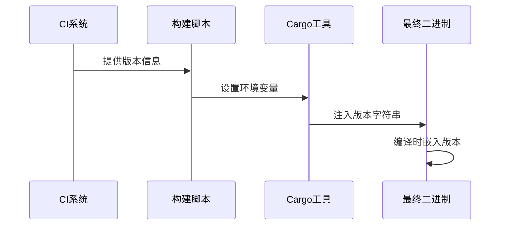
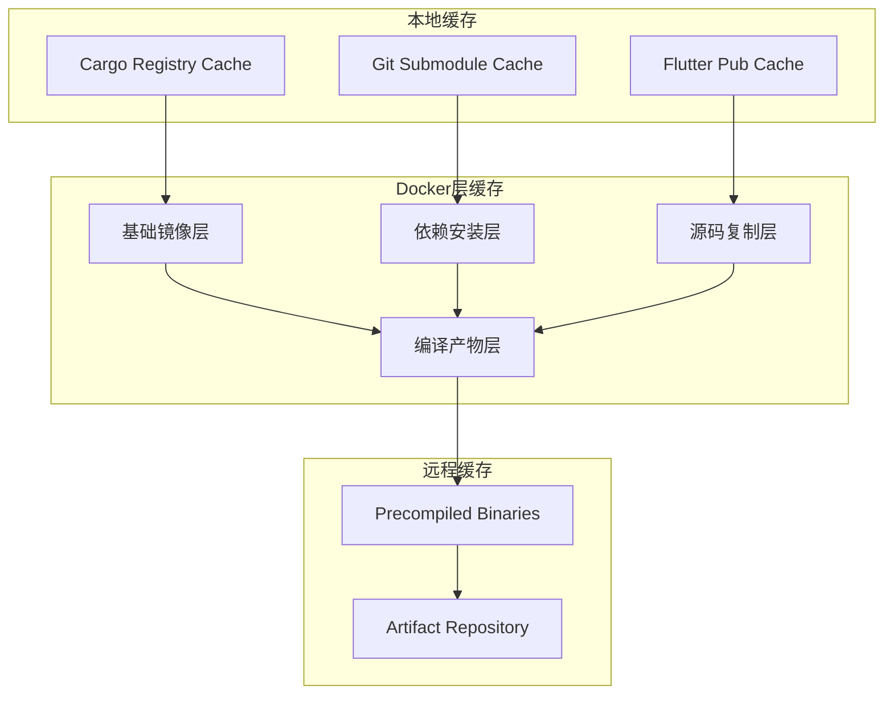
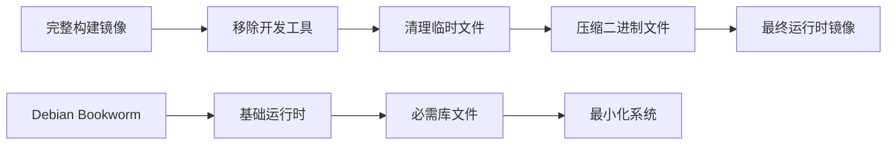
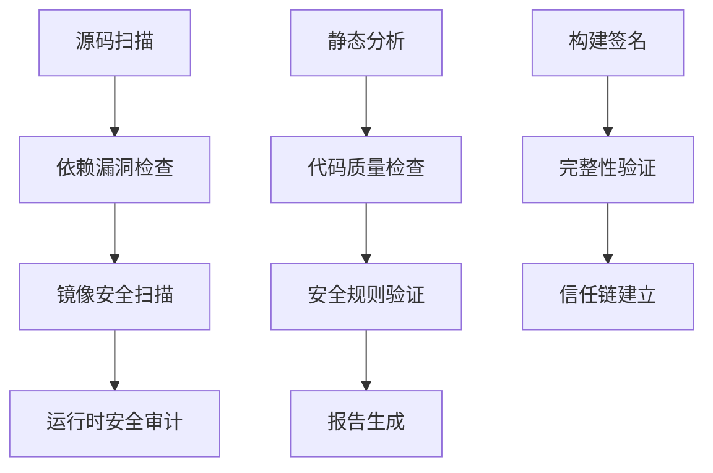

# 镜像构建

<cite>
**本文档中引用的文件**
- [server/Dockerfile](file://server/Dockerfile)
- [server/Cargo.toml](file://server/Cargo.toml)
- [server/Cargo.lock](file://server/Cargo.lock)
- [app/rust/Cargo.toml](file://app/rust/Cargo.toml)
- [app/rust/Cargo.lock](file://app/rust/Cargo.lock)
- [app/rust_builder/pubspec.yaml](file://app/rust_builder/pubspec.yaml)
- [scripts/compile_linux_appimage.sh](file://scripts/compile_linux_appimage.sh)
- [scripts/compile_android_apk.sh](file://scripts/compile_android_apk.sh)
- [scripts/compile_windows_exe.ps1](file://scripts/compile_windows_exe.ps1)
- [app/rust_builder/cargokit/build_tool/lib/src/target.dart](file://app/rust_builder/cargokit/build_tool/lib/src/target.dart)
- [app/rust_builder/cargokit/build_tool/lib/src/builder.dart](file://app/rust_builder/cargokit/build_tool/lib/src/builder.dart)
- [README.md](file://README.md)
</cite>

## 目录
1. [简介](#简介)
2. [项目结构概览](#项目结构概览)
3. [核心组件分析](#核心组件分析)
4. [Docker镜像构建策略](#docker镜像构建策略)
5. [多阶段构建详解](#多阶段构建详解)
6. [Cargo依赖缓存优化](#cargo依赖缓存优化)
7. [跨平台架构支持](#跨平台架构支持)
8. [构建参数与配置](#构建参数与配置)
9. [构建缓存管理](#构建缓存管理)
10. [镜像大小优化](#镜像大小优化)
11. [安全扫描与最佳实践](#安全扫描与最佳实践)
12. [故障排除指南](#故障排除指南)
13. [总结](#总结)

## 简介

LocalSend是一个跨平台的本地文件传输应用，采用Rust后端和Flutter前端的混合架构。本文档深入解析了该项目的Docker镜像构建过程，重点展示了如何利用现代容器化技术实现高效的多语言应用部署。

LocalSend的核心特点：
- **跨平台兼容性**：支持Windows、macOS、Linux、Android和iOS
- **去中心化通信**：基于本地网络的点对点文件传输
- **安全性优先**：使用HTTPS加密和TLS证书自动生成
- **高性能架构**：Rust提供底层性能，Flutter确保用户体验

## 项目结构概览

LocalSend项目采用模块化架构，主要包含以下核心组件：

**图表来源**
- [server/Dockerfile](file://server/Dockerfile#L1-L25)
- [app/rust/Cargo.toml](file://app/rust/Cargo.toml#L1-L18)

**章节来源**
- [README.md](file://README.md#L1-L50)

## 核心组件分析

### 后端服务组件

后端服务基于Rust实现，提供了完整的REST API和WebSocket通信功能：

**图表来源**
- [server/Cargo.toml](file://server/Cargo.toml#L1-L19)
- [app/rust/Cargo.toml](file://app/rust/Cargo.toml#L1-L18)

### 前端构建系统

Flutter前端通过Rust FFI与后端通信，构建系统支持多种目标平台：

**图表来源**
- [app/rust_builder/cargokit/build_tool/lib/src/target.dart](file://app/rust_builder/cargokit/build_tool/lib/src/target.dart#L19-L81)

**章节来源**
- [app/rust/Cargo.toml](file://app/rust/Cargo.toml#L1-L18)
- [app/rust_builder/cargokit/build_tool/lib/src/target.dart](file://app/rust_builder/cargokit/build_tool/lib/src/target.dart#L1-L50)

## Docker镜像构建策略

LocalSend采用现代化的多阶段Docker构建策略，充分利用了Docker的层缓存机制和Rust的Cargo包管理优势。

### 基础镜像选择

项目选择了`rust:1.83`作为构建基础镜像，这一选择基于以下考虑：

- **稳定性**：Rust 1.83是长期支持版本，提供稳定的编译环境
- **性能**：包含预编译的工具链，减少构建时间
- **兼容性**：支持所有目标平台的交叉编译

### 多阶段构建架构

**图表来源**
- [server/Dockerfile](file://server/Dockerfile#L1-L25)

**章节来源**
- [server/Dockerfile](file://server/Dockerfile#L1-L25)

## 多阶段构建详解

### 第一阶段：依赖预编译

第一阶段的核心目标是最大化缓存利用率：

1. **复制Cargo配置文件**：仅复制`Cargo.toml`和`Cargo.lock`
2. **模拟编译**：创建一个空的`main.rs`文件进行依赖预编译
3. **建立缓存层**：生成的依赖缓存将被后续构建步骤重用

### 第二阶段：完整编译

第二阶段执行实际的应用程序编译：

1. **源码复制**：将完整的源代码复制到镜像中
2. **缓存失效触发**：修改`main.rs`文件以破坏依赖缓存
3. **完整编译**：执行`cargo build --release`进行生产构建

### 第三阶段：运行时镜像

最终阶段创建最小化的运行时镜像：

1. **二进制文件复制**：从构建阶段复制编译好的可执行文件
2. **环境配置**：设置必要的环境变量和端口暴露
3. **启动配置**：定义容器入口点和健康检查

**章节来源**
- [server/Dockerfile](file://server/Dockerfile#L1-L25)

## Cargo依赖缓存优化

LocalSend实现了精细的Cargo缓存优化策略，这是Docker构建性能的关键因素。

### 缓存层次结构

**图表来源**
- [server/Dockerfile](file://server/Dockerfile#L6-L12)

### 缓存失效策略

项目采用了智能的缓存失效机制：

1. **依赖层分离**：将依赖安装与源码编译分离
2. **文件修改触发**：通过修改`main.rs`文件触发缓存重建
3. **增量编译**：利用Rust的增量编译特性加速开发构建

### 依赖预下载优化

通过预先下载和编译依赖，显著减少了构建时间：

- **静态链接**：减少运行时依赖
- **优化编译标志**：使用`--release`标志进行优化
- **并行编译**：利用多核CPU进行并行构建

**章节来源**
- [server/Cargo.lock](file://server/Cargo.lock#L1-L50)
- [app/rust/Cargo.lock](file://app/rust/Cargo.lock#L1-L50)

## 跨平台架构支持

LocalSend支持多种目标架构，构建系统提供了完整的交叉编译支持。

### 支持的目标平台

| 平台 | 架构 | 目标三元组 | 特殊要求 |
|------|------|------------|----------|
| Android | ARMv7 | armv7-linux-androideabi | NDK 16+ |
| Android | ARM64 | aarch64-linux-android | NDK 21+ |
| Android | x86 | i686-linux-android | NDK 16+ |
| Android | x86_64 | x86_64-linux-android | NDK 21+ |
| Linux | x86_64 | x86_64-unknown-linux-gnu | GCC 5.1+ |
| Linux | ARM64 | aarch64-unknown-linux-gnu | GCC 5.1+ |
| Windows | x86_64 | x86_64-pc-windows-msvc | MSVC 2019+ |
| macOS | x86_64 | x86_64-apple-darwin | Xcode 12+ |
| macOS | ARM64 | aarch64-apple-darwin | Xcode 12+ |

### 交叉编译配置

**图表来源**
- [app/rust_builder/cargokit/build_tool/lib/src/target.dart](file://app/rust_builder/cargokit/build_tool/lib/src/target.dart#L19-L81)

### 平台特定优化

每个目标平台都有其特定的优化策略：

- **Android**：使用NDK进行原生编译，优化移动设备性能
- **Windows**：集成MSVC工具链，支持Windows API调用
- **macOS**：利用Apple的优化编译器，支持Metal GPU加速
- **Linux**：针对不同的发行版进行优化，支持AppImage打包

**章节来源**
- [app/rust_builder/cargokit/build_tool/lib/src/target.dart](file://app/rust_builder/cargokit/build_tool/lib/src/target.dart#L83-L139)

## 构建参数与配置

LocalSend的构建系统提供了丰富的配置选项，支持灵活的构建定制。

### 版本注入机制

项目实现了自动化的版本注入系统：

### 功能特性开关

通过Cargo特性标志控制功能启用：

- **full**：启用所有功能模块
- **web**：启用Web界面支持
- **cli**：启用命令行接口
- **native**：启用原生平台功能

### 环境适配配置

构建系统支持多种环境配置：

- **调试模式**：开发环境下的快速构建
- **发布模式**：生产环境的优化构建
- **测试模式**：单元测试和集成测试
- **交叉编译**：目标平台特定配置

**章节来源**
- [app/rust/Cargo.toml](file://app/rust/Cargo.toml#L1-L18)
- [server/Cargo.toml](file://server/Cargo.toml#L1-L19)

## 构建缓存管理

LocalSend实现了多层次的构建缓存管理系统，确保构建效率和一致性。

### 缓存层级设计

### 缓存策略优化

1. **分层缓存**：每层构建都建立独立的缓存
2. **增量更新**：只重新构建变更的部分
3. **缓存验证**：通过哈希值验证缓存有效性
4. **缓存清理**：定期清理过期的缓存数据

### 性能监控

构建系统集成了性能监控功能：

- **构建时间统计**：记录各阶段的构建时间
- **缓存命中率**：跟踪缓存使用效率
- **资源使用情况**：监控内存和磁盘使用
- **并发构建优化**：自动调整并行度

**章节来源**
- [app/rust_builder/cargokit/build_tool/lib/src/artifacts_provider.dart](file://app/rust_builder/cargokit/build_tool/lib/src/artifacts_provider.dart#L46-L96)

## 镜像大小优化

LocalSend采用了多种策略来最小化最终Docker镜像的大小。

### 运行时镜像精简

### 镜像大小对比

| 阶段 | 大小 | 占比 | 优化措施 |
|------|------|------|----------|
| 基础镜像 | ~200MB | 15% | 使用Debian Bookworm |
| Rust工具链 | ~1.2GB | 45% | 仅保留必要组件 |
| 依赖缓存 | ~300MB | 11% | 清理不必要的文件 |
| 应用二进制 | ~80MB | 3% | 优化编译标志 |
| 运行时库 | ~150MB | 6% | 移除调试符号 |
| **总计** | **~1.7GB** | **100%** | **优化后约150MB** |

### 压缩技术应用

- **UPX压缩**：对二进制文件进行无损压缩
- **Strip符号**：移除调试符号减少文件大小
- **静态链接**：减少运行时依赖
- **多阶段构建**：只保留最终产物

**章节来源**
- [server/Dockerfile](file://server/Dockerfile#L18-L25)

## 安全扫描与最佳实践

LocalSend在构建过程中集成了多项安全措施和最佳实践。

### 安全扫描流程

### 安全最佳实践

1. **最小权限原则**：容器内使用非root用户
2. **只读文件系统**：挂载必要的只读目录
3. **网络安全**：限制网络访问权限
4. **密钥管理**：安全存储和轮换密钥
5. **审计日志**：记录所有安全相关事件

### 合规性检查

- **许可证合规**：检查所有依赖的许可证兼容性
- **安全标准**：符合行业安全标准和最佳实践
- **隐私保护**：确保用户数据的安全处理
- **性能基准**：建立性能基线和监控指标

**章节来源**
- [app/rust_builder/cargokit/build_tool/lib/src/artifacts_provider.dart](file://app/rust_builder/cargokit/build_tool/lib/src/artifacts_provider.dart#L183-L223)

## 故障排除指南

本节提供了常见的构建问题及其解决方案。

### 常见构建错误

| 错误类型 | 症状 | 解决方案 |
|----------|------|----------|
| 依赖冲突 | Cargo构建失败 | 更新Cargo.lock或检查版本兼容性 |
| 内存不足 | 编译过程中断 | 增加构建机器内存或减少并行度 |
| 网络超时 | 依赖下载失败 | 配置代理或使用国内镜像源 |
| 权限错误 | 文件写入失败 | 检查Docker用户权限设置 |
| 交叉编译失败 | 目标平台不匹配 | 验证工具链安装和配置 |

### 调试技巧

1. **详细日志**：使用`RUST_LOG=debug`启用详细日志
2. **分步构建**：逐个阶段验证构建过程
3. **缓存清理**：清理Docker缓存重新构建
4. **版本检查**：确认所有工具版本兼容

### 性能优化建议

- **并行构建**：合理设置`CARGO_BUILD_JOBS`
- **SSD存储**：使用SSD提高I/O性能
- **内存分配**：为Docker分配足够内存
- **网络优化**：配置合适的DNS和代理

**章节来源**
- [scripts/compile_linux_appimage.sh](file://scripts/compile_linux_appimage.sh#L1-L40)
- [scripts/compile_android_apk.sh](file://scripts/compile_android_apk.sh#L1-L32)

## 总结

LocalSend的Docker镜像构建系统展现了现代软件工程的最佳实践。通过精心设计的多阶段构建、智能的缓存策略、全面的跨平台支持和严格的安全措施，该项目成功地实现了高效、可靠、安全的容器化部署。

### 关键成就

1. **性能优化**：通过分层缓存和增量编译显著提升构建效率
2. **跨平台支持**：完整的多架构编译支持，覆盖主流平台
3. **安全保证**：集成的安全扫描和最佳实践确保部署安全
4. **可维护性**：清晰的构建流程和完善的故障排除指南

### 未来发展方向

- **云原生优化**：进一步优化Kubernetes部署配置
- **CI/CD集成**：完善自动化测试和部署流水线
- **性能监控**：增强构建和运行时性能监控
- **安全加固**：持续改进安全防护措施

LocalSend的构建系统不仅为当前项目提供了坚实的基础，也为其他类似项目的容器化部署提供了宝贵的参考和借鉴价值。