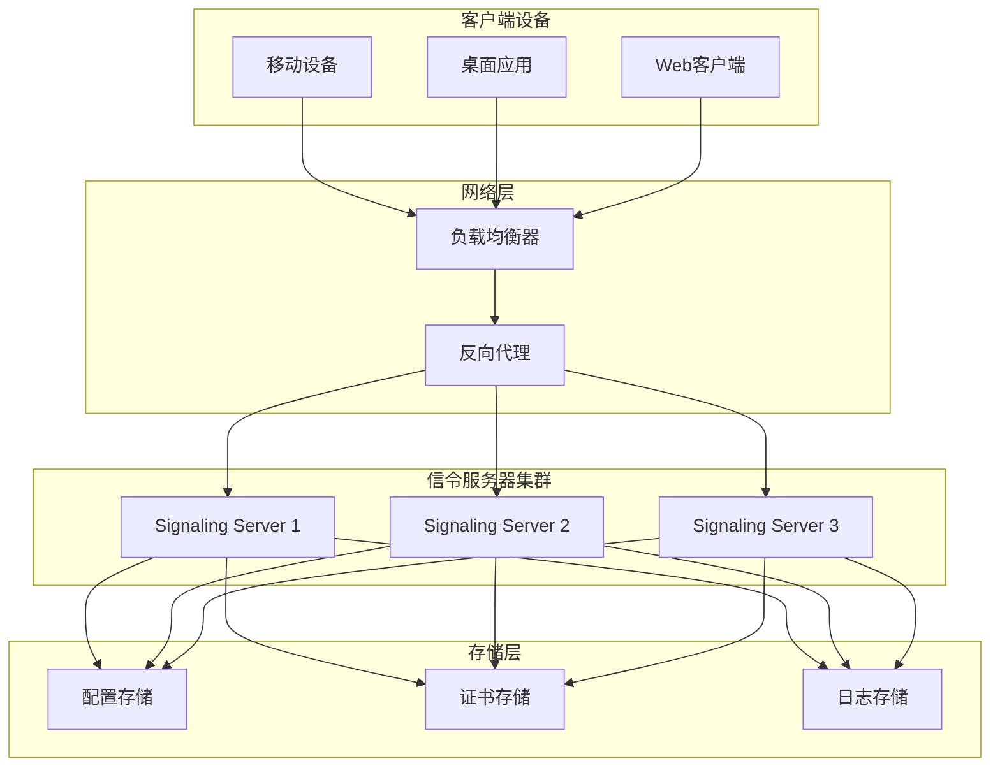
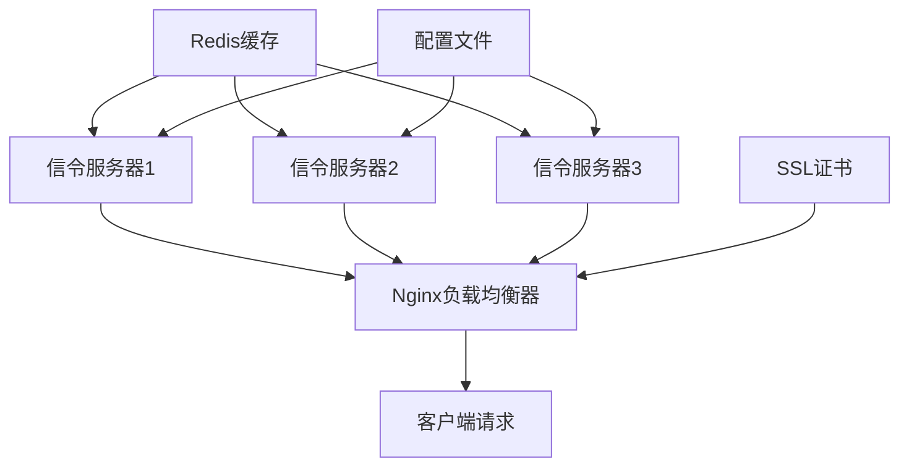
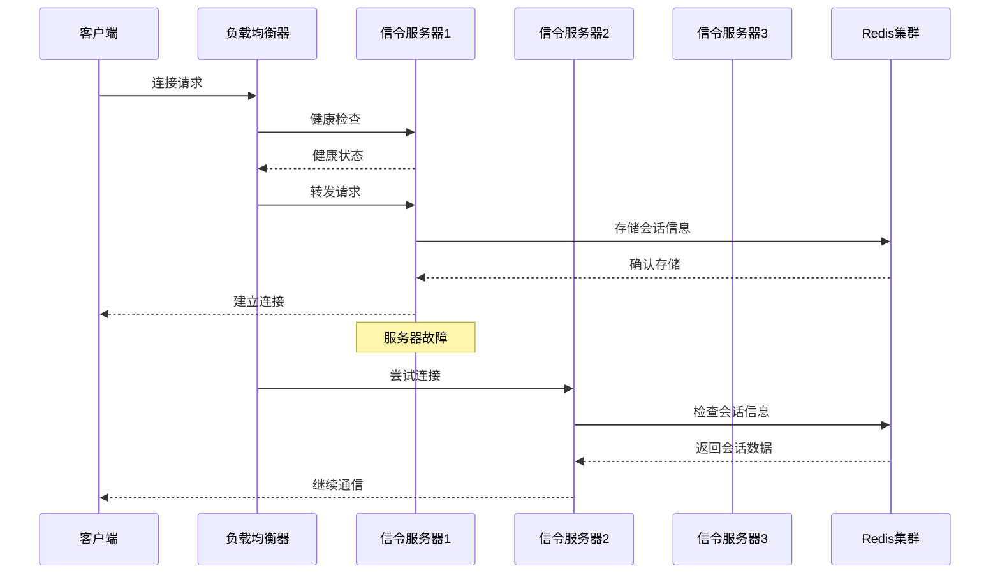

# LocalSend集群部署文档

<cite>
**本文档中引用的文件**
- [README.md](file://README.md)
- [server/Dockerfile](file://server/Dockerfile)
- [server/src/main.rs](file://server/src/main.rs)
- [server/Cargo.toml](file://server/Cargo.toml)
- [server/src/config/init.rs](file://server/src/config/init.rs)
- [server/src/config/state.rs](file://server/src/config/state.rs)
- [common/lib/model/dto/multicast_dto.dart](file://common/lib/model/dto/multicast_dto.dart)
- [common/lib/src/task/discovery/multicast_discovery.dart](file://common/lib/src/task/discovery/multicast_discovery.dart)
- [core/src/http/server/client_cert_verifier.rs](file://core/src/http/server/client_cert_verifier.rs)
- [app/lib/util/security_helper.dart](file://app/lib/util/security_helper.dart)
</cite>

## 目录
1. [简介](#简介)
2. [项目架构概述](#项目架构概述)
3. [基础Docker Compose配置](#基础docker-compose配置)
4. [多容器编排](#多容器编排)
5. [网络配置与服务发现](#网络配置与服务发现)
6. [安全配置](#安全配置)
7. [环境变量管理](#环境变量管理)
8. [高可用部署](#高可用部署)
9. [监控与日志](#监控与日志)
10. [备份恢复方案](#备份恢复方案)
11. [不同规模部署场景](#不同规模部署场景)
12. [故障排除指南](#故障排除指南)

## 简介

LocalSend是一个跨平台的本地文件传输应用，采用信令服务器架构，支持设备间的直接通信。本部署文档提供了完整的Docker Compose集群部署方案，涵盖从单机到大规模云环境的各种部署场景。

LocalSend的核心特性包括：
- 基于WebRTC的点对点通信
- 自动化的设备发现机制
- 强加密的TLS/SSL通信
- 多播广播协议支持
- 跨平台兼容性

## 项目架构概述

LocalSend采用分布式微服务架构，主要组件包括：



**图表来源**
- [server/src/main.rs](file://server/src/main.rs#L1-L34)
- [server/src/config/state.rs](file://server/src/config/state.rs#L1-L34)

**章节来源**
- [README.md](file://README.md#L1-L50)
- [server/src/main.rs](file://server/src/main.rs#L1-L34)

## 基础Docker Compose配置

### 单节点部署配置

以下是LocalSend信令服务器的基础Docker Compose配置：

```yaml
version: '3.8'

services:
  localsend-signaling:
    build:
      context: ./server
      dockerfile: Dockerfile
    container_name: localsend-signaling
    ports:
      - "3000:3000"
    environment:
      - SERVER_IP=0.0.0.0
      - SERVER_PORT=3000
      - RUST_LOG=info
    volumes:
      - ./data:/app/data
      - ./logs:/app/logs
    networks:
      - localsend-network
    restart: unless-stopped
    healthcheck:
      test: ["CMD", "curl", "-f", "http://localhost:3000/v1/ws"]
      interval: 30s
      timeout: 10s
      retries: 3
      start_period: 40s

networks:
  localsend-network:
    driver: bridge
    ipam:
      config:
        - subnet: 172.20.0.0/16
```

### 多节点集群配置

对于生产环境，建议使用多个信令服务器实例：

```yaml
version: '3.8'

services:
  localsend-signaling-1:
    build: ../server
    container_name: localsend-signaling-1
    ports:
      - "3001:3000"
    environment:
      - SERVER_IP=0.0.0.0
      - SERVER_PORT=3000
      - NODE_ID=1
    networks:
      - localsend-network
    restart: unless-stopped
    depends_on:
      - redis

  localsend-signaling-2:
    build: ../server
    container_name: localsend-signaling-2
    ports:
      - "3002:3000"
    environment:
      - SERVER_IP=0.0.0.0
      - SERVER_PORT=3000
      - NODE_ID=2
    networks:
      - localsend-network
    restart: unless-stopped
    depends_on:
      - redis

  load-balancer:
    image: nginx:alpine
    container_name: localsend-load-balancer
    ports:
      - "80:80"
      - "443:443"
    volumes:
      - ./nginx.conf:/etc/nginx/nginx.conf:ro
      - ./ssl:/etc/nginx/ssl:ro
    networks:
      - localsend-network
    depends_on:
      - localsend-signaling-1
      - localsend-signaling-2
    restart: unless-stopped

  redis:
    image: redis:7-alpine
    container_name: localsend-redis
    ports:
      - "6379:6379"
    volumes:
      - redis-data:/data
    networks:
      - localsend-network
    restart: unless-stopped

volumes:
  redis-data:

networks:
  localsend-network:
    driver: bridge
    ipam:
      config:
        - subnet: 172.20.0.0/16
```

**章节来源**
- [server/Dockerfile](file://server/Dockerfile#L1-L25)
- [server/src/main.rs](file://server/src/main.rs#L15-L25)

## 多容器编排

### 服务依赖关系



**图表来源**
- [server/src/config/state.rs](file://server/src/config/state.rs#L1-L34)
- [server/src/config/init.rs](file://server/src/config/init.rs#L1-L21)

### 容器编排最佳实践

1. **健康检查配置**：为每个服务配置健康检查端点
2. **资源限制**：设置CPU和内存限制
3. **日志聚合**：统一收集和管理日志
4. **数据持久化**：确保重要数据的持久化存储

```yaml
services:
  localsend-signaling:
    deploy:
      resources:
        limits:
          cpus: '0.5'
          memory: 512M
        reservations:
          cpus: '0.25'
          memory: 256M
    logging:
      driver: "json-file"
      options:
        max-size: "10m"
        max-file: "3"
```

**章节来源**
- [server/src/config/state.rs](file://server/src/config/state.rs#L1-L34)

## 网络配置与服务发现

### 多播发现配置

LocalSend使用多播协议进行设备发现，需要正确配置网络参数：

```yaml
services:
  localsend-signaling:
    environment:
      - MULTICAST_GROUP=239.255.255.250
      - DISCOVERY_PORT=53317
      - NETWORK_WHITELIST=192.168.0.0/16,10.0.0.0/8
    cap_add:
      - NET_ADMIN
    sysctls:
      - net.ipv4.ip_forward=1
      - net.ipv6.conf.all.forwarding=1
    networks:
      - localsend-network
      - legacy-network

networks:
  localsend-network:
    driver: bridge
    driver_opts:
      com.docker.network.bridge.enable_icc: "true"
      com.docker.network.bridge.enable_ip_masquerade: "true"
    ipam:
      config:
        - subnet: 172.20.0.0/16
          gateway: 172.20.0.1
  legacy-network:
    driver: bridge
    driver_opts:
      com.docker.network.bridge.name: docker0
```

### 端口映射策略

| 服务类型 | 协议 | 端口范围 | 用途 |
|---------|------|----------|------|
| 信令服务 | TCP | 3000 | WebSocket通信 |
| 信令服务 | UDP | 53317 | 设备发现 |
| 负载均衡器 | TCP | 80,443 | HTTP/HTTPS访问 |
| Redis缓存 | TCP | 6379 | 会话状态存储 |
| 监控系统 | TCP | 9090,9100 | 指标收集 |

**章节来源**
- [common/lib/src/task/discovery/multicast_discovery.dart](file://common/lib/src/task/discovery/multicast_discovery.dart#L192-L224)
- [common/lib/model/dto/multicast_dto.dart](file://common/lib/model/dto/multicast_dto.dart#L1-L54)

## 安全配置

### TLS/SSL证书配置

LocalSend使用自签名证书进行端到端加密：

```yaml
services:
  localsend-signaling:
    environment:
      - ENABLE_TLS=true
      - CERT_PATH=/app/certs/server.crt
      - KEY_PATH=/app/certs/server.key
      - CA_CERT_PATH=/app/certs/ca.crt
    volumes:
      - ./certs:/app/certs:ro
      - ./security:/app/security
    networks:
      - localsend-network

  nginx:
    volumes:
      - ./ssl:/etc/nginx/ssl:ro
      - ./nginx.conf:/etc/nginx/nginx.conf:ro
    environment:
      - NGINX_SSL_CERT=/etc/nginx/ssl/server.crt
      - NGINX_SSL_KEY=/etc/nginx/ssl/server.key
```

### 证书生成脚本

```bash
#!/bin/bash
# 生成自签名证书
openssl req -x509 -newkey rsa:4096 -keyout server.key -out server.crt -days 365 -nodes \
  -subj "/C=US/ST=State/L=City/O=Organization/CN=localhost"
```

### 访问控制配置

```yaml
services:
  localsend-signaling:
    environment:
      - ALLOWED_ORIGINS=https://localsend.org,https://app.localsend.org
      - RATE_LIMIT_ENABLED=true
      - MAX_REQUESTS_PER_MINUTE=100
    networks:
      - localsend-network
```

**章节来源**
- [core/src/http/server/client_cert_verifier.rs](file://core/src/http/server/client_cert_verifier.rs#L1-L82)
- [app/lib/util/security_helper.dart](file://app/lib/util/security_helper.dart#L1-L39)

## 环境变量管理

### 核心配置参数

| 变量名 | 默认值 | 描述 | 示例 |
|--------|--------|------|------|
| SERVER_IP | 0.0.0.0 | 绑定IP地址 | 0.0.0.0 |
| SERVER_PORT | 3000 | 服务端口 | 3000 |
| RUST_LOG | info | 日志级别 | debug,info,warn,error |
| NODE_ID | - | 节点标识符 | 1,2,3 |
| REDIS_URL | redis://redis:6379 | Redis连接URL | redis://localhost:6379 |
| MULTICAST_GROUP | 239.255.255.250 | 多播组地址 | 239.255.255.250 |
| DISCOVERY_PORT | 53317 | 发现端口 | 53317 |

### 配置文件管理

```yaml
services:
  localsend-signaling:
    env_file:
      - .env.production
    environment:
      - DATABASE_URL=${DATABASE_URL}
      - REDIS_URL=${REDIS_URL}
      - JWT_SECRET=${JWT_SECRET_FILE}
    secrets:
      - jwt_secret
      - database_password

secrets:
  jwt_secret:
    file: ./secrets/jwt_secret.txt
  database_password:
    file: ./secrets/database_password.txt
```

### 密钥管理

```yaml
# secrets/jwt_secret.txt
${JWT_SECRET}

# secrets/database_password.txt
${DATABASE_PASSWORD}
```

**章节来源**
- [server/src/main.rs](file://server/src/main.rs#L15-L25)

## 高可用部署

### 滚动更新策略

```yaml
services:
  localsend-signaling:
    deploy:
      replicas: 3
      update_config:
        parallelism: 1
        delay: 30s
        failure_action: rollback
        order: start-first
      rollback_config:
        parallelism: 1
        delay: 10s
        failure_action: pause
      restart_policy:
        condition: on-failure
        delay: 5s
        max_attempts: 3
        window: 120s
      placement:
        constraints:
          - node.role == worker
```

### 故障转移机制



**图表来源**
- [server/src/config/state.rs](file://server/src/config/state.rs#L1-L34)

### 数据同步策略

```yaml
services:
  redis-master:
    image: redis:7-alpine
    command: redis-server --appendonly yes --requirepass ${REDIS_PASSWORD}
    volumes:
      - redis-master-data:/data
    networks:
      - localsend-network

  redis-slave:
    image: redis:7-alpine
    command: redis-server --slaveof redis-master 6379 --requirepass ${REDIS_PASSWORD}
    depends_on:
      - redis-master
    networks:
      - localsend-network

volumes:
  redis-master-data:
```

**章节来源**
- [server/src/config/state.rs](file://server/src/config/state.rs#L1-L34)

## 监控与日志

### Prometheus监控配置

```yaml
services:
  prometheus:
    image: prom/prometheus:latest
    container_name: localsend-prometheus
    ports:
      - "9090:9090"
    volumes:
      - ./prometheus.yml:/etc/prometheus/prometheus.yml:ro
      - prometheus-data:/prometheus
    networks:
      - localsend-network
    restart: unless-stopped

  grafana:
    image: grafana/grafana:latest
    container_name: localsend-grafana
    ports:
      - "3000:3000"
    volumes:
      - grafana-data:/var/lib/grafana
    environment:
      - GF_SECURITY_ADMIN_PASSWORD=admin
    networks:
      - localsend-network
    depends_on:
      - prometheus

volumes:
  prometheus-data:
  grafana-data:

networks:
  localsend-network:
```

### 日志收集配置

```yaml
services:
  localsend-signaling:
    logging:
      driver: "json-file"
      options:
        max-size: "100m"
        max-file: "5"
        labels: "service=localsend-signaling"
    
  fluentd:
    image: fluent/fluentd:v1.14
    container_name: localsend-fluentd
    ports:
      - "24224:24224"
    volumes:
      - ./fluentd.conf:/fluentd/etc/fluent.conf:ro
      - ./logs:/logs
    networks:
      - localsend-network
    depends_on:
      - elasticsearch

  elasticsearch:
    image: docker.elastic.co/elasticsearch/elasticsearch:7.17.0
    container_name: localsend-elasticsearch
    environment:
      - discovery.type=single-node
      - "ES_JAVA_OPTS=-Xms512m -Xmx512m"
    volumes:
      - elasticsearch-data:/usr/share/elasticsearch/data
    networks:
      - localsend-network

  kibana:
    image: docker.elastic.co/kibana/kibana:7.17.0
    container_name: localsend-kibana
    ports:
      - "5601:5601"
    environment:
      - ELASTICSEARCH_HOSTS=http://elasticsearch:9200
    networks:
      - localsend-network
    depends_on:
      - elasticsearch

volumes:
  elasticsearch-data:
```

### 关键指标监控

| 指标类型 | 指标名称 | 描述 | 单位 |
|---------|----------|------|------|
| 系统指标 | cpu.usage | CPU使用率 | % |
| 系统指标 | memory.usage | 内存使用率 | MB |
| 应用指标 | http.requests.total | 总请求数 | count |
| 应用指标 | websocket.connections | WebSocket连接数 | count |
| 应用指标 | discovery.devices | 发现设备数 | count |
| 错误指标 | http.errors.5xx | 5xx错误数 | count |
| 错误指标 | websocket.errors | WebSocket错误数 | count |

**章节来源**
- [server/src/config/init.rs](file://server/src/config/init.rs#L1-L21)

## 备份恢复方案

### 数据备份策略

```bash
#!/bin/bash
# 备份脚本
BACKUP_DIR="/backup/$(date +%Y%m%d_%H%M%S)"
mkdir -p $BACKUP_DIR

# 备份Redis数据
docker exec localsend-redis redis-cli save
docker cp localsend-redis:/data/dump.rdb $BACKUP_DIR/redis_dump.rdb

# 备份证书
cp -r ./certs $BACKUP_DIR/

# 备份配置文件
cp -r ./config $BACKUP_DIR/

echo "备份完成: $BACKUP_DIR"
```

### 自动化恢复流程

```bash
#!/bin/bash
# 恢复脚本
BACKUP_PATH=$1

if [ -z "$BACKUP_PATH" ]; then
    echo "用法: $0 <备份路径>"
    exit 1
fi

# 停止服务
docker-compose down

# 恢复Redis数据
docker cp $BACKUP_PATH/redis_dump.rdb localsend-redis:/data/dump.rdb
docker exec localsend-redis redis-cli --raw flushall
docker exec localsend-redis redis-cli --raw restore db 0 $(cat $BACKUP_PATH/redis_dump.rdb | xxd -p -c 1000000)

# 恢复证书
rm -rf ./certs
cp -r $BACKUP_PATH/certs ./certs

# 启动服务
docker-compose up -d

echo "恢复完成"
```

### 灾难恢复计划

1. **数据丢失恢复**：从最近的备份恢复Redis数据
2. **服务中断恢复**：启动备用节点替换故障节点
3. **网络分区恢复**：重新配置多播路由
4. **证书过期处理**：自动更新SSL证书

## 不同规模部署场景

### 单机部署（开发环境）

```yaml
version: '3.8'

services:
  localsend-signaling:
    build: ../server
    container_name: localsend-dev
    ports:
      - "3000:3000"
    environment:
      - SERVER_IP=0.0.0.0
      - SERVER_PORT=3000
      - RUST_LOG=debug
    volumes:
      - ./data:/app/data
      - ./logs:/app/logs
    networks:
      - localsend-network
    restart: unless-stopped

networks:
  localsend-network:
    driver: bridge
```

### 多机部署（生产环境）

```yaml
version: '3.8'

services:
  localsend-signaling-1:
    image: localsend/signaling:${VERSION}
    container_name: localsend-signaling-1
    ports:
      - "3001:3000"
    environment:
      - NODE_ID=1
      - CLUSTER_SIZE=3
      - REDIS_URL=redis://redis-cluster:6379
    networks:
      - localsend-network
    restart: always
    deploy:
      replicas: 1
      placement:
        constraints:
          - node.hostname == node1.example.com

  localsend-signaling-2:
    image: localsend/signaling:${VERSION}
    container_name: localsend-signaling-2
    ports:
      - "3002:3000"
    environment:
      - NODE_ID=2
      - CLUSTER_SIZE=3
      - REDIS_URL=redis://redis-cluster:6379
    networks:
      - localsend-network
    restart: always
    deploy:
      replicas: 1
      placement:
        constraints:
          - node.hostname == node2.example.com

  localsend-signaling-3:
    image: localsend/signaling:${VERSION}
    container_name: localsend-signaling-3
    ports:
      - "3003:3000"
    environment:
      - NODE_ID=3
      - CLUSTER_SIZE=3
      - REDIS_URL=redis://redis-cluster:6379
    networks:
      - localsend-network
    restart: always
    deploy:
      replicas: 1
      placement:
        constraints:
          - node.hostname == node3.example.com

  redis-cluster:
    image: redis:7-alpine
    command: redis-server --cluster-enabled yes --cluster-config-file nodes.conf --cluster-node-timeout 5000 --appendonly yes
    ports:
      - "7000-7005:7000-7005"
    volumes:
      - redis-data:/data
    networks:
      - localsend-network
    command: >
      bash -c "
        redis-cli --cluster create $$(hostname -i):7000 $$(hostname -i):7001 $$(hostname -i):7002 $$(hostname -i):7003 $$(hostname -i):7004 $$(hostname -i):7005 --cluster-replicas 1
      "

volumes:
  redis-data:

networks:
  localsend-network:
    driver: overlay
    attachable: true
```

### 云环境部署（Kubernetes）

```yaml
apiVersion: apps/v1
kind: Deployment
metadata:
  name: localsend-signaling
spec:
  replicas: 3
  selector:
    matchLabels:
      app: localsend-signaling
  template:
    metadata:
      labels:
        app: localsend-signaling
    spec:
      containers:
      - name: localsend-signaling
        image: localsend/signaling:latest
        ports:
        - containerPort: 3000
        env:
        - name: REDIS_URL
          value: "redis://redis-service:6379"
        resources:
          requests:
            memory: "256Mi"
            cpu: "250m"
          limits:
            memory: "512Mi"
            cpu: "500m"
        livenessProbe:
          httpGet:
            path: /health
            port: 3000
          initialDelaySeconds: 30
          periodSeconds: 10
        readinessProbe:
          httpGet:
            path: /ready
            port: 3000
          initialDelaySeconds: 5
          periodSeconds: 5

---
apiVersion: v1
kind: Service
metadata:
  name: localsend-service
spec:
  selector:
    app: localsend-signaling
  ports:
  - protocol: TCP
    port: 80
    targetPort: 3000
  type: LoadBalancer
```

## 故障排除指南

### 常见问题诊断

| 问题类型 | 症状 | 可能原因 | 解决方案 |
|---------|------|----------|----------|
| 连接超时 | 客户端无法连接到服务器 | 端口未开放或防火墙阻止 | 检查端口配置和防火墙规则 |
| 多播发现失败 | 设备无法发现其他设备 | 网络配置或多播路由问题 | 验证多播组和网络接口配置 |
| 证书验证失败 | TLS握手失败 | 证书过期或不匹配 | 更新SSL证书 |
| 性能问题 | 响应缓慢或高延迟 | 资源不足或网络拥塞 | 监控资源使用情况 |
| 数据丢失 | 会话状态丢失 | Redis连接问题 | 检查Redis集群状态 |

### 诊断命令集合

```bash
# 检查容器状态
docker ps -a

# 查看容器日志
docker logs localsend-signaling

# 检查网络连接
docker network ls
docker network inspect localsend-network

# 测试端口连通性
telnet localhost 3000
nc -zv localhost 3000

# 检查Redis状态
docker exec localsend-redis redis-cli ping
docker exec localsend-redis redis-cli info replication

# 监控系统资源
docker stats localsend-signaling
```

### 性能优化建议

1. **硬件优化**：
   - 使用SSD存储提高I/O性能
   - 增加内存容量减少交换使用
   - 配置适当的CPU核心数

2. **软件优化**：
   - 调整Redis内存配置
   - 优化WebSocket连接池大小
   - 启用HTTP/2协议

3. **网络优化**：
   - 使用专用网络接口
   - 配置QoS策略保证带宽
   - 优化MTU大小

**章节来源**
- [README.md](file://README.md#L100-L150)

## 结论

本部署文档提供了LocalSend信令服务器的完整Docker Compose集群解决方案，涵盖了从基础配置到高级功能的各个方面。通过遵循本文档的指导，您可以成功部署一个高可用、可扩展的LocalSend集群，满足不同规模和场景的需求。

关键要点：
- 使用Docker Compose进行容器编排
- 实施高可用和故障转移机制
- 配置完善的监控和日志系统
- 制定详细的备份和恢复计划
- 根据实际需求选择合适的部署规模

定期维护和监控是确保系统稳定运行的关键，建议建立完善的运维流程和应急预案。