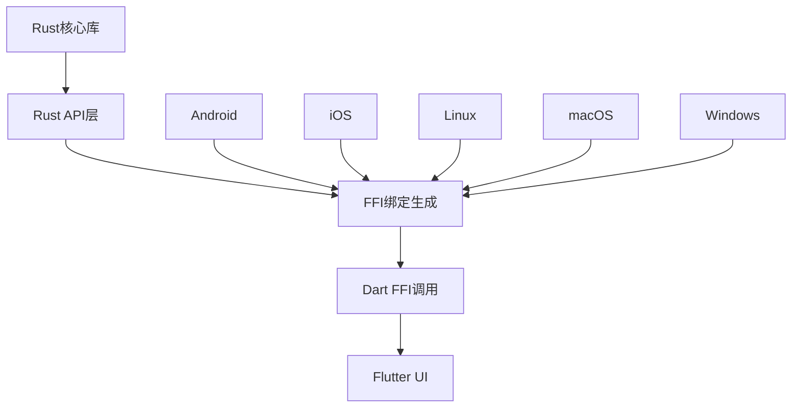
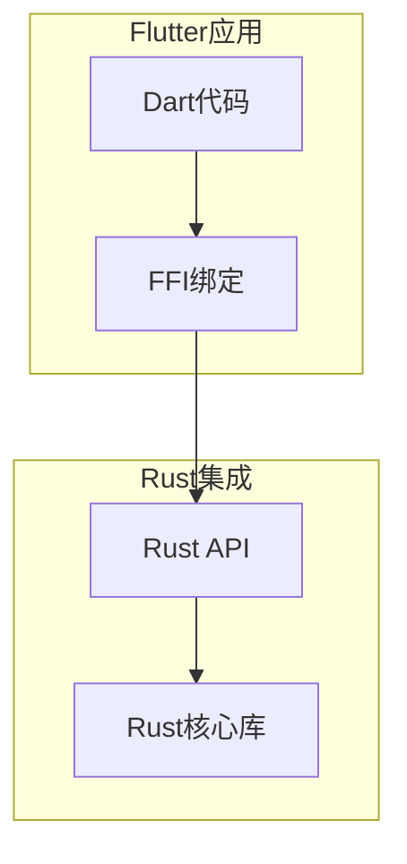
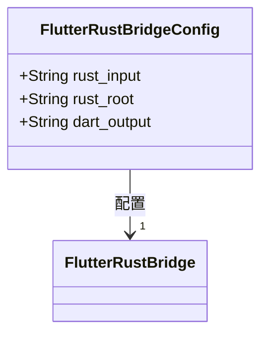
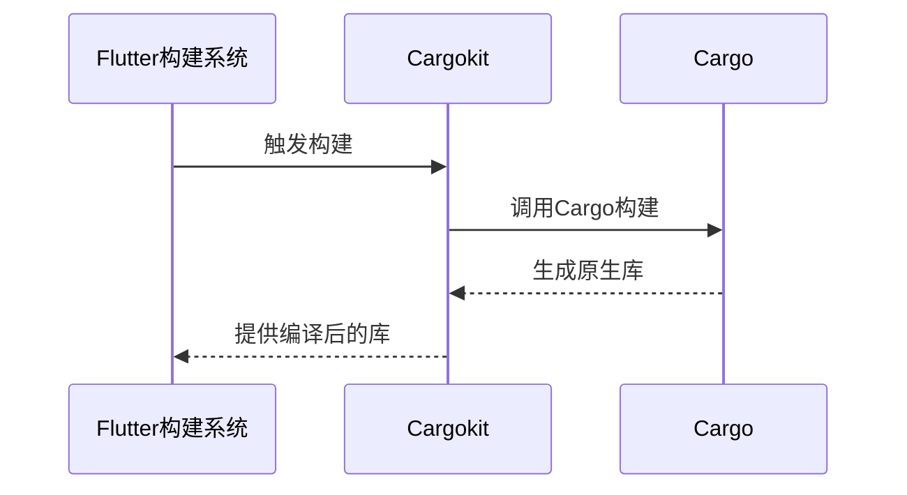
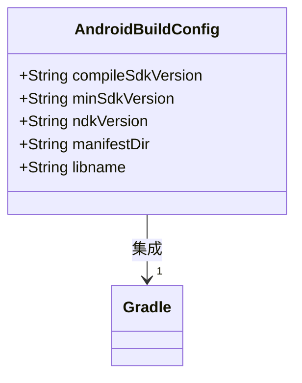
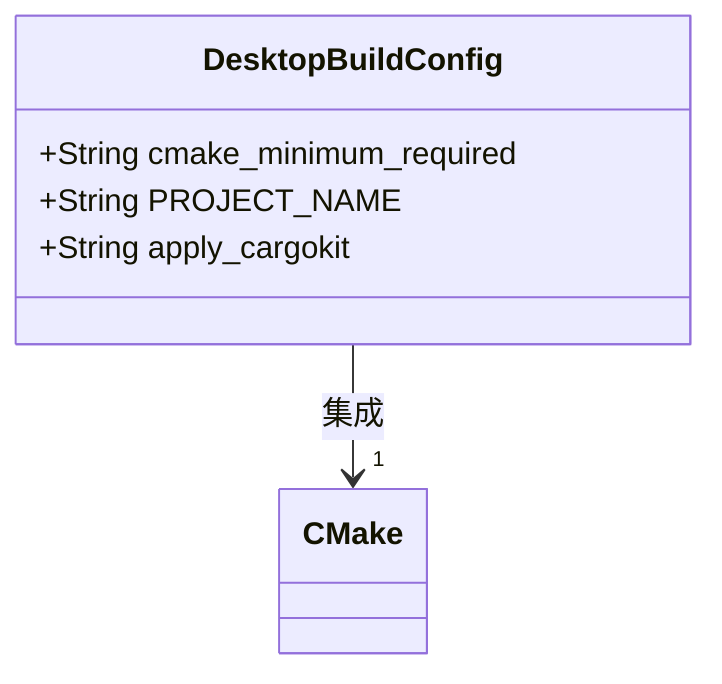
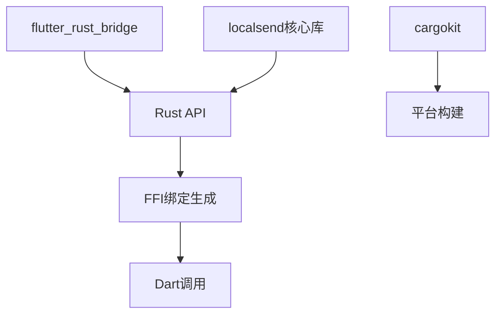

# Rust集成构建

<cite>
**本文档引用的文件**
- [Cargo.toml](file://app/rust/Cargo.toml)
- [lib.rs](file://app/rust/src/lib.rs)
- [mod.rs](file://app/rust/src/api/mod.rs)
- [flutter_rust_bridge.yaml](file://app/flutter_rust_bridge.yaml)
- [pubspec.yaml](file://app/rust_builder/pubspec.yaml)
- [build.gradle](file://app/rust_builder/android/build.gradle)
- [build_pod.sh](file://app/rust_builder/cargokit/build_pod.sh)
- [run_build_tool.sh](file://app/rust_builder/cargokit/run_build_tool.sh)
- [CMakeLists.txt](file://app/rust_builder/linux/CMakeLists.txt)
- [CMakeLists.txt](file://app/rust_builder/windows/CMakeLists.txt)
- [frb_generated.rs](file://app/rust/src/frb_generated.rs)
- [frb_generated.dart](file://app/lib/rust/frb_generated.dart)
</cite>

## 目录
1. [简介](#简介)
2. [项目结构](#项目结构)
3. [核心组件](#核心组件)
4. [架构概述](#架构概述)
5. [详细组件分析](#详细组件分析)
6. [依赖分析](#依赖分析)
7. [性能考虑](#性能考虑)
8. [故障排除指南](#故障排除指南)
9. [结论](#结论)

## 简介
本项目采用Flutter与Rust深度集成的架构，通过flutter_rust_bridge实现高性能的跨语言调用。Rust代码主要负责核心业务逻辑、加密算法、WebRTC通信等计算密集型任务，而Flutter负责UI渲染和用户交互。这种架构设计充分发挥了Rust在内存安全和性能方面的优势，同时利用Flutter的跨平台UI能力。

## 项目结构
项目采用模块化设计，将Rust核心库与Flutter应用分离。Rust代码位于`app/rust`目录，包含API接口和与核心库的集成。`rust_builder`目录包含构建工具配置，用于在不同平台上编译Rust代码。生成的FFI绑定代码位于`lib/rust`目录，供Dart代码调用。

**图表来源**
- [Cargo.toml](file://app/rust/Cargo.toml)
- [pubspec.yaml](file://app/rust_builder/pubspec.yaml)

**本节来源**
- [Cargo.toml](file://app/rust/Cargo.toml)
- [pubspec.yaml](file://app/rust_builder/pubspec.yaml)

## 核心组件
系统的核心是Rust实现的API层，通过flutter_rust_bridge生成Dart FFI绑定。Rust代码编译为动态库(`cdylib`)和静态库(`staticlib`)，供不同平台使用。`flutter_rust_bridge.yaml`配置文件定义了Rust输入、Rust根目录和Dart输出目录，指导代码生成过程。

**本节来源**
- [Cargo.toml](file://app/rust/Cargo.toml)
- [flutter_rust_bridge.yaml](file://app/flutter_rust_bridge.yaml)

## 架构概述
系统采用分层架构，Rust核心库通过API层暴露功能，flutter_rust_bridge生成FFI绑定，Dart代码通过这些绑定调用Rust功能。cargokit构建工具负责在不同平台上编译Rust代码，确保跨平台兼容性。

**图表来源**
- [lib.rs](file://app/rust/src/lib.rs)
- [mod.rs](file://app/rust/src/api/mod.rs)

## 详细组件分析

### Flutter-Rust桥接分析
系统使用flutter_rust_bridge实现Dart与Rust的高效通信。该工具自动生成FFI绑定代码，处理类型转换和内存管理。

#### 桥接配置

**图表来源**
- [flutter_rust_bridge.yaml](file://app/flutter_rust_bridge.yaml)

### Rust核心库编译流程
Rust核心库的编译由cargokit构建工具管理，支持多平台交叉编译。

#### 构建工具工作原理

**图表来源**
- [run_build_tool.sh](file://app/rust_builder/cargokit/run_build_tool.sh)
- [build_pod.sh](file://app/rust_builder/cargokit/build_pod.sh)

### 平台特定构建配置
不同平台使用不同的构建系统集成cargokit。

#### Android构建配置

**图表来源**
- [build.gradle](file://app/rust_builder/android/build.gradle)

#### 桌面平台构建配置

**图表来源**
- [CMakeLists.txt](file://app/rust_builder/linux/CMakeLists.txt)
- [CMakeLists.txt](file://app/rust_builder/windows/CMakeLists.txt)

**本节来源**
- [build.gradle](file://app/rust_builder/android/build.gradle)
- [CMakeLists.txt](file://app/rust_builder/linux/CMakeLists.txt)
- [CMakeLists.txt](file://app/rust_builder/windows/CMakeLists.txt)

## 依赖分析
项目依赖关系清晰，Rust层依赖核心库和flutter_rust_bridge，构建层依赖cargokit，Dart层依赖生成的FFI绑定。

**图表来源**
- [Cargo.toml](file://app/rust/Cargo.toml)
- [pubspec.yaml](file://app/rust_builder/pubspec.yaml)

**本节来源**
- [Cargo.toml](file://app/rust/Cargo.toml)
- [pubspec.yaml](file://app/rust_builder/pubspec.yaml)

## 性能考虑
虽然本节不分析具体文件，但可以提供一般性性能建议：
- 使用Release模式编译Rust代码以获得最佳性能
- 避免频繁的跨语言调用，批量处理数据
- 合理使用异步调用避免UI阻塞
- 监控内存使用，避免内存泄漏

## 故障排除指南
当遇到构建问题时，可以检查以下方面：
- 确保Rust工具链正确安装
- 检查平台特定的构建依赖
- 验证flutter_rust_bridge版本兼容性
- 查看构建日志中的具体错误信息

**本节来源**
- [run_build_tool.sh](file://app/rust_builder/cargokit/run_build_tool.sh)
- [build_pod.sh](file://app/rust_builder/cargokit/build_pod.sh)

## 结论
本项目成功实现了Flutter与Rust的深度集成，通过flutter_rust_bridge和cargokit构建工具，实现了跨平台的高效原生代码执行。这种架构既保证了性能，又保持了开发效率，为复杂应用提供了可靠的解决方案。