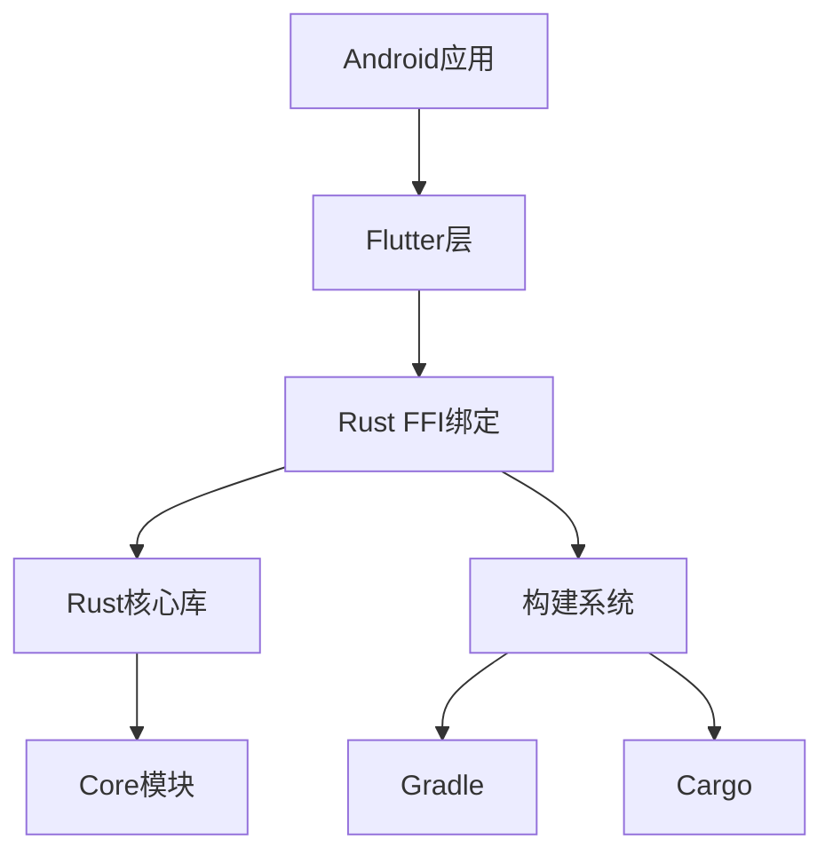
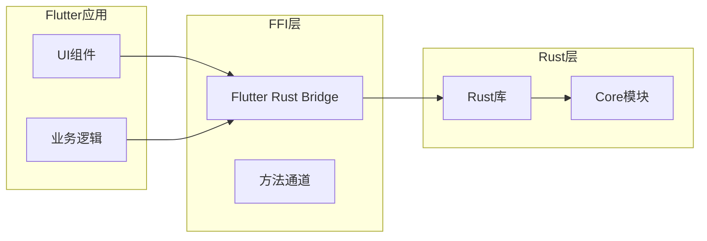
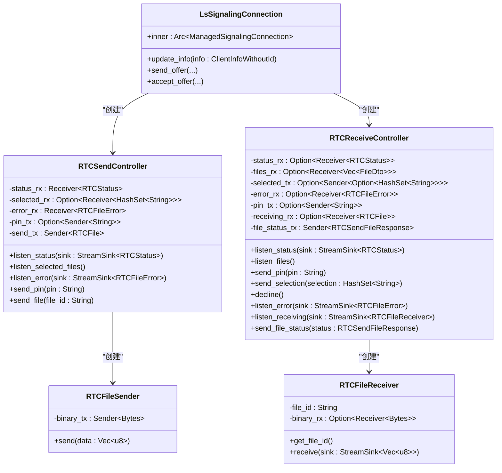
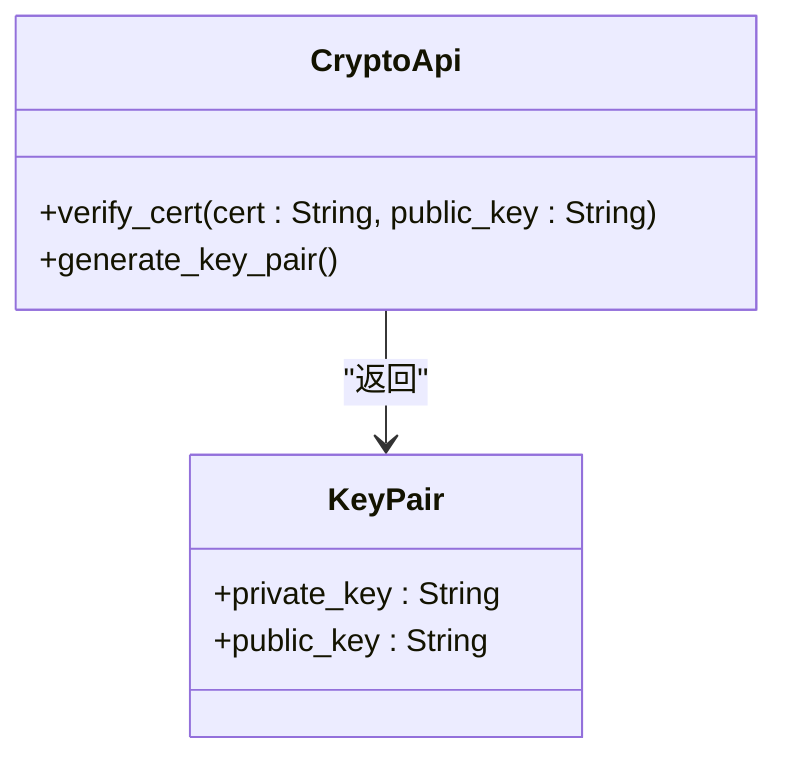
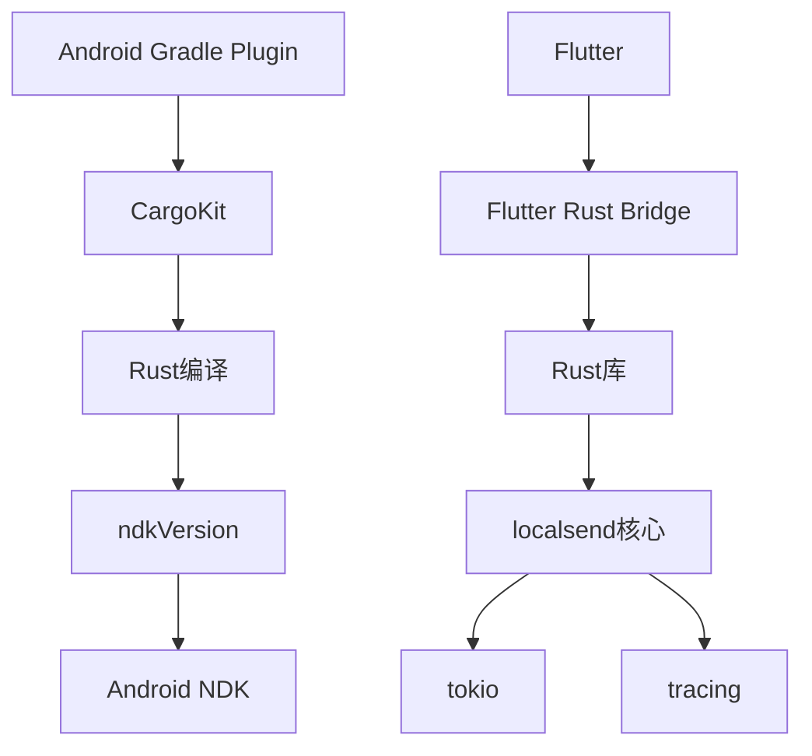

# Android平台集成

<cite>
**本文档引用的文件**
- [build.gradle](file://app/android/app/build.gradle)
- [build.gradle](file://app/android/build.gradle)
- [Cargo.toml](file://app/rust/Cargo.toml)
- [build.gradle](file://app/rust_builder/android/build.gradle)
- [settings.gradle](file://app/rust_builder/android/settings.gradle)
- [pubspec.yaml](file://app/rust_builder/pubspec.yaml)
- [lib.rs](file://app/rust/src/lib.rs)
- [mod.rs](file://app/rust/src/api/mod.rs)
- [webrtc.rs](file://app/rust/src/api/webrtc.rs)
- [crypto.rs](file://app/rust/src/api/crypto.rs)
</cite>

## 目录
1. [项目结构](#项目结构)
2. [核心组件](#核心组件)
3. [架构概述](#架构概述)
4. [详细组件分析](#详细组件分析)
5. [依赖分析](#依赖分析)
6. [性能考虑](#性能考虑)
7. [故障排除指南](#故障排除指南)

## 项目结构

本项目采用分层架构，将Rust核心库与Android平台集成。主要结构包括应用层、Rust库层和构建工具层。Android应用通过Gradle构建系统集成Rust代码，使用Flutter Rust Bridge进行FFI绑定。

**图示来源**
- [app/build.gradle](file://app/android/app/build.gradle#L1-L102)
- [rust_builder/android/build.gradle](file://app/rust_builder/android/build.gradle#L1-L56)

**本节来源**
- [app/android/app/build.gradle](file://app/android/app/build.gradle#L1-L102)
- [app/android/build.gradle](file://app/android/build.gradle#L1-L34)

## 核心组件

项目的核心组件包括Rust库、Flutter Rust Bridge绑定和Android Gradle集成。Rust库提供核心功能实现，通过FFI接口暴露给Flutter应用。构建系统负责编译Rust代码为Android可用的原生库。

**本节来源**
- [Cargo.toml](file://app/rust/Cargo.toml#L1-L17)
- [pubspec.yaml](file://app/rust_builder/pubspec.yaml#L1-L34)

## 架构概述

系统架构采用分层设计，上层为Flutter应用，中间层为FFI绑定，底层为Rust核心实现。构建流程通过Gradle调用Cargo编译Rust代码，生成针对不同ABI的原生库。

**图示来源**
- [lib.rs](file://app/rust/src/lib.rs#L1-L3)
- [mod.rs](file://app/rust/src/api/mod.rs#L1-L4)

## 详细组件分析

### WebRTC组件分析

WebRTC组件负责处理点对点通信，包括信令连接、SDP交换和文件传输。组件通过异步通道处理状态更新和错误报告。

**图示来源**
- [webrtc.rs](file://app/rust/src/api/webrtc.rs#L1-L514)

**本节来源**
- [webrtc.rs](file://app/rust/src/api/webrtc.rs#L1-L514)

### 加密组件分析

加密组件提供证书验证和密钥对生成功能，确保通信安全。组件封装了底层加密库的复杂性，提供简单的API接口。

**图示来源**
- [crypto.rs](file://app/rust/src/api/crypto.rs#L1-L21)

**本节来源**
- [crypto.rs](file://app/rust/src/api/crypto.rs#L1-L21)

## 依赖分析

项目依赖关系清晰，分为构建依赖和运行时依赖。构建系统依赖Gradle和Cargo工具链，运行时依赖Rust标准库和第三方crate。

**图示来源**
- [Cargo.toml](file://app/rust/Cargo.toml#L1-L17)
- [build.gradle](file://app/rust_builder/android/build.gradle#L1-L56)

**本节来源**
- [Cargo.toml](file://app/rust/Cargo.toml#L1-L17)
- [build.gradle](file://app/rust_builder/android/build.gradle#L1-L56)

## 性能考虑

在Android平台集成Rust时，需要考虑多个性能因素。不同ABI的库会增加APK大小，但可以提高执行效率。异步编程模型有助于避免UI线程阻塞，但需要合理管理资源。

建议启用代码瘦身，只包含目标设备所需的ABI。对于启动时间优化，可以延迟加载非关键Rust组件。内存使用监控应关注原生内存分配，避免内存泄漏。

## 故障排除指南

常见问题包括NDK版本不兼容、架构缺失和构建缓存问题。当遇到NDK版本问题时，应检查`android.ndkVersion`配置是否与项目要求匹配。对于架构缺失问题，确保在build.gradle中正确配置ABI过滤器。

构建缓存问题可以通过清理Gradle和Cargo缓存解决。如果遇到链接错误，检查Rust库的导出符号是否正确暴露。调试时建议启用详细的构建日志输出，以便定位问题根源。