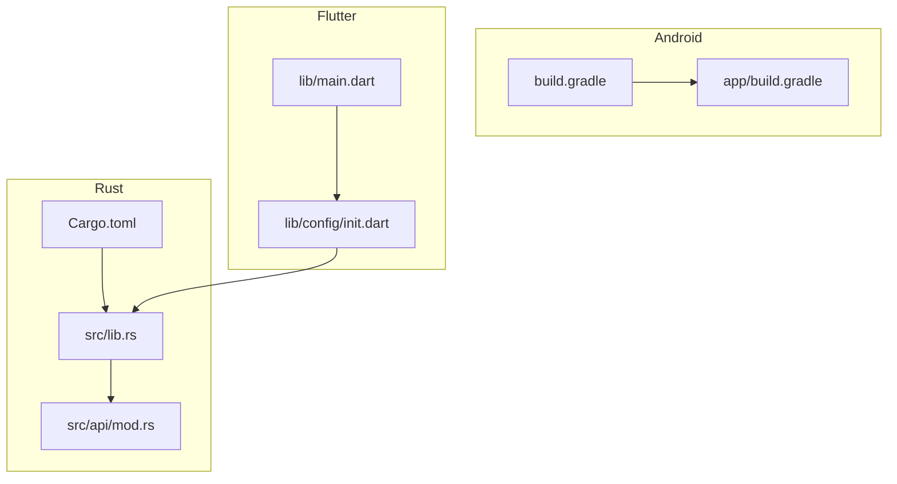
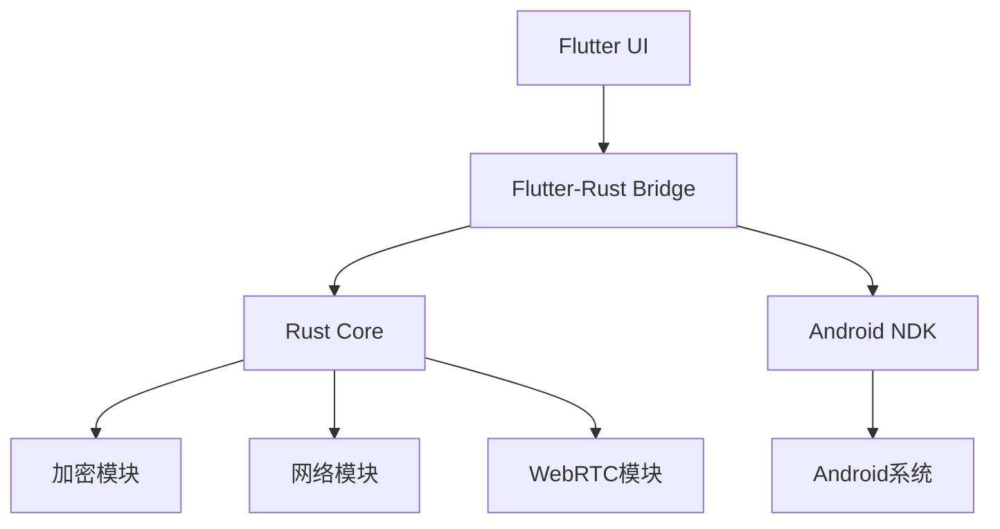
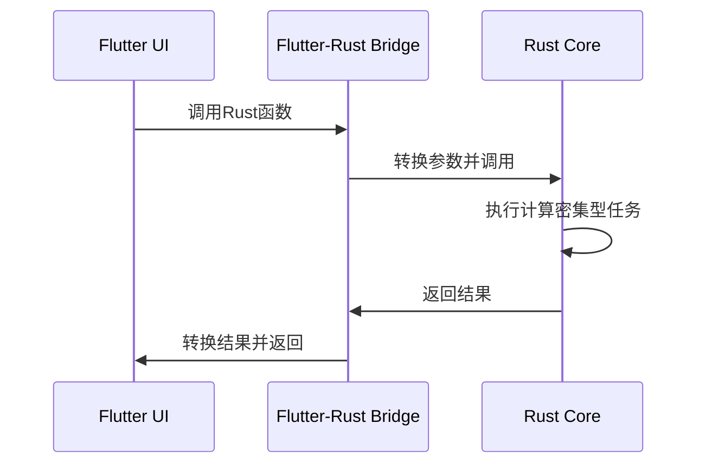
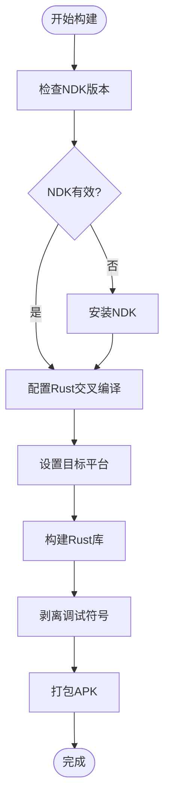
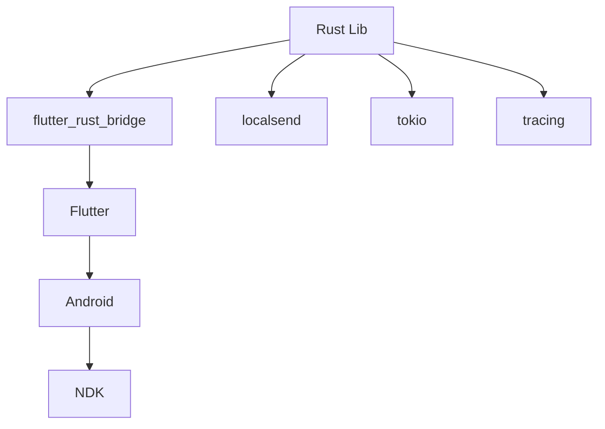

# Android性能优化

<cite>
**本文档中引用的文件**
- [build.gradle](file://app/android/app/build.gradle)
- [Cargo.toml](file://app/rust/Cargo.toml)
- [lib.rs](file://app/rust/src/lib.rs)
- [mod.rs](file://app/rust/src/api/mod.rs)
- [plugin.gradle](file://app/rust_builder/cargokit/gradle/plugin.gradle)
- [init.dart](file://app/lib/config/init.dart)
- [frb_generated.dart](file://app/rust/frb_generated.dart)
- [android_environment.dart](file://app/rust_builder/cargokit/build_tool/lib/src/android_environment.dart)
</cite>

## 目录
1. [简介](#简介)
2. [项目结构](#项目结构)
3. [核心组件](#核心组件)
4. [架构概述](#架构概述)
5. [详细组件分析](#详细组件分析)
6. [依赖分析](#依赖分析)
7. [性能考虑](#性能考虑)
8. [故障排除指南](#故障排除指南)
9. [结论](#结论)

## 简介
本指南详细介绍了如何通过Rust集成优化Android平台的性能。重点包括通过Rust代码优化减少APK体积、启动时间优化方案以及内存使用监控方法。文档还提供了实际案例，展示如何通过配置build.gradle中的packagingOptions和ndk配置来优化最终产物性能。

## 项目结构
本项目采用Flutter与Rust集成的架构，主要分为Android原生代码、Rust核心逻辑和Flutter UI层。Rust代码通过flutter_rust_bridge与Flutter进行通信，实现了高性能的本地计算。

**Diagram sources**
- [app/android/app/build.gradle](file://app/android/app/build.gradle#L1-L102)
- [app/rust/Cargo.toml](file://app/rust/Cargo.toml#L1-L17)
- [app/lib/config/init.dart](file://app/lib/config/init.dart#L1-L324)

**Section sources**
- [app/android/app/build.gradle](file://app/android/app/build.gradle#L1-L102)
- [app/rust/Cargo.toml](file://app/rust/Cargo.toml#L1-L17)
- [app/lib/config/init.dart](file://app/lib/config/init.dart#L1-L324)

## 核心组件
项目的核心组件包括Rust库、Flutter-Rust桥接层和Android构建配置。Rust库负责处理加密、网络通信等计算密集型任务，通过flutter_rust_bridge与Flutter进行高效通信。

**Section sources**
- [app/rust/Cargo.toml](file://app/rust/Cargo.toml#L1-L17)
- [app/rust/src/lib.rs](file://app/rust/src/lib.rs#L1-L4)
- [app/rust/src/api/mod.rs](file://app/rust/src/api/mod.rs#L1-L5)

## 架构概述
系统采用分层架构，将计算密集型任务交给Rust处理，UI层由Flutter负责。这种架构充分利用了Rust的高性能和内存安全性，同时保持了Flutter的跨平台优势。

**Diagram sources**
- [app/rust/src/lib.rs](file://app/rust/src/lib.rs#L1-L4)
- [app/rust/src/api/mod.rs](file://app/rust/src/api/mod.rs#L1-L5)
- [app/rust/Cargo.toml](file://app/rust/Cargo.toml#L1-L17)

## 详细组件分析

### Rust集成分析
Rust集成通过flutter_rust_bridge实现，该桥接工具自动生成必要的绑定代码，确保类型安全和内存安全。

#### 对于API/服务组件：

**Diagram sources**
- [app/rust/frb_generated.dart](file://app/rust/frb_generated.dart#L23-L75)
- [app/lib/config/init.dart](file://app/lib/config/init.dart#L56-L94)

### 构建配置分析
Android构建配置通过Gradle脚本管理Rust库的编译和集成，确保在不同架构上正确构建。

#### 对于复杂逻辑组件：

**Diagram sources**
- [app/rust_builder/cargokit/gradle/plugin.gradle](file://app/rust_builder/cargokit/gradle/plugin.gradle#L1-L179)
- [app/android/app/build.gradle](file://app/android/app/build.gradle#L1-L102)

**Section sources**
- [app/rust_builder/cargokit/gradle/plugin.gradle](file://app/rust_builder/cargokit/gradle/plugin.gradle#L1-L179)
- [app/android/app/build.gradle](file://app/android/app/build.gradle#L1-L102)

## 依赖分析
项目依赖关系清晰，Rust库通过Cargo.toml管理依赖，Android通过Gradle管理依赖，两者通过Cargokit工具集成。

**Diagram sources**
- [app/rust/Cargo.toml](file://app/rust/Cargo.toml#L1-L17)
- [app/rust_builder/cargokit/gradle/plugin.gradle](file://app/rust_builder/cargokit/gradle/plugin.gradle#L1-L179)

**Section sources**
- [app/rust/Cargo.toml](file://app/rust/Cargo.toml#L1-L17)
- [app/rust_builder/cargokit/gradle/plugin.gradle](file://app/rust_builder/cargokit/gradle/plugin.gradle#L1-L179)

## 性能考虑
通过Rust集成，项目在性能方面获得了显著优势。Rust代码的零成本抽象和内存安全特性使得计算密集型任务的执行效率远高于纯Java/Kotlin实现。

**Section sources**
- [app/rust/Cargo.toml](file://app/rust/Cargo.toml#L1-L17)
- [app/lib/config/init.dart](file://app/lib/config/init.dart#L56-L94)

## 故障排除指南
当遇到Rust集成相关问题时，首先检查NDK版本是否匹配，然后确认Cargokit配置是否正确。常见的性能问题通常与JNI调用频率过高或内存泄漏有关。

**Section sources**
- [app/rust_builder/cargokit/gradle/plugin.gradle](file://app/rust_builder/cargokit/gradle/plugin.gradle#L1-L179)
- [app/android/app/build.gradle](file://app/android/app/build.gradle#L1-L102)

## 结论
通过Rust集成，本项目在Android平台上实现了显著的性能提升。建议在未来的开发中继续利用Rust处理计算密集型任务，同时优化Flutter与Rust之间的通信效率。