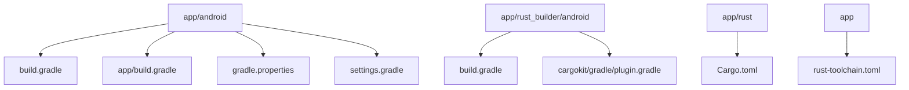

# Android构建配置

<cite>
**本文档引用的文件**   
- [app/android/build.gradle](file://app/android/build.gradle)
- [app/android/app/build.gradle](file://app/android/app/build.gradle)
- [app/rust_builder/android/build.gradle](file://app/rust_builder/android/build.gradle)
- [app/rust_builder/cargokit/gradle/plugin.gradle](file://app/rust_builder/cargokit/gradle/plugin.gradle)
- [app/rust-toolchain.toml](file://app/rust-toolchain.toml)
- [app/rust/Cargo.toml](file://app/rust/Cargo.toml)
- [app/pubspec.yaml](file://app/pubspec.yaml)
</cite>

## 目录
1. [项目结构](#项目结构)
2. [Gradle构建系统配置](#gradle构建系统配置)
3. [Rust集成配置](#rust集成配置)
4. [NDK版本与ABI配置](#ndk版本与abi配置)
5. [构建优化策略](#构建优化策略)
6. [构建输出管理](#构建输出管理)

## 项目结构

本项目采用Flutter与Rust集成的混合架构，Android构建配置主要分布在多个层级的build.gradle文件中。核心的Android构建配置位于`app/android`目录下，包含项目级和应用级的构建脚本。



**图源**
- [app/android/build.gradle](file://app/android/build.gradle)
- [app/rust_builder/android/build.gradle](file://app/rust_builder/android/build.gradle)
- [app/rust/Cargo.toml](file://app/rust/Cargo.toml)

**本节来源**
- [app/android/build.gradle](file://app/android/build.gradle)
- [app/rust_builder/android/build.gradle](file://app/rust_builder/android/build.gradle)

## Gradle构建系统配置

### 项目级构建配置

项目级的`build.gradle`文件定义了全局的构建参数和仓库配置。该文件设置了项目的构建目录结构，并为所有子项目配置了编译SDK版本和构建工具版本。

```gradle
allprojects {
    repositories {
        google()
        mavenCentral()
    }
}

rootProject.buildDir = '../build'
subprojects {
    project.buildDir = "${rootProject.buildDir}/${project.name}"
}

subprojects {
    afterEvaluate { project ->
        if (project.plugins.hasPlugin("com.android.application") ||
                project.plugins.hasPlugin("com.android.library")) {
            project.android {
                compileSdkVersion 34
                buildToolsVersion "34.0.0"
            }
        }
    }
}
```

此配置确保所有Android模块使用统一的编译SDK版本34和构建工具版本34.0.0，保证了构建环境的一致性。

### 应用级构建配置

应用级的`app/build.gradle`文件配置了具体的应用构建参数，包括命名空间、编译SDK版本、NDK版本以及Java和Kotlin的编译选项。

```gradle
android {
    namespace "org.localsend.localsend_app"
    compileSdkVersion 34
    ndkVersion flutter.ndkVersion

    compileOptions {
        sourceCompatibility JavaVersion.VERSION_17
        targetCompatibility JavaVersion.VERSION_17
    }

    kotlinOptions {
        jvmTarget = '17'
    }
}
```

该配置指定了Java和Kotlin的编译目标版本为Java 17，确保了现代Java特性的支持。同时，通过`flutter.ndkVersion`引用Flutter项目中定义的NDK版本，保持了版本的一致性。

**本节来源**
- [app/android/build.gradle](file://app/android/build.gradle#L1-L35)
- [app/android/app/build.gradle](file://app/android/app/build.gradle#L1-L30)

## Rust集成配置

### Rust插件应用

项目通过Cargokit插件实现Rust与Android的集成。在`rust_builder/android/build.gradle`文件中，通过应用Cargokit插件来配置Rust构建环境。

```gradle
apply from: "../cargokit/gradle/plugin.gradle"
cargokit {
    manifestDir = "../../rust"
    libname = "rust_lib_localsend_app"
}
```

Cargokit插件通过`manifestDir`指定Rust项目的根目录（包含Cargo.toml文件），通过`libname`指定要构建的Rust库名称。这种配置方式将Rust构建无缝集成到Gradle构建系统中。

### Cargo命令配置

Rust构建的配置主要通过`Cargo.toml`文件定义。在`app/rust/Cargo.toml`中，配置了Rust库的基本信息和依赖关系。

```toml
[package]
name = "rust_lib_localsend_app"
version = "0.1.0"
edition = "2021"

[lib]
crate-type = ["cdylib", "staticlib"]

[dependencies]
anyhow = "1.0.95"
bytes = "1.9.0"
flutter_rust_bridge = { version = "=2.11.1", features = ["uuid"] }
localsend = { path = "../../core", features = ["full"] }
tokio = { version = "1.43.0", features = ["full"] }
tracing = "0.1.41"
tracing-subscriber = { version = "0.3.19" }
uuid = { version = "1.11.1", features = ["v4"] }
```

该配置定义了库的类型为动态库和静态库，确保生成的二进制文件可以在Android应用中使用。同时，通过`flutter_rust_bridge`依赖实现了Flutter与Rust之间的桥接通信。

### Target设置

Rust的target配置通过`rust-toolchain.toml`文件定义，指定了要支持的平台和Rust工具链版本。

```toml
[toolchain]
channel = "1.84.1"
targets = ["aarch64-linux-android", "armv7-linux-androideabi", "x86_64-linux-android", "aarch64-apple-darwin", "x86_64-apple-darwin"]
```

此配置指定了使用Rust 1.84.1版本，并为目标平台aarch64-linux-android（arm64-v8a）、armv7-linux-androideabi（armeabi-v7a）和x86_64-linux-android（x86_64）构建二进制文件，确保了对主要Android架构的支持。

**本节来源**
- [app/rust_builder/android/build.gradle](file://app/rust_builder/android/build.gradle#L51-L56)
- [app/rust/Cargo.toml](file://app/rust/Cargo.toml#L1-L18)
- [app/rust-toolchain.toml](file://app/rust-toolchain.toml#L1-L4)

## NDK版本与ABI配置

### NDK版本选择策略

NDK版本的选择在`app/android/app/build.gradle`文件中通过`ndkVersion`属性配置，该属性引用了Flutter项目中定义的NDK版本。

```gradle
android {
    compileSdkVersion 34
    ndkVersion flutter.ndkVersion
}
```

这种配置方式确保了Rust构建使用的NDK版本与Flutter项目保持一致，避免了版本不兼容的问题。同时，在`rust_builder/android/build.gradle`中也引用了相同的NDK版本：

```gradle
android {
    ndkVersion android.ndkVersion
}
```

### ABI过滤器配置

项目支持armeabi-v7a、arm64-v8a、x86和x86_64架构的配置是通过Gradle构建系统自动处理的。在Cargokit插件中，通过`targetPlatforms`环境变量传递目标平台列表。

```gradle
environment "CARGOKIT_TARGET_PLATFORMS", targetPlatforms.join(",")
```

构建系统会根据这些平台配置为每个ABI生成相应的原生库。在`app/android/app/build.gradle`中，还配置了F-Droid版本代码方案，为不同ABI分配不同的版本代码：

```gradle
ext.abiCodes = ["x86_64": 1, "armeabi-v7a": 2, "arm64-v8a": 3]
android.applicationVariants.all { variant ->
    variant.outputs.each { output ->
        def abiVersionCode = project.ext.abiCodes.get(output.getFilter(OutputFile.ABI))
        if (abiVersionCode != null) {
            output.versionCodeOverride = variant.versionCode * 10 + abiVersionCode
        }
    }
}
```

这种配置确保了在F-Droid等应用商店中，不同架构的APK可以正确排序和更新。

**本节来源**
- [app/android/app/build.gradle](file://app/android/app/build.gradle#L10-L13)
- [app/rust_builder/android/build.gradle](file://app/rust_builder/android/build.gradle#L38-L40)
- [app/android/app/build.gradle](file://app/android/app/build.gradle#L92-L101)

## 构建优化策略

### 增量编译配置

项目通过Cargokit插件实现了Rust代码的增量编译。构建系统会检查源文件的修改时间，只有在Rust代码发生变化时才会重新编译原生库，大大提高了开发效率。

```gradle
def task = project.tasks.create(taskName, CargoKitBuildTask.class) {
    // ... 配置参数
}
```

Cargokit构建任务会智能地判断是否需要重新构建，避免了不必要的编译过程。

### 缓存策略

构建系统利用Gradle的内置缓存机制和Cargo的依赖缓存来优化构建性能。Rust依赖项在`Cargo.lock`文件中锁定版本，确保了构建的可重现性。

```gradle
environment "CARGOKIT_TOOL_TEMP_DIR", "${buildDir}/build_tool"
environment "CARGOKIT_TARGET_TEMP_DIR", buildDir
```

构建工具和目标文件的临时目录配置确保了构建产物的隔离和缓存的有效性。

### 并行构建设置

虽然项目配置中没有显式设置并行构建参数，但Gradle和Cargo都默认支持并行构建。在`gradle.properties`文件中配置了JVM参数，为并行构建提供了足够的内存资源。

```properties
org.gradle.jvmargs=-Xmx4g -Xms1g
```

此配置为Gradle构建进程分配了最大4GB的内存，确保了在多任务并行构建时的性能和稳定性。

**本节来源**
- [app/rust_builder/android/build.gradle](file://app/rust_builder/android/build.gradle#L57-L156)
- [app/android/gradle.properties](file://app/android/gradle.properties#L1-L4)

## 构建输出管理

### 构建输出目录结构

Rust构建的输出目录结构由Cargokit插件自动管理。构建产物被放置在`build/jniLibs`目录下，按照构建类型（debug/release）组织。

```gradle
def cargoOutputDir = "${project.buildDir}/jniLibs/${buildType}";
def jniLibs = project.android.sourceSets.maybeCreate(buildType).jniLibs;
jniLibs.srcDir(new File(cargoOutputDir))
```

这种目录结构符合Android构建系统的标准，确保了原生库能够被正确打包到APK或AAB中。

### 产物管理

构建系统会为每个支持的ABI生成相应的.so文件，并将其打包到应用中。最终的APK或AAB文件将包含所有目标架构的原生库，确保应用在不同设备上的兼容性。

构建产物的版本管理通过Gradle的versionCode和versionName机制实现，同时结合ABI特定的版本代码，确保了不同架构版本的正确排序和更新。

**本节来源**
- [app/rust_builder/cargokit/gradle/plugin.gradle](file://app/rust_builder/cargokit/gradle/plugin.gradle#L120-L125)