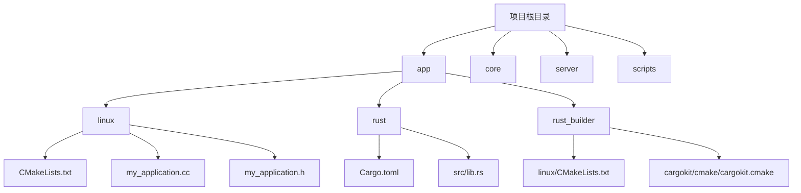
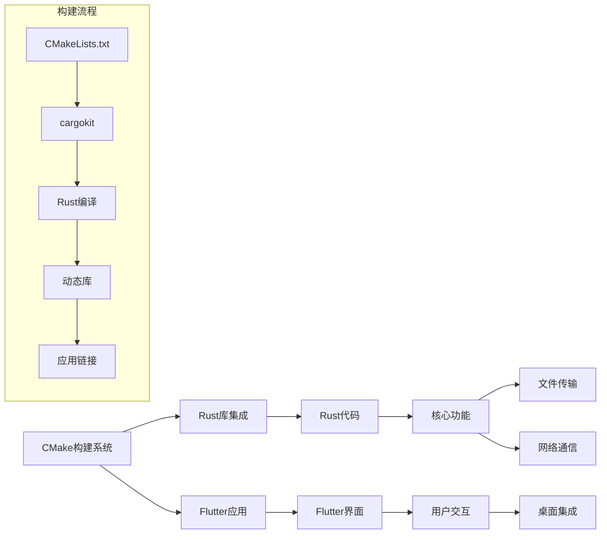
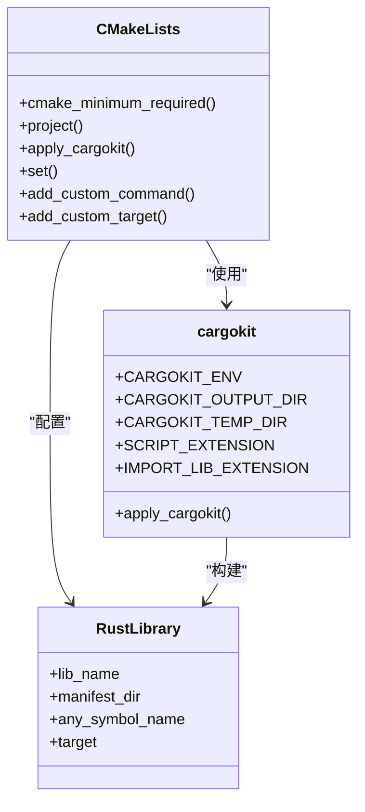
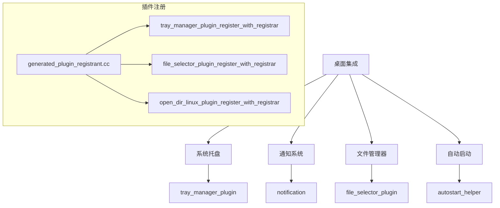
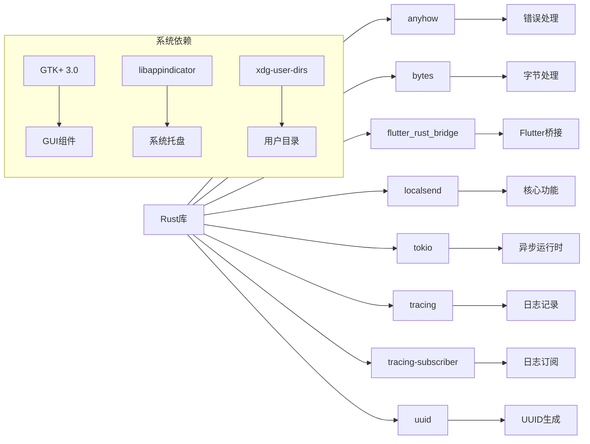

# Linux平台集成

<cite>
**本文档引用的文件**
- [app/linux/CMakeLists.txt](file://app/linux/CMakeLists.txt)
- [app/rust_builder/linux/CMakeLists.txt](file://app/rust_builder/linux/CMakeLists.txt)
- [app/rust/Cargo.toml](file://app/rust/Cargo.toml)
- [app/rust_builder/cargokit/cmake/cargokit.cmake](file://app/rust_builder/cargokit/cmake/cargokit.cmake)
- [app/linux/my_application.cc](file://app/linux/my_application.cc)
- [app/linux/my_application.h](file://app/linux/my_application.h)
- [scripts/compile_linux_appimage.sh](file://scripts/compile_linux_appimage.sh)
- [app/linux/packaging/rpm/make_config.yaml](file://app/linux/packaging/rpm/make_config.yaml)
- [app/lib/util/native/autostart_helper.dart](file://app/lib/util/native/autostart_helper.dart)
</cite>

## 目录
1. [简介](#简介)
2. [项目结构](#项目结构)
3. [核心组件](#核心组件)
4. [架构概述](#架构概述)
5. [详细组件分析](#详细组件分析)
6. [依赖分析](#依赖分析)
7. [性能考虑](#性能考虑)
8. [故障排除指南](#故障排除指南)
9. [结论](#结论)

## 简介
本文件详细说明了在Linux平台上集成Rust库的配置方法，重点介绍了通过CMake构建系统集成Rust代码的完整流程。文档涵盖了CMakeLists.txt文件的修改、编译参数设置、不同Linux发行版的兼容性处理、桌面环境集成、性能调优以及常见问题解决方案。

## 项目结构



**图表来源**
- [app/linux/CMakeLists.txt](file://app/linux/CMakeLists.txt)
- [app/rust/Cargo.toml](file://app/rust/Cargo.toml)
- [app/rust_builder/linux/CMakeLists.txt](file://app/rust_builder/linux/CMakeLists.txt)

**章节来源**
- [app/linux/CMakeLists.txt](file://app/linux/CMakeLists.txt#L1-L140)
- [app/rust/Cargo.toml](file://app/rust/Cargo.toml#L1-L18)

## 核心组件

本文档的核心组件包括Linux平台的CMake构建配置、Rust库集成机制、桌面环境集成以及打包部署流程。系统通过CMake作为构建系统，将Rust编写的后端逻辑与Flutter前端界面集成，实现了跨平台的文件传输应用。

**章节来源**
- [app/linux/CMakeLists.txt](file://app/linux/CMakeLists.txt#L1-L140)
- [app/rust_builder/linux/CMakeLists.txt](file://app/rust_builder/linux/CMakeLists.txt#L1-L20)

## 架构概述



**图表来源**
- [app/linux/CMakeLists.txt](file://app/linux/CMakeLists.txt#L1-L140)
- [app/rust_builder/cargokit/cmake/cargokit.cmake](file://app/rust_builder/cargokit/cmake/cargokit.cmake#L1-L100)

## 详细组件分析

### CMake集成分析

#### CMake配置流程


**图表来源**
- [app/linux/CMakeLists.txt](file://app/linux/CMakeLists.txt#L1-L140)

#### Rust库集成机制


**图表来源**
- [app/rust_builder/linux/CMakeLists.txt](file://app/rust_builder/linux/CMakeLists.txt#L1-L20)
- [app/rust_builder/cargokit/cmake/cargokit.cmake](file://app/rust_builder/cargokit/cmake/cargokit.cmake#L1-L100)

### 桌面环境集成

#### 桌面集成组件


**图表来源**
- [app/linux/flutter/generated_plugin_registrant.cc](file://app/linux/flutter/generated_plugin_registrant.cc#L1-L62)
- [app/lib/util/native/autostart_helper.dart](file://app/lib/util/native/autostart_helper.dart#L52-L87)

**章节来源**
- [app/linux/flutter/generated_plugin_registrant.cc](file://app/linux/flutter/generated_plugin_registrant.cc#L1-L62)
- [app/lib/util/native/autostart_helper.dart](file://app/lib/util/native/autostart_helper.dart#L52-L87)

## 依赖分析



**图表来源**
- [app/rust/Cargo.toml](file://app/rust/Cargo.toml#L1-L18)
- [app/linux/CMakeLists.txt](file://app/linux/CMakeLists.txt#L20-L25)
- [app/linux/packaging/rpm/make_config.yaml](file://app/linux/packaging/rpm/make_config.yaml#L1-L27)

**章节来源**
- [app/rust/Cargo.toml](file://app/rust/Cargo.toml#L1-L18)
- [app/linux/packaging/rpm/make_config.yaml](file://app/linux/packaging/rpm/make_config.yaml#L1-L27)

## 性能考虑

### 启动时间优化
通过预编译Rust库和优化CMake构建流程，减少应用启动时的动态链接和初始化时间。使用静态链接关键依赖，避免运行时查找共享库的开销。

### 内存使用监控
集成tracing和tracing-subscriber库，提供详细的内存使用和性能监控。通过异步tokio运行时优化资源管理，减少内存峰值。

### 系统资源管理
合理配置GTK+资源使用，通过CMake的RPATH设置确保库文件的正确加载路径。使用系统标准的xdg-user-dirs管理用户数据目录，确保跨发行版兼容性。

[无来源，因为本节提供一般性指导]

## 故障排除指南

### 依赖库缺失
确保安装了所有必要的系统依赖：
- GTK+ 3.0开发库
- libappindicator开发库
- xdg-user-dirs工具

使用包管理器安装：
```bash
sudo apt install libgtk-3-dev libayatana-appindicator3-dev xdg-user-dirs
```

### 权限问题
确保应用有权限访问用户目录和网络资源。检查AppImage或包的权限设置，必要时使用sudo运行安装脚本。

### 显示服务器兼容性
支持X11和Wayland显示服务器。在my_application.cc中通过GDK_WINDOWING_X11宏处理X11特定功能，确保在不同显示服务器上的兼容性。

**章节来源**
- [app/linux/my_application.cc](file://app/linux/my_application.cc#L1-L100)
- [scripts/compile_linux_appimage.sh](file://scripts/compile_linux_appimage.sh#L1-L40)

## 结论
本文档详细介绍了Linux平台上Rust集成的完整配置流程。通过CMake构建系统和cargokit工具，实现了Rust库与Flutter应用的无缝集成。文档涵盖了从构建配置、依赖管理到桌面环境集成的各个方面，为开发者提供了全面的指导。建议遵循文档中的最佳实践，确保应用在不同Linux发行版上的兼容性和性能优化。

[无来源，因为本节总结而不分析特定文件]