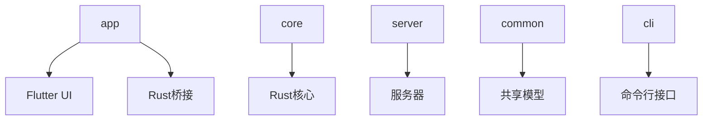
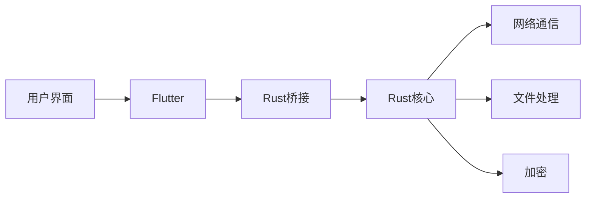
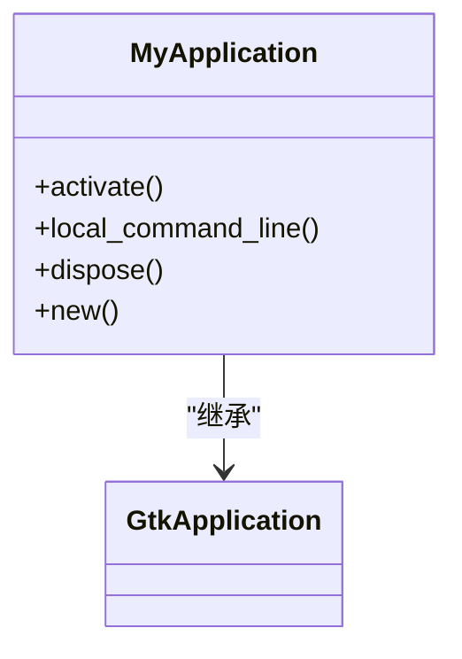
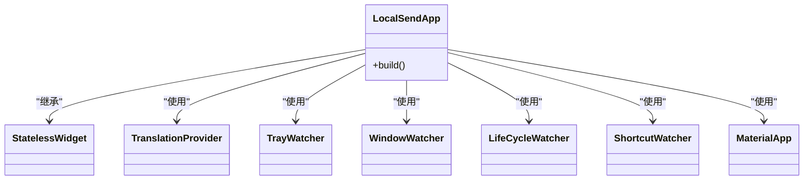
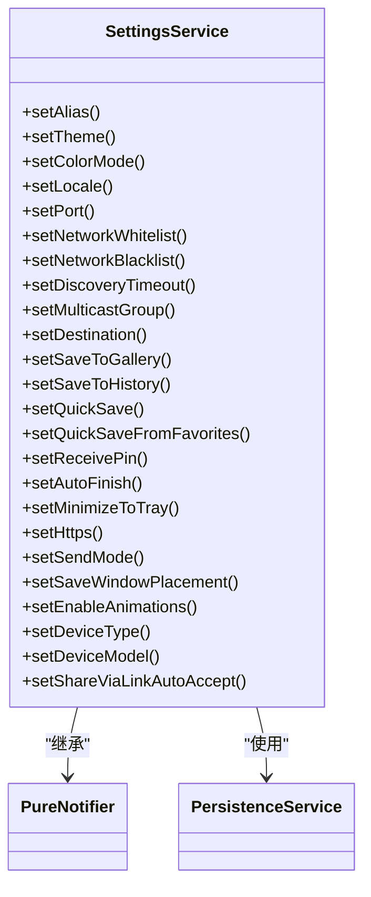
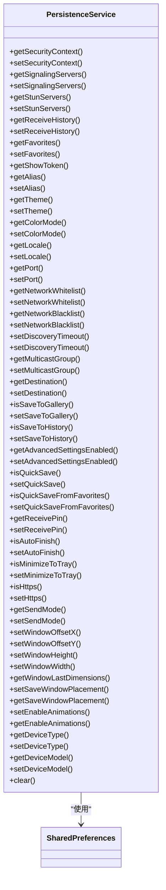
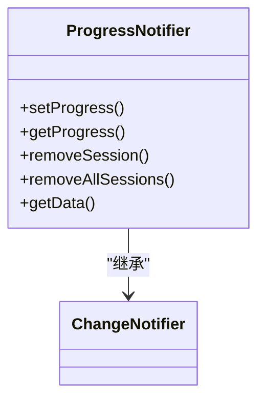
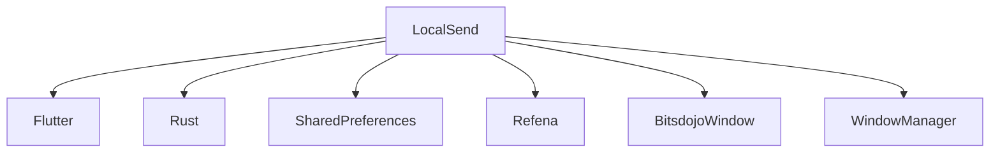

# Linux性能优化

<cite>
**本文档引用的文件**  
- [main.dart](file://app/lib/main.dart)
- [my_application.cc](file://app/linux/my_application.cc)
- [my_application.h](file://app/linux/my_application.h)
- [init.dart](file://app/lib/config/init.dart)
- [settings_provider.dart](file://app/lib/provider/settings_provider.dart)
- [persistence_provider.dart](file://app/lib/provider/persistence_provider.dart)
- [theme.dart](file://app/lib/config/theme.dart)
- [progress_provider.dart](file://app/lib/provider/progress_provider.dart)
- [local_ip_provider.dart](file://app/lib/provider/local_ip_provider.dart)
</cite>

## 目录
1. [简介](#简介)
2. [项目结构](#项目结构)
3. [核心组件](#核心组件)
4. [架构概述](#架构概述)
5. [详细组件分析](#详细组件分析)
6. [依赖分析](#依赖分析)
7. [性能考量](#性能考量)
8. [故障排除指南](#故障排除指南)
9. [结论](#结论)

## 简介
本指南详细阐述了Linux平台下LocalSend应用程序的性能优化策略。文档涵盖了启动时间优化、内存使用监控、系统资源管理、桌面环境集成优化、性能基准测试和回归监控机制等关键方面。通过分析应用程序的代码库，我们提供了具体的优化建议和技术方案，帮助开发者提升应用程序的性能和用户体验。

## 项目结构
LocalSend项目采用模块化设计，主要分为以下几个部分：
- **app**: 主应用程序代码，包含Flutter和Rust实现
- **cli**: 命令行接口
- **common**: 共享代码和模型
- **core**: 核心Rust实现
- **server**: 服务器实现
- **rust**: Rust桥接代码
- **scripts**: 构建和部署脚本

这种结构使得代码易于维护和扩展，同时也便于性能优化的实施。

**图表来源**
- [main.dart](file://app/lib/main.dart)
- [my_application.cc](file://app/linux/my_application.cc)

**章节来源**
- [main.dart](file://app/lib/main.dart)
- [my_application.cc](file://app/linux/my_application.cc)

## 核心组件
LocalSend的核心组件包括：
- **MyApplication**: Linux平台的主应用程序类
- **LocalSendApp**: Flutter主应用程序类
- **SettingsService**: 设置服务，管理应用程序设置
- **PersistenceService**: 持久化服务，管理数据存储
- **ProgressNotifier**: 进度通知器，管理文件传输进度

这些组件共同构成了应用程序的基础，其性能直接影响到用户体验。

**章节来源**
- [main.dart](file://app/lib/main.dart#L1-L88)
- [my_application.cc](file://app/linux/my_application.cc#L1-L99)
- [settings_provider.dart](file://app/lib/provider/settings_provider.dart#L1-L243)
- [persistence_provider.dart](file://app/lib/provider/persistence_provider.dart#L1-L552)
- [progress_provider.dart](file://app/lib/provider/progress_provider.dart#L1-L38)

## 架构概述
LocalSend采用混合架构，结合了Flutter和Rust的优势。Flutter负责用户界面和跨平台兼容性，而Rust则处理核心逻辑和性能关键部分。这种架构使得应用程序既能提供流畅的用户界面，又能保证高性能的数据处理。

**图表来源**
- [main.dart](file://app/lib/main.dart)
- [frb_generated.dart](file://app/lib/rust/frb_generated.dart)
- [lib.rs](file://core/src/lib.rs)

## 详细组件分析

### MyApplication分析
MyApplication是Linux平台的主应用程序类，负责初始化和管理应用程序的生命周期。

**图表来源**
- [my_application.cc](file://app/linux/my_application.cc#L15-L99)
- [my_application.h](file://app/linux/my_application.h#L1-L18)

### LocalSendApp分析
LocalSendApp是Flutter主应用程序类，负责构建用户界面和管理应用程序状态。

**图表来源**
- [main.dart](file://app/lib/main.dart#L50-L88)

### SettingsService分析
SettingsService管理应用程序的设置，包括主题、语言、网络配置等。

**图表来源**
- [settings_provider.dart](file://app/lib/provider/settings_provider.dart#L1-L243)

### PersistenceService分析
PersistenceService管理数据的持久化存储，包括设置、历史记录、收藏等。

**图表来源**
- [persistence_provider.dart](file://app/lib/provider/persistence_provider.dart#L1-L552)

### ProgressNotifier分析
ProgressNotifier管理文件传输的进度，提供实时的进度更新。

**图表来源**
- [progress_provider.dart](file://app/lib/provider/progress_provider.dart#L1-L38)

**章节来源**
- [progress_provider.dart](file://app/lib/provider/progress_provider.dart#L1-L38)

## 依赖分析
LocalSend的依赖关系复杂，涉及多个平台和语言。主要依赖包括：
- **Flutter**: 用户界面框架
- **Rust**: 核心逻辑和性能关键部分
- **SharedPreferences**: 数据持久化
- **Refena**: 状态管理
- **BitsdojoWindow**: 窗口管理
- **WindowManager**: 窗口管理

这些依赖共同构成了应用程序的基础，其性能和稳定性直接影响到用户体验。

**图表来源**
- [pubspec.yaml](file://app/pubspec.yaml)
- [Cargo.toml](file://core/Cargo.toml)

**章节来源**
- [pubspec.yaml](file://app/pubspec.yaml)
- [Cargo.toml](file://core/Cargo.toml)

## 性能考量
### 启动时间优化
LocalSend通过以下策略优化启动时间：
- **延迟加载**: 只在需要时加载组件
- **资源预加载**: 预加载常用资源
- **初始化流程优化**: 优化初始化流程，减少启动时间

### 内存使用监控
使用Linux系统工具（如valgrind、perf）分析内存使用情况，确保内存使用效率。

### 系统资源管理
- **文件描述符管理**: 有效管理文件描述符
- **线程池配置**: 优化线程池配置
- **CPU亲和性设置**: 设置CPU亲和性，提高性能

### 桌面环境集成
- **减少UI卡顿**: 优化UI渲染性能
- **优化渲染性能**: 提高渲染效率

### 性能基准测试
- **基准测试方法**: 定义性能基准测试方法
- **性能回归监控**: 监控性能回归，确保性能稳定

## 故障排除指南
### 常见问题
- **启动失败**: 检查依赖和配置
- **内存泄漏**: 使用工具分析内存使用
- **性能下降**: 优化代码和配置

### 调试工具
- **日志**: 使用日志记录调试信息
- **性能分析工具**: 使用性能分析工具定位问题

**章节来源**
- [init.dart](file://app/lib/config/init.dart#L1-L324)
- [local_ip_provider.dart](file://app/lib/provider/local_ip_provider.dart)

## 结论
LocalSend通过混合架构和多种优化策略，实现了高性能和良好的用户体验。通过持续的性能优化和监控，可以进一步提升应用程序的性能和稳定性。