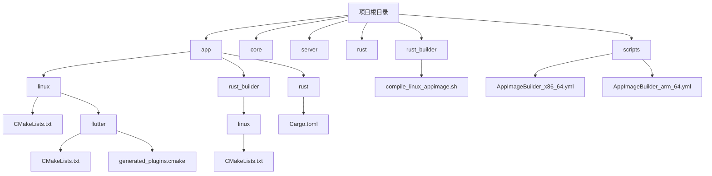
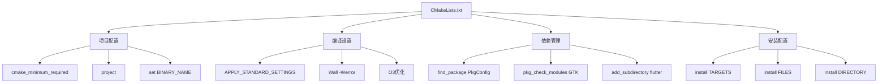
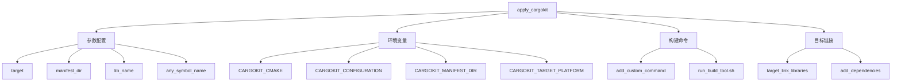
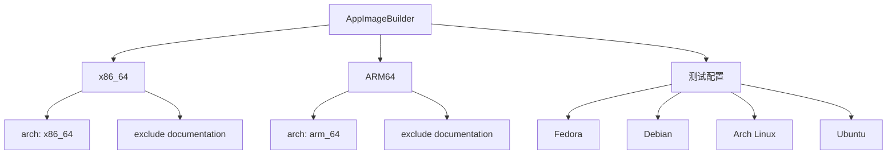
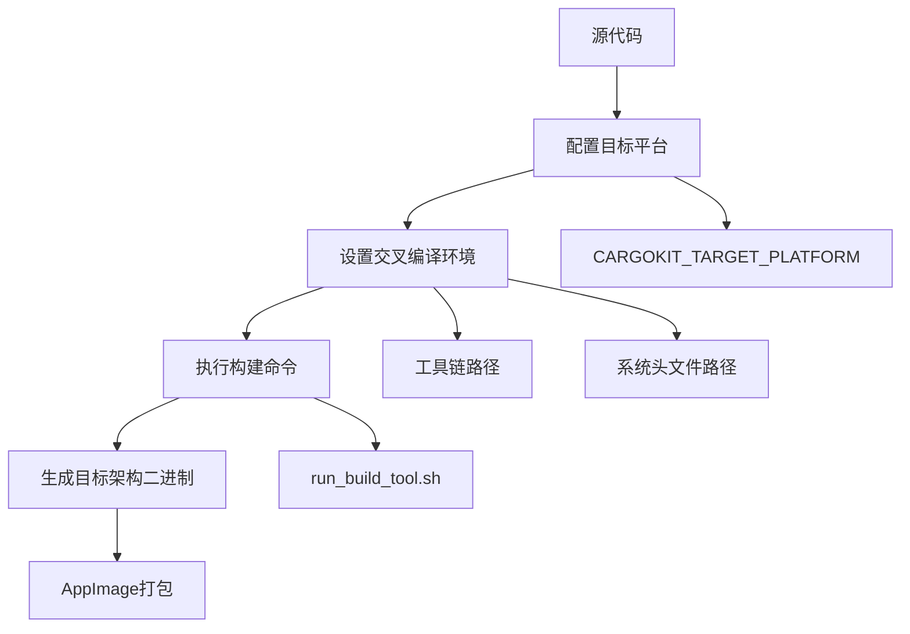
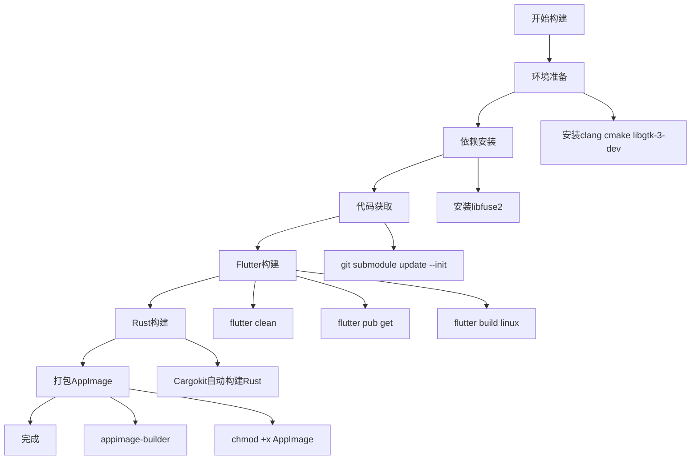
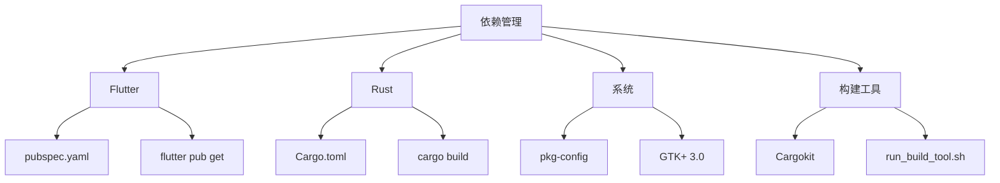

# Linux构建配置

<cite>
**本文档中引用的文件**  
- [app/linux/CMakeLists.txt](file://app/linux/CMakeLists.txt)
- [app/linux/flutter/CMakeLists.txt](file://app/linux/flutter/CMakeLists.txt)
- [app/rust_builder/linux/CMakeLists.txt](file://app/rust_builder/linux/CMakeLists.txt)
- [app/rust/Cargo.toml](file://app/rust/Cargo.toml)
- [app/rust_builder/cargokit/cmake/cargokit.cmake](file://app/rust_builder/cargokit/cmake/cargokit.cmake)
- [app/rust_builder/cargokit/run_build_tool.sh](file://app/rust_builder/cargokit/run_build_tool.sh)
- [app/rust_builder/cargokit/build_pod.sh](file://app/rust_builder/cargokit/build_pod.sh)
- [scripts/compile_linux_appimage.sh](file://scripts/compile_linux_appimage.sh)
- [scripts/appimage/AppImageBuilder_x86_64.yml](file://scripts/appimage/AppImageBuilder_x86_64.yml)
- [scripts/appimage/AppImageBuilder_arm_64.yml](file://scripts/appimage/AppImageBuilder_arm_64.yml)
</cite>

## 目录
1. [项目结构](#项目结构)
2. [核心构建配置](#核心构建配置)
3. [Flutter与Rust集成配置](#flutter与rust集成配置)
4. [不同Linux发行版的构建配置](#不同linux发行版的构建配置)
5. [交叉编译配置](#交叉编译配置)
6. [构建流程详解](#构建流程详解)

## 项目结构

本项目采用多层架构设计，包含Flutter前端、Rust后端和构建工具链。主要目录结构如下：



**图源**  
- [app/linux/CMakeLists.txt](file://app/linux/CMakeLists.txt)
- [app/rust/Cargo.toml](file://app/rust/Cargo.toml)
- [scripts/compile_linux_appimage.sh](file://scripts/compile_linux_appimage.sh)

## 核心构建配置

项目使用CMake作为主要构建系统，通过多级CMakeLists.txt文件管理构建过程。主应用程序的CMakeLists.txt文件定义了基本构建配置：

- 设置最低CMake版本为3.10
- 定义项目名称和可执行文件名称
- 配置RPATH以从相对路径加载库
- 定义标准编译设置（C++14、警告级别、优化选项）



**图源**  
- [app/linux/CMakeLists.txt](file://app/linux/CMakeLists.txt#L1-L50)

**本节源码**  
- [app/linux/CMakeLists.txt](file://app/linux/CMakeLists.txt#L1-L139)

## Flutter与Rust集成配置

项目通过flutter_rust_bridge实现Flutter与Rust的深度集成，使用Cargokit作为构建桥梁工具。

### Rust库配置

Rust库在Cargo.toml中定义为cdylib和staticlib两种类型，确保可以被C/C++代码链接：

```toml
[lib]
crate-type = ["cdylib", "staticlib"]
```

主要依赖包括：
- flutter_rust_bridge：用于生成FFI绑定
- localsend核心库：项目业务逻辑
- tokio：异步运行时
- tracing：日志系统

**本节源码**  
- [app/rust/Cargo.toml](file://app/rust/Cargo.toml#L1-L17)

### CMake集成配置

通过cargokit.cmake实现Rust与CMake的集成，主要配置包括：



关键配置项：
- 使用`apply_cargokit`函数集成Rust库
- 设置CARGOKIT_TARGET_PLATFORM指定目标平台
- 通过自定义命令调用run_build_tool.sh执行构建
- 将生成的库链接到主应用程序

**图源**  
- [app/rust_builder/cargokit/cmake/cargokit.cmake](file://app/rust_builder/cargokit/cmake/cargokit.cmake#L1-L100)
- [app/rust_builder/linux/CMakeLists.txt](file://app/rust_builder/linux/CMakeLists.txt#L1-L20)

**本节源码**  
- [app/rust_builder/cargokit/cmake/cargokit.cmake](file://app/rust_builder/cargokit/cmake/cargokit.cmake#L1-L100)
- [app/rust_builder/linux/CMakeLists.txt](file://app/rust_builder/linux/CMakeLists.txt#L1-L20)

## 不同Linux发行版的构建配置

项目通过AppImage格式支持多种Linux发行版，确保在不同系统上的兼容性。

### Ubuntu配置

Ubuntu系统需要安装以下依赖：
```bash
sudo apt install curl clang cmake libgtk-3-dev ninja-build
sudo apt install libayatana-appindicator3-dev
sudo apt install libfuse2
```

### Fedora配置

Fedora系统使用DNF包管理器：
```bash
sudo dnf install clang cmake gtk3-devel ninja-build
sudo dnf install libappindicator-gtk3-devel
sudo dnf install fuse
```

### Arch Linux配置

Arch Linux使用Pacman包管理器：
```bash
sudo pacman -S clang cmake gtk3 ninja
sudo pacman -S libappindicator-gtk3
sudo pacman -S fuse2
```

### glibc版本处理

项目通过静态链接关键依赖来处理glibc版本差异：
- 使用musl目标进行静态编译
- 避免使用特定glibc版本的API
- 在AppImage中包含必要的系统库

AppImage配置文件中定义了不同架构的构建参数：



**图源**  
- [scripts/appimage/AppImageBuilder_x86_64.yml](file://scripts/appimage/AppImageBuilder_x86_64.yml#L1-L70)
- [scripts/appimage/AppImageBuilder_arm_64.yml](file://scripts/appimage/AppImageBuilder_arm_64.yml#L1-L70)

**本节源码**  
- [scripts/appimage/AppImageBuilder_x86_64.yml](file://scripts/appimage/AppImageBuilder_x86_64.yml#L1-L70)
- [scripts/appimage/AppImageBuilder_arm_64.yml](file://scripts/appimage/AppImageBuilder_arm_64.yml#L1-L70)

## 交叉编译配置

项目支持为不同架构生成可执行文件，主要通过Cargokit和Flutter工具链实现。

### 架构支持

项目支持以下架构：
- x86_64 (linux-x64)
- ARM64 (linux-arm64)

在Cargokit中定义了目标平台映射：

```dart
Target(
  rust: 'x86_64-unknown-linux-gnu',
  flutter: 'linux-x64',
),
Target(
  rust: 'aarch64-unknown-linux-gnu',
  flutter: 'linux-arm64',
)
```

### 交叉编译流程



构建脚本中通过环境变量控制目标平台：
- FLUTTER_TARGET_PLATFORM_SYSROOT：系统根目录
- CMAKE_SYSROOT：CMake系统根目录
- CARGOKIT_TARGET_PLATFORM：Cargokit目标平台

**本节源码**  
- [app/rust_builder/cargokit/run_build_tool.sh](file://app/rust_builder/cargokit/run_build_tool.sh#L1-L95)
- [app/rust_builder/cargokit/cmake/cargokit.cmake](file://app/rust_builder/cargokit/cmake/cargokit.cmake#L1-L100)

## 构建流程详解

完整的Linux构建流程包括多个步骤，从环境准备到最终打包。

### 构建脚本分析

compile_linux_appimage.sh脚本定义了完整的构建流程：



关键步骤说明：
1. **环境准备**：确保系统安装了必要的构建工具
2. **依赖获取**：通过git submodule获取子模块
3. **Flutter构建**：使用flutter命令构建主应用程序
4. **Rust集成**：Cargokit自动处理Rust库的构建和链接
5. **打包**：使用appimage-builder创建AppImage包

### 构建依赖管理

项目通过多种机制管理依赖：
- Flutter依赖：pubspec.yaml
- Rust依赖：Cargo.toml
- 系统依赖：CMake中的pkg_check_modules
- 构建工具依赖：Cargokit



**本节源码**  
- [scripts/compile_linux_appimage.sh](file://scripts/compile_linux_appimage.sh#L1-L40)
- [app/pubspec.yaml](file://app/pubspec.yaml#L1-L124)