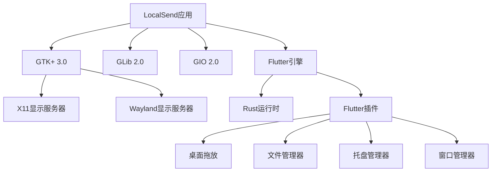
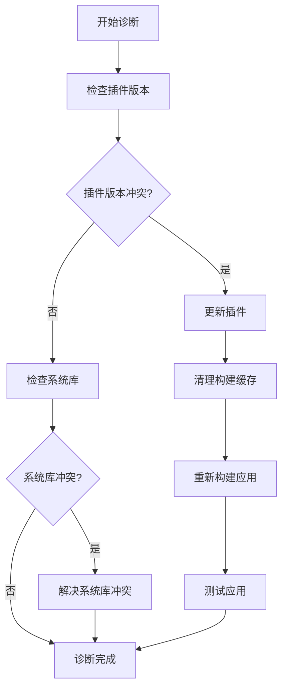
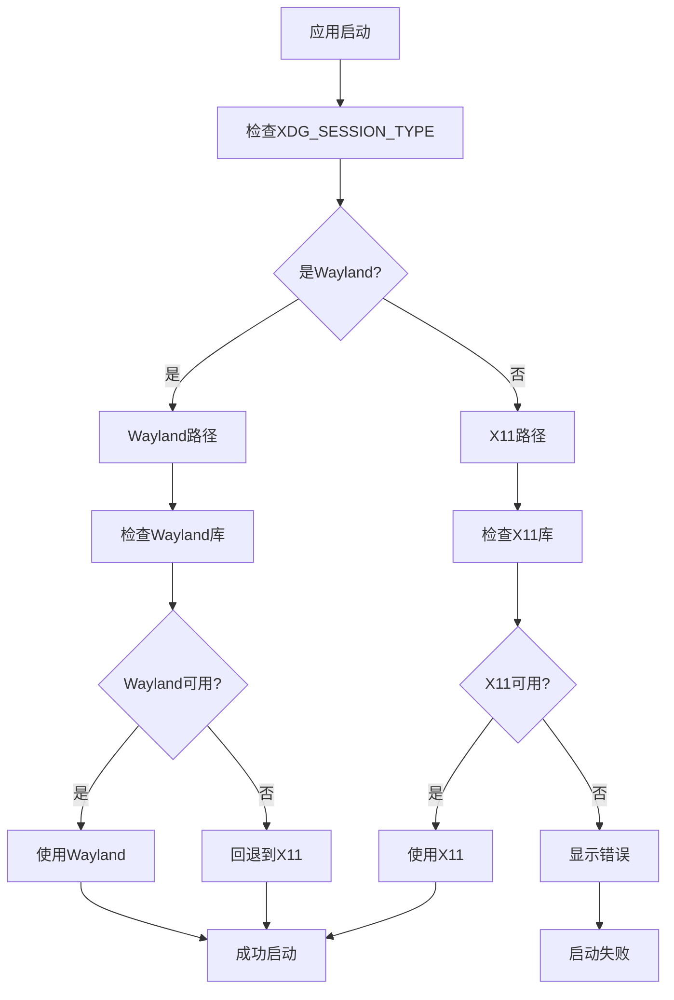
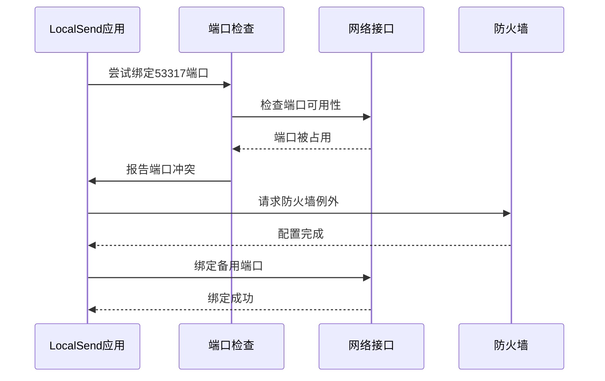
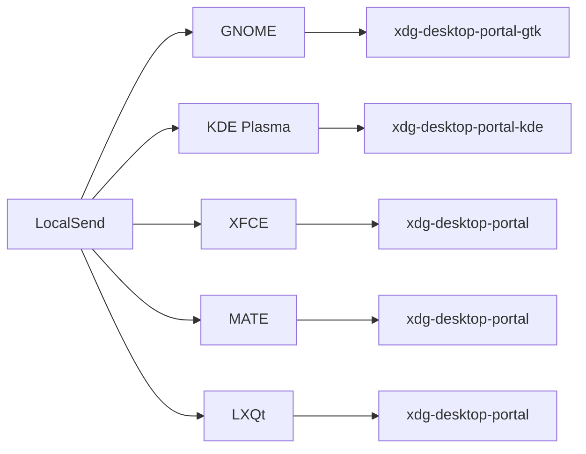
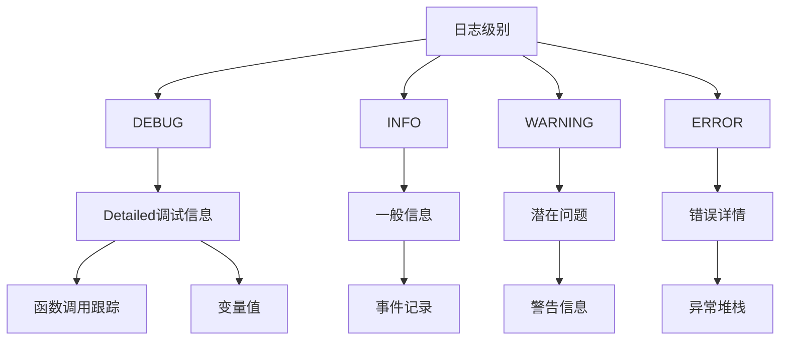
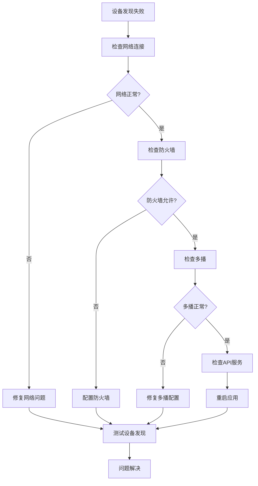

# Linux问题排查指南

<cite>
**本文档中引用的文件**
- [README.md](file://README.md)
- [my_application.cc](file://app/linux/my_application.cc)
- [my_application.h](file://app/linux/my_application.h)
- [troubleshoot_page.dart](file://app/lib/pages/troubleshoot_page.dart)
- [platform_check.dart](file://app/lib/util/native/platform_check.dart)
- [cmd_helper.dart](file://app/lib/util/native/cmd_helper.dart)
- [CMakeLists.txt](file://app/linux/CMakeLists.txt)
- [generated_plugin_registrant.cc](file://app/linux/flutter/generated_plugin_registrant.cc)
- [settings_provider.dart](file://app/lib/provider/settings_provider.dart)
- [logger.dart](file://common/lib/util/logger.dart)
- [logging.rs](file://app/rust/src/api/logging.rs)
</cite>

## 目录
1. [简介](#简介)
2. [依赖库缺失问题排查](#依赖库缺失问题排查)
3. [权限问题排查](#权限问题排查)
4. [显示服务器兼容性问题](#显示服务器兼容性问题)
5. [网络连接问题](#网络连接问题)
6. [桌面环境集成问题](#桌面环境集成问题)
7. [日志分析技巧](#日志分析技巧)
8. [常见问题解决方案](#常见问题解决方案)
9. [故障排除工具](#故障排除工具)
10. [预防措施](#预防措施)

## 简介

LocalSend是一个跨平台的文件传输应用程序，在Linux平台上运行时可能会遇到各种技术问题。本指南提供了系统性的排查方法和解决方案，帮助用户快速定位和解决Linux平台上的常见问题。

## 依赖库缺失问题排查

### 识别缺失的库

Linux应用程序依赖于许多系统库和框架。LocalSend主要依赖以下组件：



**图表来源**
- [generated_plugin_registrant.cc](file://app/linux/flutter/generated_plugin_registrant.cc#L0-L62)
- [CMakeLists.txt](file://app/linux/CMakeLists.txt#L35-L40)

### 常见缺失库及解决方案

#### GTK相关库缺失

**症状：**
- 应用程序启动失败
- 界面显示异常或空白
- 主题不匹配

**诊断命令：**
```bash
# 检查GTK版本
pkg-config --modversion gtk+-3.0

# 查找GTK相关包
apt-cache search gtk+-3.0
dnf search gtk3
pacman -Ss gtk3
```

**解决方案：**
```bash
# Ubuntu/Debian
sudo apt update
sudo apt install libgtk-3-dev

# CentOS/RHEL/Fedora
sudo dnf install gtk3-devel

# Arch Linux
sudo pacman -S gtk3
```

#### Flutter引擎依赖

**症状：**
- 应用程序崩溃
- 启动时出现"Flutter engine not found"错误

**诊断：**
检查Flutter SDK是否正确安装：
```bash
flutter --version
which flutter
```

**解决方案：**
```bash
# 安装Flutter
curl -fsSL https://storage.googleapis.com/flutter_infra_release/releases/stable/linux/flutter_linux_*.tar.xz | tar -xJ -C /opt
export PATH="$PATH:/opt/flutter/bin"
```

### 版本冲突处理

#### 插件版本兼容性

LocalSend使用多个Flutter插件，可能存在版本冲突：



**图表来源**
- [generated_plugin_registrant.cc](file://app/linux/flutter/generated_plugin_registrant.cc#L22-L62)

**节来源**
- [CMakeLists.txt](file://app/linux/CMakeLists.txt#L35-L40)
- [generated_plugin_registrant.cc](file://app/linux/flutter/generated_plugin_registrant.cc#L0-L62)

## 权限问题排查

### 文件系统权限

#### 用户目录访问权限

**常见权限问题：**
- 无法保存文件到用户目录
- 无法读取共享文件
- 设置保存失败

**诊断方法：**
```bash
# 检查当前用户的主目录权限
ls -la ~

# 检查应用数据目录权限
ls -la ~/.local/share/localsend/

# 检查临时目录权限
ls -la /tmp/
```

**解决方案：**
```bash
# 修复用户目录权限
chmod 755 ~
chmod 700 ~/.config/localsend

# 创建必要的目录结构
mkdir -p ~/.local/share/localsend
chmod 755 ~/.local/share/localsend
```

#### 网络访问权限

**症状：**
- 设备发现失败
- 无法建立连接
- 端口被拒绝

**诊断命令：**
```bash
# 检查防火墙状态
sudo ufw status
sudo iptables -L

# 检查SELinux状态
getenforce

# 检查端口监听状态
netstat -tuln | grep 53317
```

### 网络访问权限配置

#### 防火墙规则设置

根据README中的建议，需要配置防火墙规则：

```bash
# Ubuntu/Debian (ufw)
sudo ufw allow 53317/tcp
sudo ufw allow 53317/udp

# CentOS/RHEL/Fedora (firewalld)
sudo firewall-cmd --permanent --add-port=53317/tcp
sudo firewall-cmd --permanent --add-port=53317/udp
sudo firewall-cmd --reload

# SELinux配置
sudo setsebool -P allow_ypbind 1
```

#### 路由器设置

**重要提示：**
- 禁用AP隔离功能
- 确保网络类型为"私有"而非"公共"
- 检查无线网络的安全设置

### 桌面环境集成权限

#### XDG Portal权限

**症状：**
- 文件选择对话框不显示
- 托盘图标不工作
- 屏幕截图功能失效

**诊断：**
```bash
# 检查xdg-desktop-portal服务
ps aux | grep xdg-desktop-portal

# 检查Portal版本
xdg-desktop-portal --version

# 检查Portal后端
ls /usr/libexec/xdg-desktop-portal*
```

**解决方案：**
```bash
# 安装必要的Portal包
# GNOME桌面环境
sudo apt install xdg-desktop-portal-gtk

# KDE桌面环境
sudo apt install xdg-desktop-portal-kde

# 或者通用Portal
sudo apt install xdg-desktop-portal
```

**节来源**
- [troubleshoot_page.dart](file://app/lib/pages/troubleshoot_page.dart#L30-L60)
- [platform_check.dart](file://app/lib/util/native/platform_check.dart#L45-L55)

## 显示服务器兼容性问题

### X11与Wayland兼容性

#### 显示服务器检测

LocalSend通过环境变量检测显示服务器类型：



**图表来源**
- [my_application.cc](file://app/linux/my_application.cc#L15-L30)
- [platform_check.dart](file://app/lib/util/native/platform_check.dart#L45-L55)

#### Wayland特定问题

**常见问题：**
- 窗口无法正确显示
- 输入事件处理异常
- 截图功能失效

**诊断方法：**
```bash
# 检查Wayland会话
echo $XDG_SESSION_TYPE

# 检查Wayland库
ldd /usr/bin/localsend_app | grep wayland

# 检查Wayland协议支持
wayland-scanner --help
```

**解决方案：**
```bash
# 安装Wayland开发库
sudo apt install libwayland-dev

# 设置GTK_CSD环境变量（强制使用客户端侧边框）
export GTK_CSD=1
```

#### X11特定问题

**常见问题：**
- 透明效果不工作
- 某些窗口装饰缺失
- 与传统X应用程序兼容性差

**诊断方法：**
```bash
# 检查X11连接
echo $DISPLAY

# 检查X11库
ldd /usr/bin/localsend_app | grep X11

# 检查X11扩展
xrandr --version
```

### 图形渲染问题

#### GPU加速支持

**症状：**
- 界面卡顿
- 渲染质量差
- 内存占用高

**诊断：**
```bash
# 检查GPU驱动
glxinfo | grep "OpenGL vendor"
lspci | grep -i vga

# 检查硬件加速
echo $LIBGL_ALWAYS_SOFTWARE
echo $GALLIUM_DRIVER
```

**解决方案：**
```bash
# 安装专有驱动（以NVIDIA为例）
sudo apt install nvidia-driver-xxx

# 启用硬件加速
export LIBGL_ALWAYS_SOFTWARE=0
export GALLIUM_DRIVER=llvmpipe
```

**节来源**
- [my_application.cc](file://app/linux/my_application.cc#L15-L35)
- [platform_check.dart](file://app/lib/util/native/platform_check.dart#L45-L55)

## 网络连接问题

### 端口配置

#### 默认端口设置

LocalSend使用53317端口进行设备发现和文件传输：

| 流量类型 | 协议 | 端口 | 动作 |
|----------|------|------|------|
| 入站 | TCP, UDP | 53317 | 允许 |
| 出站 | TCP, UDP | 任意 | 允许 |

#### 端口冲突检测



**图表来源**
- [settings_provider.dart](file://app/lib/provider/settings_provider.dart#L85-L95)

### 多播组配置

#### 默认多播地址

LocalSend使用多播组进行设备发现：

- 默认多播组：239.255.255.250
- 默认端口：53317

**诊断命令：**
```bash
# 检查多播支持
cat /proc/sys/net/ipv4/ip_forward
cat /proc/sys/net/ipv4/conf/all/multicast

# 测试多播连接
ping -c 4 239.255.255.250
```

#### 路由器配置

**重要设置：**
- 禁用AP隔离
- 确保所有设备在同一子网
- 检查无线网络的多播转发

### 网络接口过滤

#### 白名单和黑名单

LocalSend支持网络接口过滤：

```dart
// 示例：设置网络白名单
await settingsProvider.setNetworkWhitelist([
  '192.168.1.0/24',    // 允许整个子网
  '10.0.0.0/8',        // 允许私有网络
]);

// 示例：设置网络黑名单
await settingsProvider.setNetworkBlacklist([
  '172.16.0.0/12',     // 排除内部网络
]);
```

**节来源**
- [settings_provider.dart](file://app/lib/provider/settings_provider.dart#L85-L120)
- [README.md](file://README.md#L120-L135)

## 桌面环境集成问题

### 桌面环境检测

#### 支持的桌面环境

LocalSend支持多种Linux桌面环境：



**图表来源**
- [generated_plugin_registrant.cc](file://app/linux/flutter/generated_plugin_registrant.cc#L0-L20)

#### 自动启动配置

**Linux自动启动文件位置：**
```bash
~/.config/autostart/localsend.desktop
/usr/share/applications/localsend.desktop
```

**桌面文件示例：**
```ini
[Desktop Entry]
Type=Application
Name=LocalSend
Exec=localsend_app
Icon=localsend
Terminal=false
Categories=Network;FileTransfer;
StartupNotify=true
```

### 托盘集成

#### 托盘图标支持

LocalSend在支持的平台上提供托盘集成功能：

**支持的平台：**
- Linux (GTK)
- Windows
- macOS

**托盘功能：**
- 最小化到托盘
- 托盘通知
- 右键菜单

#### 托盘问题诊断

**常见问题：**
- 托盘图标不显示
- 托盘菜单无响应
- 最小化功能失效

**解决方案：**
```bash
# 检查托盘支持
ps aux | grep panel
ps aux | grep tray

# 重启桌面环境
killall panel
panel &
```

### 文件关联

#### MIME类型注册

**支持的文件类型：**
- 所有文件类型
- 文本文件
- 图像文件
- 视频文件
- 音频文件

**注册命令：**
```bash
# 更新MIME数据库
sudo update-desktop-database
sudo update-mime-database /usr/share/mime

# 检查文件关联
xdg-mime query filetype filename.ext
```

**节来源**
- [platform_check.dart](file://app/lib/util/native/platform_check.dart#L25-L35)
- [generated_plugin_registrant.cc](file://app/linux/flutter/generated_plugin_registrant.cc#L40-L62)

## 日志分析技巧

### 应用程序日志

#### 日志级别配置

LocalSend提供了多种日志级别：



**图表来源**
- [logging.rs](file://app/rust/src/api/logging.rs#L0-L10)
- [logger.dart](file://common/lib/util/logger.dart#L0-L18)

#### 日志收集

**启用调试日志：**
```rust
// Rust部分启用调试日志
enable_debug_logging()?;
```

**Dart部分日志配置：**
```dart
// 初始化日志记录器
initLogger(Level.ALL); // 记录所有级别的日志
```

### 系统日志分析

#### Journalctl日志

**查看LocalSend相关日志：**
```bash
# 实时监控日志
journalctl -u localsend -f

# 查看特定时间范围的日志
journalctl --since "2024-01-01" --until "2024-01-02"

# 搜索错误信息
journalctl _COMM=localsend_app | grep -i error
```

#### X11/Wayland日志

**显示服务器日志：**
```bash
# X11日志
grep X\. /var/log/Xorg.*.log

# Wayland日志
journalctl /usr/bin/wayland --since today
```

### 错误模式识别

#### 常见错误模式

| 错误类型 | 日志模式 | 可能原因 | 解决方案 |
|----------|----------|----------|----------|
| 权限拒绝 | Permission denied | 文件权限不足 | 检查文件权限 |
| 端口占用 | Address already in use | 端口被其他进程占用 | 更换端口或停止冲突进程 |
| 连接超时 | Connection timed out | 网络配置问题 | 检查防火墙和路由设置 |
| 插件加载失败 | Plugin registration failed | 缺少必要插件 | 安装缺失的Flutter插件 |

#### 日志分析工具

**自动化分析脚本：**
```bash
#!/bin/bash
# LocalSend日志分析脚本

echo "=== LocalSend日志分析 ==="

# 检查应用状态
echo "应用状态检查:"
systemctl status localsend || echo "systemd服务未找到"

# 检查端口监听
echo -e "\n端口监听检查:"
netstat -tuln | grep 53317

# 检查权限问题
echo -e "\n权限问题检查:"
journalctl _COMM=localsend_app | grep -i permission

# 检查网络问题
echo -e "\n网络问题检查:"
journalctl _COMM=localsend_app | grep -i network
```

**节来源**
- [logger.dart](file://common/lib/util/logger.dart#L0-L18)
- [logging.rs](file://app/rust/src/api/logging.rs#L0-L10)

## 常见问题解决方案

### 设备发现失败

#### 问题诊断流程



**图表来源**
- [troubleshoot_page.dart](file://app/lib/pages/troubleshoot_page.dart#L60-L90)

#### 具体解决方案

**1. 网络配置问题**
```bash
# 检查网络接口
ip addr show

# 检查路由表
ip route

# 测试本地连接
ping localhost
```

**2. 防火墙配置**
```bash
# 临时允许端口（测试用）
sudo ufw allow 53317/tcp
sudo ufw allow 53317/udp

# 永久配置
sudo ufw allow in on wlan0 to any port 53317 proto tcp
sudo ufw allow in on wlan0 to any port 53317 proto udp
```

**3. 多播配置**
```bash
# 启用IP转发
echo 1 > /proc/sys/net/ipv4/ip_forward

# 检查多播路由
route -n | grep mcast
```

### 性能优化

#### 网络性能问题

**症状：**
- 传输速度慢
- 间歇性断开
- CPU使用率高

**优化方案：**
```bash
# 使用5GHz Wi-Fi
iw dev wlan0 set freq 5180

# 禁用加密（仅用于测试）
iw dev wlan0 set power_save off

# 优化TCP参数
sysctl -w net.core.rmem_max=16777216
sysctl -w net.core.wmem_max=16777216
```

#### 内存优化

**内存使用监控：**
```bash
# 监控内存使用
top -p $(pgrep localsend_app)

# 检查内存泄漏
valgrind --tool=memcheck ./localsend_app

# 分析内存使用
pmap $(pgrep localsend_app)
```

### 应用崩溃处理

#### 崩溃分析

**收集崩溃信息：**
```bash
# 启用核心转储
ulimit -c unlimited
echo "/tmp/core.%e.%p" > /proc/sys/kernel/core_pattern

# 重现崩溃后分析
gdb ./localsend_app /tmp/core.localsend_app.*
```

**常见崩溃原因：**
- 内存不足
- 插件冲突
- 系统资源限制

**解决方案：**
```bash
# 增加系统资源限制
echo "* soft nofile 65536" >> /etc/security/limits.conf
echo "* hard nofile 65536" >> /etc/security/limits.conf

# 重启会话使更改生效
```

**节来源**
- [troubleshoot_page.dart](file://app/lib/pages/troubleshoot_page.dart#L30-L90)
- [README.md](file://README.md#L120-L140)

## 故障排除工具

### 诊断脚本

#### 自动诊断工具

```bash
#!/bin/bash
# LocalSend Linux诊断脚本

echo "=== LocalSend Linux诊断工具 ==="
echo "日期: $(date)"
echo "操作系统: $(uname -a)"

echo -e "\n=== 系统信息 ==="
echo "CPU架构: $(uname -m)"
echo "Linux发行版: $(lsb_release -d 2>/dev/null || cat /etc/os-release | grep PRETTY_NAME)"
echo "桌面环境: $XDG_CURRENT_DESKTOP"

echo -e "\n=== 依赖检查 ==="
# 检查GTK版本
if command -v pkg-config &> /dev/null; then
    echo "GTK版本: $(pkg-config --modversion gtk+-3.0 2>/dev/null || echo '未安装')"
fi

# 检查Flutter
if command -v flutter &> /dev/null; then
    echo "Flutter版本: $(flutter --version | head -1)"
else
    echo "Flutter: 未安装"
fi

# 检查应用
if pgrep -f localsend_app > /dev/null; then
    echo "LocalSend: 正在运行"
else
    echo "LocalSend: 未运行"
fi

echo -e "\n=== 网络检查 ==="
# 检查端口
if netstat -tuln | grep -q ':53317 '; then
    echo "端口53317: 已监听"
else
    echo "端口53317: 未监听"
fi

# 检查防火墙
if command -v ufw &> /dev/null; then
    echo "防火墙状态: $(sudo ufw status 2>/dev/null || echo '未安装')"
fi

echo -e "\n=== 权限检查 ==="
# 检查用户权限
echo "用户: $(whoami)"
echo "组: $(groups)"

# 检查应用目录权限
if [ -d ~/.local/share/localsend ]; then
    echo "应用数据目录: $(ls -la ~/.local/share/localsend | head -1)"
fi

echo -e "\n=== 日志检查 ==="
# 检查最近的日志
if command -v journalctl &> /dev/null; then
    echo "最近的错误日志:"
    journalctl -u localsend --since "1 hour ago" | grep -i error || echo "无错误日志"
fi

echo -e "\n=== 建议的修复 ==="
echo "1. 确保所有依赖已正确安装"
echo "2. 检查防火墙设置"
echo "3. 验证网络配置"
echo "4. 查看系统日志获取更多信息"
```

### 性能监控

#### 实时监控工具

**网络性能监控：**
```bash
#!/bin/bash
# 网络性能监控脚本

echo "=== LocalSend网络性能监控 ==="

while true; do
    clear
    echo "时间: $(date)"
    echo "=== 网络接口统计 ==="
    
    # 显示网络接口统计
    ifstat -i $(ip route | grep default | awk '{print $5}') 1 1
    
    echo -e "\n=== 连接状态 ==="
    # 显示活跃连接
    ss -tuln | grep 53317
    
    echo -e "\n=== 系统负载 ==="
    uptime
    
    sleep 5
done
```

#### 资源使用分析

**内存和CPU监控：**
```bash
#!/bin/bash
# 资源使用监控脚本

echo "=== LocalSend资源使用监控 ==="

while true; do
    clear
    echo "时间: $(date)"
    echo "=== 进程资源使用 ==="
    
    # 显示LocalSend进程资源使用
    ps aux | grep localsend_app | grep -v grep
    echo ""
    
    # 显示内存使用
    free -h
    
    echo -e "\n=== 磁盘空间 ==="
    df -h ~/.local/share/localsend
    
    sleep 10
done
```

### 配置备份和恢复

#### 配置文件管理

**备份当前配置：**
```bash
#!/bin/bash
# LocalSend配置备份脚本

BACKUP_DIR="$HOME/.localsend-backup"
mkdir -p "$BACKUP_DIR"

echo "=== LocalSend配置备份 ==="
echo "备份目录: $BACKUP_DIR"

# 备份应用设置
if [ -f ~/.config/localsend/settings.json ]; then
    cp ~/.config/localsend/settings.json "$BACKUP_DIR/"
    echo "✓ 应用设置已备份"
fi

# 备份自动启动配置
if [ -d ~/.config/autostart ]; then
    cp ~/.config/autostart/* "$BACKUP_DIR/" 2>/dev/null || true
    echo "✓ 自动启动配置已备份"
fi

# 备份桌面文件
if [ -d ~/.local/share/applications ]; then
    cp ~/.local/share/applications/*localsend* "$BACKUP_DIR/" 2>/dev/null || true
    echo "✓ 桌面文件已备份"
fi

echo "备份完成！共备份 $(ls -1 "$BACKUP_DIR" | wc -l) 个文件"
```

**恢复配置：**
```bash
#!/bin/bash
# LocalSend配置恢复脚本

BACKUP_DIR="$HOME/.localsend-backup"

echo "=== LocalSend配置恢复 ==="

if [ ! -d "$BACKUP_DIR" ]; then
    echo "错误: 备份目录不存在"
    exit 1
fi

echo "从 $BACKUP_DIR 恢复配置..."

# 恢复应用设置
if [ -f "$BACKUP_DIR/settings.json" ]; then
    mkdir -p ~/.config/localsend
    cp "$BACKUP_DIR/settings.json" ~/.config/localsend/
    echo "✓ 应用设置已恢复"
fi

# 恢复自动启动配置
if [ -d "$BACKUP_DIR" ]; then
    mkdir -p ~/.config/autostart
    cp "$BACKUP_DIR"/* ~/.config/autostart/ 2>/dev/null || true
    echo "✓ 自动启动配置已恢复"
fi

echo "配置恢复完成！"
```

## 预防措施

### 系统维护

#### 定期检查清单

**每日检查：**
- [ ] 检查应用是否正常运行
- [ ] 验证网络连接状态
- [ ] 监控系统资源使用

**每周检查：**
- [ ] 更新系统和依赖库
- [ ] 清理临时文件
- [ ] 检查日志文件大小

**每月检查：**
- [ ] 备份配置文件
- [ ] 检查磁盘空间
- [ ] 更新防火墙规则

#### 自动化维护

**定时任务配置：**
```bash
# 添加到crontab
# 每天凌晨2点检查应用状态
0 2 * * * /usr/local/bin/check-localsend-status.sh

# 每周日清理临时文件
0 3 * * 0 /usr/local/bin/cleanup-localsend-temp.sh

# 每月备份配置
0 4 1 * * /usr/local/bin/backup-localsend-config.sh
```

### 环境准备

#### 推荐的系统配置

**最小系统要求：**
- Linux内核 3.10+
- GTK+ 3.0+
- Flutter SDK 3.0+
- Rust 1.50+

**推荐的桌面环境：**
- GNOME 3.36+
- KDE Plasma 5.18+
- XFCE 4.14+
- MATE 1.20+

#### 网络配置最佳实践

**路由器设置：**
```bash
# 推荐的路由器配置
# 1. 禁用AP隔离
# 2. 设置网络类型为"私有"
# 3. 启用DHCP
# 4. 禁用IGMP Snooping（如果需要）

# 网络拓扑建议
# Home Network
# ├── Router (192.168.1.1)
# ├── Device 1 (192.168.1.100)
# ├── Device 2 (192.168.1.101)
# └── Device 3 (192.168.1.102)
```

### 监控和告警

#### 系统监控配置

**Prometheus监控配置：**
```yaml
# prometheus.yml
global:
  scrape_interval: 15s

scrape_configs:
  - job_name: 'localsend'
    static_configs:
      - targets: ['localhost:9100']
    metrics_path: /metrics
```

**Grafana仪表板：**
- 应用程序状态指标
- 网络连接统计
- 系统资源使用情况
- 错误率监控

#### 告警规则

**关键指标告警：**
```yaml
groups:
- name: localsend_alerts
  rules:
  - alert: LocalSendDown
    expr: up{job="localsend"} == 0
    for: 1m
    labels:
      severity: critical
    annotations:
      summary: "LocalSend应用不可用"
      
  - alert: HighNetworkLatency
    expr: avg(network_latency) > 100
    for: 5m
    labels:
      severity: warning
    annotations:
      summary: "网络延迟过高"
```

通过遵循本指南中的排查方法和预防措施，您可以有效地诊断和解决Linux平台上的LocalSend相关问题，确保应用程序稳定可靠地运行。