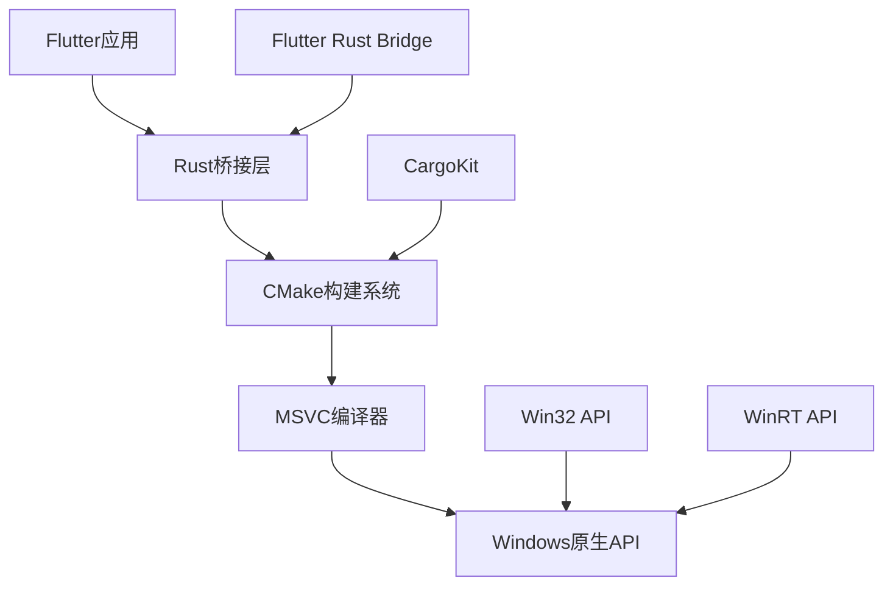

# Windows平台集成

<cite>
**本文档引用的文件**
- [Cargo.toml](file://app/rust/Cargo.toml)
- [CMakeLists.txt](file://app/windows/CMakeLists.txt)
- [windows/CMakeLists.txt](file://app/rust_builder/windows/CMakeLists.txt)
- [flutter_rust_bridge.yaml](file://app/flutter_rust_bridge.yaml)
- [pubspec.yaml](file://app/pubspec.yaml)
- [lib.rs](file://app/rust/src/lib.rs)
- [mod.rs](file://app/rust/src/api/mod.rs)
- [crypto.rs](file://app/rust/src/api/crypto.rs)
- [logging.rs](file://app/rust/src/api/logging.rs)
- [utils.cpp](file://app/windows/runner/utils.cpp)
- [win32_window.cpp](file://app/windows/runner/win32_window.cpp)
- [winrt_ext.h](file://app/windows/runner/winrt_ext.h)
- [run_build_tool.cmd](file://app/rust_builder/cargokit/run_build_tool.cmd)
- [compile_windows_exe.ps1](file://scripts/compile_windows_exe.ps1)
</cite>

## 目录
1. [项目结构](#项目结构)
2. [Rust与CMake集成配置](#rust与cmake集成配置)
3. [Windows特定系统API调用](#windows特定系统api调用)
4. [MSVC编译器与Rust工具链兼容性](#msvc编译器与rust工具链兼容性)
5. [性能调优建议](#性能调优建议)
6. [常见问题解决方案](#常见问题解决方案)

## 项目结构

本项目采用Flutter与Rust集成的架构，通过CMake构建系统在Windows平台上实现原生功能集成。项目结构包含多个关键组件，其中Rust代码位于`app/rust`目录，CMake构建配置位于`app/windows`和`app/rust_builder/windows`目录。



**图示来源**
- [pubspec.yaml](file://app/pubspec.yaml)
- [flutter_rust_bridge.yaml](file://app/flutter_rust_bridge.yaml)
- [CMakeLists.txt](file://app/windows/CMakeLists.txt)

**本节来源**
- [pubspec.yaml](file://app/pubspec.yaml)
- [flutter_rust_bridge.yaml](file://app/flutter_rust_bridge.yaml)
- [CMakeLists.txt](file://app/windows/CMakeLists.txt)

## Rust与CMake集成配置

### CMakeLists.txt配置

项目通过CMakeLists.txt文件配置Rust库的集成。主应用的CMakeLists.txt位于`app/windows/CMakeLists.txt`，而Rust构建的CMakeLists.txt位于`app/rust_builder/windows/CMakeLists.txt`。

主应用的CMakeLists.txt配置了项目的基本设置，包括：
- 最低CMake版本要求（3.14）
- 项目名称和语言（CXX）
- 构建配置类型（Debug、Profile、Release）
- Unicode支持定义
- 标准编译设置应用函数

```cmake
cmake_minimum_required(VERSION 3.14)
project(localsend_app LANGUAGES CXX)
set(BINARY_NAME "localsend_app")
add_definitions(-DUNICODE -D_UNICODE)
```

Rust构建的CMakeLists.txt通过Cargokit集成Rust构建系统：

```cmake
cmake_minimum_required(VERSION 3.14)
project(rust_lib_localsend_app LANGUAGES CXX)
include("../cargokit/cmake/cargokit.cmake")
apply_cargokit(rust_lib_localsend_app ../../../../../../rust rust_lib_localsend_app "")
```

### 构建参数设置

构建参数在CMakeLists.txt中通过以下方式设置：
- 使用`APPLY_STANDARD_SETTINGS`函数应用标准编译设置
- 设置C++标准为C++17
- 配置编译器警告级别（/W4）和异常处理（/EHsc）
- 定义`_HAS_EXCEPTIONS=0`以禁用C++异常

```cmake
function(APPLY_STANDARD_SETTINGS TARGET)
  target_compile_features(${TARGET} PUBLIC cxx_std_17)
  target_compile_options(${TARGET} PRIVATE /W4 /WX /wd"4100")
  target_compile_options(${TARGET} PRIVATE /EHsc)
  target_compile_definitions(${TARGET} PRIVATE "_HAS_EXCEPTIONS=0")
endfunction()
```

**本节来源**
- [CMakeLists.txt](file://app/windows/CMakeLists.txt)
- [windows/CMakeLists.txt](file://app/rust_builder/windows/CMakeLists.txt)

## Windows特定系统API调用

### 文件路径差异处理

在Windows平台上，文件路径使用反斜杠（\）作为分隔符，与Unix系统不同。项目通过标准C++库和Windows API处理路径差异：

1. 使用`std::filesystem`（C++17）进行跨平台路径操作
2. 在需要Windows特定功能时使用Win32 API

### 系统API调用实现

项目中实现了多个Windows特定的系统API调用：

#### 命令行参数处理

在`utils.cpp`中，使用`CommandLineToArgvW`将UTF-16命令行参数转换为UTF-8：

```cpp
std::vector<std::string> GetCommandLineArguments() {
  int argc;
  wchar_t** argv = ::CommandLineToArgvW(::GetCommandLineW(), &argc);
  // 转换逻辑...
  ::LocalFree(argv);
  return command_line_arguments;
}
```

#### 字符编码转换

使用`WideCharToMultiByte`函数进行UTF-16到UTF-8的转换：

```cpp
std::string Utf8FromUtf16(const wchar_t* utf16_string) {
  int target_length = ::WideCharToMultiByte(
      CP_UTF8, WC_ERR_INVALID_CHARS, utf16_string,
      -1, nullptr, 0, nullptr, nullptr);
  // 转换逻辑...
}
```

#### 窗口管理API

在`win32_window.cpp`中使用DWM（Desktop Window Manager）API实现暗色模式：

```cpp
void Win32Window::UpdateTheme(HWND const window) {
  DWORD light_mode;
  LSTATUS result = RegGetValue(HKEY_CURRENT_USER, kGetPreferredBrightnessRegKey,
                               kGetPreferredBrightnessRegValue,
                               RRF_RT_REG_DWORD, nullptr, &light_mode,
                               &light_mode_size);
  if (result == ERROR_SUCCESS) {
    BOOL enable_dark_mode = light_mode == 0;
    DwmSetWindowAttribute(window, DWMWA_USE_IMMERSIVE_DARK_MODE,
                          &enable_dark_mode, sizeof(enable_dark_mode));
  }
}
```

#### WinRT扩展

通过`winrt_ext.h`头文件使用WinRT API：

```cpp
#include <winrt/base.h>
bool IsRunningWithIdentity();
winrt::hstring GetSharedMedia();
```

**本节来源**
- [utils.cpp](file://app/windows/runner/utils.cpp)
- [win32_window.cpp](file://app/windows/runner/win32_window.cpp)
- [winrt_ext.h](file://app/windows/runner/winrt_ext.h)

## MSVC编译器与Rust工具链兼容性

### 运行时库选择

项目通过CMake配置确保MSVC编译器与Rust工具链的运行时库兼容：

1. 在CMakeLists.txt中禁用C++异常：
```cmake
target_compile_definitions(${TARGET} PRIVATE "_HAS_EXCEPTIONS=0")
```

2. 使用静态链接的Rust库（cdylib和staticlib）：
```toml
[lib]
crate-type = ["cdylib", "staticlib"]
```

### 异常处理机制

项目采用以下异常处理策略：

1. Rust端使用`anyhow`库进行错误处理：
```rust
pub fn verify_cert(cert: String, public_key: String) -> anyhow::Result<()> {
    localsend::crypto::cert::verify_cert_from_pem(cert, Some(public_key))
}
```

2. C++端通过Flutter Rust Bridge进行异常转换：
- Rust的`Result<T, E>`自动转换为C++的异常或错误码
- 使用`flutter_rust_bridge`生成的桥接代码处理跨语言异常

3. Windows特定的错误处理：
```cpp
LSTATUS result = RegGetValue(HKEY_CURRENT_USER, kGetPreferredBrightnessRegKey,
                             kGetPreferredBrightnessRegValue,
                             RRF_RT_REG_DWORD, nullptr, &light_mode,
                             &light_mode_size);
if (result == ERROR_SUCCESS) {
    // 处理成功
}
```

### 工具链配置

项目使用Cargokit作为Rust与CMake的集成工具：

1. 在`run_build_tool.cmd`中配置构建环境：
```cmd
@echo off
REM Cargokit构建工具脚本
```

2. 通过`flutter_rust_bridge.yaml`配置桥接参数：
```yaml
rust_input: crate::api
rust_root: rust/
dart_output: lib/rust
```

3. 在`pubspec.yaml`中声明Rust依赖：
```yaml
dependencies:
  flutter_rust_bridge: 2.11.1
  rust_lib_localsend_app:
    path: rust_builder
```

**本节来源**
- [Cargo.toml](file://app/rust/Cargo.toml)
- [flutter_rust_bridge.yaml](file://app/flutter_rust_bridge.yaml)
- [pubspec.yaml](file://app/pubspec.yaml)
- [lib.rs](file://app/rust/src/lib.rs)

## 性能调优建议

### 链接优化

1. **增量链接**：在Debug配置中启用增量链接以加快开发迭代速度
2. **链接时优化（LTO）**：在Release配置中启用LTO以获得最佳性能
3. **减少依赖**：通过精简Rust依赖树减少二进制大小

### 启动时间优化

1. **延迟加载**：将非关键功能延迟到应用启动后加载
2. **预加载**：在应用启动时预加载常用资源
3. **异步初始化**：将耗时的初始化操作移到后台线程

### 资源管理

1. **内存管理**：
   - 使用RAII模式确保资源正确释放
   - 避免不必要的内存分配
   - 使用对象池重用频繁创建和销毁的对象

2. **句柄管理**：
   - 及时释放Win32句柄（如`HMODULE`、`HWND`）
   - 使用智能指针管理资源生命周期

3. **缓存策略**：
   - 实现适当的缓存机制避免重复计算
   - 设置合理的缓存过期策略

```cpp
void EnableFullDpiSupportIfAvailable(HWND hwnd) {
  HMODULE user32_module = LoadLibraryA("User32.dll");
  if (!user32_module) {
    return;
  }
  // 使用后及时释放
  FreeLibrary(user32_module);
}
```

**本节来源**
- [win32_window.cpp](file://app/windows/runner/win32_window.cpp)
- [utils.cpp](file://app/windows/runner/utils.cpp)

## 常见问题解决方案

### DLL加载失败

**问题原因**：
- 缺少必要的Visual C++运行时库
- DLL路径配置错误
- 32位/64位架构不匹配

**解决方案**：
1. 确保安装最新版Visual C++ Redistributable
2. 检查DLL搜索路径：
```cpp
// 确保DLL在可执行文件目录或系统路径中
HMODULE module = LoadLibraryA("User32.dll");
```
3. 使用Dependency Walker检查依赖关系

### 字符编码问题

**问题表现**：
- 中文文件名显示乱码
- 命令行参数包含特殊字符时出错

**解决方案**：
1. 统一使用UTF-8编码：
```cpp
std::string Utf8FromUtf16(const wchar_t* utf16_string) {
  int target_length = ::WideCharToMultiByte(
      CP_UTF8, WC_ERR_INVALID_CHARS, utf16_string,
      -1, nullptr, 0, nullptr, nullptr);
  // 转换逻辑...
}
```
2. 在CMake中定义Unicode：
```cmake
add_definitions(-DUNICODE -D_UNICODE)
```

### 权限错误

**常见场景**：
- 访问注册表需要管理员权限
- 写入系统目录被拒绝

**解决方案**：
1. 避免需要管理员权限的操作
2. 使用用户数据目录而非系统目录
3. 正确处理权限检查：
```cpp
LSTATUS result = RegGetValue(HKEY_CURRENT_USER, kGetPreferredBrightnessRegKey,
                             kGetPreferredBrightnessRegValue,
                             RRF_RT_REG_DWORD, nullptr, &light_mode,
                             &light_mode_size);
if (result != ERROR_SUCCESS) {
    // 处理权限错误
}
```

### 构建脚本问题

**Windows构建脚本**：
- `compile_windows_exe.ps1`：使用Inno Setup创建安装程序
- `compile_windows_msix_*`系列脚本：创建MSIX包

```powershell
# compile_windows_exe.ps1
fvm flutter build windows
iscc .\scripts\compile_windows_exe-inno.iss
```

**最佳实践**：
1. 确保所有路径使用正确的分隔符
2. 处理长路径问题（Windows路径限制）
3. 在脚本中添加错误处理

**本节来源**
- [compile_windows_exe.ps1](file://scripts/compile_windows_exe.ps1)
- [utils.cpp](file://app/windows/runner/utils.cpp)
- [win32_window.cpp](file://app/windows/runner/win32_window.cpp)