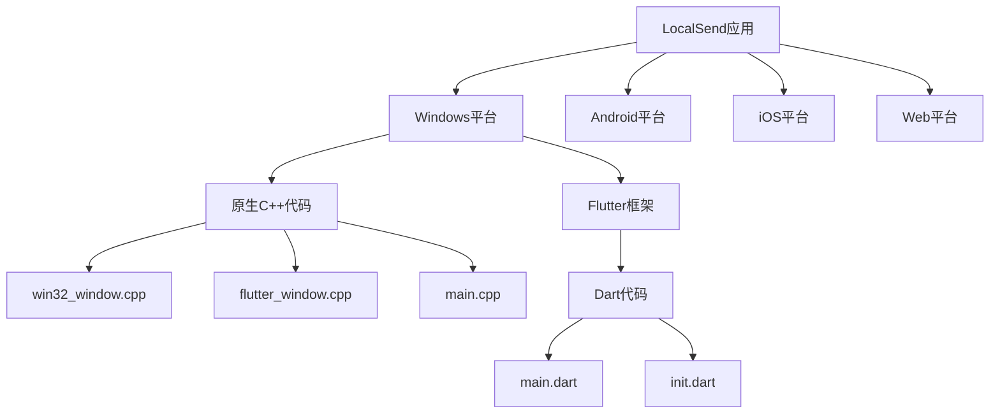
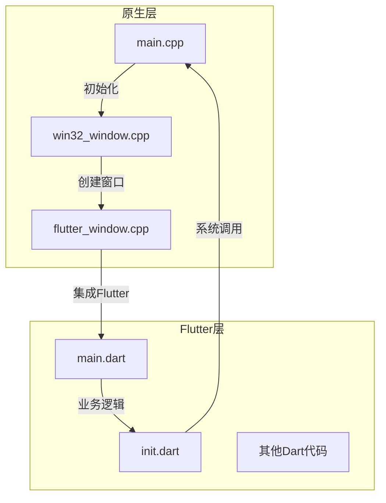
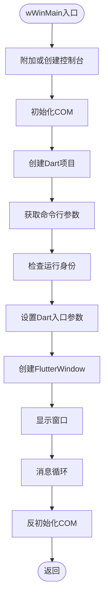
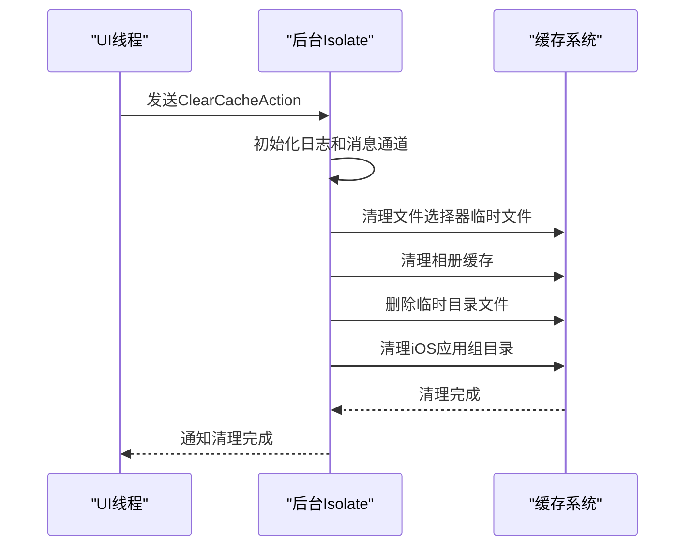
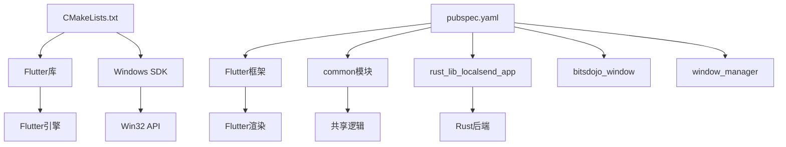

# Windows性能优化

<cite>
**本文档引用的文件**   
- [main.cpp](file://app/windows/runner/main.cpp)
- [flutter_window.cpp](file://app/windows/runner/flutter_window.cpp)
- [win32_window.cpp](file://app/windows/runner/win32_window.cpp)
- [CMakeLists.txt](file://app/windows/CMakeLists.txt)
- [main.dart](file://app/lib/main.dart)
- [init.dart](file://app/lib/config/init.dart)
- [cache_helper.dart](file://app/lib/util/native/cache_helper.dart)
</cite>

## 目录
1. [引言](#引言)
2. [项目结构](#项目结构)
3. [核心组件](#核心组件)
4. [架构概述](#架构概述)
5. [详细组件分析](#详细组件分析)
6. [依赖分析](#依赖分析)
7. [性能考虑](#性能考虑)
8. [故障排除指南](#故障排除指南)
9. [结论](#结论)

## 引言
LocalSend是一个开源的跨平台文件传输应用，本指南将详细阐述如何在Windows平台上进行性能优化。我们将深入分析应用的启动时间优化、内存管理、多线程处理和图形渲染等方面，为开发者提供全面的性能优化策略。

## 项目结构
该项目是一个基于Flutter的跨平台应用，采用分层架构设计。Windows平台的实现位于`app/windows`目录下，包含原生C++代码与Flutter框架的集成。项目使用CMake进行构建管理，通过`flutter_rust_bridge`实现Dart与Rust代码的互操作。



**图表来源**
- [main.cpp](file://app/windows/runner/main.cpp#L1-L54)
- [main.dart](file://app/lib/main.dart#L1-L89)

## 核心组件
本应用的核心组件包括Windows原生窗口管理、Flutter集成、多线程任务处理和网络通信。通过分析这些组件，我们可以了解应用的性能特征和优化机会。

**章节来源**
- [main.cpp](file://app/windows/runner/main.cpp#L1-L54)
- [main.dart](file://app/lib/main.dart#L1-L89)

## 架构概述
应用采用分层架构，将原生Windows代码与Flutter框架分离。Windows原生代码负责窗口创建、消息循环和系统集成，而Flutter框架负责UI渲染和业务逻辑。这种分离使得应用既能利用原生系统的性能优势，又能保持跨平台的一致性。



**图表来源**
- [main.cpp](file://app/windows/runner/main.cpp#L1-L54)
- [flutter_window.cpp](file://app/windows/runner/flutter_window.cpp#L1-L62)

## 详细组件分析

### Windows原生窗口管理分析
Windows原生窗口管理组件负责创建和管理应用窗口，处理系统消息和DPI缩放。该组件通过Win32 API实现，确保应用在不同Windows版本和显示设置下的兼容性。

```mermaid
classDiagram
class Win32Window {
+Point origin
+Size size
+HWND window_handle_
+HWND child_content_
+bool quit_on_close_
+Create(title, origin, size) bool
+Show() bool
+Destroy() void
+SetChildContent(content) void
+GetClientArea() RECT
+MessageHandler(hwnd, message, wparam, lparam) LRESULT
}
class FlutterWindow {
+flutter : : DartProject project_
+std : : unique_ptr<flutter : : FlutterViewController> flutter_controller_
+OnCreate() bool
+OnDestroy() void
+MessageHandler(hwnd, message, wparam, lparam) LRESULT
}
Win32Window <|-- FlutterWindow : "继承"
FlutterWindow --> flutter : : FlutterViewController : "使用"
```

**图表来源**
- [win32_window.cpp](file://app/windows/runner/win32_window.cpp#L1-L289)
- [flutter_window.cpp](file://app/windows/runner/flutter_window.cpp#L1-L62)

### 应用初始化流程分析
应用初始化流程从`main.cpp`的`wWinMain`函数开始，经过一系列初始化步骤，最终启动Flutter应用。这个过程包括COM初始化、窗口创建、Dart项目配置和消息循环。



**图表来源**
- [main.cpp](file://app/windows/runner/main.cpp#L1-L54)
- [flutter_window.cpp](file://app/windows/runner/flutter_window.cpp#L1-L62)

### 多线程任务处理分析
应用使用Isolate机制实现多线程任务处理，避免UI线程阻塞。通过`startIsolate`函数创建独立的执行环境，将耗时操作如缓存清理放到后台线程执行。



**图表来源**
- [cache_helper.dart](file://app/lib/util/native/cache_helper.dart#L1-L78)
- [init.dart](file://app/lib/config/init.dart#L1-L325)

## 依赖分析
应用的依赖关系清晰，分为原生层依赖和Dart层依赖。原生层依赖主要通过CMakeLists.txt管理，而Dart层依赖通过pubspec.yaml管理。这种分层依赖管理确保了代码的模块化和可维护性。



**图表来源**
- [CMakeLists.txt](file://app/windows/CMakeLists.txt#L1-L109)
- [pubspec.yaml](file://app/pubspec.yaml#L1-L124)

## 性能考虑
### 启动时间优化
通过分析代码，我们可以识别出几个启动时间优化的机会：
1. 延迟初始化非关键组件
2. 预加载关键资源
3. 优化DLL依赖

### 内存管理
应用采用智能指针（如`std::unique_ptr`）管理内存，避免内存泄漏。同时，通过Isolate机制隔离耗时操作，防止UI线程阻塞。

### 多线程优化
应用合理分配工作线程与UI线程的任务，确保UI响应性。通过Isolate机制，将文件操作、网络请求等耗时操作放到后台线程执行。

### 图形渲染优化
应用利用Flutter的GPU加速渲染能力，同时通过`EnableFullDpiSupportIfAvailable`函数支持高DPI显示，确保在不同分辨率下的显示效果。

## 故障排除指南
### 启动问题
如果应用无法启动，检查以下几点：
1. 确保所有依赖DLL文件存在
2. 检查COM初始化是否成功
3. 验证Flutter引擎初始化状态

### 性能问题
如果遇到性能问题，考虑以下优化措施：
1. 使用Windows Performance Analyzer分析CPU和内存使用情况
2. 检查Isolate任务是否过多阻塞UI线程
3. 优化资源加载顺序

**章节来源**
- [main.cpp](file://app/windows/runner/main.cpp#L1-L54)
- [init.dart](file://app/lib/config/init.dart#L1-L325)

## 结论
LocalSend应用在Windows平台上的性能优化需要从多个方面入手。通过优化启动流程、合理管理内存、有效利用多线程和优化图形渲染，可以显著提升应用性能。建议开发者使用Windows Performance Analyzer和Visual Studio Profiler等工具进行性能分析，持续优化应用表现。