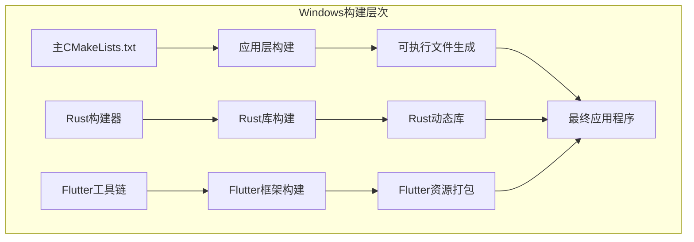
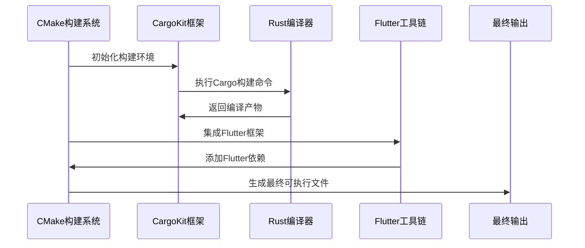
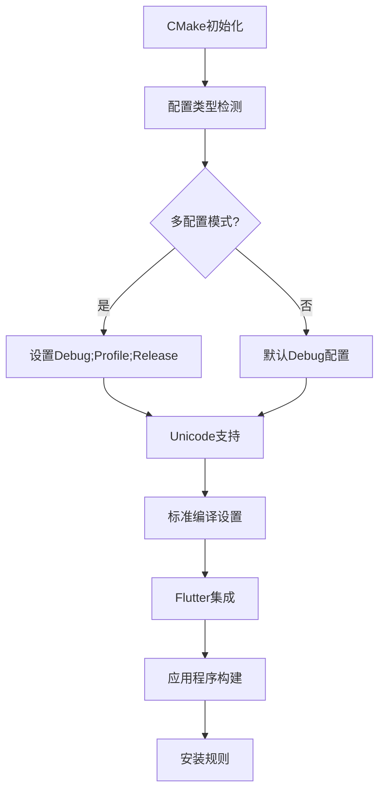
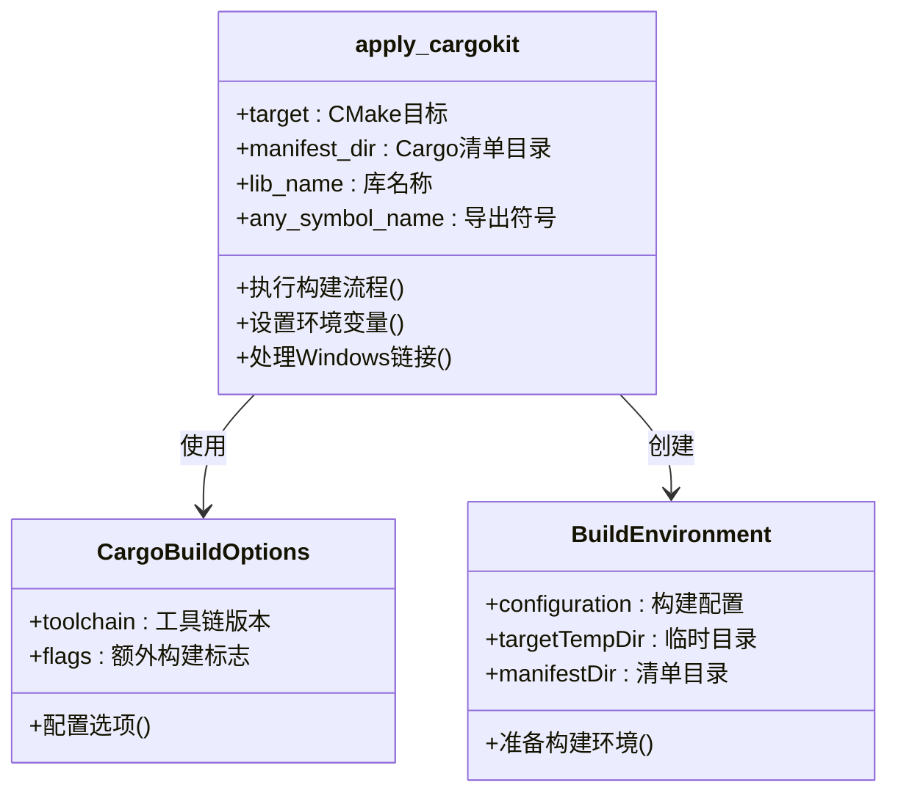
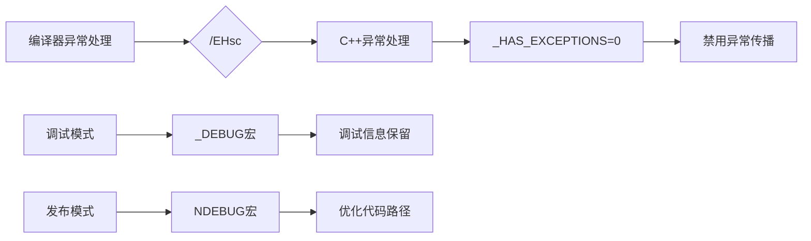
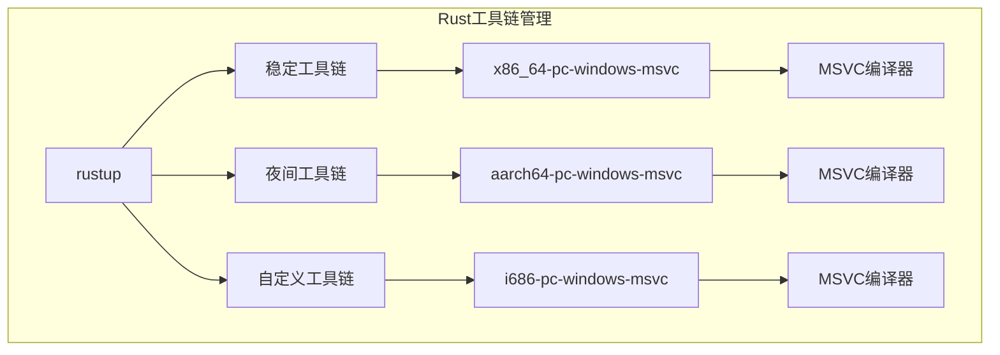
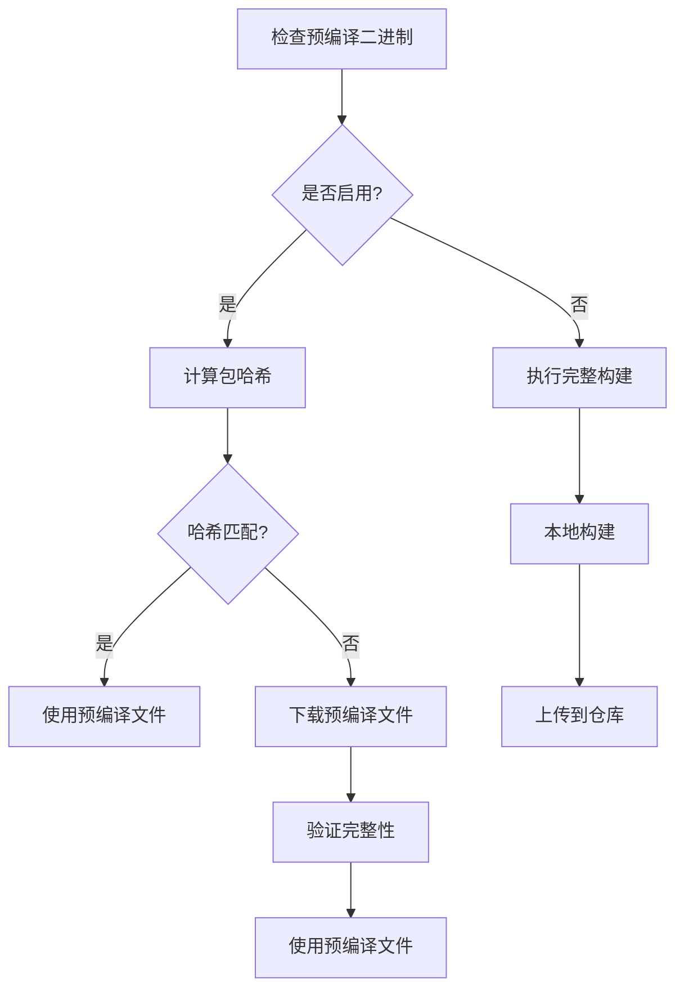

# Windows构建配置详细文档

<cite>
**本文档引用的文件**
- [app/windows/CMakeLists.txt](file://app/windows/CMakeLists.txt)
- [app/rust_builder/windows/CMakeLists.txt](file://app/rust_builder/windows/CMakeLists.txt)
- [app/windows/runner/CMakeLists.txt](file://app/windows/runner/CMakeLists.txt)
- [app/rust_builder/cargokit/cmake/cargokit.cmake](file://app/rust_builder/cargokit/cmake/cargokit.cmake)
- [app/rust/Cargo.toml](file://app/rust/Cargo.toml)
- [app/rust_builder/cargokit/run_build_tool.cmd](file://app/rust_builder/cargokit/run_build_tool.cmd)
- [scripts/compile_windows_exe.ps1](file://scripts/compile_windows_exe.ps1)
- [app/rust_builder/cargokit/build_tool/lib/src/builder.dart](file://app/rust_builder/cargokit/build_tool/lib/src/builder.dart)
- [app/rust_builder/cargokit/build_tool/lib/src/artifacts_provider.dart](file://app/rust_builder/cargokit/build_tool/lib/src/artifacts_provider.dart)
</cite>

## 目录
1. [简介](#简介)
2. [项目结构概览](#项目结构概览)
3. [核心构建组件](#核心构建组件)
4. [架构概览](#架构概览)
5. [详细组件分析](#详细组件分析)
6. [MSVC编译器配置](#msvc编译器配置)
7. [Rust库集成配置](#rust库集成配置)
8. [构建优化策略](#构建优化策略)
9. [故障排除指南](#故障排除指南)
10. [结论](#结论)

## 简介

本文档深入分析了LocalSend项目在Windows平台上的构建配置，重点探讨了CMakeLists.txt文件中Rust库的集成配置、MSVC编译器与Rust工具链的协同工作，以及各种构建优化技术。该配置系统采用了现代化的构建流程，支持多配置模式、并行编译和智能缓存机制。

## 项目结构概览

LocalSend项目采用混合架构，结合了Flutter前端和Rust后端。Windows平台的构建配置分布在多个层次：

**图表来源**
- [app/windows/CMakeLists.txt](file://app/windows/CMakeLists.txt#L1-L109)
- [app/rust_builder/windows/CMakeLists.txt](file://app/rust_builder/windows/CMakeLists.txt#L1-L21)

**章节来源**
- [app/windows/CMakeLists.txt](file://app/windows/CMakeLists.txt#L1-L109)
- [app/rust_builder/windows/CMakeLists.txt](file://app/rust_builder/windows/CMakeLists.txt#L1-L21)

## 核心构建组件

### 主构建配置层

主CMakeLists.txt文件定义了项目的整体构建策略，包括配置管理、编译选项和安装规则。

### Rust构建器层

专门负责Rust库的构建和集成，通过cargokit框架实现与CMake的无缝对接。

### 应用程序层

处理具体的可执行文件生成和资源打包。

**章节来源**
- [app/windows/CMakeLists.txt](file://app/windows/CMakeLists.txt#L1-L50)
- [app/rust_builder/windows/CMakeLists.txt](file://app/rust_builder/windows/CMakeLists.txt#L1-L21)

## 架构概览

整个Windows构建系统采用分层架构设计，确保各组件间的松耦合和高内聚：

**图表来源**
- [app/rust_builder/cargokit/cmake/cargokit.cmake](file://app/rust_builder/cargokit/cmake/cargokit.cmake#L10-L100)
- [app/rust_builder/cargokit/build_tool/lib/src/builder.dart](file://app/rust_builder/cargokit/build_tool/lib/src/builder.dart#L130-L170)

## 详细组件分析

### CMakeLists.txt配置分析

#### 主配置文件结构

主CMakeLists.txt文件采用了现代CMake的最佳实践，支持多配置模式：

**图表来源**
- [app/windows/CMakeLists.txt](file://app/windows/CMakeLists.txt#L10-L40)

#### 编译器标准和警告配置

系统强制使用C++17标准，并启用了严格的警告检查：

| 编译器标志 | 用途 | 说明 |
|-----------|------|------|
| `/W4` | 警告级别 | 最高级别的警告级别 |
| `/WX` | 警告转错误 | 将所有警告视为错误 |
| `/wd"4100"` | 忽略特定警告 | 忽略未使用的参数警告 |
| `/EHsc` | 异常处理 | 启用C++异常处理 |
| `_HAS_EXCEPTIONS=0` | 异常禁用 | 在某些情况下禁用异常 |

**章节来源**
- [app/windows/CMakeLists.txt](file://app/windows/CMakeLists.txt#L35-L45)

### Rust库集成配置

#### apply_cargokit函数详解

CargoKit框架提供了强大的Rust库集成能力：

**图表来源**
- [app/rust_builder/cargokit/cmake/cargokit.cmake](file://app/rust_builder/cargokit/cmake/cargokit.cmake#L10-L100)
- [app/rust_builder/cargokit/build_tool/lib/src/builder.dart](file://app/rust_builder/cargokit/build_tool/lib/src/builder.dart#L80-L170)

#### 动态库与静态库配置

Rust库支持多种输出格式，适应不同的部署需求：

| 目标平台 | 静态库格式 | 动态库格式 | 导入库格式 |
|---------|-----------|-----------|-----------|
| Windows | `rust_lib_localsend_app.lib` | `rust_lib_localsend_app.dll` | `rust_lib_localsend_app.dll.lib` |
| Linux | `librust_lib_localsend_app.a` | `librust_lib_localsend_app.so` | - |
| macOS | `librust_lib_localsend_app.a` | `librust_lib_localsend_app.dylib` | - |

**章节来源**
- [app/rust_builder/cargokit/build_tool/lib/src/artifacts_provider.dart](file://app/rust_builder/cargokit/build_tool/lib/src/artifacts_provider.dart#L220-L265)

**章节来源**
- [app/rust_builder/cargokit/cmake/cargokit.cmake](file://app/rust_builder/cargokit/cmake/cargokit.cmake#L10-L100)
- [app/rust_builder/cargokit/build_tool/lib/src/builder.dart](file://app/rust_builder/cargokit/build_tool/lib/src/builder.dart#L130-L170)

## MSVC编译器配置

### 运行时库选择策略

Windows平台的MSVC编译器提供了两种主要的运行时库选项：

#### /MT vs /MD 运行时库对比

| 特性 | /MT (多线程静态) | /MD (多线程动态) |
|------|-----------------|------------------|
| 运行时库 | 静态链接到可执行文件 | 动态链接到MSVCR*.DLL |
| 文件大小 | 较大，包含运行时代码 | 较小，依赖外部DLL |
| 部署复杂度 | 简单，无需额外DLL | 复杂，需要分发运行时 |
| 内存使用 | 可能有重复的运行时实例 | 共享运行时实例 |
| 更新便利性 | 不易更新运行时 | 易于更新运行时补丁 |

#### 异常处理机制统一

系统采用了统一的异常处理策略：

**图表来源**
- [app/windows/CMakeLists.txt](file://app/windows/CMakeLists.txt#L35-L45)

**章节来源**
- [app/windows/CMakeLists.txt](file://app/windows/CMakeLists.txt#L35-L45)

### 增量链接配置

虽然当前配置中没有显式启用增量链接，但可以通过以下方式配置：

| CMake变量 | 默认值 | 推荐值 | 说明 |
|----------|--------|--------|------|
| CMAKE_EXE_LINKER_FLAGS | 空 | `/INCREMENTAL:NO` | 禁用增量链接以提高性能 |
| CMAKE_SHARED_LINKER_FLAGS | 空 | `/INCREMENTAL:NO` | 禁用共享库增量链接 |
| CMAKE_STATIC_LINKER_FLAGS | 空 | - | 静态库不支持增量链接 |

## Rust工具链协同工作

### 编译器工具链配置

Rust工具链通过cargo工具自动管理，支持多种目标平台：

**图表来源**
- [app/rust_builder/cargokit/build_tool/lib/src/builder.dart](file://app/rust_builder/cargokit/build_tool/lib/src/builder.dart#L80-L130)

### 构建环境变量配置

系统通过环境变量传递构建配置：

| 环境变量 | 用途 | 示例值 |
|---------|------|--------|
| CARGOKIT_CMAKE | CMake命令路径 | `${CMAKE_COMMAND}` |
| CARGOKIT_CONFIGURATION | 当前配置 | `Debug` 或 `Release` |
| CARGOKIT_TARGET_PLATFORM | 目标平台 | `windows-x64` |
| CARGOKIT_TOOL_TEMP_DIR | 临时目录 | `${TEMP}/cargokit` |

**章节来源**
- [app/rust_builder/cargokit/cmake/cargokit.cmake](file://app/rust_builder/cargokit/cmake/cargokit.cmake#L30-L45)
- [app/rust_builder/cargokit/build_tool/lib/src/builder.dart](file://app/rust_builder/cargokit/build_tool/lib/src/builder.dart#L150-L198)

## 构建优化策略

### 并行编译设置

虽然当前配置中没有显式设置并行编译选项，但可以通过以下方式优化：

#### CMake并行编译配置

| 设置项 | 默认值 | 优化值 | 说明 |
|-------|--------|--------|------|
| CMAKE_BUILD_PARALLEL_LEVEL | 自动检测 | CPU核心数×2 | 设置并行任务数量 |
| CMAKE_JOB_POOLS | 空 | `console;1` | 控制控制台输出池 |
| CMAKE_VERBOSE_MAKEFILE | OFF | ON | 启用详细构建信息 |

### 构建缓存优化

#### 预编译二进制文件策略

系统实现了智能的预编译二进制文件机制：

**图表来源**
- [app/rust_builder/cargokit/build_tool/lib/src/artifacts_provider.dart](file://app/rust_builder/cargokit/build_tool/lib/src/artifacts_provider.dart#L98-L127)

### 预编译头文件使用

虽然当前配置中没有明确使用预编译头文件，但可以通过以下方式添加：

| 配置项 | 用途 | 实现方法 |
|-------|------|----------|
| PCH文件 | 加速编译 | 创建预编译头文件 |
| 编译器支持 | MSVC支持 | `/Yu` 和 `/Yc` 标志 |
| 包含顺序 | 优化效果 | 按频率排序包含文件 |

**章节来源**
- [app/rust_builder/cargokit/build_tool/lib/src/artifacts_provider.dart](file://app/rust_builder/cargokit/build_tool/lib/src/artifacts_provider.dart#L98-L127)

## 故障排除指南

### 常见构建问题及解决方案

#### Rust库链接失败

**问题症状：**
- 链接器找不到Rust库符号
- 编译过程中出现undefined reference错误

**解决方案：**
1. 检查CARGOKIT环境变量设置
2. 验证Rust库输出路径
3. 确认符号导出配置

#### MSVC编译器版本不兼容

**问题症状：**
- 编译器版本过旧警告
- 新特性编译失败

**解决方案：**
1. 更新Visual Studio版本
2. 检查CMake最低版本要求
3. 验证工具链兼容性

#### 并行编译冲突

**问题症状：**
- 构建过程中出现文件锁定错误
- 间歇性编译失败

**解决方案：**
1. 减少并行任务数量
2. 清理构建缓存
3. 检查磁盘空间

**章节来源**
- [app/rust_builder/cargokit/cmake/cargokit.cmake](file://app/rust_builder/cargokit/cmake/cargokit.cmake#L70-L98)
- [app/rust_builder/cargokit/run_build_tool.cmd](file://app/rust_builder/cargokit/run_build_tool.cmd#L1-L92)

## 结论

LocalSend项目的Windows构建配置展现了现代跨语言项目的最佳实践。通过CMake与Cargo的深度集成，实现了Flutter前端与Rust后端的无缝协作。系统采用了多层次的优化策略，包括智能缓存、并行编译和预编译二进制文件，显著提升了构建效率。

关键优势包括：
- **模块化设计**：清晰的分层架构便于维护和扩展
- **自动化程度高**：减少了手动配置的工作量
- **性能优化**：通过缓存和并行编译提升构建速度
- **跨平台兼容**：统一的构建接口支持多平台部署

未来的改进方向可以考虑：
- 增强增量链接支持
- 优化预编译头文件使用
- 改进构建缓存策略
- 添加更多的构建诊断信息