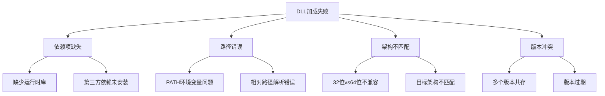
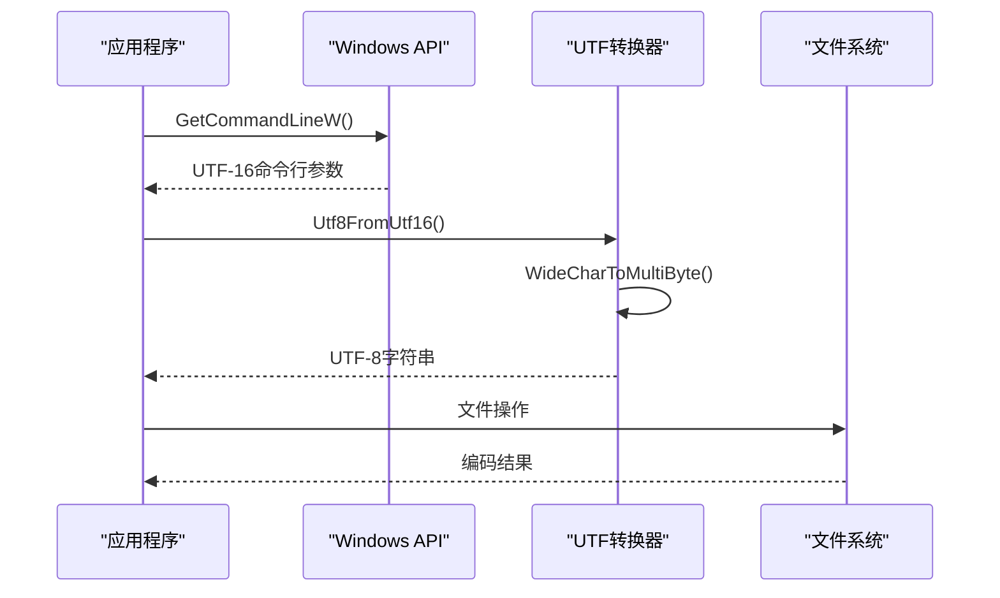
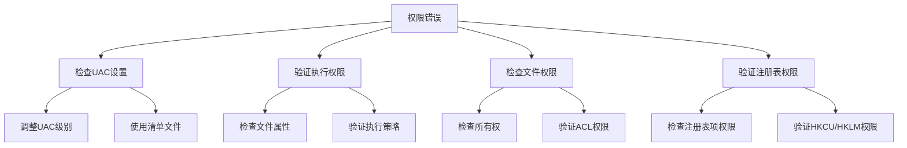
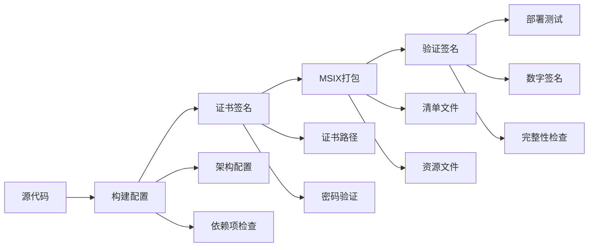

# Windows问题排查指南

<cite>
**本文档中引用的文件**
- [utils.cpp](file://app/windows/runner/utils.cpp)
- [win32_window.cpp](file://app/windows/runner/win32_window.cpp)
- [main.cpp](file://app/windows/runner/main.cpp)
- [flutter_window.cpp](file://app/windows/runner/flutter_window.cpp)
- [CMakeLists.txt](file://app/windows/CMakeLists.txt)
- [install_msix_helper.ps1](file://app/windows/install_msix_helper.ps1)
- [compile_windows_exe-inno.iss](file://scripts/compile_windows_exe-inno.iss)
- [compile_windows_msix_helper.ps1](file://scripts/compile_windows_msix_helper.ps1)
- [verify_exe_signature.ps1](file://scripts/verify_exe_signature.ps1)
- [AppxManifest.xml](file://msix/AppxManifest.xml)
- [troubleshoot_page.dart](file://app/lib/pages/troubleshoot_page.dart)
- [cmd_helper.dart](file://app/lib/util/native/cmd_helper.dart)
</cite>

## 目录
1. [简介](#简介)
2. [DLL加载失败问题](#dll加载失败问题)
3. [字符编码问题](#字符编码问题)
4. [权限错误排查](#权限错误排查)
5. [安装包相关问题](#安装包相关问题)
6. [网络连接问题](#网络连接问题)
7. [故障排除工具](#故障排除工具)
8. [最佳实践建议](#最佳实践建议)

## 简介

本指南专门针对Windows平台上的LocalSend应用程序可能遇到的各种问题提供系统性的诊断和解决方案。涵盖了从底层DLL加载到高级用户权限管理的全方位问题排查策略。

## DLL加载失败问题

### 常见症状

- 应用程序启动时出现"无法找到指定模块"错误
- 运行时出现"找不到入口点"异常
- 插件或扩展功能无法正常工作

### 根本原因分析

根据项目中的CMake配置和Windows平台实现，DLL加载问题主要源于以下几个方面：



**图表来源**
- [CMakeLists.txt](file://app/windows/CMakeLists.txt#L30-L40)
- [main.cpp](file://app/windows/runner/main.cpp#L1-L20)

### 解决方案

#### 1. 检查依赖项完整性

**步骤1：验证运行时库**
```powershell
# 检查Visual C++ Redistributable版本
Get-WmiObject -Class Win32_Product | Where-Object {$_.Name -like "*Visual C++*"}
```

**步骤2：检查必需的Windows组件**
```powershell
# 验证.NET Framework版本
Get-ChildItem "HKLM:\SOFTWARE\Microsoft\NET Framework Setup\NDP" -Recurse | Get-ItemProperty -Name Version -ErrorAction SilentlyContinue
```

#### 2. 路径配置优化

**环境变量设置：**
- 将应用程序目录添加到PATH环境变量
- 确保系统目录优先于用户目录
- 验证路径长度不超过260字符限制

#### 3. 架构兼容性检查

**检测当前系统架构：**
```powershell
# 检查系统架构
Get-WmiObject -Class Win32_OperatingSystem | Select-Object OSArchitecture

# 检查处理器架构
Get-WmiObject -Class Win32_Processor | Select-Object Architecture
```

**确保应用程序与系统架构匹配：**
- 32位应用只能在32位系统上运行
- 64位应用可以在64位和部分32位系统上运行
- 使用正确的编译目标

**章节来源**
- [CMakeLists.txt](file://app/windows/CMakeLists.txt#L30-L40)
- [main.cpp](file://app/windows/runner/main.cpp#L1-L20)

## 字符编码问题

### 问题根源

Windows平台的字符编码问题主要集中在UTF-8与Windows本地编码之间的转换处理上。项目中通过专门的UTF-16到UTF-8转换函数来处理命令行参数和文件路径。

### 编码转换流程



**图表来源**
- [utils.cpp](file://app/windows/runner/utils.cpp#L35-L65)

### 具体问题类型

#### 1. 命令行参数编码问题

**症状：**
- 特殊字符显示为问号或乱码
- 文件名包含非ASCII字符时出错
- 多语言界面文本显示异常

**解决方案：**
- 确保所有字符串处理都使用UTF-8编码
- 在文件读写操作中明确指定编码格式
- 使用Unicode标准进行字符串比较

#### 2. 文件路径编码问题

**检测方法：**
```cpp
// 检查文件路径编码转换
std::wstring filePath = L"C:\\测试\\文件.txt";
std::string utf8Path = Utf8FromUtf16(filePath.c_str());
```

#### 3. 注册表访问编码

**Windows注册表编码注意事项：**
- 注册表键值默认使用UTF-16编码
- 读取时需要正确转换为UTF-8
- 写入时确保编码一致性

**章节来源**
- [utils.cpp](file://app/windows/runner/utils.cpp#L35-L65)

## 权限错误排查

### UAC限制问题

#### 问题识别
- 应用程序请求管理员权限但被拒绝
- 文件或文件夹访问被阻止
- 注册表修改操作失败

#### 排查步骤



#### 解决方案

**1. UAC配置优化**
```xml
<!-- 应用程序清单文件示例 -->
<assembly xmlns="urn:schemas-microsoft-com:asm.v1" manifestVersion="1.0">
  <trustInfo xmlns="urn:schemas-microsoft-com:asm.v3">
    <security>
      <requestedPrivileges>
        <requestedExecutionLevel level="requireAdministrator" uiAccess="false"/>
      </requestedPrivileges>
    </security>
  </trustInfo>
</assembly>
```

**2. 文件系统权限检查**
```powershell
# 检查文件权限
Get-Acl "C:\Program Files\LocalSend" | Format-List

# 设置文件权限
icacls "C:\Program Files\LocalSend" /grant Users:F
```

**3. 注册表权限修复**
```powershell
# 检查注册表权限
Get-Acl "HKLM:\SOFTWARE\LocalSend" | Format-List

# 修改注册表权限
$acl = Get-Acl "HKLM:\SOFTWARE\LocalSend"
$rule = New-Object System.Security.AccessControl.RegistryAccessRule("Users","FullControl","Allow")
$acl.SetAccessRule($rule)
Set-Acl "HKLM:\SOFTWARE\LocalSend" $acl
```

### 文件系统权限问题

#### 常见权限错误类型

| 错误类型 | 症状 | 解决方案 |
|---------|------|----------|
| 访问被拒绝 | 无法创建/删除文件 | 检查文件所有权和ACL |
| 只读文件 | 无法修改文件 | 移除只读属性 |
| 权限不足 | 无法写入目录 | 提升目录权限 |
| 路径不存在 | 无法访问子目录 | 创建必要目录结构 |

**章节来源**
- [troubleshoot_page.dart](file://app/lib/pages/troubleshoot_page.dart#L30-L50)
- [cmd_helper.dart](file://app/lib/util/native/cmd_helper.dart#L1-L20)

## 安装包相关问题

### Inno Setup脚本配置问题

#### 1. 安装程序配置错误

**常见配置问题：**
- 输出目录设置错误
- 组件选择不当
- 卸载程序配置不完整

**解决方案：**
```ini
[Setup]
; 正确的输出目录配置
OutputDir=D:\inno-result
OutputBaseFilename=localsend

; 权限要求配置
PrivilegesRequired=admin
PrivilegesRequiredOverridesAllowed=dialog

; 架构支持
ArchitecturesInstallIn64BitMode=x64compatible
ArchitecturesAllowed=x64compatible
```

#### 2. 依赖项打包问题

**DLL文件打包：**
```ini
[Files]
; 包含所有必要的DLL文件
Source: "D:\inno\*.dll"; DestDir: "{app}"; Flags: ignoreversion
Source: "D:\inno\data\*"; DestDir: "{app}\data"; Flags: recursesubdirs createallsubdirs
```

### MSIX打包错误

#### 打包过程问题



**图表来源**
- [compile_windows_msix_helper.ps1](file://scripts/compile_windows_msix_helper.ps1#L1-L5)
- [AppxManifest.xml](file://msix/AppxManifest.xml#L16-L32)

#### 数字签名验证失败

**检查签名状态：**
```powershell
# 验证EXE文件签名
& $signtoolPath verify build\windows\runner\Release\localsend_app.exe

# 检查证书有效性
Get-AuthenticodeSignature "localsend_app.exe"
```

**证书配置：**
```xml
<!-- AppxManifest.xml中的证书信息 -->
<Identity Name="11157TienDoNam.LocalSend" 
          Version="1.14.0.0"
          Publisher="CN=Tien Do Nam, O=Tien Do Nam, S=Sachsen, C=DE" 
          ProcessorArchitecture="x64" />
```

#### MSIX辅助程序问题

**MSIX Helper安装：**
```powershell
# 安装MSIX辅助程序
Add-AppxPackage .\localsend_msix_helper.msix -ExternalLocation $(Get-Location)
```

**部署验证：**
```powershell
# 检查MSIX包状态
Get-AppxPackage | Where-Object {$_.Name -eq "LocalSend"}

# 移除现有包（如有）
Remove-AppxPackage com.flutter.localsendapp
```

**章节来源**
- [compile_windows_exe-inno.iss](file://scripts/compile_windows_exe-inno.iss#L1-L90)
- [install_msix_helper.ps1](file://app/windows/install_msix_helper.ps1#L1-L1)
- [AppxManifest.xml](file://msix/AppxManifest.xml#L16-L32)

## 网络连接问题

### 防火墙配置问题

#### Windows防火墙规则

**自动配置防火墙规则：**
```powershell
# 添加TCP防火墙规则
netsh advfirewall firewall add rule name="LocalSend" dir=in action=allow protocol=TCP localport=53317

# 添加UDP防火墙规则  
netsh advfirewall firewall add rule name="LocalSend" dir=in action=allow protocol=UDP localport=53317
```

#### 网络发现问题

**症状诊断：**
- 设备无法在网络中发现
- 连接超时错误
- 端口被占用警告

**解决方案：**
1. 检查端口占用情况
2. 配置网络适配器设置
3. 启用网络发现服务

**章节来源**
- [troubleshoot_page.dart](file://app/lib/pages/troubleshoot_page.dart#L30-L50)

## 故障排除工具

### 自动化诊断脚本

#### 权限检查脚本
```powershell
# 权限诊断脚本
function Test-LocalSendPermissions {
    $testPath = "$env:TEMP\localsend_test"
    
    # 测试写入权限
    try {
        New-Item -Path $testPath -ItemType File -Force | Out-Null
        Remove-Item -Path $testPath -Force
        Write-Host "✓ 写入权限正常" -ForegroundColor Green
    } catch {
        Write-Host "✗ 写入权限不足" -ForegroundColor Red
    }
    
    # 测试注册表权限
    try {
        $key = "HKCU:\Software\LocalSend\Test"
        New-Item -Path $key -Force | Out-Null
        Remove-Item -Path $key -Force
        Write-Host "✓ 注册表权限正常" -ForegroundColor Green
    } catch {
        Write-Host "✗ 注册表权限不足" -ForegroundColor Red
    }
}
```

#### 系统兼容性检查
```powershell
# 系统兼容性检查
function Test-SystemCompatibility {
    # 检查Windows版本
    $osVersion = [Environment]::OSVersion.Version
    if ($osVersion.Major -lt 10) {
        Write-Host "✗ Windows 10或更高版本要求" -ForegroundColor Red
    }
    
    # 检查.NET版本
    $dotNetVersion = Get-ItemProperty "HKLM:\SOFTWARE\Microsoft\NET Framework Setup\NDP\v4\Full\" -ErrorAction SilentlyContinue
    if ($null -eq $dotNetVersion) {
        Write-Host "✗ .NET Framework未安装" -ForegroundColor Red
    }
}
```

### 日志分析工具

#### 应用程序日志收集
```powershell
# 收集应用程序日志
function Collect-LocalSendLogs {
    $logPaths = @(
        "$env:APPDATA\LocalSend\logs\",
        "$env:LOCALAPPDATA\LocalSend\logs\",
        "$env:ProgramData\LocalSend\logs\"
    )
    
    foreach ($path in $logPaths) {
        if (Test-Path $path) {
            Write-Host "收集日志: $path"
            Get-ChildItem $path -Recurse | Compress-Archive -DestinationPath "localsend_logs.zip"
        }
    }
}
```

**章节来源**
- [troubleshoot_page.dart](file://app/lib/pages/troubleshoot_page.dart#L190-L226)

## 最佳实践建议

### 开发阶段

1. **编码规范**
   - 统一使用UTF-8编码
   - 明确指定字符串编码格式
   - 避免硬编码路径分隔符

2. **权限设计**
   - 最小权限原则
   - 用户模式优先
   - 必要时才提升权限

3. **错误处理**
   - 完善的异常捕获机制
   - 用户友好的错误消息
   - 详细的日志记录

### 部署阶段

1. **安装包质量**
   - 完整的依赖项检查
   - 正确的数字签名
   - 兼容性测试

2. **系统集成**
   - 正确的注册表配置
   - 文件关联设置
   - 开始菜单集成

3. **维护更新**
   - 渐进式部署策略
   - 回滚机制
   - 用户通知

### 运维监控

1. **性能监控**
   - CPU和内存使用率
   - 网络连接状态
   - 文件系统IO性能

2. **安全审计**
   - 权限变更记录
   - 异常访问检测
   - 更新补丁跟踪

3. **用户支持**
   - 问题报告模板
   - 自助诊断工具
   - 社区支持渠道

通过遵循这些最佳实践，可以显著减少Windows平台上LocalSend应用程序遇到的问题，并提高整体用户体验。