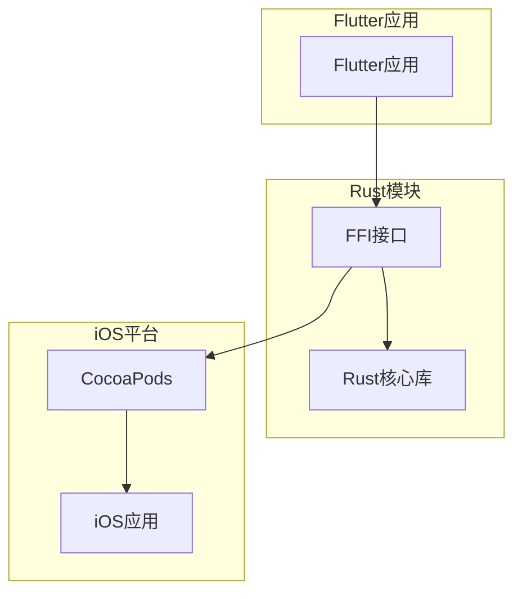
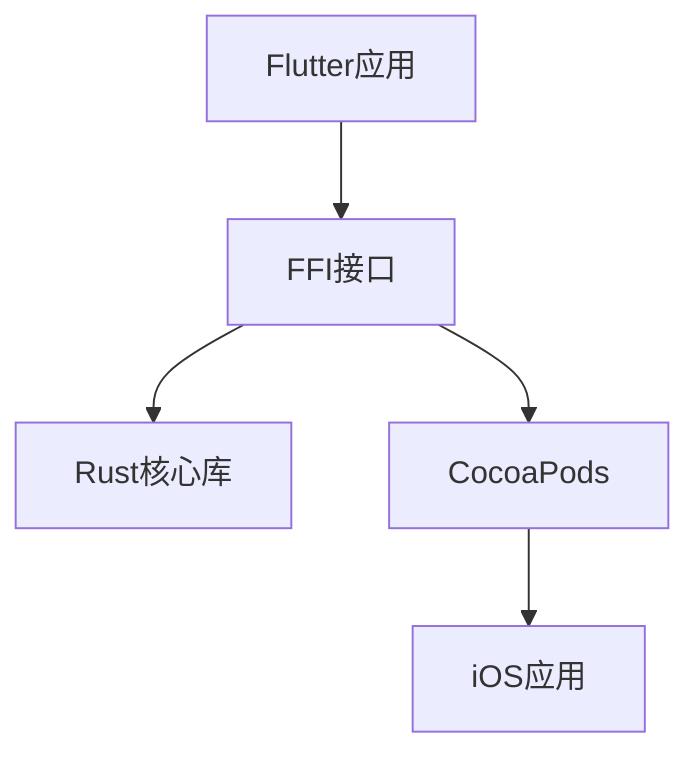
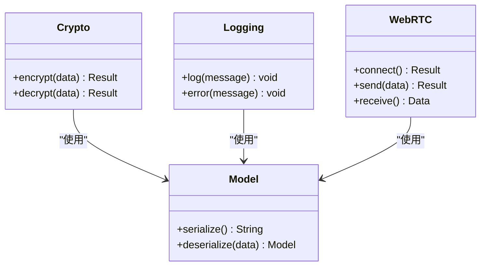
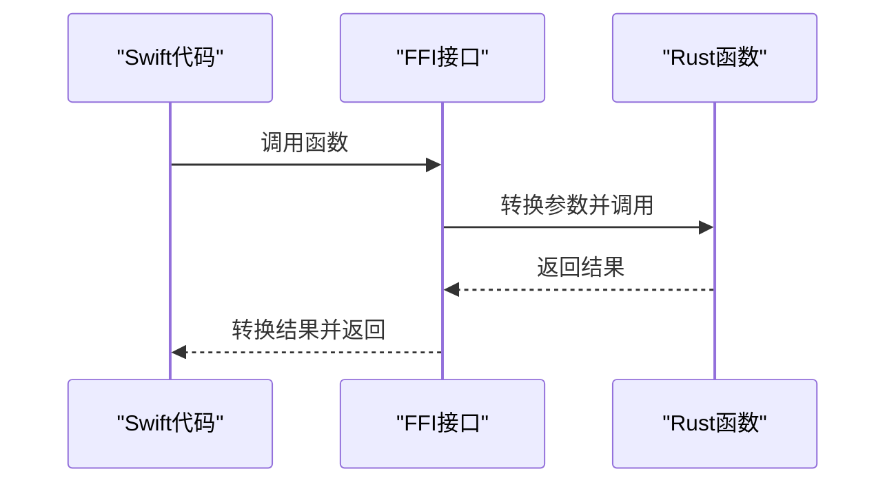
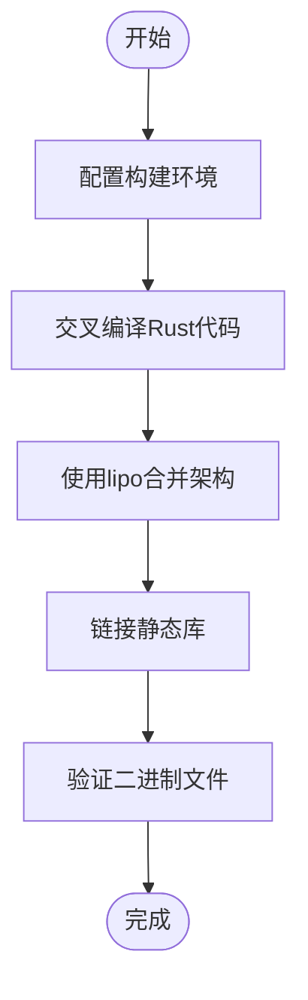
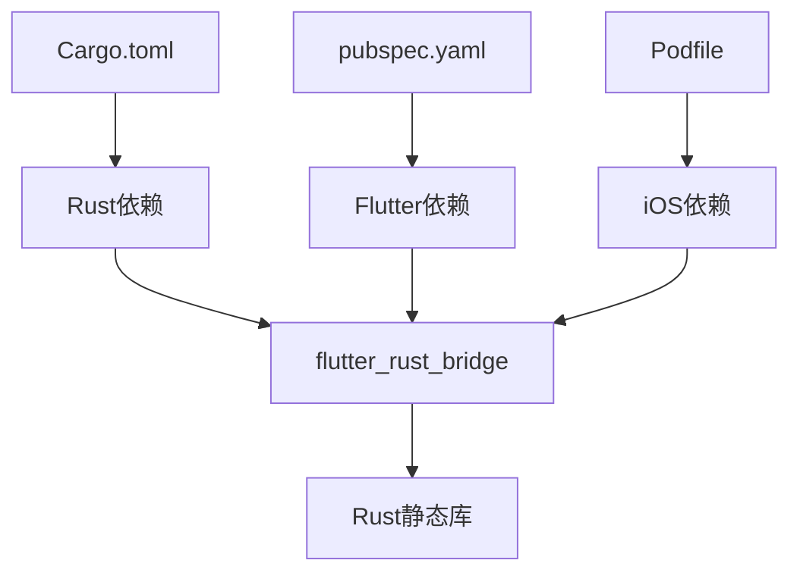

# iOS平台集成

<cite>
**本文档中引用的文件**  
- [Podfile](file://app/ios/Podfile)
- [Cargo.toml](file://app/rust/Cargo.toml)
- [pubspec.yaml](file://app/rust_builder/pubspec.yaml)
- [build_pod.sh](file://app/rust_builder/cargokit/build_pod.sh)
- [run_build_tool.sh](file://app/rust_builder/cargokit/run_build_tool.sh)
- [lib.rs](file://app/rust/src/lib.rs)
- [Runner-Bridging-Header.h](file://app/ios/Runner/Runner-Bridging-Header.h)
- [compile_ios.sh](file://scripts/compile_ios.sh)
</cite>

## 目录
1. [简介](#简介)
2. [项目结构](#项目结构)
3. [核心组件](#核心组件)
4. [架构概述](#架构概述)
5. [详细组件分析](#详细组件分析)
6. [依赖分析](#依赖分析)
7. [性能考虑](#性能考虑)
8. [故障排除指南](#故障排除指南)
9. [结论](#结论)

## 简介
本文档详细说明了在iOS平台上集成Rust库的完整流程，包括通过CocoaPods集成、bitcode处理、架构适配（arm64, x86_64）、Xcode项目配置、Swift/Objective-C与Rust代码交互的最佳实践，以及App Store发布时的特殊考虑。

## 项目结构
本项目采用Flutter框架构建跨平台应用，其中Rust代码通过FFI（Foreign Function Interface）与iOS平台集成。Rust代码位于`app/rust`目录下，通过`rust_builder`工具构建为静态库，并通过CocoaPods集成到iOS项目中。

**图表来源**  
- [Podfile](file://app/ios/Podfile#L1-L48)
- [Cargo.toml](file://app/rust/Cargo.toml#L1-L17)

**章节来源**  
- [Podfile](file://app/ios/Podfile#L1-L48)
- [Cargo.toml](file://app/rust/Cargo.toml#L1-L17)

## 核心组件
项目的核心组件包括Rust库、FFI接口、CocoaPods集成脚本和iOS应用。Rust库提供核心功能，通过FFI接口暴露给iOS应用，CocoaPods负责构建和链接静态库。

**章节来源**  
- [lib.rs](file://app/rust/src/lib.rs#L1-L4)
- [pubspec.yaml](file://app/rust_builder/pubspec.yaml#L1-L34)

## 架构概述
系统架构采用分层设计，上层为Flutter应用，中间层为FFI接口，底层为Rust核心库。通过CocoaPods将Rust静态库集成到iOS项目中，实现跨语言调用。

**图表来源**  
- [lib.rs](file://app/rust/src/lib.rs#L1-L4)
- [build_pod.sh](file://app/rust_builder/cargokit/build_pod.sh#L1-L58)

## 详细组件分析

### Rust库分析
Rust库是项目的核心，提供加密、日志记录、模型和WebRTC等功能。通过`flutter_rust_bridge`生成FFI接口，实现与Flutter的通信。

**图表来源**  
- [lib.rs](file://app/rust/src/lib.rs#L1-L4)
- [api/mod.rs](file://app/rust/src/api/mod.rs#L1-L5)

### FFI接口分析
FFI接口是Rust与iOS之间的桥梁，通过`flutter_rust_bridge`生成。它定义了Rust函数的C语言接口，使Objective-C/Swift代码能够调用Rust函数。

**图表来源**  
- [frb_generated.rs](file://app/rust/src/frb_generated.rs)
- [frb_generated.dart](file://app/lib/rust/frb_generated.dart)

### CocoaPods集成分析
CocoaPods通过自定义脚本`build_pod.sh`和`run_build_tool.sh`构建Rust静态库，并将其集成到iOS项目中。构建过程包括交叉编译、lipo合并和符号处理。

**图表来源**  
- [build_pod.sh](file://app/rust_builder/cargokit/build_pod.sh#L1-L58)
- [run_build_tool.sh](file://app/rust_builder/cargokit/run_build_tool.sh#L1-L94)

**章节来源**  
- [build_pod.sh](file://app/rust_builder/cargokit/build_pod.sh#L1-L58)
- [run_build_tool.sh](file://app/rust_builder/cargokit/run_build_tool.sh#L1-L94)

## 依赖分析
项目依赖关系复杂，涉及多个层次的依赖管理。Rust依赖通过Cargo管理，Flutter依赖通过pubspec管理，iOS依赖通过CocoaPods管理。

**图表来源**  
- [Cargo.toml](file://app/rust/Cargo.toml#L1-L17)
- [pubspec.yaml](file://app/rust_builder/pubspec.yaml#L1-L34)
- [Podfile](file://app/ios/Podfile#L1-L48)

**章节来源**  
- [Cargo.toml](file://app/rust/Cargo.toml#L1-L17)
- [pubspec.yaml](file://app/rust_builder/pubspec.yaml#L1-L34)

## 性能考虑
在iOS平台上集成Rust库时，需要考虑二进制大小、启动时间和内存使用。通过静态库链接可以减少运行时开销，但会增加应用体积。建议在发布版本中启用LTO（Link Time Optimization）以优化性能。

## 故障排除指南
### 架构不匹配
当出现架构不匹配错误时，检查`ARCHS`环境变量和Rust目标三元组是否一致。确保为arm64和x86_64都构建了相应的二进制文件。

**章节来源**  
- [build_pod.sh](file://app/rust_builder/cargokit/build_pod.sh#L10-L15)

### bitcode编译失败
bitcode编译失败通常是由于Rust编译器不支持bitcode。建议在Xcode中禁用bitcode，或使用支持bitcode的编译器。

**章节来源**  
- [Podfile](file://app/ios/Podfile#L1-L48)

### 符号冲突
符号冲突可能由于多个库导出相同符号引起。使用`-dead_strip`链接器标志可以移除未使用的符号，减少冲突可能性。

**章节来源**  
- [build_pod.sh](file://app/rust_builder/cargokit/build_pod.sh#L50-L57)

## 结论
通过CocoaPods集成Rust库到iOS平台是一个复杂但可行的过程。关键在于正确配置构建环境、处理架构适配和管理依赖关系。遵循本文档的指导，可以成功实现Rust与iOS的集成，充分发挥Rust在性能和安全性方面的优势。